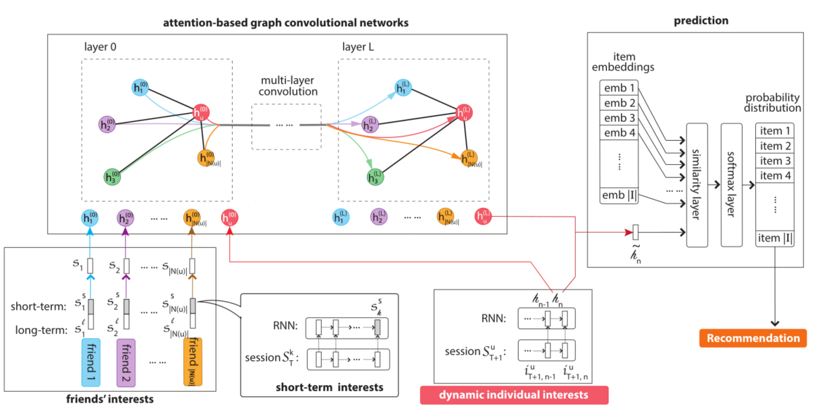
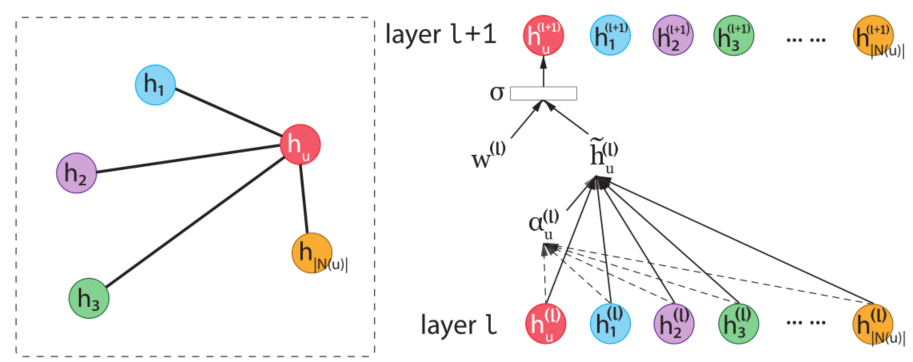
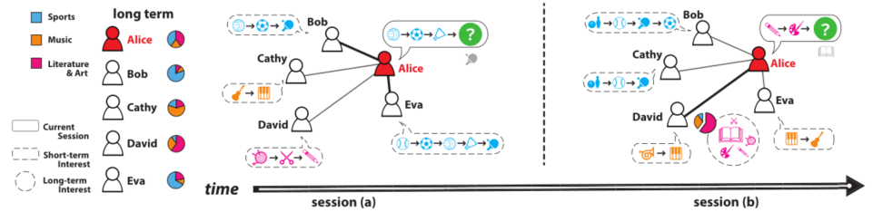

> 论文标题：Session-based Social Recommendation via Dynamic Graph Attention Networks
>
> 发表于：2019 WSDM
>
> 作者：Weiping Song,Zhiping Xiao,Yifan Wang
>
> 代码：https://github.com/DeepGraphLearning/RecommenderSystems
>
> 论文地址：https://arxiv.org/pdf/1902.09362v2.pdf

## 摘要

- 在线社区的推荐是一个具有挑战性的问题：
  - 用户的兴趣是动态的，用户受朋友的影响。影响者可能与上下文相关。不同的朋友可以依赖于不同的主题
- 文章提出了一种基于动态图注意力神经网络的在线社区推荐系统。
  - 使用RNN对动态用户行为进行建模，并使用图注意神经网络对上下文相关的社会影响进行建模，该网络根据用户当前的兴趣动态推断影响者。

## 结论

- 提出了一种基于图卷积网络的模型，用于在线社区中基于会话的社交推荐
  - 首先通过对用户当前兴趣建模来学习个人用户表示。
  - 使用具有新的注意机制的图卷积网络将每个用户的表示与她朋友的表示聚合
  - 然后使用组合表示以及用户的原始表示来形成项目推荐

## 未来工作

- 探索用户和项目特征的偏好，并进一步提高在线社区推荐系统的性能。

## 介绍

- 在线社区存在的挑战：
  - 用户兴趣本质上是动态的，
  - 由于在线社区经常促进朋友之间的信息共享，因此用户也很可能受到朋友的影响
  - 影响者的集合可以是动态的，因为它们可以依赖于上下文
- 当前的推荐要么模拟了用户的动态兴趣，要么模拟了用户的社会影响力
- 本文中，提出了一个基于两者的推荐模型，基于会话的兴趣以及动态的社会影响，推荐模型基于动态图注意力网络
  - 首先使用循环神经网络 (RNN) [7] 对会话中的用户行为进行建模。
  - 根据用户当前的兴趣（由 RNN 的隐藏表示捕获），我们使用图注意力网络 [33] 捕获朋友的影响。
  - 为了提供会话级推荐，将朋友短期偏好模型与长期偏好模型区分开来。
  - 考虑到用户当前的兴趣，每个朋友的影响力将由注意力机制自动确定 [1, 40]。

## 模型架构

- DGRec
  
- 使用注意力机制的单个卷积层图形模型
  
  - 以当前兴趣为条件的输出被解释为上下文相关的社会影响。
- Alice 在两个会话上的社会影响的插图。
  
  - 会话 (a) 中Alice 浏览体育项目。她的两个朋友 Bob 和 Eva 是体育迷（长期兴趣），他们最近正在浏览体育项目（短期兴趣）
  - 会话 (b) 中，Alice 对“文学和艺术”项目感兴趣，但她的朋友最近都没有消费过此类物品。朋友大卫这个话题感兴趣（长期利益）。在这种情况下，爱丽丝受到大卫的影响，

## 实验

- ### 研究问题

- ### 数据集

  - Douban：  使用电影社区中用户的身份抓取数据，获取他们评论的每部电影以及相关的时间戳。我们还爬取了用户的社交网络。我们通过使用每条评论作为用户消费商品的证据来构建我们的数据集。用户在豆瓣上往往非常活跃，因此我们将用户的行为（电影消费）细分为为期一周的会话。  
  - Delicious：  一个在线书签系统，用户可以在其中存储、共享和发现网络书签，并为其分配各种语义标签。我们考虑的任务是个性化的书签标签推荐。每个会话都是用户分配给书签的一系列标签（标签操作带有时间戳）。这不同于会话的普通定义，即短期内的一系列消费。  
  - Yelp：在线评论系统，用户可以在其中评论本地企业（例如餐馆和商店）。与豆瓣类似，我们将每条评论视为观察。根据评论的经验频率，我们将数据划分为为期一个月的会话

- ### baseline

  - (A) 不利用社因素和时间因素的经典方法； (B) 社交推荐 (C) 基于会话的推荐方法，
    - ItemKNN [22] (A)：受经典 KNN 模型的启发，它寻找与用户过去喜欢的项目相似的项目。
    - BPR-MF [27] (A)：使用排名目标而非回归目标训练的矩阵分解 (MF) 技术。 
    - SoReg [24]  (B)：使用社交网络对矩阵分解的潜在用户因素进行正则化。 
    - SBPR [41] (B)：一种基于 BPR-MF  的社会推荐方法。社交网络用于为矩阵分解提供额外的训练样本。
    - TranSIV [38] (B)：使用共享潜在因素将学习到的信息从社交领域转移到推荐领域。 
    - RNN-Session [13] (C)：最近使用循环神经网络进行基于会话的推荐的最先进的方法。
    - NARM [21]  (C)：会话级别偏好和用户“主要目的”的混合模型，其中主要目的是通过参与会话中的先前行为来获得的。

- ### 超参数设置

- ### 评估指标

  - Recall@K
  - NDCG@K