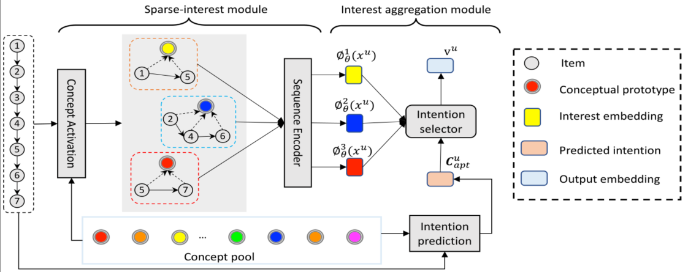

> 论文标题：Sparse-Interest Network for Sequential Recommendation
>
> 发表于：2021 WSDM
>
> 作者：Qiaoyu Tan, Jianwei Zhang, Jiangchao Yao
>
> 代码：https://github.com/Qiaoyut/SINE
>
> 论文地址：https://arxiv.org/pdf/2102.09267v1.pdf

## 摘要

- 用户的行为序列通常包含多个概念上不同的项目，而统一的嵌入向量主要受一个人最近的频繁行为的影响
  - 因此，如果概念上相似的项目在最近的交互中不占主导地位，它可能无法推断出下一个首选项目。
- 一种解决方案是用多个嵌入向量表示每个用户，该向量编码用户意图的不同方面
- 最近关于多兴趣嵌入的工作通常考虑通过聚类发现的少量概念，这可能无法与实际系统中的大量项目类别相媲美
- 有效地对大量不同的概念原型进行建模是一项艰巨的任务，因为项目在概念上通常不能很好地以细粒度进行聚类
  - 一个人通常只与一组稀疏的概念交互
- 提出了一种新颖的稀疏兴趣网络（SINE）用于顺序推荐。
  - 稀疏兴趣模块可以从大型概念池中自适应地为每个用户推断一组稀疏概念，并相应地输出多个嵌入。
  - 给定多个兴趣嵌入，开发了一个兴趣聚合模块来主动预测用户的当前意图，然后使用它来显式地建模多个兴趣以进行下一个项目的预测。

## 结论

- 为顺序推荐提出了一种稀疏兴趣嵌入框架。模型可以从大量概念原型中自适应地激活多个意图，从而为用户生成多个兴趣嵌入。
- 它还开发了一个兴趣聚合模块来捕获多兴趣以主动获取整体前  N 个项目

## 未来工作

## 介绍

- 先前方法忽略了用户行为的顺序结构，因此无法捕捉相邻行为之间的相关性。
- 现有工作将推荐形式化为一个顺序问题。用有序序列表示每个用户并假设其顺序很重要。
  - 对于用户的行为历史，顺序推荐方法先对过去的行为进行排序以获得有序序列。
  - 该序列将被输入不同的神经序列模块RNN、CNN、Transformer以生成整体用户嵌入向量，然后预测下一个感兴趣的项目
- 文章认为由于从用户行为序列中学习单个嵌入的瓶颈，现有的顺序推荐模型对于下一个项目的预测可能不是最优的
  - 从行为序列中学习到的整体用户嵌入向量主要受最近最频繁操作的影响
  - 如果概念上相似的项目在最近的交互中不占主导地位，它可能无法提取相关信息来学习预测下一个项目
- 一个替代解决方案是从用户的行为序列中学习多个嵌入向量，其中每个嵌入向量编码用户兴趣的一个方面。
  - 从工业级数据中的用户行为序列中有效地提取多个嵌入向量存在一些挑战
    - 项目在实际系统中通常在概念上没有很好地聚类。
      - 尽管可以将项目的类别信息用作概念，但由于注释噪声，这种类型的辅助信息在实践中可能不可用或不可靠
    - 如何从大型概念池中自适应地为用户推断出一组稀疏的感兴趣的概念
      - 推理过程包括一个选择操作，这是一个离散的优化问题，很难进行端到端的训练
    - 给定多个兴趣嵌入向量，我们需要确定哪个兴趣可能被激活以进行下一项预测。
      - 在训练过程中，下一个预测项目可以用作激活首选意图的标签，但推理阶段没有这样的标签。
      - 该模型必须自适应地预测用户的下一个意图

## 模型架构

- SINE:
  
  - 给定用户的行为序列作为输入，稀疏兴趣模块旨在从大型兴趣组池中自适应地激活他/她的兴趣以及输出多兴趣嵌入。
  - 然后，兴趣聚合模块通过主动预测用户的下一个意图来帮助选择最喜欢的兴趣进行下一个项目推荐。 
  -  SINE 提供了对项目进行聚类并以端到端方式推断用户的稀疏兴趣集的能力。

## 实验

- ### 研究问题

  - Q1：与其他最先进的基线相比，所提出的方法有多有效？   
  - Q2 ：通过消融研究，不同模块、稀疏兴趣模块和兴趣聚合模块的效果是什么？  
  - Q3：超参数设置有多敏感，包括首选的 K 意图和相应的 L  概念原型？第三季度

- ### 数据集

  - MovieLens 
  - Amazon
  - Taobao
  - ULarge

- ### baseline

  - 单一嵌入模型：
    - GRU4Rec  [17] 是一项开创性的工作，它使用 GRU 对用户行为序列进行建模。 
    - Caser [42] 是最近基于 CNN 的顺序推荐基准。 
  - 多嵌入模型：
    - MIND  [24]:基于胶囊网络 [34] 的多兴趣方法
    - SASRec [21]: 多头自注意力 [43] 的多兴趣方法。 
    - MCPRN ： 是另一个基于潜在概念原型的最先进的多兴趣框架。

- ### 超参数设置

- ### 评估指标

  -  Hit R@K 
  - NDCG@K