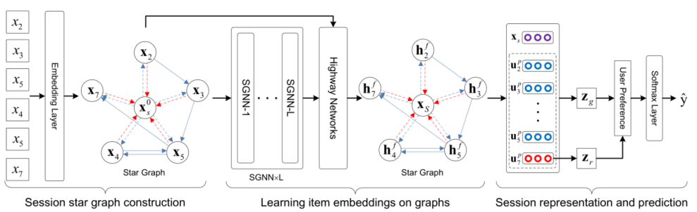

> 论文标题：Star Graph Neural Networks for Session-based Recommendation
>
> 发表于：2020 CIKM
>
> 作者：Zhiqiang Pan, Fei Cai, Wanyu Chen,
>
> 代码：
>
> 论文地址：https://irlab.science.uva.nl/wp-content/papercite-data/pdf/pan-2020-star.pdf

## 摘要

- 如果无法访问用户的历史用户项交互，正在进行的会话中可用的信息可能非常有限
- 以前基于会话的推荐已经考虑了用户顺序交互的项目序列。
  - 这样的项目序列可能无法完全捕获超出检验顺序的项目之间的复杂过渡关系
- GNN模型捕获项目之间的转换关系,GNN 通常只传播来自相邻项目的信息，
  - 因此忽略了来自没有直接连接的项目的信息,同时，GNN存在过拟合问题
- 提出了带有高速网络的星图神经网络 (SGNN-HN) 用于基于会话的推荐
  - 应用星图神经网络 (SGNN) 来模拟正在进行的会话中项目之间的复杂转换关系
    - 它可以通过在门控图神经网络的基础上，通过增加一个星节点来考虑不相邻的项目，可以解决远程信息传播问题。
  - 为了避免过度拟合，我们使用高速网络 (HN) 从项目表示中自适应地选择嵌入
  - 最后，在正在进行的会话中聚合 SGNN 生成的项目嵌入，以表示用户对项目预测的最终偏好

## 结论

- 提出了一种新颖的方法，即带有高速网络的星图神经网络 (SGNN-HN)，用于基于会话的推荐。
- SGNN-HN 应用星图神经网络 (SGNN)  对会话中项目之间的复杂转换关系进行建模，以生成准确的项目嵌入。
  - 它可以通过在门控图神经网络的基础上，通过增加一个星节点来考虑不相邻的项目，可以解决远程信息传播问题。
- 为了解决基于会话的推荐中图神经网络的过拟合问题，我们利用高速网络在多层 SGNN  之前和之后动态组合来自项目嵌入的信息。
- 最后，我们应用注意力机制将会话中的项目嵌入结合为用户的一般偏好，然后将其与她最近在会话中单击的项目所表达的兴趣连接起来，以进行项目推荐。

## 未来工作

- 合并邻居会话以丰富当前会话中的转换关系，如 [11, 30]。
- 将星图神经网络应用于对话推荐 [13, 26] 和对话系统 [38]  等其他任务，以研究其可扩展性

## 介绍

- 对于用户的长期历史交互不可用的情况，例如新用户，以准确的方式捕捉她的偏好是具有挑战性的 [10]。
  - 基于会话的推荐任务是仅基于正在进行的会话生成推荐。
- 基于 GNN 的方法主要在相邻项目之间传播信息，因此忽略了来自没有直接连接的项目的信息。
  - 随后，多层 GNN  被用于在没有直接连接的项目之间传播信息，但这很容易导致过度拟合。
- 因此提出，带有高速网络的星图神经网络（SGNN-HN）用于基于会话的推荐。
  - 首先使用星图神经网络 (SGNN)  对正在进行的会话中的复杂转换模式进行建模，
    - 它可以通过在门控图神经网络的基础上，通过增加一个星节点来考虑不相邻的项目，可以解决远程信息传播问题。
  - 然后，为了规避 GNN 的过拟合问题，我们应用高速公路网络 (HN) 来动态选择 SGNN  前后的项目嵌入，这有助于探索项目之间的复杂过渡关系。
  - 最后，我们在一个正在进行的会话中仔细地聚合由 SGNN 生成的项目嵌入，以表示用户对进行项目推荐的偏好。

## 模型架构

- SGNN-HN
  
  - 首先，通过嵌入层为会话中的每个唯一项目 xi 生成 d 维嵌入 ，并将每个会话构建为会话星图.然后将图中的节点（项目嵌入）输入到多层星图神经网络（SGNN）中。
  - 之后，我们使用高速网络在 SGNN  之前和之后组合项目嵌入。
  - 最后，通过结合一般偏好和最近对会话的兴趣来表示会话。
  - 在获得会话表示后，通过计算所有候选项目的分数来生成推荐。

## 实验

- ### 研究问题

  - RQ1) 提出的 SGNN-HN 模型能否击败基于会话的推荐任务的竞争基线？ 
  - RQ2）星图神经网络（SGNN）对整体推荐性能的贡献是什么？
  - RQ3)  高速公路网络能否缓解图神经网络的过拟合问题？ 
  - RQ4）与基线相比，SGNN-HN 在不同长度的会话上表现如何？

- ### 数据集

  - Yoochoose
  - Diginetica

- ### baseline

  - S-POP 为当前会话推荐最受欢迎的项目。
  - FPMC 是一种基于马尔可夫链的最先进的顺序推荐混合方法。我们省略了用户表示，因为它在基于会话的推荐中不可用。
  - GRU4REC 应用 GRU 对基于会话的推荐中的序列信息进行建模，并采用会话并行的小批量训练过程。 
  - NARM 使用 GRU  对顺序行为进行建模，并利用注意力机制来捕捉用户的主要目的。 
  - CSRM 通过引入相邻会话作为辅助信息来扩展 NARM，以便使用并行内存模块对当前会话进行建模。
  - STAMP 利用注意力机制来获得一般偏好，并利用最后一项作为当前会话的最近兴趣来进行预测。
  - SR-IEM  采用改进的自我注意机制来估计项目的重要性，并根据全局偏好和当前兴趣提出建议。
  - SR-GNN  利用门控图神经网络获得项目嵌入并使用注意力机制提出建议以生成会话表示。
  - NISER+ 引入 L2 归一化来解决长尾问题，并应用 dropout 来缓解  SR-GNN 的过拟合问题。

- ### 超参数设置

- ### 评估指标

  - P@K 
  - MRR@K