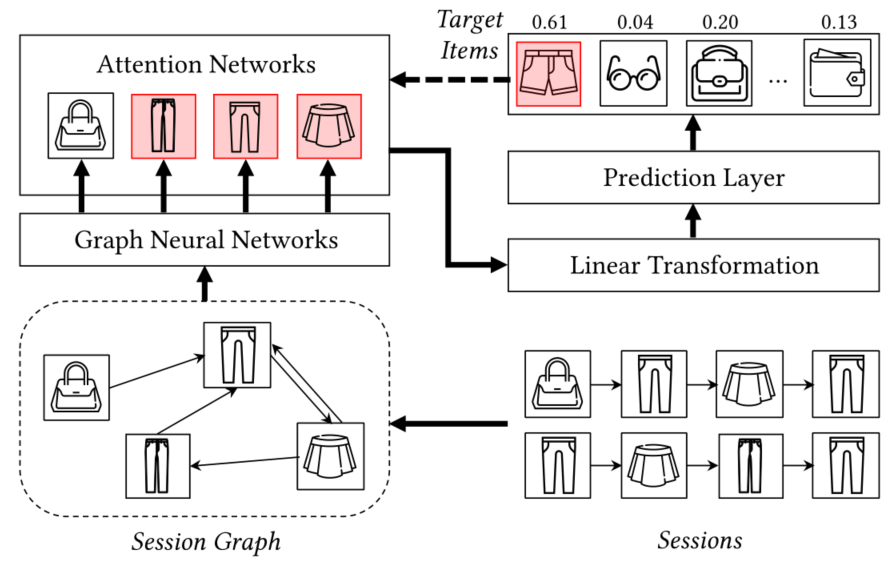

> 论文标题：TAGNN: Target Attentive Graph Neural Networks for Session-based Recommendation
>
> 发表于：2020 SIGIR
>
> 作者：Feng Yu,Yanqiao Zhu, Qiang Liu
>
> 代码：https://github.com/CRIPAC-DIG/TAGNN
>
> 论文地址：https://arxiv.org/pdf/2005.02844.pdf

## 摘要

- 现有方法将会话压缩为一个固定的表示向量，而不考虑要预测的目标项目。
  - 考虑到目标项目的多样性和用户的兴趣，固定向量会限制推荐模型的表示能力
- 提出了一种新的目标注意力图神经网络 (TAGNN) 模型，用于基于会话的推荐。
  - 在 TAGNN  中，目标感知注意力自适应地激活不同用户对不同目标项目的兴趣。
  - 学习到的兴趣表示向量随着目标项目的不同而变化，极大地提高了模型的表达能力。
  - TAGNN  利用图神经网络来捕获会话中丰富的项目转换

## 结论

- 开发了一种新的目标注意力图神经网络模型，用于基于会话的推荐。通过结合图建模和目标感知注意模块，所提出的 TAGNN  联合考虑给定特定目标项目的用户兴趣以及会话中的复杂项目转换。

## 未来工作

## 介绍

- 基于会话的推荐根据用户在当前会话中的先前行为来预测用户的下一个动作（例如，单击哪个项目）。
- 以前的工作强调复杂的用户行为模式对于基于会话的推荐具有重要意义 [3, 5]。
  - 这些基于序列的方法仅对连续项目之间的顺序转换进行建模，而忽略了复杂的转换。
  - 以重复购买为例，这是网购场景中最突出的行为之一。
    - 假设用户的会话是 s = v1 → v2 → v1 →  v3。这些基于序列的方法很难捕捉到项目之间的这种来回关系
      - 他们会对 item v1 和 items (v2,v3) 之间的关系感到困惑
- 本文建议通过会话图 [10]  发现会话下的复杂过渡模式。
  - 通过将会话中的项目建模为会话图，这种对会话中丰富的时间模式进行编码的自然方法可以为每个项目生成更准确的表示
- 候选项目通常很丰富，用户的兴趣通常是多样的，以前的工作 [3, 5, 10] 表示使用一个嵌入向量的一个会话。
  - 该固定大小的向量代表单个用户的所有兴趣，无法表达不同的用户兴趣，从而限制了推荐模型的表达能力。
  - 一种蛮力解决方案，可以考虑扩大该固定长度向量的维度，这反过来会暴露出过度拟合的风险并降低模型性能
- 给定目标项目[11]，可以有针对性地激活具有丰富行为的用户的兴趣
- 本文中提出一个新的目标注意模块改进了所提出的基于图的模型。称为  TAGNN。
  - 所提出的目标注意模块旨在通过考虑给定目标项目的历史行为的相关性来自适应地激活用户兴趣。
  - 通过引入本地目标注意力单元，激活当前会话中与目标项目相关的特定用户兴趣，这将有利于下游会话表示

## 模型架构

- TAGNN
  
  - 首先是基于会话构建会话图。
  - 然后，图神经网络在会话中捕获丰富的项目转换。
  - 最后，从一个会话嵌入向量中，目标感知注意力自适应地激活与要预测的不同目标项目有关的不同用户兴趣。

## 实验

- ### 研究问题

  - RQ1。与现有的代表性基线算法相比，所提出的 TAGNN 是否实现了最先进的性能？ 
  - RQ2。表示用户兴趣的不同方案如何影响模型性能？

- ### 数据集

  - Diginetica 
  - Yoochoose 1/64

- ### baseline

  - 基于频率预测的方法
    - POP 
    - S-POP
  - 基于相似性的方法
    - Item-KNN
  - 基于分解的方法
    - 贝叶斯个性化排名 (BPRMF) [6] 
    - 分解个性化马尔可夫链模型(FPMC) [7]
  - 基于 RNN 的推荐模型
    - GRU4REC [1]
    - 神经注意力推荐模型 (NARM)
    - 短期注意力/记忆优先模型 (STAMP) [5]
  - 基于 GNN 的推荐模型
    - SR-GNN [10]

- ### 超参数设置

- ### 评估指标

  - Precision@20 
  - MRR@20.