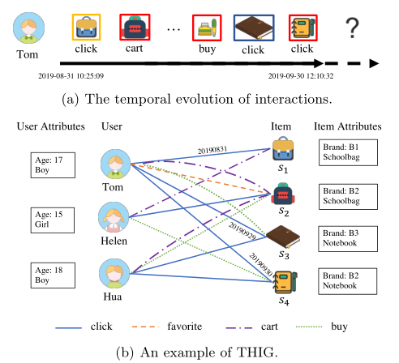
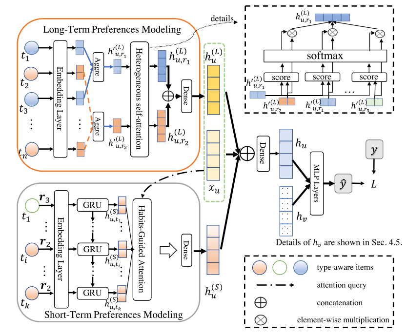

> 论文标题：Temporal Heterogeneous Interaction Graph Embedding For Next-Item Recommendation
>
> 发表于：2020 ECML-PKDE
>
> 作者：Yugang JI， Mingyang YIN，Yuan FANG
>
> 代码：https://github.com/BUPT-GAMMA/THIGE
>
> 论文地址：https://ink.library.smu.edu.sg/cgi/viewcontent.cgi?article=6160&context=sis_research

## 摘要

- 在下一个项目推荐的场景中，以前的方法试图通过捕捉顺序交互的演变来模拟用户偏好。
- 它们的顺序表达通常是有限的，没有模拟短期需求通常会受到长期习惯影响的复杂动态。
- 同时很少有人考虑到用户和项目之间的异构类型的交互
- 本文中，我们将复杂数据建模为时间异构交互图 (THIG)，并在 THIG 上学习用户和项目嵌入，以解决下一个项目的推荐问题。
- 挑战涉及两个方面：相互作用的复杂动态和丰富的异质性
- 提出了 THIG Embedding  (THIGE)，它对复杂的动态进行建模，以便与不断发展的短期需求由长期的历史习惯引导，并利用丰富的异质性来表达不同类型偏好的潜在相关性。

## 结论

- 为了充分利用动态和异构信息，我们提出了 THIGE 通过习惯引导和异构自我注意机制来模拟短期和长期偏好

## 未来工作

## 介绍

- 现有方法通常独立地模拟短期和长期偏好，而忽略了习惯在推动当前不断变化的需求中的作用
- **第一个挑战**：如何有效地模拟复杂的时间动态，同时结合历史习惯和不断变化的需求？
  - 在本文中将历史习惯建模为长期偏好，将当前不断变化的需求建模为短期偏好。
  - 将需求学习与历史习惯相结合，形成一种习惯导向的注意力，将长期和短期偏好紧密结合。
- 现有序列模型忽略丰富的异构结构信息。
  - 现有异构网络嵌入和图神经网络 (GNN) [1,21,24] 中研究，忽略了复杂的时间动态，将图形视为静态快照。
  - 他们中的大多数人独立处理不同类型的交互，但实际上不同类型（例如点击和购买）通常表达不同的潜在相关性
  - 在最近的一些同质图[19, 10] 的工作中已经研究了时间图，而没有对丰富的异质性进行建模
- **第二个研究挑战**：如何充分利用时间异构交互来对不同类型的偏好进行建模？
  - 提出了一个时间异构交互图（THIG）来联合建模异构交互和时间维度。与静态图相比，THIG 可以表达用户不断变化的偏好和物品流行度的变化；与时间图相比，THIG  可以利用丰富的异质因素，同时有助于偏好学习
  - 设计了一种新颖的异构自我注意机制，以从多重交互中提取潜在相关性和多方面偏好
- 在 THIGE  中，我们首先使用时间信息对异构交互进行编码。
- 在时间编码的基础上，我们考虑了长期习惯对短期需求的影响，并设计了一种以习惯为导向的注意机制来结合短期和长期偏好。
- 为了充分利用丰富的异构交互来增强多方面的偏好，我们进一步通过异构自注意机制捕捉不同类型交互的潜在相关性

## 模型架构

- 异构图：
  
- THIGE：
  

## 实验

- ### 数据集

  - Yelp：一个公共业务数据集，具有两种类型的时间交互，即用户和企业之间的“评论”和“提示”。
  - CloudTheme：记录点击和购买日志的公共电子商务数据集
  - UserBehavior：从淘宝网站提取的一个行业数据集，由用户和物品之间的“点击”、“收藏”、“购物车”和“购买”交互组成。

- ### baseline

  - DIEN [25]：一个分层 GRU，用于编码不断发展的兴趣
  - STAMP [9]：短期记忆优先模型，用于提取基于会话的兴趣
  - SHAN [23]：采用分层注意机制来融合历史和最近的交互
  - M3R： 分别使用 GRU 和注意机制对长期和短期兴趣进行建模
  - MEIRec：专注于基于不同元路径聚合信息，而不关注元路径的相关性
  - GATNE： 将多种类型的交互与注意力机制相结合，但未能对动态进行建模。

- ### 超参数设置

- ### 评估指标

  - F1
  - PR-AUC
  - ROC-AUC