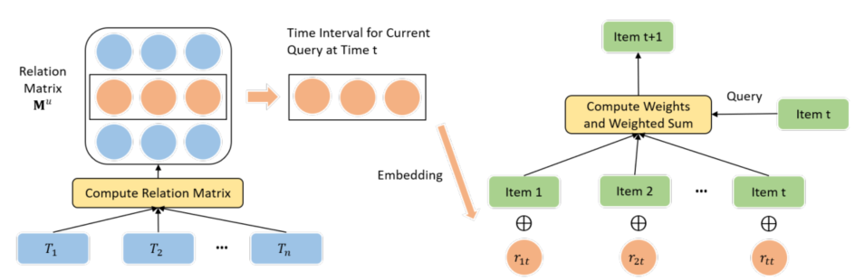

> 论文标题：Time Interval Aware Self-Attention for Sequential Recommendation
>
> 发表于：2020 WSDM
>
> 作者：Jiacheng Li，Yujie Wang，Julian McAuley
>
> 代码：https://github.com/pmixer/TiSASRec.pytorch
>
> 论文地址：https://cseweb.ucsd.edu/~jmcauley/pdfs/wsdm20b.pdf

## 摘要

- 现有模型所做的简化假设是将交互历史视为有序序列，而不考虑每次交互之间的时间间隔
  - （它们对时间顺序进行建模，而不是对实际时间戳进行建模）
- 本文中在顺序建模框架内显式建模交互的时间戳，以探索不同时间间隔对下一个项目预测的影响
- 本文提出了 TiSASRec（基于时间间隔感知的自我注意的顺序推荐),对项目的绝对位置以及它们在序列中的时间间隔进行建模
  - 将用户的交互历史视为具有不同时间间隔的序列，并将不同时间间隔建模为任意两个交互之间的关系
  - 将绝对位置和相对时间间隔编码的优势相结合进行自我注意，设计了一种新颖的时间间隔感知自我注意机制来学习不同项目的权重、绝对位置和时间间隔来预测未来的项目

## 结论

- 提出了一种用于顺序推荐的时间间隔感知自注意模型（TiSASRec）。 
- TiSASRec 对项目之间的相对时间间隔和绝对位置进行建模，以预测未来的交互

## 未来工作

## 介绍

- 挖掘用户交互历史的两条重要工作线：时间推荐和顺序推荐。
  - 时间推荐 [17, 29, 31, 35] 侧重于对绝对时间戳建模以捕获用户和项目的时间动态
    - 不考虑顺序模式，而是考虑依赖于时间的时间模式
  - 顺序推荐通过交互时间戳对项目进行排序，并专注于顺序模式挖掘来预测下一个可能与之交互的项目
    - 顺序推荐会丢弃时间戳并仅保留项目的顺序，（隐含地）假设序列中的所有相邻项目具有相同的时间间隔。
    - 影响下一项的因素只有上一项的位置和身份
  - 然而，具有较新时间戳的项目将对下一个项目产生更大的影响
    - 如：两个用户的交互顺序相同，但其中一个用户在一天内完成了这些交互，而另一个用户在一个月内完成了这些交互
    - 即使两个用户的交互对接下来的项目产生不同的影响，它们仍具有相同的顺序位置
    - 以前的工作忽略了这些间隔及其对预测项目的影响
  - 提出了一种时间感知自我注意机制TiSASRec。
    - 该模型不仅考虑了像 SASRec [14] 这样的项目的绝对位置，还考虑了任何两个项目之间的相对时间间隔

## 模型架构

- TiSASRec：
  
  - 时间间隔和自注意力相对应的组件

## 实验

- ### 研究问题

  - RQ1：我们提出的方法能否在顺序推荐任务中优于最先进的基线？ 
  - RQ2：对于顺序推荐，绝对位置或相对时间间隔哪个更重要？ 
  - RQ3：参数如何影响模型性能，例如维度数、序列的最大长度和我们考虑的最大时间间隔？ 
  - RQ4：个性化的时间间隔在这个模型中有用吗？

- ### 数据集

  - MovieLens-1M
  - Amazon CDs and Vinyl,
  - Amazon  Movies and TV, 
  - Amazon Beauty，
  - Amazon Video Games

- ### baseline

  - POP。所有的item都按照他们在所有用户的训练集中的流行度进行排名，流行度是通过计算动作的数量来计算的。
  - BPR[20]。贝叶斯个性化排名是通用项目推荐的经典方法。矩阵分解用作推荐器。 
  - FPMC[21]。该方法结合了矩阵分解和一阶马尔可夫链，分别捕获长期偏好和动态转换。 
  - TransRec[7]。此方法将每个用户建模为从项目到项目的转换向量。这是捕获转换的一阶方法。 
  - GRU4Rec+[11]。为基于会话的推荐建模用户动作序列。GRU4Rec+ 采用了不同的损失函数和采样策略，在 GRU4Rec  上表现出显着的改进。
  - Caser[24]。将一系列最近的项目嵌入到时间和潜在空间中的“图像”中。该方法可以捕获考虑 L 个最近项的高阶马尔可夫链。 
  - MARank [34]。最近提出的最先进的模型。此方法考虑最近的项目并应用多顺序注意力来捕获单个和联合级别的项目依赖关系。

- ### 超参数设置

- ### 评估指标

  - Hit@10 
  - NDCG@10