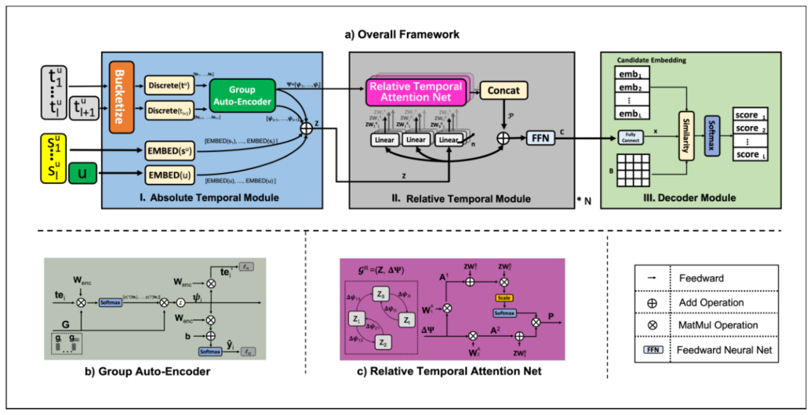
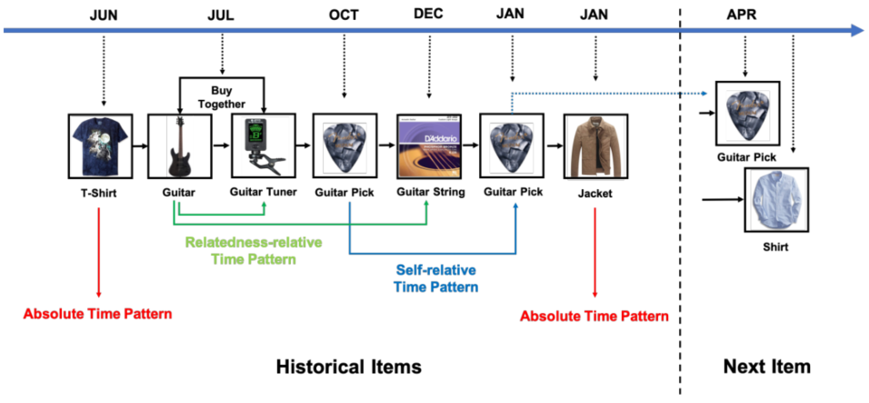

> 论文标题：Time Matters: Sequential recommendation with complex temporal information
>
> 发表于：2020 SIGIR
>
> 作者：Wenwen Ye, Shuaiqiang Wang, Xu Chen
>
> 代码：
>
> 论文地址：https://sci.bban.top/pdf/10.1145/3397271.3401154.pdf

## 摘要

- 现有的方法大多将行为的时间信息简化为行为序列，用于基于 RNN 的建模,这样与时间相关的关键信号在很大程度上被忽略
- 本文发现了两种基本的用户行为时间模式：“绝对时间模式”和“相对时间模式”，
  - 前者突出了用户对时间敏感的行为，
    - 例如，人们可能在某个时间点频繁与特定产品交互，
  - 后者表示时间间隔如何影响两个动作之间的关系。
- 因此设计了时间注意顺序推荐（TASER），将这些信息无缝地整合到一个统一的模型中来模拟用户动态偏好。

## 结论

- 本文中旨在利用用户行为序列中的绝对时间模式和相对时间模式进行顺序推荐。
- 提出了一种名为 TASER  的新型神经网络框架，
  - 其中时间模式分别由绝对时间模块和相对时间模块捕获，并在损失函数中采用时间感知约束以获得更好的时间信息表示。

## 未来工作

## 介绍

- 现有的顺序推荐算法主要关注用户行为的序列，而忽略了他们的时间模式 [41, 43]。
- 传统的 [17] 推荐系统通常使用概念漂移来模拟用户兴趣的时间演变，并假设用户的兴趣随着时间的推移而平稳地演变
- 基于会话的推荐[14, 18]，主要侧重于跟踪短期用户兴趣，仅将项目的顺序进行建模。除此之外，一些顺序推荐模型嵌入了具有自我注意的桶化的绝对时间和位置 [15,  41]。
- 它们大多考虑了不完整（或部分）的时间信息。仍然缺乏对这种综合时间模式进行全面而彻底的建模
- 本文发现实际生活中有两种典型的用户行为序列时间模式：绝对时间模式和相对时间模式
  - 绝对时间模式直接将用户的行为序列与时间戳联系起来
  - 相对时间模式强调行为之间的时间间隔，可以进一步分为两个子类别：自相关时间模式和相关性相对时间模式。
    - 自相关时间模式，
      - 如，每三个月连续回购吉他拨片是电子商务中周期性行为的特征，这通常适用于消耗品，例如尿布、啤酒等。
    - 相关性相对时间模式通过揭示项目之间的相关性关系来考虑时间维度。
      - 如：吉他和琴弦之间的间隔可以确定为五个月，因为最初它们都是在 7 月购买的，而琴弦更换发生在 12 月。
- 因此提出时间注意顺序推荐（TASER），它可以联合学习这些时间模式和用户兴趣以进行顺序推荐。
  - 对于每个输入序列，引入包含组自动编码器嵌入网络的绝对时间模块来嵌入时间序列。
  - 与传统的时间分桶方法相比，该模块丰富了表示绝对时间的能力。
  - 与绝对时间模块一起，相对时间模块以显式方式将相对时间效应注入到用户行为序列的两个动作之间的关系中。
  - 此外，损失函数中采用了时间感知约束，以获得更好的时间信息表示。

## 模型架构

- TASER
  
  - (a) 总体框架。
    - 首先，绝对时间模块将带有时间戳的顺序行为嵌入到密集向量中，然后将其馈入相对时间模块以生成目标用户的语义向量'  历史行为。
    - 然后可以计算目标用户和候选项目之间的相似度，以便在解码器模块中进行预测。
  - (b) Group Autoencoder 结构的详细实现。
  - (c)  左图：由序列元素及其相对时间组成的标记的、有向的、完全连接的图。右图：Relative Temporal Attention Net 的详细实现。
- 时间行为示例
  

## 实验

- ### 研究问题

  - RQ1 提出的模型是否在顺序推荐中实现了最先进的性能？ 
  - RQ2 TASER 架构中各种组件的作用是什么？
  - RQ3 序列的时间信息如何影响推荐结果？ 
  - RQ4  关键超参数有什么影响？

- ### 数据集

  - LastFM。它是一种广泛使用的音乐推荐数据。在实验中使用 1K 版本。
  - Amazon Instant Video, Amazon Musical Instrument, Amazon Beauty, Amazon Digital Music ，Amazon Cell Phone

- ### baseline

  - POP.。这是一种非个性化方法，其中所有项目都按每个用户的受欢迎程度进行排名。
  - BPR [23]。贝叶斯个性化排名是一种最先进的非序列项目推荐方法。
  - FPMC [24]。分解个性化马尔可夫链是一种基于马尔可夫链的顺序推荐方法。对于我们的顺序推荐问题，每个篮子代表一个项目。
  - GRU4Rec  [14]。它是一种基于会话的推荐方法，使用 RNN 结构化 GRU 进行序列推荐。
  - NARM [18]。基于会话的推荐模型，将注意力机制集成到  RNN 中。它可以捕获用户在每个会话中的顺序行为及其主要目的。
  - Time-LSTM [43]。它是 LSTM 的一种变体，可以对用户的顺序动作进行建模，为  LSTM 配备时间门来对时间间隔进行建模。 
  - ATRank。 [41] 它是一个对用户行为进行建模的自注意力框架。 
  - TASER-Position。它是我们的  TASER 的变体，它仅使用序列的位置顺序而不是时间信息进行预测。
  - TASER-Abs。它是 TASER 的另一种变体，它在相对时间模块中使用原始的  self-attention 而没有相对时间。

- ### 超参数设置

- ### 评估指标

  - F1-score
  - NDCG@K