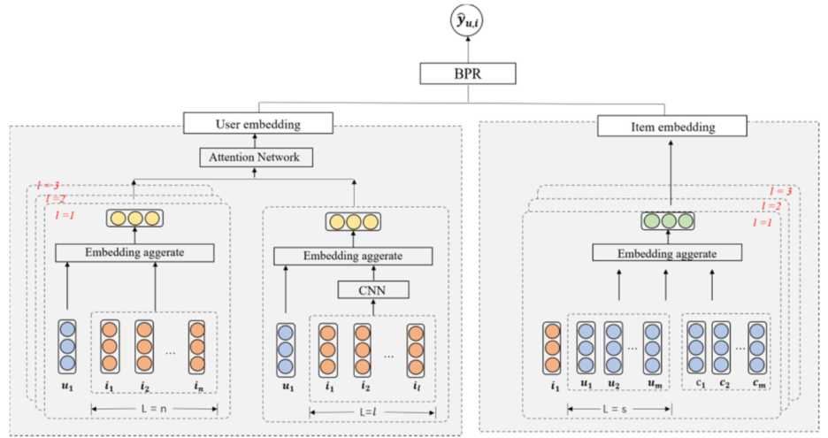
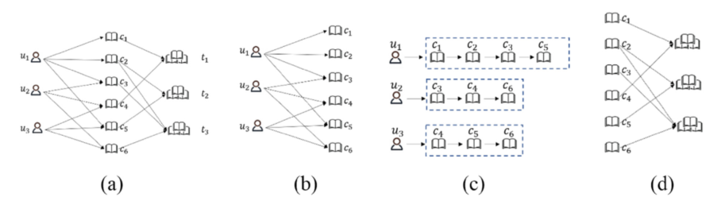

> 论文标题：Top-N personalized recommendation with graph neural networks in MOOCs
>
> 发表于：Computers and Education: Artificial Intelligence
>
> 作者：Jingjing Wang, Haoran Xie 
>
> 代码：
>
> 论文地址：https://sciencedirect.53yu.com/science/article/pii/S2666920X21000047

## 摘要

- 现有模型有两个主要缺点。
  - 首先，这些模型很少学习项目结构关系的明确表示。
  - 其次，这些模型中的大多数通常会获取用户的一般偏好并忽略项目的新近度
- 本文提出在在线课程（MOOCs）中使用图神经网络（TP-GNN）的Top-N个性化推荐
  - 探索了两种不同的聚合函数来处理用户的序列邻居，
  - 然后使用注意力机制生成最终的项目表示。
- TP-GNN 模型同时考虑了用户的顺序行为和一般偏好。 
  - 对于一般偏好，我们应用 GCN  来捕获节点之间的高级隐式关系，特别是对于课程类别关系和共同学习关系。
  - 对于序列化聚合，我们应用 CNN 来过滤序列模式的重要特征

## 结论

- 提出了一种基于图卷积网络的 Top-N 个性化课程推荐方法
  - 将共同学习关系和共同类别关系作为用户的一般偏好纳入项目嵌入中
  - 为了捕捉用户当前的偏好，我们将序列修改为 CNN 输入，避免了 RNN 中所有相邻项目相互依赖的限制
  - 通过一般偏好级别，TP-GNN 学习如何嵌入具有高阶连接性的项目。
  - TP-GNN 使用 CNN 来提取具有当前项目的序列模式的重要特征

## 未来工作

- 将考虑更多的学习行为，如学习进度、意见，以探索学习者的特点 作为推荐特征

## 介绍

- 现有方法中的大多数都关注用户的一般偏好，而忽略了他们最近的偏好。
  - 一般偏好代表用户长期的静态行为，而近期偏好则代表用户的短期动态行为
  - 在最近的偏好中，下一个项目或动作更依赖于用户最近的项目或动作
- 使用会话事件序列可以解决用户偏好的转变，并在许多领域获得有希望的结果
- 现有的基于 RNN 的方法存在两个主要缺点。
  - 首先，这些模型依赖于足够的用户行为数据来估计用户表示。
    - 与会话点击有关的用户行为数据通常是有限的，尤其是对于通过  MOOC 中的点击进行的新注册。
    - 由于会话是匿名的，在基于会话的推荐系统中，项目表示是从这些 RNN 方法的隐藏状态生成的（例如 NARM  的全局推荐器）。因此，很难从每个会话中生成用户的表示。
  - 此外，当相邻动作没有依赖关系时，基于 RNN  的方法可能表现不佳，例如，意外点击错误项目，或出于好奇而注册课程。
- 目前的推荐通常只考虑直接连接关系，这限制了表示能力。
  - 由于用户经常在朋友之间分享信息，这意味着用户的偏好会受到朋友的影响。因此，高阶连接中的用户-项目交互需要考虑
- 提出了一种新颖的图神经网络框架，在 MOOCs 中使用图神经网络的 Top-N  个性化推荐（TP-GNN）。
  - 为了充分利用协同学习关系和顺序模式，我们探索了两种不同的聚合函数来处理基于用户-项目交互图的用户邻居，
  - 然后应用注意力机制来生成最终的节点嵌入表示

## 模型架构

- TP-GNN
  
  - 包含三个主要组件：用户嵌入、项目嵌入和评分预测。
- 图形示意
  
  - a）是原始的user-item交互图，可以分为 b）、c）、d）。
  - 图（b）是用户-项目二分图，图2（c）是用户序列关系图。图 2 (d)  是课程类别图。

## 实验

- ### 研究问题

- ### 数据集

  - MOOCs

- ### baseline

  - POP：无论用户的在线行为如何，都会将所有用户序列中最受欢迎的商品推荐给用户。
  - S-POP：这种方法也是根据物品的受欢迎程度。 POP 和 S-POP 的区别在于 S-POP 会建议当前会话中最受欢迎的项目。
  - BPR (Rendle et al., 2012)：贝叶斯个性化排名是一种广泛使用的 RS 成对排名方法。但是，它通常用于推荐非连续项目。 
  - GRU4REC ：GRU4REC 使用基于 RNN 的门机制来识别会话序列中的项目转换。 
  - PinSage (Berg et al., 2017)：这是一个基于图的推荐模型，它为用户/项目生成特征表示。

- ### 超参数设置

- ### 评估指标

  - Recall@K
  - NDCG@K