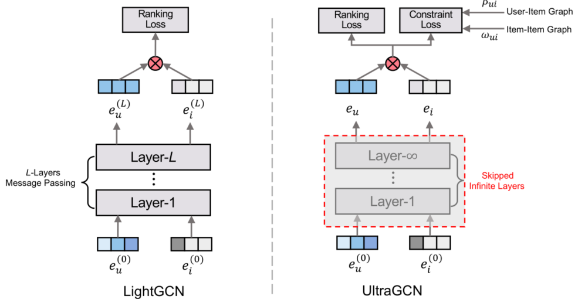

> 论文标题：UltraGCN: Ultra Simplification of Graph Convolutional Networks for Recommendation
>
> 发表于：2021 CIKM	
>
> 作者：Kelong Mao,Jieming Zhu,Xi Xiao
>
> 代码：https://github.com/xue-pai/ultragcn
>
> 论文地址：https://arxiv.org/pdf/2110.15114v1.pdf

## 摘要

- GCN 的核心在于其聚合邻域信息的消息传递机制。消息传递在很大程度上减慢了 GCN 在训练期间的收敛速度
- LightGCN 早期尝试通过省略特征转换和非线性激活来简化协同过滤的 GCN
- 在本文中提出了一种超简化的 GCN 公式（称为 UltraGCN），它跳过了无限层的消息传递以实现高效推荐。
  - UltraGCN 不是显式的消息传递，而是通过约束损失直接逼近无限层图卷积的极限
  - UltraGCN 允许更合适的边缘权重分配和不同类型关系之间相对重要性的灵活调整

## 结论

- 提出了一种超简化的 GCN 公式， UltraGCN。跳过显式消息传递，直接逼近无限消息传递层的限制

## 未来工作

## 介绍

- 当前的模型设计繁重且繁重。为了捕获更高阶的协作信号并更好地建模用户和项目之间的交互过程，当前基于 GNN 的 CF 模型 [1, 24, 27, 32]  倾向于寻求越来越复杂的网络编码器
  - 这些基于 GCN 的模型很难用大图进行训练
- 目前简化基于 GCN 的 CF 模型的设计，主要通过删除 CF 不需要的特征转换和非线性激活，但消息传递操作仍然主导着它们的训练
- 但是大图上的消息传递（即邻域聚合）对于 CF 来说通常是耗时的
  - 堆叠多层消息传递可能会导致基于 GCN 的模型在 CF 任务上的收敛缓慢
- 问题：如何提高 GCN 模型的效率同时保持其在推荐方面的有效性？
- 分析了 LightGCN 的消息传递公式并确定了三个关键限制：
  - 1）在消息传递期间分配给边缘的权重是违反直觉的，这可能不适合 CF。  
  - 2）传播过程递归地将不同类型的关系对（包括用户-项目对、项目-项目对和用户-用户对）组合到模型中，但未能捕捉到它们不同的重要性。这也可能会引入干扰模型训练的嘈杂和无信息的关系。  
  - 3）过度平滑问题限制了 LightGCN 中消息传递层数过多的使用。因此，我们寻求通过约束损失直接逼近无限层图卷积的极限，而不是执行显式消息传递
- UltraGCN 基于损失的设计非常灵活，允许我们手动调整不同类型关系的相对重要性，也可以避免负采样的过度平滑问题。

## 模型架构

- LightGCN 需要反复执行 L个layers 消息传递来获得最终的 embeddings 进行训练，
- 而 UltraGCN 可以“跳过”这样的消息传递，使  embeddings 被直接训练，大大提高了训练效率，有助于实际部署。

## 实验

- ### 研究问题

- ### 数据集

  - Amazon-Book, 
  - Yelp2018,
  - Gowalla, 
  - MovieLens-1M

- ### baseline

  - 基于 MF 的
    - MF-BPR [15]
    - ENMF [3]）
  - 基于度量学习的
    - CML [12]
  - 网络嵌入方法
    - DeepWalk [20]、
    - LINE [25] 
    - Node2Vec [7]
  - 基于GCN
    - NGCF [27]
    - NIA-GCN [24]
    - LR-GCCF [4]
    - LightGCN [10] 
    - DGCF  [ 28]

- ### 超参数设置

- ### 评估指标

  - Recall@20 
  - NDCG@20