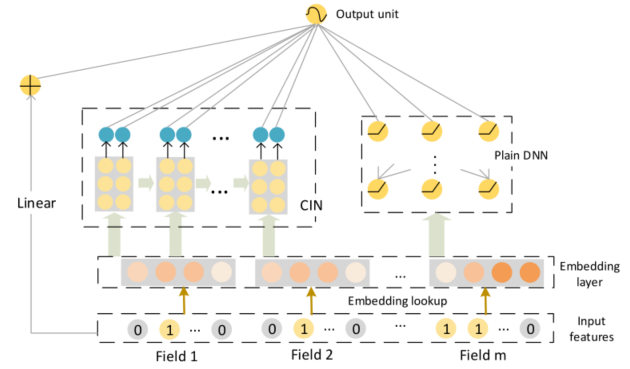

> 论文标题：xDeepFM: Combining Explicit and Implicit Feature Interactionsfor Recommender Systems
>
> 发表于：2018 SIGKDD
>
> 作者：Jianxun Lian, Xiaohuan Zhou, Fuzheng Zhang
>
> 代码和数据：https://github.com/shenweichen/DeepCTR-PyTorch
>
> 论文地址：https://arxiv.org/pdf/1803.05170v3.pdf

## 摘要

- 基于因子分解的模型根据向量积来衡量交互，可以自动学习组合特征的模式，也可以泛化到看不见的特征
- DNN从数据中学习任意函数的能力非常强大，但普通 DNN 是隐式地在位级别上生成特征交互
- 提出了一种新颖的压缩交互网络Compressed Interaction Network （CIN），旨在以显式方式和向量级别生成特征交互
- 将 CIN 和经典深度神经网络DNN 组合成一个统一模型 xDeepFM
- xDeepFM 能够显式地学习某些有界度特征交互；另一方面，它可以隐式地学习任意低阶和高阶特征交互

## 介绍

- 特征在许多预测系统的成功中起着核心作用.一种主要的特征转换类型是分类特征的叉积转换[5]。这些特征称为交叉特征或多路特征，它们测量多个原始特征的交互
- 传统的交叉特征工程存在三个主要缺点。
  - 首先，获得高质量的特征需要付出高昂的代价。
  - 在大型预测系统中，例如网络规模的推荐系统，大量的原始特征使得手动提取所有交叉特征是不可行的
  - 手工制作的交叉特征不能推广到训练数据中看不见的交互
- FM模型主要的缺点是，[2] 对所有特征交互进行建模，包括有用和无用的组合，无用特征的交互可能会引入噪声并降低性能
- DNN 来学习复杂和选择性的特征交互
  - [46] 提出了一种因子分解机支持的神经网络（FNN）来学习高阶特征交互。在应用 DNN 之前，它使用预先训练的分解机器进行字段嵌
  - [31] 进一步提出了一种基于产品的神经网络（PNN），它在嵌入层和 DNN 层之间引入了产品层，并且不依赖于预训练的 FM。
  - FNN 和 PNN 的主要缺点是它们更多地关注高阶特征交互，而捕获很少的低阶交互
  - Wide&Deep [5] 和 DeepFM [9] 模型通过引入混合架构克服了这个问题，混合架构包含一个浅层组件和一个深层组件，目的是学习记忆和泛化，他们可以共同学习低阶和高阶特征交互。
- DNN 是否确实是表示高阶特征交互的最有效模型仍然是一个悬而未决的问题

## 结论

- 提出了一种名为 Compressed Interaction Network (CIN) 的新型网络，旨在显式学习高阶特征交互。 
- CIN  有两个特殊的优点：（1）它可以有效地学习某些有界度特征交互； (2) 它在向量级别学习特征交互。
- xDeepFM 可以自动学习显式和隐式两种方式的高阶特征交互，这对于减少手动特征工程工作具有重要意义

## 未来工作

- 目前只是简单地使用 sum pooling 来嵌入多价字段。我们可以探索使用 DIN 机制 [47] 来根据候选项目捕获相关激活
- CIN 模块的时间复杂度很高。我们有兴趣开发可以在 GPU 集群上有效训练的分布式版本的 xDeepFM。

## 模型架构

- xDeepFM:
- CIN的组件和架构

- CIN 的结构与循环神经网络 (RNN)  非常相似，其中下一个隐藏层的输出取决于最后一个隐藏层和一个附加输入。我们在所有层都保留了嵌入向量的结构，因此交互作用是在向量层面应用的

## 实验

- ### 研究目的

  - (Q1）我们提出的 CIN 在高阶特征交互学习中表现如何？ 
  - (Q2) 推荐系统是否有必要结合显式和隐式的高阶特征交互？ 
  - (Q3)  网络设置如何影响xDeepFM 的性能？

- ### 数据集

  - Criteo ：用于开发预测广告点击率的模型，给定一个用户和他正在访问的页面，目标是预测他点击给定广告的概率
  - Dianping：大众点评网是中国最大的消费者评论网站。提供评论、签到、店铺元信息（包括地理信息和店铺属性）等多种功能
  - Bing News ：是微软Bing搜索引擎的一部分。我们收集了连续五天在新闻阅读服务上的印象日志。

- ### baseline

  - LR（逻辑回归）
  - FM
  - DNN（普通深度神经网络）
  - PNN（从 iPNN 和 oPNN 中选择更好的一个）[31]
  - Wide & Deep  [5]
  - DCN（Deep & Cross Network）
  - DeepFM [9]

- ### 超参数设置

  - 学习率设置为 0.001
  - 小批量大小为 4096 的 Adam 
  - 对 DNN、DCN、Wide&Deep、DeepFM 和 xDeepFM 使用 L2 正则化，λ = 0.0001，对 PNN 使用 dropout  0.5。
  - 每层神经元数量的默认设置为： (1) DNN 层为 400； (2) Criteo 数据集上的 CIN 层数为 200，大众点评和 Bing News  数据集上的 CIN 层数为 100
  - 嵌入维度设为固定值 10

- ### 评估指标

  - AUC
  - Logloss (cross entropy).