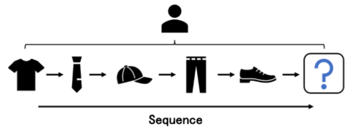

---

---

## RS历程：

浅层模型、神经模型 和 基于GNN的模型

## 优势：

图神经网络采用聚合邻域嵌入的方式传播迭代。通过堆叠传播层，每个节点可以访问高阶邻居的信息，而不是像传统方法那样只访问一阶邻居的信息

## 挑战：

- 推荐系统的数据输入应该仔细、正确地构造成图，节点表示元素，边表示关系
- 对于具体的任务，需要对图神经网络中的组件进行自适应设计，包括如何进行传播和聚合
- 基于GNN模型的优化，包括优化目标、损失函数、数据采样等，应符合任务要求
- 由于推荐系统对计算成本有严格的限制，并且由于GNNs的嵌入传播操作引入了大量计算，因此在推荐系统中高效部署图神经网络是另一个关键挑战

## 阶段：

- ### 匹配 Matching

  - 从非常大的项目池（百万级甚至十亿级）生成数百个候选项目, 这个阶段的模型通常是简洁的
  - 这个阶段的核心任务是高效地检索潜在的相关项，并实现用户兴趣的粗粒度建模

- ### 排序 Ranking

  - 来自不同渠道的多个候选项目源被合并到一个列表中，然后通过单个排名模型进行评分
  - 排名模型根据分数对这些项目进行排名，并选择排名前几十的项目
  - 这一阶段的输入项目数量相对较少，系统可以提供更复杂的算法
  - 由于涉及到很多特性，因此此阶段的关键挑战是设计适当的模型以捕获复杂的特性交互

- ### 重新排序 Re-ranking

  - 排名阶段后获得的项目列表在相关性方面进行了优化，但可能无法满足其他重要要求，如新鲜度、多样性、公平性
  - 通常会删除某些项目或更改列表的顺序，以满足其他条件并满足业务需求
  - 这一阶段的主要关注点是考虑最高得分项目之间的多重关系,如 ：类似或可替代的项目在建议中紧密显示时可能导致信息冗余

## 场景：

- ### 社交推荐 Social Recommendation

  

  - 个人行为受到个人和社会因素的驱动，用户的行为可能会受到朋友的行为或想法的影响，这就是所谓的社会影响
  - 社会关系常常被整合到推荐系统中，以提高最终的性能，这称为社会推荐

- ### 顺序推荐 Sequential Recommendation

  

  - 用户会随着时间的推移产生大量的交互行为。顺序推荐方法从这些行为序列中提取信息，并预测用户的下一个交互项目
  - 顺序推荐使用用户的历史行为序列来学习时间戳感知的顺序模式，以推荐用户可能感兴趣的下一个项目
  - 挑战：
    - 对于每个样本，在每个序列中，需要从序列中提取用户的兴趣，以预测下一个项目。特别是当序列长度增加时，同时对用户的短期、长期和动态兴趣进行建模是非常具有挑战性的
    - 除了在序列内建模外，由于项目可能出现在多个序列中或用户具有多个序列，因此需要捕获不同序列之间的协作信号以更好地表示学习

- ### 基于会话的推荐 Session-based Recommendation

  

  - 由于存储资源有限，不可能或不需要长时间跟踪用户id的行为；用户配置文件和长期历史交互不可用，只提供来自匿名用户的短期会话数据
  - 使用给定的匿名行为会话数据预测下一个项目。与顺序推荐不同，同一用户的后续会话在SBR(基于会话的推荐)中独立处理，因为每个会话中用户的行为只显示基于会话的特征

- ### 捆绑推荐 Bundle Recommendation

  

  - 捆绑包是一系列物品的集合，是产品促销的重要营销策略，捆绑推荐旨在为用户推荐一组商品供其消费
  - 例子：Spotify上的音乐播放列表、Pinterest上的插针板、亚马逊上的电脑套件以及宜家的家具套件

- ### 跨域推荐 Cross-Domain Recommendation

  

  - 用户跨多个域与多模式信息交互
  - 缓解冷启动和数据稀疏问题的一种有前途的方法
  - 方法分为两类
    - 单目标CDR（STCDR）
    - 双目标CDR（DTCDR)
    - STCDR方法将信息从源域向目标域单向传输；
    - DTCDR强调源域和目标域信息的相互利用，可以扩展到多目标CDR（MTCDR）。

- ### 多行为推荐 Multi-behavior Recommendation

  

- 在多种类型的行为下交互，而不是仅在一种类型的行为下交互

- 例子：

  - 当用户单击视频时，他/她还可能执行收集或评论等行为
  - 用户通常在购买产品之前单击、添加到购物车、共享或收集产品
  - 对于每个用户u及项目v, 假设有K种不同类型的行为{y1.y2...yk}. 对于第i个行为，如果用户有观察到的行为，则yi=1，否则yi=0
  - 目标是提高特定类型目标行为的预测精度

- 挑战：

  - 不同的行为对目标行为有不同的影响。有些行为可能是强信号，有些可能是弱信号，这种影响对于每个用户都是不同的。准确地模拟这些不同行为对目标行为的影响是一个挑战
  - 从项目的不同行为类型中学习综合表征是一项挑战，不同的行为反映了用户对物品的不同偏好；不同的行为有不同的含义。为了获得更好的表征，需要将不同行为的意义整合到表征学习中

## 目标：

- ### 多样性

  

  - 个体层次的多样性
    - 它衡量每个用户推荐项目的不同性
    - 个人层面的多样性反映了推荐列表涵盖的主题数量以及推荐项目在不同主题上的分布平衡程度
  - 系统层次的多样性
    - 比较了不同用户的推荐结果，并期望它们彼此不同
    - 低系统级多样性意味着总是向所有用户推荐热门项目，而忽略长尾项目
    - 系统级多样性有时被称为长尾推荐 
  - 挑战：
    - 不同项目的信号强度差异很大。对于每个用户来说，都存在优势话题和劣势话题。从弱势主题或长尾项目分别推荐监管如此薄弱的相关内容是一个挑战
    - 多样性有时可能与推荐准确性相矛盾，导致准确性-多样性困境

- ### 可解释性

  - 可解释的推荐系统的重点不仅是产生准确的推荐结果，而且是对如何以及为什么向特定用户推荐商品产生有说服力的解释
  - 增加推荐系统的可解释性可以增强用户感知的透明度、说服力和可信度，并便于从业者调试和完善系统
  - 采用了两种不同的方法
    - 一种是努力设计内在的可解释模型，通过设计具有透明逻辑（而不仅仅是“黑箱”）的模型来确保推荐结果的可解释性
      - 例如：显式因素模型[202]、隐藏因素和主题模型[106]和TriRank
    - 另一种，他们设计了事后独立的模型来解释“黑箱”推荐系统产生的结果
      - 例如：解释挖掘
  - 挑战：
    - 表示可解释的信息需要图形结构项属性，没有GNN的强大功能，很难对这些属性进行建模
    - 推理建议依赖于知识图中的外部知识，这也对任务提出了挑战

- ### 公平性

  - 用户公平性
    - 试图确保特定用户或人口统计组之间没有算法偏差
  - 项目公平性
    - 它表示不同项目的公平暴露，或者不同项目之间没有受欢迎程度偏差
  - 增强公平性的两种方法：
    - 在训练过程中直接扣除推荐结果
    - 在后处理方法中努力对项目进行排序以缓解不公平性
  - 图形数据（如用户-用户）的利用可能会加剧对公平性的担忧
  - 挑战：
    - 在丰富的图形数据背景下，将推荐视为不公平是一个挑战，从图的角度来看，提高用户推荐的公平性更为困难

## 应用：

- ### 产品推荐

  - 推荐时建议同时优化点击率和转换率，
  - 产品可能具有丰富的属性，如价格，类别等，在此基础上可以构建异构图

- ### 兴趣点推荐

  - 为用户下次访问推荐新的位置/兴趣点
  - 有两个重要的因素
    - 空间因素： 指POI自然存在的地理属性 如地理位置
    - 时间因素： 用户的访问 / 签入行为总是形成一个序列 引发了下一个POI或后续POI建议的问题

- ### 新闻推荐

  - 对新闻文本进行适当的建模，与自然语言处理方法相结合，以便更好地提取新闻特征
  - 准确地从快速变化的候选库中筛选新闻也是至关重要

- ### 电影推荐

  - 估计用户对电影的评分，从1分到5分，即显式反馈。最近，二元隐式反馈已成为更流行的设置

- ### 其他：视频推荐、音乐推荐、工作推荐、食品推荐 等

## GNN

- ### 图形构造。构造图需要预先存在的图数据或从非结构化数据中抽象出图节点和边的概念

  - 定义图 G = ( V , E )
    - 齐次图：其中每个边只连接两个节点，并且只有一种类型的节点和边。
    - 异构图：其中每条边只连接两个节点，并且有多种类型的节点或边
    - 超   图：其中每条边连接两个以上的节点
  - 例子：
    - 以自然语言处理（NLP）中使用的文本数据为例，将单词/文档描述为节点，并根据术语频率逆文档频率（IF-ITF）构造它们之间的边
    - 知识图（KG)，是异构图的一个典型实例。其中节点和边分别被重新定义为实体和关系。KG中的实体可以覆盖广泛的元素，包括人物、电影、书籍等。这些关系用于描述实体如何相互关联。

- ### 网络设计。

  - 光谱模型

    - 谱模型将图看作信号，并在谱域中用图卷积来处理它们
    - 首先通过定义在图形上的傅里叶变换将图形信号转换为谱域，然后应用滤波器，最后将处理后的信号转换回空间域

  - 空间模型

    - 直接对图结构进行卷积，通过加权聚合（如CNN）提取局部特征

  - 迭代收集邻域信息以捕获图节点和边之间的高阶相关性

  - GNN的主要和关键操作是按照结构连接在图上传播嵌入，包括聚合邻域嵌入并将其与目标（节点或边）嵌入融合，以逐层更新图嵌入。

  - 

  - #### GCN ：典型的光谱模型，结合了图卷积和神经网络来实现半监督分类的图任务，GCN在卷积中近似一阶滤波器

  - #### GarphSAGE ：空间GNN模型，它对目标节点的邻居进行采样，聚合它们的嵌入，并与目标嵌入合并以进行更新

  - #### GAT：空间GNN模型,解决了从特定图形结构到另一个图形结构的泛化能力差，以及复杂的矩阵求逆计算。

    - #### GAT利用注意机制通过为不同节点指定不同的权重来聚合邻域特征（嵌入）。

    - #### 注意机制是通过一个完全连接的层实现的。该层由一个可学习向量a参数化，然后是SoftMax函数。

  - #### HetGNN：为异构图定制的空间GNN

    - #### HetGNN首先根据其类型将邻居划分为子集，然后针对每种类型的邻居执行聚合器功能，以结合LSTM和平均操作来收集局部信息

    - #### 此外，基于注意机制，对不同类型的邻域信息进行聚合

  - #### HGNN：在超图上实现GNN的光谱模型

    - #### 这种卷积运算可以看作是邻域嵌入传播的两个阶段：

      - #### 1）从节点传播到连接它们的超边，2）从超边传播到它们相遇的节点。

- ### 模型优化

  - 图上主要任务：分类、预测和回归任务；包括三个层次：节点、边和子图。

  - 模型优化程序：相关嵌入将被映射并带有标签，以形成损失函数，然后利用现有优化器进行模型学习

    - 映射函数（例如MLP、内积）

    - 损失函数（例如成对的、逐点的）

      - 对于成对损失函数，鼓励区分正样本和负样本

        - p和q表示正样本和负样本，s（·）用于测量样本

        - $$
          \zeta = \sum_{p,n}-ln\sigma(s(p)-s(n))
          $$

        

      - 对于逐点损失函数，它包括均方误差损失、交叉熵损失等

  - #### 以链接预测和节点分类任务为例来详细说明如何优化GNN模型：

    - ##### 对于链路预测

      - 两个节点之间是否存在边的可能性i，j需要定义，基于与传播的每一层中的节点嵌入的相似性来计算

      - 将训练数据构造为O={(i，j，k}, 

        - 由观察到的阳性和随机选择的阴性样本组成(i,j) 及(i,k),节点i与图上的j连接，而不是与k连接

        - 在推荐系统中，样本将表明用户i与项目j进行了交互，但没有与项目k进行交互，其中k是从所有其他项目u之前没有交互过的项目中进行采样的.

        - 如果选择成对损耗BPR，则优化对象将为
          $$
          \zeta = \sum_{i,j,k ∈ O}-ln\sigma(s(i,j)-s(j,k))
          $$

    - ##### 对于节点分类

      - 节点嵌入将转换为表示其所属类别的概率分布
      - 分类任务通常选择逐点损失函数，例如交叉熵损失

  - 基于GNN的模型中的优化将GNN概括的表示作为输入，将图形结构（如边、节点类）作为标签，并定义损失函数用于训练

## 为什么推荐系统需要GNN？

- 推荐系统已经从传统的因式分解方法快速发展到先进的基于深度神经网络的模型

- 从以下三个角度来解释：

- ### 结构数据：

  - 在线平台收集的数据有多种形式，传统的推荐系统无法利用这些多种形式的数据，它们通常只关注一个或几个特定的数据源，这会导致次优性能，因为许多信息被忽略
  - 通过将所有数据表示为图上的节点和边，GNN提供了利用可用数据的统一方法
  - 可以获得对用户、项目和其他特征的高质量嵌入

- ###  高阶连通性：

  - 在传统方法中，由于训练数据主要是交互记录，仅包含直接连接的项目，因此只能隐式捕获协同过滤效果，只考虑一阶连通性，缺少高阶连接性会在很大程度上损害推荐性能。
  - 基于GNN的模型可以有效地捕获高阶连接性，协同过滤效果可以自然地表示为图上的多跳邻居，并通过嵌入传播和聚合将其融入学习表示中

- ###  监控信号：

  - 监督信号在采集的数据中通常是稀疏的，仅使用目标行为的推荐系统可能会获得较差的性能
  - 基于GNN的模型可以在表示学习过程中利用半监督信号来缓解这一问题
  - 基于GNN的模型可以通过对图上的半监督信号进行编码，有效地结合多种非目标行为。
  - 还可以通过在图上设计辅助任务来利用自监督信号，从而进一步提高推荐性能

## GNN的推荐系统的挑战

- ### 如何为特定任务构建适当的图表

- ### 如何设计信息传播和聚合机制

- ### 如何优化模型？

- ### 如何确保模型培训和推理的效率？

1. ### 构造图

   - 有两个方面：将输入的数据构造为图形结构数据；将推荐目标重新组织为图表上的任务。

     - 以标准协同过滤任务为例
       - 数据输入为观察到的用户项交互数据，输出为缺失用户项交互的预测
       - 因此，可以构造以用户/项目为节点、交互为边的二部图

   - 节点定义：

     - 图形神经网络学习的主要目标之一是为节点分配表示。这导致节点的定义在很大程度上决定了GNN模型的规模，其中大部分参数由0层节点嵌入所占据。通常不考虑边缘嵌入，或者根据节点嵌入计算边缘嵌入
     - 另一方面，确定是否区分不同类型的节点也是一个具有挑战性的问题
       - 例如，在协同过滤任务中，可以对用户节点和项目节点进行不同的建模，或者将其视为同一类节点
     - 另一个挑战点是处理具体的输入
       - 比如一些数字特征，比如物品价格，它们总是连续的数

     - 为了在图中表示这些特征，一种可能的解决方案是将它们离散化为分类特征，然后将其表示为节点

   - 边定义：

     - 边的定义在进一步的传播和聚合以及模型优化中高度影响图形的质量
     - 在构造图时，良好的边设计应充分考虑图的密度；
       - 过于密集的图形意味着存在度数极高的节点。这将使嵌入传播由非常多的邻居进行。这将进一步使传播的嵌入变得不可区分和无用。要处理过于密集的边，对图进行采样、过滤或修剪是很有希望的解决方案
       - 过于稀疏的图也会导致嵌入传播的效用不佳，因为传播将仅在一小部分节点上进行。

2. ### 网络设计

   - 使GNN不同于传统的图形学习方法的是传播层
   - 对于传播，如何选择路径是建立推荐系统高阶相似性模型的关键。
   - 此外，传播也可以是参数化的，即为不同的节点分配不同的权重
   - 在传播过程中，也有各种聚合函数的选择，包括平均池、LSTM、max、min等。
   - 传播/聚集的不同选择极大地影响计算效率
     - 平均池在基于GNN的推荐模型中被广泛使用，因为它可以高效地计算，特别是对于包含高度节点的图
     - 可以堆叠传播/聚集层以帮助节点访问更高跳数的邻居
     - 过浅的层会使高阶图结构无法很好地建模，过深的层会使节点嵌入过度平滑

3. ### 模型优化

   - 为了优化基于图神经网络的推荐模型，推荐系统中传统的损失函数总是转向图学习损失
     - 例如，优化过程中的损耗可以看作是逐点链路预测损耗。BPR(贝叶斯个性化排序)损失[126]通常用于图上的链路预测任务
   - 数据采样方面，要对正
   - 项目或负项目进行抽样，抽样方式在很大程度上取决于图形结构
   - 基于GNN的推荐可能涉及多个任务，例如不同类型边缘上的链路预测任务。那么在这种情况下，如何平衡每一项任务，使它们相互促进是一个挑战

4. ### 计算效率

   - GNN模型的计算量要高得多，特别是对于光谱GNN模型
     - 如GCN，复杂的矩阵运算涉及到每个GCN层。随着GCN层的多层叠加，计算成本进一步增加
     - 空间GNN模型（如PinSage）更容易在大规模工业应用中实现。通过邻域间采样或剪枝图结构，只要能够承受推荐性能的下降，就可以始终保持推荐效率

5. ### 现有方法

   过程包括为候选项选择进行匹配，为捕获用户偏好进行排名，以及为超出准确性的其他标准重新排名

   1. #### 在不同推荐阶段

      - 

      - #### 在匹配阶段，由于候选选择的计算复杂度较高，因此效率是一个基本问题

      - 在这一阶段提出的模型几乎没有利用用户项目交互作为建模用户偏好的数据输入

        - 
        - 匹配阶段基于GNN的模型可视为嵌入匹配
          - Berget等人[8] 提出 通过对不同关系边缘（即用户项评级）的权重共享转换通道求和和分配来传递邻域消息
          - Sunet等人[137]认为简单的聚合机制（如总和、平均值或最大值）无法对邻居之间的关系信息进行建模，并提出了邻居交互感知卷积来解决该问题
          - Wanget al.[154]开发了分离GNN以捕获独立的用户意图，这扩展了匹配中的候选项集，同时保证了准确性
          - Wuet等人[161]利用图形结构的稳定性，结合对比学习框架来辅助表征学习
          - [188]表明，基于GNN的模型可以高效地应用于现实平台中的web级推荐系统，该模型将随机游走和GraphSAGE[52]相结合，用于将学习嵌入到大规模项目图中

      - #### 在排名阶段，候选项的数量要小得多，可以使用更精确的模型

        - 现有的排序模型通常首先将稀疏特征转换为一个热编码，然后再将其转换为密集的嵌入向量
        - 利用GNN进行排名的主要挑战是设计适当的结构来捕获特征交互
        - 基于GNN的排名模型通常由编码器和预测器两部分组成，它们处理来自不同方向的特征交互
          - 一方面，编码器中可以设计特殊的图形结构来捕获所需的特征交互
          - 另一方面，在预测器中可以考虑特征交互，其中通过集成来自GNN编码器的不同特征嵌入来估计排名分数
        - 
          - Liet al.[87]提出了特征交互图神经网络（Fi  GNN），它构造了所有输入特征的加权全连通图。fignn中的编码器由GAT和GRU组成，预测器由注意网络实现
          - Zheng等人[206,207]研究了价格特征对排名的影响，并提出了一种称为价格感知用户偏好建模（PUP）的模型。他们在预定义的异构图上设计了一个带有GCN的编码器来捕获价格感知，并使用一个双分支因子分解机作为预测器。
          - 由于并非所有功能交互都有用，L0-SIGN[135]自动检测有益的特征交互，并仅保留这些边，从而生成一个学习的图形，该图形进一步输入到图形分类模型中，以估计排名分数
          - Guo等人[50]提出了DG-ENN，其中包含属性图和协作图的对偶图，该图集成了不同领域的信息，以细化嵌入以进行排名
          - SHCF[79]和GCM[160]分别利用额外的节点和边缘属性来表示项目属性和上下文信息。采用了经典的交互预测因子，如内积和FM

      - #### 在重新排序阶段，在获得推荐项目的得分后，使用预定义的规则或函数对排名靠前的项目进一步重新排序

        - 需要考虑两个关键因素
          - 相同的项目可以通过某些关系（如替代性和互补性）相互影响。
          - 不同用户有不同偏好，重新排名的个性化
        - Liuet等人[94]提出了一种称为IRGPR的模型，以借助GNN实现个性化的重新排名。
          - 他们提出了一个异构图来融合两个信息源，一个项目关系图来捕获多个项目关系，一个用户项目评分图来包含初始排名分数。
          - 用户和项目嵌入是在多个消息传播层之后获得的，包括全局项目关系传播和个性化意图传播。通过前馈网络生成重新排序项目的最终顺序

   2. #### 在不同推荐场景

      - 

      - ### 社交推荐：两个关键考虑因素：1）如何捕捉社会因素；2） 如何结合朋友的社交因素和用户的互动行为偏好

      - 

        - 图形构造
          - 为了捕捉高阶社会关系，图的构造方法可以分为两个方向：堆叠图和超图
          - 堆叠的GNN层可能存在过度平滑[18]问题，这可能导致性能显著下降
          - 超图的边可以连接两个以上的节点，并以自然的方式对高阶关系进行建模。沿社交网络递归传播嵌入，以反映用户表示中高阶邻居的影响
          - 为了进一步提高推荐性能，一些文献[6,63，134，182，196]在构建图时引入了边信息
            - RecoGCN[182]将用户、物品和销售代理统一到一个异构图中，以捕获社会电子商务中的复杂关系。
            - GBGCN[196]构建了一个图表，用于组织团购推荐中两个视图的用户行为，其中initiator视图包含发起人项目交互，participant视图包含参与者项目交互。
            - DGRec[134]和TGRec[6]将用户行为的时间信息引入到社会推荐中。
            - KCGN[63]建议使用开发的知识感知耦合图来捕获用户-用户和项目-项目关系。
        - 信息传播
          - 平均池（GCN）和注意机制（GAT）
            - 有平均池机制的方法[[6,51,63,71,132,164,184,191,193,196]在社交图上进行平均池传播（GCN）
              - RecoGCN[182]在构建的图上进行基于元路径的GCN传播
              - HOSR[96]使用GCN聚合邻居的信息
              - MHCN[193]在构造的超图上使用GCN进行传播
            - 具有注意机制的方法[35,98,113,134,163,167,192]
              - 如GraphRec[35]和DiffNet[163]，为不同朋友的社会影响分配不同的权重
        - 用户表示从两个不同的角度学习，即 社会影响和用户交互。从这两个角度组合用户表示，有两种策略：
          - 1）分别从社交图和用户项二部图学习用户表示，
            - 如DiffNet[164]、GraphRec[35]和MHCN[193]，首先分别从社交图和用户项目图中学习用户表示，然后将表示与总和池[164193]、串联[35]、MLP[113]或注意机制[6,71,96]相结合。
          - 2）联合从由社交图和用户项二部图组成的统一图学习用户表示。
            - DiffNet[163]是第二种策略的典型方法，它首先使用GAT机制聚合用户项目子图和社会子图中的信息，然后在每一层将表示与设计的多级注意网络相结合
        - 
        - DiffNet[164]仅使用GNN对社会网络进行建模。
        - 模拟社交网络和用户与GNN交互的方法[35,51,71,98，113，132，163，164，167，184，191，192]成为基于GNN的社交推荐的主流。
        - 如MHCN[193]和HOSR[96]，试图通过更充分地建模社交网络中的高阶关系来增强推荐

      - ### 序列化推荐：从序列中提取尽可能多的有效信息，并了解用户对序列的兴趣，包括短期兴趣、长期兴趣、动态兴趣等，以便准确预测用户可能感兴趣的下一个项目

        - 对于图神经网络，通过将数据转换为图，它可以很好地用于短期、动态的兴趣建模或表示学习
        - 
        - 
        - SURGE[14]将每个用户的序列转换为项目图，并通过度量学习自适应地学习边的权重，动态图池只保留较强的边。保留的图形通过位置展平转换为序列，最后用于预测下一项
        - Maet al.[100]考虑序列中的短期利益建模，以构建项目图。对于每个项目，它仅构建与序列中靠近它的其他项目的边。这使它能够在序列中学习短期用户兴趣，同时仍能够通过其他网络学习长期用户兴趣。学习到的多个表示融合在一起并用于最终推荐。
        - GNN具有通过聚集来自相邻节点的信息进行高阶关系建模的能力，在将多个序列融合到一个图中后，它可以学习不同序列中用户和项目的表示，这是马尔可夫模型或递归神经网络无法完成的。
        - Wanget  al.[145]提出了一种简单的方法，将序列信息直接转换为图上的有向边，然后使用GNN学习表示。
        - Liuet等人[91]同时构建了一个用户-项二部图和一个项-项图，其中项-项图的边表示序列中的共现，边权重根据出现的次数分配。
        - DGSR〔199〕和TGSREC〔36〕考虑在图的构造过程中序列中的时间戳。在图中，每条边表示用户和项目之间的交互，并具有相应的时间属性。然后对时态图执行卷积运算，以了解用户和项目的表示
        - 对于序列中的一个项目，GES SASRec[215]考虑其他序列中该项目的下一个项目，SGRec[85]不仅考虑下一个项目，还考虑上一个项目。通过以不同的顺序聚合目标项前后的项，增强了项的表示
        - GPR[12]和GME[179]通过考虑连续出现的频率或相同序列中出现的频率来构建项目之间的边，以增强表示
        
      - ### 基于会话的推荐中的GNN ：会话数据可以同时包含用户intererts和噪声信号
      
        - 两个主要考虑事项
          - 如何在会话数据中建模项转换模式
          - 如何从嘈杂的数据中激活用户的核心兴趣
        - 项目转换可以建模为图，图上的信息传播可以激活用户的实际兴趣。
        - 图形构造
          - 使用有向图对会话数据进行建模，以捕获项目转换模式
          - 会话序列较短，用户行为有限，从单个会话构造的会话图可能只包含有限的节点和边
            - 解决上述挑战并充分捕获项目之间可能的关系，有两种策略：
              - 直接捕获其他会话的关系
                - APGNN[170]、DGTN[208]和GAG[123]建议增强当前会话图与相关会话的关系，
                - GCE-GNN[157]通过构建另一个全局图来利用全局上下文，以协助当前会话中的转换模式
                - DHCN[176]将每个会话视为超边，并在超图中表示所有会话
                - SERec[24]通过知识图增强了每个会话的全局信息。
                - CAGE[128]通过利用开放知识图来改进基于会话的新闻推荐，学习语义级实体的表示
                - MKM-SR[109]通过结合用户微观行为和项目知识图来增强给定会话中的信息。
                - COTREC[175]将所有会话从项目视图统一成一个全局项目图，并从会话视图通过线图捕获会话之间的关系。
                - DAT-MID[15]遵循GCE-GNN[157]构建会话图和全局图，然后从不同域学习项目嵌入。
                - TASRec[211]为每天构建一个图表，以模拟项目之间的关系，并增强每个会话中的信息。
              - 添加会话图的附加边
                - SGNN-HN[116]构造了带有“星形”节点的星形图，以获取会话数据中的额外知识。
                - SHARE[148]通过滑动会话序列上的上下文窗口来扩展hyperedge连接。
                - LESSR[23]建议首先构造一个保持边序的多重图，然后为每个会话构造一个快捷图，以丰富边链接
            - 信息传播
              - 门控GNN,GCN,GAT,GraphSAGE
              - 
                - 
                - SR-GNN[169]及其相关著作[24，109，116，170，181，190]结合了会话图上传播中的选通循环单元（选通GNN）
                - GAG[123]，DCTN[208]在构造的有向图上进行图卷积。
                - DHCN[176]建议对超图和线图执行图卷积，以从两个不同的角度获得会话表示
                - 与DHCN[176]类似，COTREC[175]对项目图和线图执行GCN，分别从项目视图和会话视图中获取信息
                - CAGE[128]在物品级图形上进行GCN，
                - TASRec[211]在动态图形上进行图形卷积以捕获项目关系
                - FGNN[122]在有向会话图上执行GAT，以在不同项目上分配不同的权重
                - SHARE[148]在会话超图上执行GAT，以捕获项目之间的高阶上下文关系
                - GCE-GNN[157]和DAT-MID[15]分别对会话图和全局图执行GAT，以捕获本地和全局信息
                - MGNN SPred[150]采用多关系项图上的GraphSAGE来捕获来自不同类型邻居的信息
              - [15,24,109,123,128,150,157,170,175,176,208,211]中的方法结合其他会话的信息，从类似会话或所有会话捕获更多信息
              - 具有附加链接的方法，如SGNN-HN[116]、SHARE[148]和LESSR[23]，试图向给定会话引入附加边，以捕获会话数据中的复杂关系和信息
              - DHCN[176]和SHARE[148]，试图通过更充分地建模会话数据中的高阶关系来增强建议
      
      - ### 捆绑推荐GNN
      
        - 挑战：
          - 用户对捆绑包的决定取决于捆绑包所包含的项目（隶属关系）
          - 使用稀疏的用户捆绑包交互学习捆绑包表示
          - 高阶关系。
        - 早期的工作通过同时学习用户项目交互和用户捆绑交互，以及参数共享或联合损失函数[22，118]，来解决捆绑推荐问题
        - Changet  al.[13]提出一个GNN模型，该模型将交互的两个部分和捆绑项目从属关系统一为一个图。然后，该项可以作为用户包和包包之间嵌入传播的桥梁。此外，还提出了一种专门设计的用于查找硬阴性样本的抽样方法，用于训练
        - Denget al.[33]使用转换参数构造一个类似的三元图，以便从包含项的表示中很好地提取束表示
        - Zheng〔209〕考虑药物包数据集中的包推荐，并提出用辅助数据初始化图，并将交互表示为标量权重和向量。建议使用GNN层来获得药物打包嵌入。
        - LI （83）考虑个性化服装推荐的问题，这也可以被认为是一种捆绑推荐。作者构造了一个层次图，其中包含用户、项目和装备。GNN层用于获取用户和装备的表示。GNN模型的学习遵循多任务方式
        - 捆绑推荐的数据输入可以很好地表示为图结构数据，特别是对于已经表示为一种新节点的捆绑
      
      - ### 跨域推荐的GNN
      
        - 
        - 
        - Zhao等人[204]利用来自多个域的共享用户和项目构建跨域图。所提出的PPGN嵌入传播层能够在多任务学习框架下很好地学习用户对多个领域项目的偏好
        - Liu等人[92]提出了以共享用户为桥梁的双向知识转移。GNN层用于利用用户项交互图中的高阶连接性，以便更好地学习用户特征、来自公共特征和特定领域特征的融合
        - Guo等人[49]为每个域构造图，并部署特定于域的GCN层，以学习特定于用户的嵌入。作者将其与注意机制相结合，在嵌入传播过程中自适应地选择重要邻居
        - Wang.[146]提出了一种编码器-解码器框架，其中编码器由图卷积网络实现。具体而言，GCN部署在用户项交互图上
        - Cui等人[30]提出构建一个异构图，其中可以很好地包含多个域的用户和项。基于GNN的嵌入传播部署在多个域上，其中一个用户/项目可以直接吸收不同域的信息，其中重复注意网络用于区分重要邻居。
      
      - ### GNN在多行为推荐中的应用
      
        - 基于公共用户项二部图，用户与项之间的多种行为可以自然地建模为节点之间不同类型的边，多数基于图神经网络的多行为推荐方法都是基于异构图的
        - 重点：
          - 如何建模多行为和目标行为之间的关系
          - 如何通过行为建模项目的语义
        - 
        - 
        - 为了模拟辅助行为对目标行为的影响，最简单的方法是直接模拟所有类型的行为，而不考虑行为之间的差异
          - Zhang等人[200]在一个图中构造所有用户行为，并执行图卷积运算
          - Wang[150151]从图中提取每个行为来构造一个子图，然后从子图中学习，最后通过选通机制进行聚合
          - Chene等人[16]提出了一种直观的方法，将表示分配给用户、项目和行为。在传播过程中，需要先合成边缘和相邻节点的表示以获得新的节点表示，然后将其应用于GNN方法。通过组合操作，将节点的表示与不同类型的行为融合在一起
          - Xia.[172]还重新设计了图卷积网络上的聚合机制，以明确建模不同类型行为的影响
          - Jin等人[67]将不同的可学习权重分配给不同的边，以模拟行为的重要性
        - 为了捕捉复杂的多行为关系，还有一些工作依赖于知识
          - Xia.[173]学习不同行为空间中的表示，然后向表示中注入时间上下文信息以模拟用户的行为动力学，最后通过注意机制，区分预测目标的最重要关系和行为
          - Xia.[174]使用元图网络学习不同行为的元知识，然后在不同类型的行为之间传递学习到的元知识
        - 除了建模不同类型行为的影响外，不同的行为可能包含不同的含义或语义
          - 例如，对于添加到购物车中的项目，用户可能对其有类似的偏好，或者这些项目具有互补关系，通常需要同时购买
          - Yuet  al.[189]不仅连接了图中的相关项目，还构建了项目所属类别的新图，用于增强项目的表示。它需要单独构造项图，也有一些作品没有在用户项异构图中单独直接构造图，通过使用元路径或二阶邻居，将相似项聚合以增强其表示[67,173]。
      
   3. ### 不同推荐目标
   
      - 
   
      - #### 多样性
   
        - 
        - 个体层面多样性
          - 检索的项目需要涵盖更多的主题
          - 由于GNN中的嵌入聚合操作使用户嵌入接近历史记录中交互项目的嵌入，GNN可能会推荐太多属于用户交互历史中主导主题的类似项目，从而阻碍多样性
          - 为了克服来自不利主题的弱信号的第一个挑战，通过从原始用户项目二部图构建多样化的子图来限制主导主题
            - 例：对于主要与电子设备交互的用户，从GNN学到的嵌入可能太接近电子项目的嵌入，使得GNN仅向该用户推荐电子设备，这导致了低多样性，其中电子设备就是主导主题。
            - Sun等人[136]提出了一种称为贝叶斯图协同过滤（BGCF）的模型，该模型通过从高阶邻居复制节点[115]来构造增广图，使得具有高度相似性的不同主题的项可以直接连接到用户节点
            - Zheng等人[205]提出了多样化的图卷积网络（DGCN），并进行了重新平衡的邻居抽样，这降低了优势主题的权重，提高了劣势主题在邻居节点中的重要性
            - 
          - 为了解决准确性和多样性之间平衡
            - BGCF根据项目受欢迎程度对顶级项目进行重新排序，DGCN利用项目嵌入的对抗性学习，鼓励GNN捕获与项目类别基本无关的用户偏好.
        - 系统层面多样性
          - 目标：从长尾项中发现更多相关项，长尾项的训练样本比流行项少得多
          - 为了解决长尾项目的弱信号问题
            - Li[82]提出了一个称为V2HT的模型来构建项目图，探索项目与外部知识的相关性。
              - 介绍了四种类型的边，它们连接频繁项和长尾项。然后堆叠多个GCN层，将频繁项的训练有素的嵌入传播到长尾项的训练有素的嵌入。通过这种方式，由于共享来自频繁项目的信息，因此获得了更高质量的长尾项目嵌入
        - 提高个体水平和系统水平的多样性
          - Xie[180]提出了FH-GAT，它通过构建异构交互图来表达不同的用户偏好，从而解决了弱信号的挑战
          - 为了平衡准确性和多样性，在异构图上进行了基于邻域相似性的损失分析。
            - Isufi.[66]在最近邻（NN）图和最远邻（FN）图上提出了两种GCN，其中NN保证准确性，FN增强不同项目的弱信号。同时，两个GCN通过一个超参数进行联合优化，以实现精度和多样性之间的平衡
   
      - #### 可解释性
   
        - 
        - 
        - Sheet  [54]构造一个具有三种节点的异构图，包括用户、项目和方面（从文本评论中提取的特定项目属性）。因此，他们将推荐任务转换为三元关系排序任务，并通过在评论中显式建模方面，提出具有高度解释性的三元关系排序任务
        - 以知识图的形式组织起来，以增强可解释性
          - Ai等人[5]构造了一个包含实体的知识图，如 用户和项目，以及关系，它们嵌入每个推荐实体，并在知识图中采用用户与项目之间的最短关系路径来表示推荐说明。是基于嵌入和基于路径的方法
          - Wanget等人[147]提出了一个端到端框架RippleNet，它将两种知识图感知推荐方法结合在一起。这里，知识图包含推荐项目的相关知识。如，电影的类型和作者。这样，可以通过用户历史记录到高分项目之间的路径生成解释
        - 顺序建议[65，155]。是基于元路径的知识图利用，也有助于其他特定的推荐任务
          - Huang.[65]从知识图中提取用户和项目之间的语义元路径，以帮助顺序推荐。此外，它们对元路径进行编码和排序以生成推荐列表，并且这些元路径还指示各自的解释
          - Wang[155]利用知识图改进顺序推荐任务的性能，并使用递归神经网络对用户和项目之间的元路径进行编码
          - Chen等人[20]通过使用神经网络捕捉历史项目特征和路径定义的上下文，进一步对时间元路径进行建模。
          - 基于元路径的挑战以及解决：
            - 预定义的元路径需要广泛的领域知识
              - Ma[101]联合从以项目为中心的知识图中发现归纳规则（元路径），这使框架具有可解释性，并学习规则引导的推荐模型
            - 枚举所有潜在元路径的计算困难
              - Xian.[177]将枚举方法替换为强化推理方法，以识别适当的元路径以实现可伸缩性。
        - 知识图注意网络（Knowledge Graph Attention Network，KGAT）
          - Yanget al.[185]开发了一个层次化的注意图卷积网络来模拟异质知识图中的高阶关系，其中可解释性也取决于注意机制
   
      - #### 公平性
   
        - 图数据可能会继承甚至放大推荐中的歧视和社会偏见[31,124,162]
          - 与只采用节点属性的模型相比，由于使用了图结构，用户的不公平性被放大了[31]。
        - 学习公平图嵌入[10，124，162]
          - Rahman.[124]将著名的图嵌入方法node2vec[47]扩展到更公平的版本Fairwalk，它可以通过根据下一个节点的敏感属性对其进行采样，为社会推荐生成更多样化的网络邻居表示。因此，所有节点的敏感属性都是不可或缺的
          - Bose等人[10]提出了一个对抗性框架，通过一个实施公平约束的鉴别器来最小化图嵌入中的敏感信息。此外，考虑到公平性的评估可以是变化的，公平性约束根据任务的不同而灵活
          - Wu等人[162]从基于图形的角度学习推荐的公平嵌入，所有节点的敏感属性都是必需的。提出FairGo，该方法采用基于图的对抗性学习方法，将任何推荐模型中的嵌入映射到敏感信息过滤空间，从而消除了原始推荐嵌入和以用户为中心的图结构中敏感信息的潜在泄漏
        - Dai等人[31]提出了公平GNN，它在公平约束的对抗性学习范式中学习具有有限已知敏感属性的公平GNN分类器
          - 与公平图嵌入不同，公平GNN分类器是为了确保节点分类任务（而不是图嵌入）独立于敏感数据。此外，他们开发了基于GNN的敏感数据估计器，以克服现实世界中敏感数据缺失的问题。
   
   4. ### 特定推荐应用的GNN
   
      - #### 电子商务/产品推荐
   
        - Liet al.[88]建议堆叠多个GNN模块，并使用确定性聚类算法来帮助提高大规模电子商务应用中GNN的效率
        - Liuet等人[95]建议利用项目关系的拓扑结构来构建电子商务推荐中的图形神经网络
   
      - #### 兴趣点推荐
   
        - GGLR[12]使用用户访问的POI序列来构建POI-POI图，其中POI之间的边表示用户连续访问两个POI的频率
        - Zhang等人[197]提出将社交网络和用户项交互结合在一起，在社交连接用户和交互POI上部署嵌入聚合
   
      - #### 新闻推荐
   
        - Huet al.[61]提出将偏好分离引入到用户新闻嵌入传播中。

## 开放性问题和未来方向

- ### 更深层GNN

  - 由于过度平滑问题，越来越多的研究集中于适当增加GNN的层，以捕获图上的高阶连通性关联，并提高模型的性能[19,76,127,213]。
    - Lai等人[76]开发了一种元策略，通过强化学习（RL）训练自适应地选择每个图节点的传播次数。实验结果表明，部分节点需要三层以上的传播来提高模型性能。
    - Rong等人.[127]通过随机删除图边（充当消息传递减缩器）来缓解过度平滑问题
    - Claudioet al.[42]认为GNN是一个动态系统，学习的表示是系统的不动点，根据这个假设，在稳定条件下，传播中的变换矩阵首先是固定的。此外，学习过程中只更新嵌入，矩阵未经培训。通过这种方式，GNN可以更快地训练，也可以更深入地训练
    - Liet al.[80]将剩余/密集连接和扩展卷积的概念从CNN转移到更深的GNN。
  - 未来的工作
    - 与当前浅层GNN相比，性能的飞跃应该是开发非常深的GNN的一个基本问题
    - 计算和时间复杂度也必须是可接受的

- ### 推荐中的动态GNN

  - 现有的基于GNN的推荐模型几乎都是基于静态图的，而推荐系统中有大量的动态模型
  - 在顺序推荐或基于会话的推荐中，自然地以动态方式收集用户的数据
  - 动态用户偏好建模是最关键的挑战之一
  - 动态图神经网络[81,103]引起了人们的关注，它在动态构造图的基础上部署了基于图神经网络的模型
  - 基于动态图神经网络的推荐模型是一个很有前途的研究方向

- ### KG与GNN的增强推荐

  - KG丰富了用户项二部图的知识。GNN知识图的使用显著解决了推荐系统中的一些实际问题[44]
    - 冷启动问题[34，198]、可伸缩性[183]和动态性[140]。
  - KG提供了一种新颖的解决方案，例如。顺序建议[65，155]和目标，可解释性[152，185]
  - 多数研究首先使用GNN学习知识图的嵌入，然后将这些嵌入合并到推荐模型中，以便可以训练端到端模型[145]
  - 可以从数据、场景和模型的角度进一步提高GNN推荐中KG的利用率
  - 合并的KG主要记录丰富的项目关系，例如。电影A属于B类[44]，但用户知识缺乏正式和合理的定义，因此基本上被忽视。
  - 未来的工作
    - 在社会学丰富的知识基础上创建以用户为中心的KG
    - KG的杠杆作用有望从需要更多外部知识的方面（如多样性和公平性）进一步提高推荐质量
      - KG在顺序建议[65155]等场景中的成功
    - 在推荐中利用KG的现有方法无法完全模拟用户与特定项目或其属性之间的复杂关系

- ### 效率和可扩展性

  - 早期关于GNN的工作遵循全批量梯度下降算法，在每个推理步骤中，整个邻接矩阵在节点嵌入上相乘，这无法处理真实世界的推荐系统，因为节点和边的数量可以达到百万级规模
    - Hamilton等人提出了GraphSAGE[52]，它执行邻居采样，并且在每个推理步骤中只更新相关子图而不是整个图。
    - [21,27]也采用了采样策略，从而降低了GNN的计算复杂度并提高了可扩展性
    - Ying.[188]成功地将GraphSAGE应用于网络规模的推荐系统，可以有效地计算数十亿项的嵌入
    - 一些开源工具已经发布，可以加速基于GNN的推荐的研究和开发，如PyG[39]、DGL[149]和AliGraph[214]。
      - 计算和加速GNN的详细信息，请参阅另一项调查[1]
  - 挑战：
    - 如何实现大规模的基于GNN的推荐，在涉及数千个特征的排名阶段，这导致了一个庞大而复杂的异构图

- ### 自监督GNN

  - 与图的规模相比，来自交互数据的直接监控相对较少.有必要包含更多来自图结构本身或推荐任务的监督信号
  - Yu.[194]和Wu.[161]试图通过从具有自我监督的图结构设计辅助任务来增强基于GNN的推荐，利用节点丢失等数据增强生成样本对进行对比训练
  - 未来方向
    - 利用额外的自我监督任务来学习基于GNN的推荐系统的有意义和健壮的表示

- ### GNN会话推荐

  - 现有RS可能存在信息不对称的问题，即系统只能根据用户历史收集的行为数据来估计用户的偏好
    - 会话（交互）推荐研究[77，139]提出了一种新的范式，即用户可以在会话中与系统交互，然后可以动态收集新数据
      - 用户可以与系统聊天，明确传达其消费需求，或对推荐项目提供正面/负面反馈
    - 未来方向
      - 图形神经网络表示学习的进展可以与会话推荐中的偏好学习相结合

- ### 自动机器学习增强GNN

  - AutoML（Automated Machine Learning）[187] 可以为特定任务自动设计合适的模型
    - 基于GNN的推荐，搜索空间相当大，包括邻居采样器、聚合器、交互功能等多个选项。
    - AutoML可以在很大程度上减少发现高级模型结构的人力
    - 搜索组合GNN层和聚合邻居[45,62]
  - 未来方向
    - 设计AutoML算法来搜索基于GNN的推荐系统

