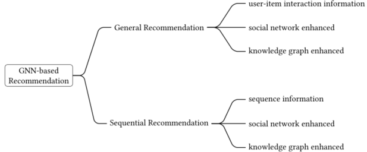

> 论文标题：Graph Neural Networks in Recommender Systems: A Survey
>
> 发表于：2021 ACM Computing Surveys (CSUR)
>
> 作者：SHIWEN WU, FEI SUN, WENTAO ZHANG, BIN CUI
>
> 论文地址：https://arxiv.org/pdf/2011.02260.pdf

## 摘要

- 能够自然融合节点信息和拓扑结构的图神经网络（GNN）技术引起了广泛关注。
- 在推荐系统中，主要挑战是从交互和辅助信息（如果有的话）中学习有效的用户/项目表示

## 介绍

- 推荐系统中的主流建模范式已经从邻域方法 [3、35、64、89] 发展到基于表示学习的框架 [13、50、51、90、110]。

- 基于项目的邻域方法 [3, 64, 89] 直接向用户推荐与他们交互过的历史项目相似的项目。

  - 通过直接使用他们的历史交互项目来表示用户的偏好

- 基于表示学习的方法，尝试将用户和项目编码为共享空间中的连续向量（也称为嵌入），从而使它们直接可比较。

  - 从矩阵分解 [50, 51] 到深度学习模型 [13, 33, 90, 153]，已经提出了各种方法来学习用户和项目的表示，以更好地估计用户对项目的偏好。

- 推荐应用程序中的交互数据可以由用户和项目节点之间的二分图表示，观察到的交互由链接表示。甚至用户行为序列中的项目转换也可以构建为图。当结合结构化的外部信息（例如，用户之间的社交关系 [17, 132] 和与项目相关的知识图谱 [113, 150]）时，将推荐公式化为图上的任务的好处变得尤为明显。通过这种方式，GNN 提供了一个统一的视角来对推荐系统中丰富的异构数据进行建模。

- GNN的优势：

  - 提供一个统一的框架来对推荐应用程序中的大量数据进行建模
  - 与仅隐式捕获协作信号（即使用用户-项目交互作为模型训练的监督信号）的传统方法不同，GNN 可以自然而明确地将关键协作信号（即拓扑结构）编码为改进用户和项目的表示
  - 早期的工作，例如 SVD++ [49] 和 FISM [43]，已经证明了交互项目在用户表示学习中的有效性。鉴于用户-项目交互图，这些先前的工作可以看作是使用一跳邻居来改进用户表示学习。 GNN 的优势在于它提供了强大且系统的工具来探索多跳关系，

- ### 工作贡献

  - 新分类。提出了一个系统的分类模式来组织现有的基于 GNN 的推荐模型。
    - 首先根据他们处理的任务将现有作品分为一般推荐和顺序推荐。
    - 然后，进一步将这两个任务中的现有模型分为三类：仅交互信息、社交网络增强和知识图增强。
  - 全面审查。对于每个类别，展示了要处理的主要问题。简要介绍了代表性模型并说明它们如何解决这些问题。 
  - 未来研究。讨论了当前方法的局限性，并提出了六个潜在的未来方向

## 背景和分类

1. ### 推荐系统：两种基本类型的任务，从配对交互中建模用户的静态偏好或从顺序行为中建模用户的动态偏好。

   - #### 一般推荐

     - 通常假设用户具有静态偏好，并基于隐式（例如，点击、阅读或购买）或显式（即，评分）反馈对其进行建模。
     - 通用推荐模型的一个常见范式是通过用户和项目的表示来重构用户的历史交互
     - 问题描述：
       - 给定用户集 U，项目集 I，以及观察到的用户和项目 R 之间的交互：U×I，对于任何用户表示 $ℎ^∗_u$ 和项目表示 $ℎ^∗_i$ 
         - $y_{u,i} = f(ℎ^∗_u,ℎ^∗_i)$
         - 评分函数f(·)可以是点积、余弦、多层感知等，$y_{u,i}$表示用户u对项目i的偏好得分，通常以概率表示
     - 研究现状
       - 早期研究以矩阵的形式考虑用户-项目交互，并将推荐制定为矩阵完成任务[52]。
         - 矩阵分解 (MF) 将用户和项目投影到共享向量空间中，以重建整个用户-项目交互矩阵，即估计用户对其未见项目的偏好 [52、54、87]。
       - 最近的深度学习工作，其中一项研究旨在通过将辅助信息与深度学习的力量相结合来提高推荐性能，
         - 例如文本 [47, 110] 和图像 [44, 115]。
       - 另一个研究方向试图使用更强大的模型架构来代替传统的矩阵分解，多层感知机MLP[33]和自动编码[90, 138]

   - #### 顺序推荐

     - 旨在通过探索她/他的历史交互中的顺序模式来预测用户可能与之交互的连续项目
     - 根据用户是否匿名以及行为是否被细分为会话，该领域的工作可以进一步分为顺序推荐和基于会话的推荐
       - 基于会话的推荐可以被视为具有匿名和会话假设的顺序推荐的子类型[84]。
     - 在顺序推荐中，用户的历史交互按时间顺序组织成序列。我们用 $s^u$ = [$i_{s,1}, i_{s,2},  . . , i_{s,n}$]来表示用户 u 的交互序列,其中 $i_{s,t}$表示用户 u 在时间步长 t 交互的项目，n 表示交互序列的长度。
     - 顺序推荐的任务是在给定她/他的历史交互序列或辅助信息（如果有）的情况下，预测用户 u 在下一个时间步 t+1 将与之交互的最可能的项目。它可以表述如下：
       - $\large i^{*}_{s,n+1} = arg\ max_{i∈I}\ P(i_{s,n+1} = i | s^u)$
     - 顺序推荐的主要挑战是学习反映用户当前偏好的有效序列表示
     - 研究现状
       - 早期的工作采用马尔可夫链（MC）[29, 86] 来捕捉项目到项目的转换，假设最近点击的项目反映了用户的动态偏好。
       - 由于循环神经网络 (RNN) 在序列建模中的优势，一些工作使用 RNN 单元来捕获序列模式 [36, 102]，为了进一步增强会话表示，
       - 除了最近的项目 [57, 68] 之外，还利用注意力机制来整合整个序列。受到 Transformer [128] 在 NLP 任务中的出色表现的启发，SASRec [45] 和 BERT4Rec [96] 利用自我注意技术对项目交互进行建模，从而为项目到项目的转换提供了更大的灵活性

2. ### 图神经网络

   - GNN 的主要思想是迭代地聚合来自邻居的特征信息，并在传播过程中将聚合的信息与当前的中心节点表示相结合 [139, 161]。
     - 从网络架构的角度来看，GNN 是堆叠多个传播层，由聚合和更新操作组成。
       - “聚合”是指从邻域收集信息作为邻域的聚合表示；
       -  “更新”是指将中心节点表示和聚合表示整合为最新的中心节点表示； 
       - “传播”是指“聚合”和“更新”的组合。
     - 在聚合步骤中，现有工作要么通过均值池操作 [28, 60] 平等对待每个邻居，要么通过注意力机制区分邻居的重要性[105]. 
     - 在更新步骤中，中心节点和聚合邻域的表示将被整合到中心节点的更新表示中。
     - 为了适应不同的场景，提出了各种策略来更好地整合这两种表示，例如 GRU 机制 [60]、非线性变换的串联 [28] 和求和运算 [105]
     
   - 根据架构设计，GNN 模型可分为循环 GNN（RecGNN）、卷积 GNN（ConvGNN）、时空 GNN（STGNN）和图自动编码器（GAE）[139]。 
     - RecGNN 旨在学习具有循环神经结构的高级节点表示，即在节点上循环应用相同的参数集。 
     - ConvGNN 在每一层中堆叠多个具有不同参数的传播层。ConvGNN 与其他神经网络的组合更加灵活方便，现有的基于 GNN 推荐的大部分工作都采用 ConvGNN 来模拟传播过程。 
     - STGNN 是为时空图设计的，它可以同时捕获图的空间和时间依赖关系。 
     - GAE 广泛用于在无监督学习框架中学习图嵌入
   
   - #### 4个简要框架
   
     - **GCN** [48] 近似图拉普拉斯算子的一阶特征分解，以迭代地聚合来自邻居的信息。具体来说，它通过以下方式更新嵌入
       - $\large  H^{(l+1)} = \sigma(\widetilde D^{-\frac 1 2}\widetilde A\widetilde D^{-\frac 1 2}H^{(l)}W^{(l)})$         
     - **GraphSage** [28] 为每个节点采样一个固定大小的邻域，提出 mean/sum/maxpooling 聚合器并采用连接操作进行更新，
       - $\large n^{(l)}_v = AGGREGATE_l({h^l_u,\forall u ∈ \mathcal N_v}),\ h^{(l+1)}_v=\sigma(W^{(l)}·[h^{(l)}_v \oplus n^{(l)}_v])$
     - **GAT** [105]假设邻居对中心节点的影响既不完全相同也不由图结构预先确定，因此它通过利用注意力机制来区分邻居的贡献，并通过关注其邻居来更新每个节点的向量，
       - $\large{\alpha_{vj} = \frac{exp(LeakyReLU(a^{\top}[W^{(l)}h^{(l)}_v \oplus W^{(l)}h^{(l)}_j]))}{\sum_{k∈\mathcal{N}}exp(LeakyReLU(a^{\top}[W^{(l)}h^{(l)}_v \oplus W^{(l)}h^{(l)}_k]))} }$
     - **GGNN** [60] 是一种典型的 RecGNN 方法，在更新步骤中采用门控循环单元（GRU），
       - $n^{(l)}_v = \frac{1}{|\mathcal{N_v}|}\sum_{j∈\mathcal N_v}\limits h^{(l)}_j$
         $h^{(l+1)}_v=GRU(h^{(l)}_v , n^{(l)}_v)$
       - GGNN 确保收敛，但对于大型图可能会出现问题，因为 GGNN 在所有节点上多次运行循环函数 [139]。
   
3. ### 为什么要使用图神经网络进行推荐

   - 推荐系统代表性图结构
      
      - 对于一般推荐，交互数据可以通过用户和项目节点之间的二分图（如图 a 所示）来表示，其中链接表示相应用户和项目之间的交互。
      - 对于顺序推荐，可以将一系列项目转换为序列图，其中每个项目都可以与一个或多个后续项目连接。图 1b 显示了一个序列图示例，其中连续项目之间存在边。与原始序列数据相比，序列图允许更灵活地处理项目到项目的关系。
      - 除此之外，一些辅助信息还具有自然的图结构，例如社交关系和知识图谱，如图 c 和 d 所示。
   - 对于一般推荐，研究人员尝试从配对交互中学习用户/项目表示
      - 一般推荐的任务是学习有效的节点表示，即用户/项目表示，并进一步预测用户偏好。
      - 对于一般推荐，GNN 可以显式编码用户-项目交互的关键协作信号，以通过传播过程增强用户/项目表示。
      - 利用协作信号进行更好的表示学习并不是一个全新的想法。
         - 例如，SVD++ [49] 结合了交互项目的表示来丰富用户表示。 
         - ItemRank [23] 从交互中构建项目-项目图，并采用随机游走算法根据用户偏好对项目进行排名。
         - SVD++ 可以被视为使用一跳邻居（即项目）来改进用户表示，而 ItemRank 使用两跳邻居来改进项目表示。
         - 与非图模型相比，GNN 更灵活更方便地对来自用户-项目交互的多跳连接进行建模，并且在高跳邻居中捕获的 CF 信号。
   - 对于顺序推荐，研究采用顺序模型从顺序行为中发现用户的动态偏好，并预测她/他接下来可能与什么交互。
      - 由于不同类型数据在推荐中的特殊性，人们提出了多种模型来有效地学习它们的模式以获得更好的推荐结果，
      - 顺序推荐的任务是学习信息丰富的图表示，即序列表示。节点表示和图表示都可以通过 GNN 学习。
      - 此外，与非图形透视相比，合并附加信息（如果可用）更加方便和灵活。
      - 对于顺序推荐，将序列数据转换为序列图可以使项目选择的原始转换具有更大的灵活性
         - 用户序列行为中的重复项是一种常见现象，这可能导致序列图中的循环结构。图 1b 显示了单击项目序列的示例，以及相应的序列图。从顺序上看，最后一项i4是连续受到前四项影响的。从序列图来看，由于i2和i3之间的循环结构，存在两条通往i4的路径。序列模型严格遵循序列的时间顺序，而 GNN 可以捕获由于循环结构而隐含在序列行为中的复杂用户偏好。

4. ### 基于图神经网络的推荐类别

   - 分类的原理在于两个方面：
      

      - （1）不同类型的信息具有不同的图结构特征，需要相应的GNN策略； 
      - （2）一般推荐和顺序推荐背后的假设不同，因为前者考虑静态用户的偏好，而后者旨在捕捉用户的动态偏好。

   - #### 一般推荐

      - 在这些类别中，模型假设用户的偏好不随时间变化。我们根据使用的信息类型将它们进一步分为三个子类别。
      - 在没有辅助信息的情况下，现有模型将用户项关系视为用户项二分图。
      - 利用社会关系信息，GNN 技术被用来挖掘社会影响力以增强用户的表示。
      - 利用知识图谱信息，采用 GNN 方法来捕获项目到项目的相关性以增强项目的表示。

   - #### 顺序推荐

      - 核心思想是捕获序列中的转换模式以进行下一个项目推荐。大多数现有作品仅基于序列捕获用户的动态偏好。他们首先构建一个序列图，然后利用 GNN 方法来捕获转换模式。

## 一般推荐

- ### 概述

  - 一般推荐旨在通过利用用户-项目交互数据对用户偏好进行建模，从而提供反映每个用户静态长期兴趣的推荐列表。
  - 除了用户-项目交互的信息外，辅助信息（如果可用）通常被用来增强用户/项目的表示。
  - 两种典型的辅助信息类型是社交网络和知识图谱。值得注意的是，不同类型的信息具有不同的图结构特征。
    - 具体来说，user-item二部图有两种类型的节点，每个节点的邻居都是齐次的；
    - 社交网络是同构图；知识图谱具有各种实体和关系。
    - 考虑到图结构的不同特征需要相应的 GNN 策略，我们按照使用的信息类型对其进行分类。
  - **现有模型**：

- ### 用户-项目交互信息

  - GNN 架构从图的角度对推荐任务进行建模。

    - 基本思想是使用用户交互的物品来增强用户表征，并使用用户曾经与物品交互过的物品来丰富物品表征。
    - 通过这种方式，多层 GNN 方法能够模拟信息扩散过程并更有效地利用用户-项目交互的高阶连通性。

  - 给定用户-项目二分图，关键挑战是如何将交互项目/用户的信息传播给用户/项目，并学习最终的用户/项目表示以进行预测。

  - **要在二分图上充分利用 GNN 方法，需要处理四个主要问题**：
    

    - **图构建**。图结构对于传播信息的范围和类型至关重要。原始二分图由一组用户/项目节点以及它们之间的交互组成。
      - 是在异质二分图上应用 GNN 还是基于两跳邻居重构同质图？
      - 考虑到计算效率，如何采样代表邻居进行图传播，而不是对全图进行操作？
    - **邻居聚合**。如何聚合来自邻居节点的信息？是区分邻居的重要性，建模中心节点与邻居之间的亲和度，还是邻居之间的交互？
    - **信息更新**。如何整合中心节点表示及其邻居的聚合表示？
    - **最终节点表示**。预测用户对项目的偏好需要整体用户/项目表示。是使用最后一层的节点表示还是所有层的节点表示的组合作为最终的节点表示？

  - #### 图形构建。

    - 直接将 GNN 应用于原始用户-项目二分图结构。原始图有两个问题：
      - 一是原始图结构可能不足以学习用户/项目表示的有效性；
      - 另一个是效率，在具有数百万甚至数十亿节点的图上传播信息很难。
    - 为了解决第一个问题，现有研究通过添加边或虚拟节点来丰富原始图结构。
      - 除了用户-项目图，Multi-GCCF [98] 和 DGCF [72] 在原始图上添加两跳邻居之间的边以获得用户-用户和项目-项目图。通过这种方式，用户和项目之间的接近度信息可以明确地结合到用户-项目交互中。
      - 考虑到以前的工作忽略了用户采用物品的意图，DGCF [121] 引入了虚拟意图节点，将原始图分解为每个意图的相应子图。在不同意图独立性的约束下，可以通过在意图感知子图中迭代地传播信息来学习不同意图下的解耦表示。最终的表示是这些解开的表示的整合，从不同方面表示节点，具有更好的表达能力。
    - 关于第二个问题，提出了采样策略以使 GNN 高效且可扩展到基于大规模图的推荐任务。 
      - PinSage [145] 设计了一种基于随机游走的抽样方法，以获得具有最高访问次数的邻域的固定大小。
        - 这样，那些与中心节点不直接相邻的节点也可能成为它的邻居。
      - 为了进行归纳推荐，IG-MC [152] 使用目标用户/项目及其单跳邻居作为节点来构建子图。
      - 封闭子图设计减少了对原始图结构的依赖，从而增强了其将模型转移到另一个数据集的泛化能力。
      - 采样是原始图信息和计算效率之间的权衡。 PinSage 包含更多的随机性，而 IG-MC 牺牲了更多的图形信息。在传输方面，IG-MC的采样方式更可取；否则，PinSage 的策略可能会更好。该模型的性能取决于采样策略，更有效的邻域构建采样策略值得进一步研究。

  - #### 邻居聚合

    - 聚合步骤对于图结构的信息传播至关重要，它决定了应该传播多少邻居的信息
    - 平均池化，当邻居的重要性显着不同时可能不合适，
      - $n^{(l)}_u = \frac{1}{|\mathcal N_u|}W^{(l)}h^{(l)}_i$
    - 继传统的 GCN 之后，一些工作采用“度归一化”[10,31,134]，它根据图结构为节点分配权重
      - $n^{(l)}_u = \sum_{i\in\mathcal N_u}\limits\frac{1}{\sqrt{|\mathcal N_u||\mathcal N_i|}}W^{(l)}h^{(l)}_i$
    - 由于随机游走采样策略，PinSage [145] 在聚合邻居向量表示时采用归一化访问计数作为邻居的重要性。
      - 然而，这些聚合函数根据图结构确定邻居的重要性，而忽略了连接节点之间的关系。
    - 考虑到交互项目在反映用户偏好方面的代表性不同，研究人员采用注意机制来区分邻居的重要性[123]。
      - NGCF [119] 采用元素产品来增强用户关心的项目的特征或用户对项目具有的功能的偏好。
      - 以用户节点为例，邻域表示计算如下:$\large n^{(l)}_u = \sum_{i\in\mathcal N_u}\limits\frac{1}{\sqrt{|\mathcal N_u||\mathcal N_i|}}(W_1^{(l)}h^{(l)}_i + W_2^{(l)}(h^{(l)}_i\odot h^{(l)}_u)$
    - NIA-GCN [97] 认为现有的聚合函数无法保留邻域内的关系信息，因此提出了成对邻域聚合方法来显式捕获邻域之间的交互。具体来说，它在每两个邻居之间应用元素乘法来模拟用户-用户/项目-项目关系
    - 尽管这些方法有效，但它们对存在多种交互类型的情况（例如浏览和单击）的关注不足。
      - 为了应对用户和物品之间的多类型关系，研究设计了一种分层聚合策略并观察有效性增益。例如，MBGCN [42]首先分别聚合属于每个行为的交互项目，并进一步整合不同的聚合行为。

  - #### 信息更新

    - 对于聚合的邻居表示和中心节点表示，如何更新中心节点的表示对于迭代信息传播至关重要
    - 一些研究 [31, 104, 121, 151] 使用邻居的聚合表示作为新的中心节点表示，即完全丢弃用户或项目节点的原始信息，这可能会忽略内在的用户偏好或内在的项目属性
    - 另外一些研究将中心节点本身及其邻域消息都考虑在内以更新节点表示
    - 一些研究将这两种表示与 sum-pooling 或 mean-pooling 操作线性结合 [97, 119, 134, 152]。
    - 受 GraphSage [28] 的启发，一些作品 [55, 98, 145] 采用具有非线性变换的连接函数来整合这两种表示
    - 一些工作 [10, 31] 观察到非线性激活对整体性能的贡献很小，它们通过消除非线性来简化更新操作，从而保持甚至提高性能并提高计算效率。例如，为了进一步简化 GNN 结构，LightGCN [31] 去除了特征变换，

  - #### 最终节点表示

    - 逐层应用聚合和更新操作会为 GNN 的每个深度生成节点的表示。最终的预测任务需要用户和项目的整体表示。
    - 一些作品 [55, 101, 104, 125, 145, 151] 使用 GNN 的最后一层中的节点向量作为最终表示，即 $h^∗_u = h^{(L)}_u $。
    - 然而，在不同层获得的表示强调通过不同连接传递的消息[119]。
      - 较低层的表示更多地反映了个体特征，而较高层的表示更多地反映了相邻特征。
    - 为了利用不同层输出表示的连接，最近的研究采用了不同的表示集成方法。
      - 拼接是最广泛采用的策略之一
      - 均值池化操作 ，将所有层的表示与 sum-pooling [121] 相结合
        - 均值池化或总和池化集成均平等地对待来自不同层的表示
      - 将所有层的表示与逐层加权池化 [31, 31, 130] 集成，
    - 均值池化和总和池化都可以看作是分层加权池化的两种特殊情况。信息传播是通过堆叠多个 GNN 层实现的，这有助于捕获远程依赖关系，并通过足够的邻域信息增强节点表示。但是，堆叠太多层也会导致过度平滑的问题。因此。最近的一些工作 [66, 95] 被提出来自适应地平衡这种权衡。

- ### 社交网络增强

  - 以前工作都假设具有社会关系的用户应该具有基于社会影响理论的相似表示，即相互联系的人会相互影响。其中一些直接使用正则化这样的关系来约束最终的用户表示[40、75、76、103]，而另一些则利用这种关系作为输入来增强原始用户嵌入[25、74]

  - 从图学习的角度来看，上述早期的工作只是通过考虑每个用户的一阶邻居来简单地对社交影响进行建模，即忽略了社交网络中影响的递归扩散。

    - 然而，在实践中，用户可能会受到她朋友的朋友的影响。
    - 忽略以前工作中的高阶影响扩散可能会导致推荐性能欠佳[132]。
    - 由于能够模拟用户如何受到递归社会扩散过程的影响，GNN 已成为在推荐中对社会信息进行建模的流行选择。

  - 为了通过利用 GNN 将用户之间的关系纳入交互行为，需要处理两个主要问题：

    - 朋友的影响。朋友有同等的影响力吗？如果不是，如何区分不同朋友的影响？ 
    - 偏好整合。用户涉及两种类型的关系，与朋友的社交关系和与物品的交互。如何从社会影响角度和交互行为整合用户表征？

  - #### 朋友影响

    - DiffNet [132] 通过利用均值池化操作平等地对待朋友的影响。但是，同等影响力的假设并不符合实际情况，用户的影响力也不适合简单地以好友的数量来确定。
    - 事实上，用户更有可能受到具有强烈社交关系或类似偏好的朋友的影响。因此，大多数作品 [17, 131, 135] 通过使用注意力机制测量链接朋友之间的关系来区分邻居的影响。
    - 最近的一项名为 ESRF [147] 的工作认为，社会关系并不总是可靠的。社交信息的不可靠性表现在两个方面：一方面，具有明确社交关系的用户可能没有影响力；另一方面，获得的社会关系可能是不完整的。考虑到不加选择地将不可靠的社会关系纳入推荐可能会导致性能不佳，ESRP 利用自动编码器机制通过过滤不相关的关系和调查新邻居来修改观察到的社会关系

  - #### 偏好整合

    - 社交增强推荐系统中的用户涉及两种类型的网络，一种是用户-项目二分图，另一种是社交图。
    - 为了通过利用社交信息来增强用户偏好表示，有两种策略可以结合来自这两个网络的信息，
      - **策略**
        
        - 一种是分别从这两个网络中学习用户表示[17、132、135]，然后将它们整合到最终的偏好向量中，如图a所示；
        - 另一种是将两个网络组合成一个统一的网络[131]，并应用 GNN 来传播信息，如图 b 所示。
      - 第一种策略的优势在于两个方面：
        - 一方面，可以区分两个网络的扩散过程深度，因为它们是分开处理的；
        - 另一方面，任何高级的用户-项目二部图方法都可以直接应用，对于社交网络这种同构图，GNN 技术非常适合模拟影响过程，因为它们最初是针对同构图提出的。
        - 这里有两种代表性的方法。
          - 遵循 SVD++ [49] 框架，DiffNet [132] 将来自两个空间的用户表示与 sum-pooling 操作相结合，其中项目空间中的用户偏好是通过对历史项目应用均值池来获得的，而用户表示在社交网络是通过利用 GNN 来学习的。
            - 将交互项目嵌入的平均表示作为项目空间中的用户偏好等效于 GNN 视图中用户向量的聚合一跳邻居。 
            - DiffNet [132] 简单地将来自两个图的用户表示与线性加法相结合。
          - 为了完全整合这两个潜在因素，GraphRec [17] 在级联向量上应用多层 MLP，通过利用非线性操作来增强特征交互。
      - 第二种策略的优势在于，
        - 社交网络中的高阶社会影响力扩散和用户-项目二分图中的兴趣扩散都可以在一个统一的模型中进行模拟，这两种信息同时反映了用户偏好。
        - 在每一层，DiffNet++ [131] 设计了一个多层次的注意力网络来更新用户节点。
          - 它首先利用 GAT 机制分别聚合二部图（即交互项目）和社交网络（即朋友）中的邻居信息。
          - 考虑到不同用户在平衡这两种关系时可能有不同的偏好，它进一步利用另一个注意力网络来融合邻居的两种隐藏状态。

- ### 知识图增强

  - 反映用户之间关系的社交网络用于增强用户表示，而通过属性表示项目之间关系的知识图用于增强项目表示。将知识图谱结合到推荐中可以带来两方面的好处[111]：

    - 知识图谱中项目之间丰富的语义相关性有助于探索它们之间的联系并改善项目表示；
    - 知识图谱将用户的历史交互项和推荐项连接起来，增强了结果的可解释性。

  - 以前的工作通过知识图嵌入 (KGE) 方法对知识图进行预处理，以学习实体和关系的嵌入，例如 [14, 113, 150, 155]。

    - 常用的 KGE 方法的局限性在于它们侧重于用转移约束对严格的语义相关性进行建模，这更适合于与图相关的任务，例如链接预测而不是推荐 [112]。
    - 一些研究设计了元路径来聚合邻居信息 [92, 100, 122, 148]。它们严重依赖手动定义的元路径，这需要领域知识，并且对于复杂的知识图谱相当费力 [114, 118]。

  - 给定用户-物品交互信息以及知识图谱，知识图谱增强推荐力求充分利用知识图谱中的丰富信息，通过显式捕捉物品之间的相关性来帮助估计用户对物品的偏好.

  - 对于知识图谱增强推荐的有效性，主要有两个问题需要处理：

    - **图构建**。考虑到知识图谱的复杂性以及融合知识图谱和用户-项目图信息的必要性，一些研究首先构建了图谱。如何平衡简单性和信息量？如何有效地将用户融入知识图谱？ 
    - **关系感知聚合**。知识图谱的一个特点是实体之间具有多种类型的关系。如何设计一个关系感知聚合函数来聚合来自链接实体的信息

  - #### 图构建

    - 一些工作直接将 GNN 应用于原始知识图 [114]，
    - 而一些工作在第一阶段基于知识图和用户-项目二分图的信息简化图结构或构建子图。动机来自两个方面：
      - 一是知识图谱包含多个实体和关系，并且总是大规模的，这增加了将 GNN 应用于图表示学习的挑战；
      - 另一个是，为了充分利用知识图谱进行推荐，必须将用户角色纳入知识图谱中，而简单地将用户节点作为知识图谱中的另一种实体可能会引入不相关的信息，并且不够有效。
    - 图简化的一个代表性方法是 IntentGC [158]，它通过将多实体知识图中的一阶接近度转换为二阶接近度来简化图结构，即保持只有一个节点相隔的项目到项目的关系.
      - 具体来说，如果项目 i1 和 i2 都由一个辅助节点连接，则辅助节点的类型表示为这两个项目之间的关系。
      - 这种变换的好处是从节点类型的角度将多实体图变成了同构图。
      - 但是这种策略不适合大多数项目节点是多跳（多于两跳）邻居的图，因为它以丢失两个项目节点之间的链接信息为代价极大地简化了图结构。
    - 为了关注与用户-项目交互相关的实体和关系，一些研究首先自动提取将目标用户和目标项目与用户的历史交互项目和知识图谱中的相关语义联系起来的高阶子图[18 , 91]。
      - 基于两个节点之间更短的路径反映更可靠连接的假设，AKGE [91] 通过以下步骤构建子图：
        - 通过 TransR [63] 预训练知识图中实体的嵌入；计算两个链接实体之间的成对欧几里得距离；保持目标用户和项目节点之间距离最短的 K 路径。
        - 潜在的限制是子图结构取决于预训练的实体嵌入和距离测量的定义。 
      - ATBRG [18]从用户的历史行为中详尽地搜索目标物品和物品的多层实体邻居，并通过多个重叠实体还原连接用户行为和目标物品的路径。为了强调信息密集型实体，ATBRG 进一步修剪了具有单个链接的实体，这也有助于控制图的规模。
      - 尽管这些方法可以获得与目标用户-项目对更相关的子图，但无论是预训练实体嵌入还是彻底搜索和修剪路径都非常耗时。一种有效且高效的子图构建策略值得进一步研究。

  - #### 关系感知聚合

    - 为了充分捕捉知识图中的语义信息，在传播过程中应考虑链接实体（即 ei、ej）和它们之间的关系（即 $r_{e_i,e_j}$ ）。
    - 此外，从推荐系统的角度来看，用户的角色也可能会产生影响。由于 GAT 在基于连接节点自适应分配权重方面的优势，大多数现有工作在知识图谱上应用了传统 GAT 的变体，即通过链接实体的加权平均值更新中心节点，并且权重根据评分函数分配，记为 ( $e_i,e_j,r_{e_i,e_j},u$ )。关键的挑战是设计一个合理有效的评分函数。
    - 对于将用户节点视为一种实体的工作[18,99,118]，当项目节点将使用交互用户和相关属性的信息进行更新时，在传播过程中，用户的偏好预测会溢出到知识图中的实体，其他实体将包含用户的偏好并迭代扩散。
      - 因此，这些工作没有明确地模拟用户对关系的兴趣，而是区分实体对连接节点及其关系的影响。
      - 例如，受知识图谱中转移关系的启发，KGAT [118] 根据关系空间中链接实体之间的距离分配权重，较近的实体会将更多信息传递给中心节点。
      - 这些方法更适合于构建的包含用户节点的子图，因为通过堆叠有限数量的 GNN 层，用户的兴趣很难扩展到所有相关实体。
    - 对于没有结合两种图源的作品，这些研究 [112, 114] 通过根据连接关系和特定用户分配权重来明确表征用户对关系的兴趣。
      - 例如，KGCN [114]采用的评分函数是用户嵌入和关系嵌入的点积，关系更符合用户兴趣的实体会将更多的信息传播到中心节点

## 顺序推荐

- ### 概述

  - 顺序推荐根据用户最近的活动预测用户的下一个偏好，旨在模拟连续项目之间的顺序模式，并为用户生成准确的推荐 [84]。
  - 受 GNN 优势的启发，利用 GNN 通过将用户的顺序行为转换为序列图来捕获转换模式。大多数现有的工作都集中在仅从序列中推断时间偏好。边信息也可以用来增强序列信息

- ### 现有工作

- ### 顺序信息

  - 从项目之间的邻接的角度来看，项目序列可以建模为图结构化数据。

  - 基于序列图，GNN 可以通过迭代传播捕获项目的转换并学习具有代表性的项目嵌入。 GNN 在顺序推荐中的总体框架如下图：
    

  - 要在顺序推荐中充分利用 GNN，需要处理三个主要问题：

    - 图构建。要在顺序推荐中应用 GNN，应将序列数据转换为序列图。
      - 为每个序列独立构建一个子图就足够了吗？在多个连续项目之间添加边会比仅在两个连续项目之间添加边缘更好吗？
    - 信息传播。为了捕捉过渡模式，哪种传播机制更合适？是否需要区分链接项目的顺序？
    - 顺序偏好。为了获得用户的时间偏好，应该整合序列中的表示。是简单地应用注意力池化还是利用 RNN 结构来增强连续时间模式？

  - #### 图形构建

    - 与具有二分图结构的用户-项目交互不同，传统顺序推荐中的顺序行为自然是按时间顺序表示的，即序列，而不是序列图。
    - 基于原始二分图重建图是可选的，主要由可扩展性或异构性问题驱动，而基于用户的序列行为构建序列图是在序列推荐中应用 GNN 的必要条件。
    - 大多数研究 [26, 82, 83, 136, 141] 通过将序列中的每个项目视为一个节点并在两个连续点击的项目之间添加边来为每个序列构建有向图。在大多数情况下，用户序列的长度很短。由单个短序列构建的序列图由少量节点和连接组成，部分节点甚至可能只有一个邻居，其包含的知识太有限，无法反映用户的动态偏好，无法充分利用图中的 GNN学习。
    - 为了应对这一挑战，最近的工作提出了几种策略来丰富原始序列图结构
      - 最直接的方法是利用额外的序列。 
        - HetGNN [116] 采用其他行为序列来丰富目标行为。 
        - A-PGNN [137] 处理用户已知的情况，因此将用户的历史序列与当前序列相结合，以丰富项目-项目连接。
        - 基于相似序列可能反映相似转换模式的假设，DGTN [160] 将当前序列及其相邻（相似）会话集成到单个图中。 
        - GCE-GNN [126] 利用所有会话中的项目转换来辅助当前序列中的转换模式，这利用了局部上下文和全局上下文。
        - 所有这些方法都在原始序列图中引入了更多信息，与单个序列图相比提高了性能。
      - 另一种主流的做法是调整当前序列的图结构。
        - 例如，假设当前节点对多个连续项目有直接影响，MA-GNN [73] 提取三个后续项目并在它们之间添加边。
        - 考虑到仅在连续项目之间添加边可能会忽略远距离项目之间的关系，SGNN-HN [80] 引入了一个虚拟“星”节点作为序列的中心，该节点与当前序列中的所有项目链接。 “星”节点的向量表示反映了整个序列的整体特征。因此，每个项目都可以通过“星”节点获得有关项目的一些知识，而无需直接连接。 
        - Chen和Wong [11]指出，现有的图构建方法忽略了邻居的顺序信息，并带来了无效的长期捕获问题。因此，他们提出了 LESSR，它从一个序列构造两个图：一个区分邻居的顺序，另一个允许从 item 到它之后的所有 item 的捷径。

  - #### 信息传播。

    - 给定序列图，必须设计一种有效的传播机制来捕获项目之间的转换模式。
    - 一些研究 [26, 80, 136, 141] 调整了 GGNN 框架以在有向图上进行传播。
      - 它采用均值池化分别聚合前一项和下一项的信息，结合两种聚合表示，并利用GRU组件整合邻居和中心节点的信息。传播函数如下：
        - $\large n^{in(l)}_{i_{s,t}} = \frac{1}{|\mathcal{N_{i_{s,t}}^in}|}\sum_{j∈\mathcal{N_{i_{s,t}}^{in}}}\limits h^{(l)}_j$,	$\large n^{out(l)}_{i_{s,t}} = \frac{1}{|\mathcal{N_{i_{s,t}}^out}|}\sum_{j∈\mathcal{N_{i_{s,t}}^{out}}}\limits h^{(l)}_j$	
          $\large n^{(l)}_{i_{s,t}} = \large n^{in(l)}_{i_{s,t}} \oplus  n^{out(l)}_{i_{s,t}} $,			$h^{(l+1)}_v=GRU(h^{(l)}_{i_{s,t}} , n^{(l)}_{i_{s,t}})$
    - 与平等对待邻居的 GGNN 不同，有些研究 [82, 126] 利用注意力机制来区分邻居的重要性
    - 以上所有方法在消息传递过程中都采用了排列不变的聚合函数，但忽略了邻域内项目的顺序，这可能导致信息丢失[11]。为了解决这个问题，LESSR [11] 保留了图构造中项目的顺序，并利用 GRU 组件按顺序聚合邻居，如下等式
      - $\large n^{(l)}_{i_{s,t},k}=GRU^{(l)}(h^{(l)}_{i_{s,t},k-1} , n^{(l)}_{i_{s,t},k})$

  - #### 顺序偏好

    - 由于传播的有限迭代，GNN 无法有效地捕获项目之间的长期依赖关系
    - 序列中最后一项（或任何一项）的表示不足以反映用户的顺序偏好。此外，大多数将序列转换为图的图构建方法都会丢失部分序列信息[11]
    - 为了获得有效的序列表示，现有的工作提出了几种策略来整合序列中的项目表示。
      - 考虑到序列中的项目具有不同的优先级，注意力机制被广泛采用进行集成。
        - 一些作品 [80, 83, 136, 160] 计算最后一个项目与序列中所有项目之间的注意力权重，并将项目表示聚合为全局偏好，并将其与局部偏好（即最后一个项目表示）结合起来作为整体偏好。这样，整体偏好很大程度上依赖于最后一个项目与用户偏好的相关性。受序列建模中多层自注意力策略优势的启发，GC-SAN [141] 在 GNN 生成的项目表示的顶部堆叠了多个自注意力层，以捕获长期依赖关系。
      - 一些作品还明确地将序列信息整合到整合过程中。
        - 例如，NISER [26] 和 GCE-GNN [126] 添加了反映项目相对顺序的位置嵌入，以有效地获得位置感知项目表示。为了平衡连续时间和灵活的转换模式，FGNN [82] 采用带有注意机制的 GRU 来迭代更新用户偏好与序列中的项目表示。

- ### 社交网络增强

  - 从他们的连续行为推断出的用户的动态偏好可以通过他们朋友的偏好来增强。但很少有人关注在顺序推荐中利用社会关系信息。
    - 可能的原因可能是，用户的表示主要是从他们在顺序推荐中的顺序行为（即项目序列）中学习的，尤其是当他们的 id 未知时。来自序列的动态偏好比基于用户 ID 的静态偏好重要得多。
  - 一项具有代表性的工作，它采用 GNN 在顺序推荐中处理社会信息。
    -  DGRec [94] 首先使用 LSTM 机制从用户最近的顺序行为中提取用户的动态兴趣。
    - DGRec 为用户引入了一组潜在嵌入来反映他们的静态偏好。社交网络中的用户表征是通过静态偏好和动态偏好的组合来初始化的。
    - 考虑到社交影响可能会随着朋友之间的关系而变化，DGRec 采用 GAT 在扩散过程中区分朋友的影响

- ### 知识图增强

  - 项目的表示可以通过它们的语义连接来增强，尤其是当序列数据不足时 [37-39, 108]
  - 序列信息和知识图谱信息既可以分开处理，也可以统一为一个整体图，与一般推荐类似
  - 只有一项工作将 GNN 应用于知识图增强顺序推荐。 Wang 和 Cai [107] 采用 SRGNN [136] 提出的 GNN 框架来捕获转换模式，并将知识图谱信息与键值记忆网络相结合。如何充分利用这两类信息仍值得进一步研究

## 未来工作

- ### 异构图推荐

  - 异质性是推荐系统中图结构数据的主要特征之一，即推荐中的许多图包含各种类型的节点和链接。例如，交互图由用户节点和项目节点组成，知识图具有多种实体和关系。由于异构图的一些独特特性（例如，融合更多信息和丰富语义），直接将同构图的方法应用于它们可能会导致次优表示。
  - 最近致力于为异构图设计 GNN 方法。一些作品 [21, 120] 使用元路径来指导传播过程。然而，这些研究中的元路径需要手动设计，而自动生成这些元路径会更可取
  - 考虑到邻居聚合，一个可行的解决方案是分层聚合策略[149]，即首先聚合每种类型内的分组邻居，然后整合不同类型的聚合表示。这种策略更适合关系数量有限的图，为复杂图探索更灵活、更强大的策略仍然是一个悬而未决的问题
  - 一些基于 GNN 的推荐研究也关注了异质性问题。例如，Multi-GCCF [98] 和 NIA-GCN [97] 使用与节点类型相对应的不同变换矩阵。 MBGCN [42] 通过分层聚合处理多行为推荐。尽管有这些新兴尝试，但很少有作品考虑更复杂图的异质性问题，例如知识图谱。此外，考虑异质性的策略总是会带来更多的计算挑战，如何提高计算效率需要进一步研究。

- ### 多样化和不确定的表征

  - 除了数据类型的异质性（例如，用户和项目等节点类型，以及不同行为类型等边类型）外，图中的用户通常还具有多样化和不确定的兴趣[12, 53]。像以前的工作一样，将每个用户表示为一个单一的向量（低维向量空间中的一个点）很难捕捉用户感兴趣的这些特征。因此，如何代表用户的多重不确定利益是一个值得探索的方向。
  - 一个自然的选择是使用各种方法 [70, 71, 127] 将这种单一向量扩展到多个向量，例如分离表示学习 [77, 78] 或胶囊网络 [56]。
    - 一些基于 GNN 的推荐工作也已经开始用多个向量来表示用户。
      - 例如，DGCF [121] 显式地为多方面表示添加正交约束，并分别迭代更新每个方面的链接节点之间的相邻关系。多向量表示推荐的研究，特别是基于 GNN 的推荐模型，还处于初级阶段，未来还有很多问题需要研究，
      - 例如如何解开与用户意图相关的嵌入；如何自适应地为每个用户设置不同的兴趣数；如何为多个向量表示设计高效且有效的传播模式。
  - 另一种可行的解决方案是将每个用户表示为一个密度而不是一个向量。将数据表示为密度（通常是多维高斯分布）有许多优点，
    - 例如，更好地编码表示及其关系的不确定性，并且比点积、余弦相似度或欧几里德距离更自然地表达不对称性。
      - 高斯嵌入已被广泛用于对各个领域的数据不确定性进行建模，例如，词嵌入 [106]、文档嵌入 [24, 79] 和网络/图嵌入 [5, 30, 124]。
      - 对于推荐系统，Dos Santos 等人 [15]和姜等人 [41] 还部署高斯嵌入来捕获用户的不确定偏好，以改善用户表示和推荐性能。
      - 基于密度的表示，例如高斯嵌入，是一个值得探索的有趣方向，但在基于 GNN 的推荐模型中尚未得到很好的研究

- ### 推荐中 GNN 的可扩展性

  - 在数据集包含数十亿个节点和边，而每个节点包含数百万个特征的工业推荐场景中，由于内存使用量大和训练时间长，直接应用传统 GNN 具有挑战性。
  - 对于大规模图的处理，主流有两种：一是通过采样减小图的大小，使现有的GNN适用；另一种是通过改变模型架构来设计一个可扩展且高效的 GNN。
    - 采样是训练大型图的一种自然且广泛采用的策略。
      - 例如，Graphsage [28] 随机采样固定数量的邻居，
      - 而 PinSage [145] 采用随机游走策略进行采样。
      - 一些工作 [18, 91] 从每个用户-项目对的原始图重建小规模子图
      - 缺点：采样会或多或少地丢失一部分信息，很少有研究关注如何设计有效的抽样策略来平衡有效性和可扩展性
    - 另一个主流是解耦非线性操作和连续层之间的折叠权重矩阵[20,31,129]。由于邻居平均特征只需要预先计算一次，因此它们具有更高的可扩展性，并且在模型训练中没有通信成本。
      - 然而，与具有更高学习灵活性的传统 GNN 相比，这些模型受到聚合器和更新器选择的限制 [9]。
      - 因此，面对大规模图，应该研究更多的未来工作。

- ### 推荐中的动态图

  - 为了保持最新的推荐，系统应该使用新的信息迭代更新。从图的角度来看，不断更新的信息带来的是动态图而不是静态图。静态图是稳定的，因此可以对其进行建模，而动态图则引入了变化的结构。
  - 如何设计相应的 GNN 框架以响应实践中的动态图是一个挑战。
  - GraphSAIL [144] 是第一次尝试解决推荐系统在 GNN 上的增量学习，它处理交互的变化，即节点之间的边缘。
    - 为了平衡更新和保存，它限制了连续学习模型中中心节点与其邻域之间的嵌入相似性，并控制增量学习的嵌入接近其先前版本。

- ### 推荐中的图对抗学习

  - GNN 很容易被输入上的小扰动所欺骗[142]，即如果图结构包含噪声，GNN 的性能将大大降低。在现实世界的推荐场景中，节点之间的关系并不总是可靠是一种普遍现象。例如，用户可能不小心点击了物品，无法捕捉到部分社交关系。此外，攻击者还可能将虚假数据注入推荐系统。由于 GNN 对噪声数据的脆弱性，在 GNN [32, 142, 154, 163] 领域出现了图对抗学习的新努力。然而，基于 GNN 推荐的现有工作很少关注对抗性学习，这对于更强大的推荐系统来说应该是一个有趣且有用的方向。

- ### 推荐中 GNN 的接收域

  - 节点的接收字段是指一组节点，包括节点本身及其在 k 跳内可达的邻居 [85]，其中 k 是传播迭代的次数。通过堆叠多个 GNN 层，高度节点的接收场将扩展过大，并可能引入噪声，这可能导致过度平滑问题 [58]，从而导致性能下降。对于度数较低的节点，它们需要深度 GNN 架构来扩大其接收域以获得足够的邻域信息。
  - 对于推荐中的图数据，节点度呈现长尾分布，即活跃用户与物品的交互较多，冷用户交互较少，类似于热门物品和冷物品。因此，在所有节点上应用相同的传播深度可能不是最理想的。只有少数新兴工作可以自适应地确定每个节点的传播深度，以获得合理的接收场 [46,66,69]。

