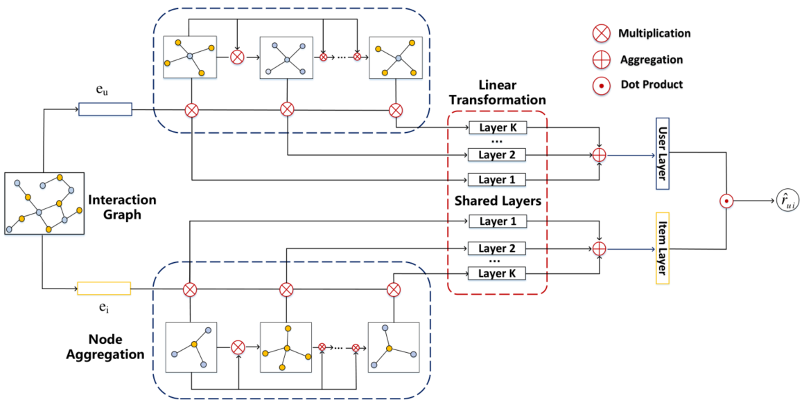

> 论文标题：A Robust Hierarchical Graph Convolutional Network Model for Collaborative Filtering
>
> 发表于：2020
>
> 作者：Shaowen Peng，Shaowen Peng
>
> 代码：
>
> 论文地址：https://arxiv.org/pdf/2004.14734.pdf

## 摘要

- GCN 仍然存在训练困难、过度平滑、容易受到对抗性攻击等诸多问题
- 本文构建一个鲁棒的 GCN 模型用于协同过滤。
  - 首先，我们认为递归地合并来自不同阶邻域的消息会无法区分不同的节点消息，这会增加训练难度；
    - 相反，我们选择使用一个简单的 GCN  模型单独聚合不同顺序的邻居消息，该模型已被证明是有效的；
  - 然后以分层方式将它们累积在一起，而不引入额外的模型参数。
  - 其次，提出了一种通过在每一层随机丢弃邻居消息来缓解过度平滑的解决方案，这也很好地防止了过度拟合并增强了鲁棒性。

## 结论

- 提出了一种用于协同过滤的鲁棒层次图卷积网络（RH-GCCF），旨在改进 GCN  以实现鲁棒推荐。
  - 首先通过在每一层随机丢弃节点消息，提出了一种过度平滑和过度拟合的解决方案，这与 dropout [32]  有相似之处。
  - 然后，我们通过分别聚合来自不同顺序邻域的节点消息来构建一个层次模型，这避免了它们无法区分的混合。

## 未来工作

- 以更合理、更有效的方式表示高阶邻域，以更好地理解用户偏好和稳健的推荐。

## 介绍

- 基于深度学习的方法假设用户-项目关系非常复杂，不足以通过被认为是线性模型的 MF 模型建模，并采用深度学习技术来捕获非线性用户-项关系
- 但忽视了有助于表示用户偏好的邻居信息 限制了性能。
  - 该信息包括用户可能感兴趣的项目和具有相似兴趣的用户，这类似于基于邻域的方法[31]
  - 大多数基于邻域的方法仅将用户与之交互的项目视为邻居，而忽略用户未交互的项目也可能有助于用户/项目表示；
  - 更重要的是，基于邻域的模型缺乏模型参数，这阻碍了模型嵌入有用的用户/项目特征来模拟用户偏好。
- 图嵌入方法通过将用户-项目交互视为二分图并将每个节点编码为向量空间中的高维向量来结合图模型和分解模型。
- 图嵌入方法与传统方法的主要区别在于，
  - 通过将用户-项目交互视为图，图嵌入方法能够合并原始用户-项目交互中不包含的高阶邻居连接。
- GCN 通过定义图卷积 [3] 来处理图结构数据等非欧几里得数据。 [9]通过引入切比雪夫多项式来简化图卷积运算，大大降低了计算复杂度； [19] 用 K =  1（一阶接近）重新制定 [9] 并添加重整化技巧以减轻梯度消失/爆炸，通过堆叠多个层来实现高阶接近。
- 然而不合理的 GCN 设计会增加训练难度并限制性能。
  - 首先，GCN  递归地聚合来自不同顺序邻域的消息，并将来自不同节点的消息无差别地混合在一起，这使得提取重要消息和清除不相关消息变得困难  [24]。
  - 其次，来自不同阶邻域的邻居消息都被压缩为一个固定长度的向量来表示节点，一个固定长度的向量不足以表示图结构的信息，这可能会导致重要信息的丢失在传输中。
  - 第三，堆叠多层会导致过度平滑效应，从而降低性能  [19, 22]
  - GCN 容易受到对抗性攻击
- 在本文中，我们旨在通过解决上述协同过滤问题来构建一个健壮的 GCN  模型。
  - 首先，通过分离来自不同顺序邻域的消息以分层方式构建我们的模型。
    - 不将所有节点消息混合在一起，而是假设不同的顺序邻域明确地有助于节点表示，
    - 因此我们分别聚合来自不同顺序邻域的邻居消息，然后以分层方式表示它们以用于最终节点表示。
  - 其次，我们从理论上展示了过度平滑的原因，并提出了通过随机丢弃交互图的边来降低过度平滑收敛速度，并且该策略还可以防止过度拟合并增强鲁棒性GCN 。

## 模型架构

- RH-GCCF
  

## 实验

- ### 研究问题

  - RQ1：网络层数、丢包率等超参数如何影响性能？ 
  - RQ2：在抑制过度平滑问题和图结构完整性之间是否存在性能平衡的最佳点？ 
  - RQ3：我们的模型是否优于其他最先进的基线？

- ### 数据集

  - Pinterest：这是一个基于内容的图像推荐的隐式反馈数据集，由  [16] 收集。 
  - citeulike-a：这个数据集[37] 是从 CiteULike 收集的，它为用户提供保存和共享学术论文的服务。交互是隐式反馈。
  - Movielens：电影评级,一个显式反馈数据集，我们将评级转换为隐式反馈。我们使用整个数据集的一个子集进行实验。

- ### baseline

  - BPR [27]：这是一个稳定的基线，它提出了贝叶斯成对损失函数来从隐式反馈中学习。
  - Neurec [46]：这是一个基于深度学习的模型，它采用 MLP  来学习用户和项目之间的非线性关系。我们将每层的神经元大小设置为 150，并使用三层架构作为基线。
  - GCMC [2]：这是一个基于GCN  的模型，最初侧重于显式反馈，并使用不同的权重矩阵来解码不同类型的边缘。由于我们专注于将每条边视为相同的隐式反馈，因此可以简单地将其视为一层 GCN 模型。 
  - NGCF [39]：这是一个最先进的基于 GCN 的模型，可以被视为 [19] 的扩展。使用三层架构作为基线。 
  - LR-GCCF  [5]：该模型利用 [40] 并提出残差网络结构来解决过度平滑问题。使用三层架构作为基线。

- ### 超参数设置

- ### 评估指标

  - Recall@k
  - NDCG@k