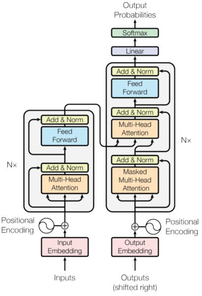
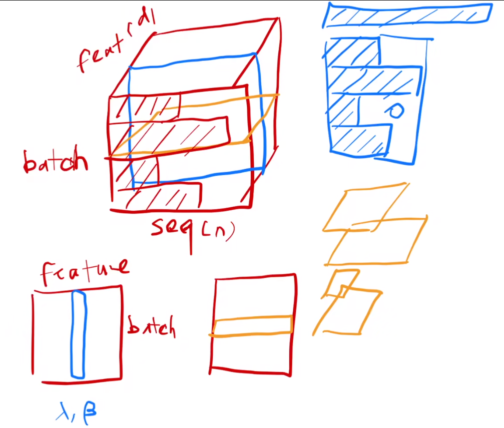
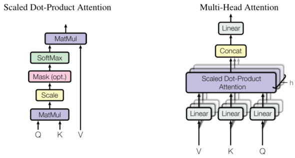
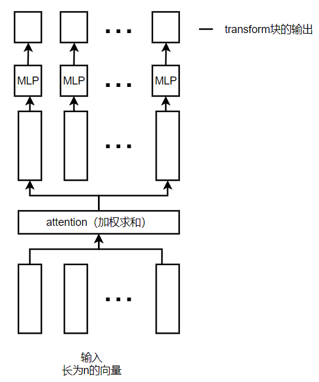
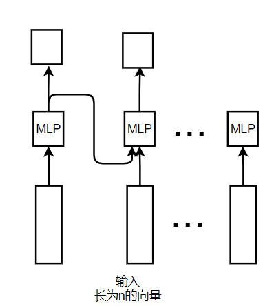
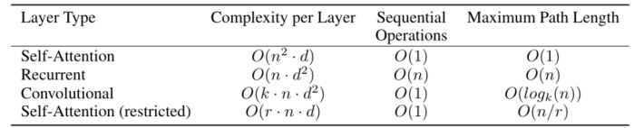
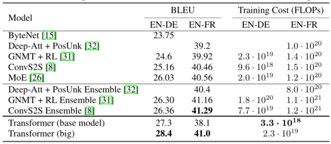
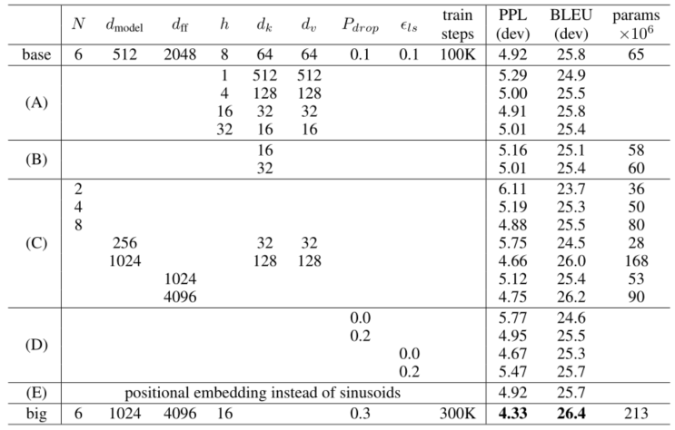

# Transformer

> 论文标题：Attention Is All You Need
>
> 作者：Ashish Vaswani, Noam Shazeer, Niki Parmar
>
> 发表: 2017 NIPS
>
> 代码： https://github.com/tensorflow/tensor2tensor
>
> 论文地址：https://arxiv.org/pdf/1706.03762v5.pdf

## 摘要

主要的序列转导模型基于复杂的循环或卷积神经网络，包括编码器和解码器。性能最好的模型还通过注意力机制连接编码器和解码器

Transformer，它完全基于注意力机制，完全摒弃了递归和卷积

## 结论

- Transformer是第一个完全基于注意力的序列转导模型，用多头自注意力取代了编码器-解码器架构中最常用的循环层
- 机器翻译，在 WMT 2014 English-to-German  和 WMT 2014 English-to-French 的翻译任务上效果更好
- 计划将 Transformer 扩展到涉及文本以外的输入和输出模式的问题，并研究局部的受限注意力机制，以有效处理图像、音频和视频等大型输入和输出
- 减少生成的顺序是另一个研究目标

## 导言

- RNN、LSTM [12] 和GRNN [7] 神经网络，尤其是在语言建模和机器翻译等序列建模和转导问题中被确立为最先进的方法

- RNN通常沿输入和输出序列的符号位置考虑计算。假设输入的是序列，RNN计算是把这个序列从左往右移一步一步往前走

  - 将位置与计算时间的步骤对齐，它们生成一系列隐藏状态 $h_t$，作为先前隐藏状态 $h_{t-1}$ 和位置 t 的输入的函数。
    -  $h_t$由$h_{t-1}$ 和位置 t 决定，将前面学习的历史信息一步步往后传递，通过$h_{t-1}$ 放到当前做计算，然后输出

  - 这种固有的顺序性质排除了训练示例中的并行化

  - 因式分解技巧 （Factorization tricks for LSTM networks.[18] ）和条件计算 （Outrageously large neural networks: The sparsely-gated mixture-of-experts layer.） 实现了计算效率的显着提高，但 顺序计算的基本约束仍然存在

- 注意机制已成为的序列建模和转导模型的组成部分，允许对依赖项进行建模，而无需考虑它们在输入或输出序列中的距离
  - 但这种注意力机制大多与循环网络结合使用。

- Transformer，这是一种避免重复的模型架构，而是完全依赖注意力机制来绘制输入和输出之间的全局依赖关系，可以并行

## 背景

- 减少顺序计算的目标也构成了 扩展神经 GPU [20]、ByteNet [15] 和 ConvS2S [8]  的基础，所有这些都使用卷积神经网络作为基本构建块，并行计算所有输入的隐藏表示和输出位置
  - 这些模型中，关联来自两个任意输入或输出位置的信号所需的操作数量随着位置之间的距离而增长
  - 对于 ConvS2S 呈线性增长，而对于 ByteNet  则呈对数增长。这使得学习远距离位置之间的依赖关系变得更加困难

- 在 Transformer 中，这被减少到恒定数量的操作，尽管由于平均注意力加权位置而降低了有效分辨率，使用多头注意力来抵消影响
  - 卷积中可以做多个输出通道，一个输出通道可以识别不一样的模式
  - Transformer也想有多个输出通道的效果，因此提出多头的注意力
- self-attention，自注意力，有时称为内部注意力，是一种将单个序列的不同位置关联起来以计算序列表示的注意力机制
- 端到端记忆网络基于循环注意机制而不是序列对齐循环，并且已被证明在简单语言问答和语言建模任务中表现良好

## 模型架构

- 神经序列转导模型具有编码器-解码器结构
  - 编码器将符号表示的输入序列 ($x_1, ..., x_n$) 映射到连续表示的序列 z = ($z_1, ..., z_n$)
    - $z_t$ 是 $x_t$ 的一个向量表示
  - 给定  z，然后解码器一次生成一个元素的符号输出序列 ($y_1, ..., y_m$)
    - 在每个步骤中，模型都是自回归的
      - 自回归：编码器中是一次性看见所有序列，而在解码器中，序列是一个一个生成的
      - 在过去时刻的输出，会作为当前时刻的输入
  
- Transformer 遵循这种整体架构，对编码器和解码器使用堆叠的  自注意力  和  逐点全连接层
  - 左图为编码器，右图为解码器
  - 输入进来是一个个的嵌入层，将其表示为一个个向量，Nx代表层有N个

- ### 编码器和解码器层

  - #### 编码器

    - 编码器由 N = 6 个相同的层组成。每层有两个子层。
      - 第一个是多头自注意力机制
      - 第二个是简单的、按位置的全连接前馈网络
    - 在两个子层中的每一个周围使用残差连接 ，然后进行层归一化 
      - 每个子层的输出为 LayerNorm (x + Sublayer(x)) ，其中Sublayer(x)是子层自己实现的函数
        - 
        - 在一个二维输入中，每一行是一个样本，每一列是一个特征
          - batchNorm：把每一个列（特征），在一个小的minibatch中将其均值变为0，方差变为1
          - LayerNorm：把每一个样本做归一化，相当于是把数据转置，放在batchNorm中，得到结果再转置就可以得到
        - 在Transformer中，是三维的相当于(batch,feature(维度为d),seq(维度为n))
          - 在时序的序列模型中，每个样本的长度可能发生变化，用layerNorm是每个样本自己计算均值和方差，不论样本长度，相对较稳定
          - 用batchNorm时，会计算一个全局的均值和方差，假设样本长度变化比较大，做小批量时计算出的均值和方差抖动相对较大，
      - 为了促进这些残差连接，模型中的 所有子层以及嵌入层 都会产生维度  $d_{model}$= 512 的输出

  - #### 解码器

    - 解码器也由一堆 N = 6 个相同的层组成，除了每个编码器层中的两个子层之外，解码器还插入了第三个子层
      - 第三个子层对编码器堆栈的输出执行多头注意力
    - 我们在每个子层周围使用残差连接，然后进行层归一化
    - 还修改了解码器堆栈中的自注意力子层，以防止位置关注后续位置（做了一个带掩码的注意力机制）
      - 这种带掩码的注意力与输出嵌入偏移一个位置的事实相结合，确保对位置 i 的预测只能依赖于位置小于 i 的已知输出

- ### 注意力

  - 注意力函数可以描述为将查询和一组键值对映射到输出

    - 其中查询、键、值和输出都是向量。

    - 输出 计算为值的加权和，其中分配给每个值的权重  由 查询与相应键 的 相似度 函数计算。

    - 注意力QKV说明：

      - 以翻译为例：

        source:我 是 中国人

        target: I am Chinese

        比如翻译目标单词为 I 的时候，Q为I

        而source中的 “我” “是” “中国人”都是K，

        那么Q就要与每一个source中的K进行对齐（相似度计算）；"I"与"我"的相似度，"I"与"是"的相似度；"I"与"中国人"的相似度；

        相似度的值进行归一化后会生成对齐概率值（“I"与source中每个单词的相似度（和为1）），也可以称为注意力值；

        而V代表每个source中输出的上下文向量；如果为RNN模型的话就是对应的状态向量；即key与value相同；

    - 在自注意力机制中，q与k，Q与K都是对应的同一个单词或者同一个句子，因此有qi=ki，Q=K，

  - #### 缩放点积注意力(Scaled Dot-Product Attention)

    - ### 

      - 输入由维度 $d_k$ 的  查询和键 以及维度 $d_v$ 的 值 组成
      - 使用所有键和 查询 做内积 ，将每个键除以 $\sqrt{dk}$，并应用 softmax 函数来获得值的权重

    - 同时计算一组查询的注意力函数，并打包到矩阵  Q 中。键和值也打包到矩阵 K 和 V 中。我们将输出矩阵计算为：
      - $\large Attention(Q,K,V) = softmax(\frac {QK^T}{\sqrt {d_k}})V$

    - 两个最常用的注意力函数是加法注意 和点积（乘法）注意

      - 点积注意力与我们的算法相同，除了 $\frac{1}{\sqrt{dk}}$ 的比例因子
      - 加法注意使用具有单个隐藏层的前馈网络计算兼容性函数。
      - 理论上两者复杂性相似，点积注意力在实践中更快且更节省空间，因为它可以使用高度优化的矩阵乘法代码来实现。
      - 对于较小的 $d_k$ 值，这两种机制的性能相似，但加法注意力优于点积注意力，而无需对较大的$d_k$ 值进行缩放 

      - 对于较大的 $d_k$ 值，点积的幅度会变大，从而将 softmax 函数推入具有极小梯度的区域 。
        - 点积变大的原因：假设 q 和k 的分量是独立随机变量，均值为 0，方差为 1, 那么它们的点积 $q·k =\sum^{d_k}_{_i=1} q_ik_i$，均值为 0，方差为  $d_k$

      - 为了抵消这种影响，我们将点积缩放  $\frac{1}{\sqrt{dk}}$ 

    - mask操作：在t时刻时，只看到$k_1至k_{t-1}$，不应该去看$k_t$及其之后的

      - 注意力机制$Q_t$会对所有k里的东西做运算，需要做的是在算出来之后，保证在计算权重(输出)时，不用到t时刻及其之后的
      - 具体是将其换成一个非常大的负数，因此在softmax时其会变成0

  - #### 多头注意力

    - 与使用 $d_{model}$ 维度的键、值和查询执行单个注意函数不同，将查询、键和值分别线性投影到 $d_k、d_k 和 d_v$ 维度上的学习不同线性投影
    - 多头注意力允许模型共同关注来自不同位置的不同表示子空间的信息。对于单个注意力头，平均化会抑制这一点。
    - $MultiHead(Q, K, V ) = Concat(head_1, ..., head_h)W^O$
      - 其中  $head_i = Attention(QW^Q_i , KW^K_i , VW^V_i)$
        - 投影是参数矩阵 $\large W^Q_i ∈ R^{d_{model}×d_k}，W^K_i ∈ R^{d_{model}×d_k}，W^V_i ∈ R^{d_{model}×d_v} 和 W^O ∈  R^{hd_v×d_{model}}$
    - 在实验中，使用 h = 8 个并行注意力层或头
      - 对于其中的每一个，我们使用 $d_k = d_v = d_{model}/h$ =  64。
      - 由于每个头的维度减少，总计算成本类似于具有全维度的单头注意力。

  - #### 注意力模型应用

    - Transformer 以三种不同的方式使用多头注意力：
      - 在“编码器-解码器注意力”层中，查询来自前一个解码器层，记忆键和值来自编码器的输出。
         - 这允许解码器中的每个位置参与输入序列中的所有位置。这模仿了序列到序列模型中典型的编码器-解码器注意机制
      - 编码器包含自注意力层。在自注意力层中，所有的键、值和查询都来自同一个地方，在这种情况下，是编码器中前一层的输出。编码器中的每个位置都可以关注编码器上一层中的所有位置。
      - 解码器中的自注意力层允许解码器中的每个位置关注解码器中直到并包括该位置的所有位置
         - 我们需要防止解码器中的信息向左流动，以保持自回归特性。我们通过屏蔽掉（设置为 -∞）softmax 输入中与非法连接相对应的所有值来实现缩放点积注意力的内部。
      - 假设输入长为n的序列，则有n个长为d的向量，
         - 编码器中的注意力层 ：有三个输入(k,v,q)，由一个输入通过线性变换做为(k,v,q)，本质上(k,v,q)均为一个东西(自注意力机制)，
         - 解码器中的注意力层：解码器的输入也与编码器一样采用自注意力，不一样的是他有个mask用来屏蔽后面的时刻
         - 解码器中第二个注意力层：(k,v)来自编码器的输出，q来自于解码器下一个attention的输入
         - 编码器最后一层的输出为n个长为d的向量，解码器下一个attention的输出也是m个长为d的向量

- ### 位置前馈网络  Position-wise Feed-Forward Networks

  - 除了注意力子层之外，我们的编码器和解码器中的每一层都包含一个全连接的前馈网络（MLP）
    - 该网络分别且相同地应用于每个位置。这由两个线性变换组成，中间有一个  ReLU 激活
      - $FFN(x) = max(0, xW_1 + b_1)W_2 + b_2$
  - 虽然线性变换在不同位置上是相同的，但它们在层与层之间使用不同的参数。另一种描述方式是内核大小为  1 的两个卷积。
    - 输入和输出的维数为 $d_{model}$= 512，内层的维数为 $d_{f f}$ = 2048。
  - **Transformer如何抽取信息，进行信息加工**：
    - attention起的作用就是将整个序列的信息抓取出来做一次聚合
  - **RNN如何抽取信息做加工**：
    - 其将上一个时序的MLP输出当做是下一个时序的MLP输入

- ### Embeddding 和 Softmax

  - 使用学习嵌入将输入标记和输出标记转换为维度 $d_{model}$ 的向量。
  - 还使用通常学习的 线性变换 和 softmax 函数将解码器输出转换为预测的下一个token概率
  - 在两个嵌入层和 pre-softmax 线性变换之间共享相同的权重矩阵，类似于[24]。在嵌入层中，我们将这些权重乘以 $\sqrt{d_{model}}$
    - [24]: Using the output embedding to improve language models.

- ### 位置编码

  - 在学习embedding会把每个向量的l2norm学习成较小值，维度大时，学的权重值就会变小因此要增加positional Encoding
    - 加上之后，它不会随着维度变大而把norm固定住
  - 由于模型不包含递归和卷积，attention不具有时序信息，为了让模型利用序列的顺序，必须注入一些关于标记在序列中的相对或绝对位置的信息
    - 在编码器和解码器堆栈底部的输入嵌入中添加“位置编码”。
    - 位置编码与嵌入具有相同的维度$d_{model}$，因此可以将两者相加
    - 位置编码的学习和固定可参考 : [8]Convolu-tional sequence to sequence learning
  - 在实验中，使用不同频率的正弦和余弦函数： 因为正余弦区间在[-1,1]因此乘以$\sqrt d$，使每个向量的区间也在[-1,1]
    - $\large P E_{(pos,2i)} = sin(pos/10000^{2i/d_{model}})$  
    - $\large P E_{(pos,2i+1)} = cos(pos/10000^{2i/d_{model}})$
    - 其中 pos 是位置，i 是维度。位置编码的每个维度对应一个正弦曲线。波长形成从 2π 到 10000 · 2π  的几何级数。
    - 选择这个函数是因为假设它可以让模型轻松地学习通过相对位置来参与
      - 因为对于任何固定的偏移量 k，$PE_{pos+k}$ 可以表示为 $P E_{pos}$  的线性函数。
  - 还尝试使用学习的位置嵌入，发现这两个版本产生了几乎相同的结果。
    - 我们选择了正弦版本,因为它可以让模型推断出比训练期间遇到的序列长度更长的序列长度。

## 为什么要Self-Attention

- 我们将自注意力层的各个方面与循环层和卷积层进行比较
  - 这些层通常用于将一个可变长度的符号表示序列 ($x_1, ..., x_n$) 映射到另一个等长序列 ($z_1, ..  ., z_n$), $x_i, z_i ∈ R^d$, 如典型序列转导编码器或解码器中的隐藏层
- 为了激发对self-attention的使用，考虑了三个必要条件
  - 一是每层的总计算复杂度
  - 二是可以并行化的计算量，以所需的最小顺序操作数来衡量
  - 三是网络中远程依赖关系之间的路径长度
    - 学习长程依赖是许多序列转导任务中的关键挑战
    - 影响学习这种依赖性的能力的一个关键因素是前向和后向信号必须在网络中遍历的路径长度
    - 输入和输出序列中任意位置组合之间的这些路径越短，就越容易学习远程依赖
    - 因此，文中比较了由不同层类型组成的网络中任意两个输入和输出位置之间的最大路径长度
      - 不同层类型的每层复杂性和最小顺序操作数、最大路径长度。 
      - n 是序列长度，d 是表示维度，k 是卷积的核大小，r 是受限自注意中的邻域大小
  - 自注意力层将所有位置与恒定数量的顺序执行操作连接起来，而循环层需要  O(n) 顺序操作。在计算复杂度方面，当序列长度 n 小于表示维度 d 时，自注意力层比循环层更快
  - 为了提高涉及非常长序列的任务的计算性能，可以将自注意力限制为仅考虑输入序列中以相应输出位置为中心的大小为 r 的邻域。这会将最大路径长度增加到  O(n/r)。
  - 内核宽度 k < n 的单个卷积层不会连接所有输入和输出位置对。这样做需要在连续内核的情况下堆叠 O(n/k) 卷积层，或者在扩张卷积的情况下需要 O($log_k(n)$)  [15]，从而增加任意两个位置之间最长路径的长度在网络中。
  - 卷积层通常比循环层更昂贵，高出 k 倍。可分离卷积 [6] 将复杂度大大降低到 O($k · n · d + n · d^2$)。
    - 然而，即使 k =  n，可分离卷积的复杂度也等于自注意力层和逐点前馈层的组合，这是我们在模型中采用的方法。

## 训练

- ### 训练数据和批处理

  - 我们在由大约  450 万个句子对组成的标准 WMT 2014 英语-德语数据集上进行了训练。

  - 句子使用字节对编码[3] 进行编码，该编码具有大约 37000  个标记的共享源目标词汇表。
    -  [3] :Massive exploration of neural machine translation architectures

  - 对于英语-法语，我们使用了显着更大的 WMT 2014 英语-法语数据集，该数据集由 3600 万个句子组成，并将标记拆分为  32000 个单词词汇表 [31]。句子对按近似的序列长度分批在一起。
    - [31] : Google’s neural machine translation system: Bridging the gap between human and machine translation.

  - 每个训练批次包含一组句子对，其中包含大约 25000 个源标记和 25000  个目标标记。

- ### 硬件和训练时间

  - 一台配备 8 个 NVIDIA P100 GPU 的机器  训练模型

  - 对基础模型进行了总共 100,000 步或 12 小时的训练

  - 对于大型模型，步进时间为 1.0 秒。大型模型训练了 300,000 步（3.5 天）。

- ### 优化器

  - Adam optimizer：$\large β_1 = 0.9, β_2 = 0.98 ,  \epsilon  = 10^{−9}$

  - 学习率变更公式：$lrate = d^{−0.5}_{model} · min(step\_num^{−0.5}, step\_num · warmup\_steps^{−1.5})$

    - 这对应于在第一个  warmup_steps 训练步骤中线性增加学习率，然后根据步数的平方根倒数按比例减少学习率。

    - 参数 warmup_steps = 4000。

- ### 正则化

  - 训练过程中采用了三种正则化
    - Residual Dropout
      - 将 dropout 应用于每个子层的输出，然后将其添加到子层输入并进行归一化
      - 将 dropout 应用于编码器和解码器堆栈中嵌入和位置编码的总和
      - 参数：$\large P_{drop}$= 0.1
    - Label Smoothing
      - 采用 $\large \epsilon_{ls} = 0.1$ 的标签平滑化，对于正确的值，softmax的值只需要达到0.1就行
      - 这是模型补缺行动，会使模型变得更加不确定，但会提高准确性和 BLEU 分数

## 实验结果

- ### 机器翻译

  - ### 

    - 为English-to-French训练的 Transformer（big）模型使用的 $P_{drop}$ = 0.1，而不是 0.3。

  - 对于基本模型，使用通过平均最后 5 个检查点获得的单个模型，这些检查点以 10 分钟的间隔写入

  - 对于大型模型，平均了最后 20 个检查点。我们使用beam搜索，beam大小为 4，长度惩罚 α = 0.6

  - 将推理期间的最大输出长度设置为输入长度 + 50，但在可能的情况下提前终止

- ### 消融实验

  - ### 

    - N：堆叠层数，d：向量长度，dff：MLP中间隐藏层输出的大小，h：多头注意力的个数，train steps ：训练多少个batch
    - $d_k$：key的维度 ，$d_v$：value的维度 $P_{drop}$：丢弃的率 ，$\large \epsilon_{ls} = 0.1$：最后label smoothing时，要学习的label的真实值
    - (A) 中，我们改变了注意力头的数量以及注意力键和值维度，保持计算量不变。
      - 虽然单头注意力比最佳设置差 0.9 BLEU，但质量也会因head过多而下降
    - (B) 中，我们观察到减小注意力键大小 $d_k$ 会损害模型质量。
      - 这表明确定兼容性并不容易，比点积更复杂的兼容性功能可能是有益的。
    - (C) 和 (D) 中进一步观察到，更大的模型更好，并且 dropout 非常有助于避免过度拟合
    - (E) 行中，我们用学习的位置嵌入 [8] 替换我们的正弦位置编码，并观察到与基本模型几乎相同的结果