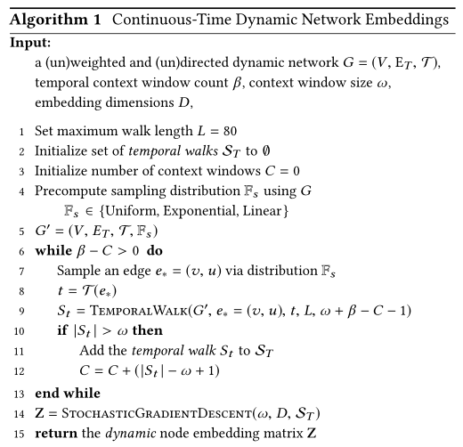
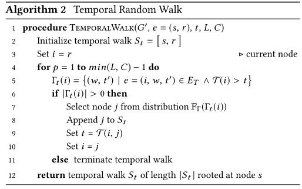

论文标题：Continuous-Time Dynamic Network Embeddings

> 发表于：2018 WWW
>
> 作者：Giang Hoang Nguyen，John Boaz Lee，Ryan A. Rossi
>
> 论文地址：https://dl.acm.org/doi/pdf/10.1145/3184558.3191526
>
> 代码：https://github.com/Shubhranshu-Shekhar/ctdne

## 摘要

- 网络随着添加，删除和更改链接和节点而随着时间的推移连续演变。
- 许多网络包含这种类型的时间信息，但网络表示学习的大多数研究都集中在图中的静态快照，并且在很大程度上忽略了网络的时间动态
- 文章描述了将时间信息纳入网络嵌入方法的通用框架。该框架引起了用于从连续时间动态网络学习时间偏见的方法
- 表明，图形中的建模时间依赖性对于学习适当和有意义的网络表示是重要的

## 结论

- 描述了一种将时间信息纳入网络嵌入方法的通用框架
- 该框架为现有的基于随机游走的嵌入方法提供了基础，用于从连续时间动态网络中学习动态（时间相关）网络嵌入
- 捕获了连续时间动态网络的重要时间属性，连续时间动态网络：避免了从图的连续时间表示创建一系列离散快照图所产生的问题和信息丢失
- 实验表明，在图中建模和合并时间依赖性对于学习适当且有意义的网络表示非常重要

## 未来工作

- 将研究使用连续时间动态网络框架来推广异构网络嵌入方法 [18] 和属性网络嵌入方法 [38] 以及其他方法 [26, 56]。

## 介绍

- 这些现实世界的网络中的大多数都是自然动态的——随着节点和链接的添加、删除和更改而随着时间的推移而发展。
- 网络中的时间信息对于准确建模、预测和理解网络数据很重要，但以前的大多数工作都忽略了网络数据中的时间信息 [7, 14, 15, 26, 37, 38, 52, 56, 61, 65].
- 描述了一个将时间依赖性合并到网络嵌入方法中的通用框架CTDNE
- 该框架允许现有的嵌入方法很容易地适应于从连续时间动态网络中学习更合适的网络表示，方法是确保在学习过程中注重时间，从而通过避免虚假或不可能的事件序列来降低噪声
- 该网络以最自然的粒度（例如，以秒或毫秒的时间尺度）捕获网络的重要时间依赖性。
  - 与将动态网络表示为一系列静态快照图形成对比，其中每个静态快照图表示在用户指定的离散时间间隔（例如，天或周）之间发生的所有边缘
- 连续时间动态网络：避免了从图的连续时间表示创建一系列离散快照图所产生的问题和信息丢失

## 模型构造

-  Continuous-Time Dynamic Network Embeddings
  -   
-  Temporal Random Walk
  -   

## 实验

- ### 数据集：来自论文 NetworkRepository [58].

  - ia-contact 
  - ia-hypertext09 
  - ia-enron-employees 
  - ia-radoslaw-email 
  - ia-email-eu 
  - fb-forum 
  - soc-bitcoinA 
  - soc-wiki-elec

- ### 超参数设置

  - 对于node2vec，窗口大小D = 128, 随机游走次数R = 10, 最大游走长度L = 80, ω = 10) 并在 node2vec [26] 中提到的 p,q ∈ {0.25, 0.50, 1, 2, 4}  上进行网格搜索.
  - 我们对 DeepWalk 使用相同的超参数，但 p = q = 1，因为它是 node2vec 的一个特例
  - 本文的方法， ω = 10, L = 80, D = 128
  - LINE 使用具有二阶接近度D = 128，和样本数 T = 6000 万
  - 使用逻辑回归 (LR)，并在该数据集上进行 25% 的保留验证。对 10 次随机种子初始化重复实验

- ### baseline

  - node2vec[26]
  - Deepwalk[52]
  - LINE[65]

- ### 评估指标

  - AUC score