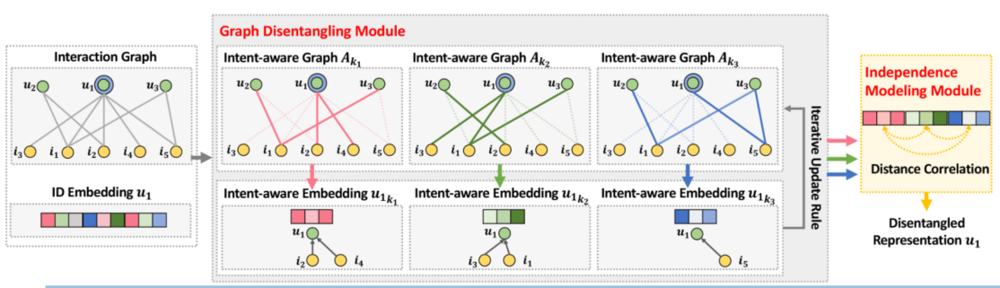

> 论文标题：Disentangled Graph Collaborative Filtering
>
> 发表于：2020 SIGIR
>
> 作者：Xiang Wang, Hongye Jin, Xiangnan He,
>
> 代码：https://github.com/Tingting2477/DGCF_torch
>
> 论文地址：https://arxiv.org/pdf/2007.01764.pdf

## 摘要

- 从交互数据中学习用户和项目的信息表示对于协同过滤（CF）至关重要
- 目前的嵌入函数利用用户-项目关系来丰富表示，从单个用户-项目实例演变为整体交互图。
  - 他们在很大程度上以统一的方式对关系进行建模，而忽略了用户采用这些物品的意图的多样性，这可能是为了消磨时间、兴趣或为家人等其他人购物。
  - 这种对用户兴趣建模的统一方法很容易导致次优表示，无法建模不同的关系并解开表示中的用户意图
- 关注用户意图更细粒度的用户-项目关系。因此，设计分离图协同过滤  (DGCF)，以分离这些因素并产生分离的表示。
  - 具体来说，通过对每个用户-项目交互的意图分布进行建模，我们迭代地细化了意图感知交互图和表示。
  - 同时，我们鼓励不同意图的独立性。这导致解耦的表示，有效地提取与每个意图相关的信息。

## 结论

- 在用户意图的粒度上展示了用户-项目关系，并将这些意图分解为用户和项目的表示
- 设计了一个新框架 DGCF，它利用图解耦模块来迭代地细化意图感知交互图和阶乘表示

## 未来工作

- 将涉及辅助信息，如用户的对话历史、项目知识和用户评论，或进行心理学实验[24]建立用户意图的基本事实，并更好地解释分离的表示。
- 探索阶乘表示的隐私性和鲁棒性，避免敏感信息的泄露

## 介绍

- 协同过滤 (CF) 侧重于历史用户与项目的交互（例如，购买、点击），它假定行为相似的用户可能对项目有相似的偏好
  - 学习用户和项目的信息表示对于改进 CF 至关重要
- 现有的嵌入函数无法区分用户对不同项目的意图，忽略了用户通常有多个意图来采用某些项目
  - 它们要么将用户-项目交互视为一个孤立的数据实例 [12、28]，
  - 要么将其统一组织为交互图中的一条边 [10、36  , 40]来训练神经网络
- 以前对用户-项目关系的建模是粗粒度的，这有几个限制：
  - 不考虑实际的用户意图很容易导致次优表示
  - 由于噪声行为（例如，随机点击）通常存在于用户的交互历史中，混淆她的意图会使表示对噪声交互的鲁棒性降低； 
  - 用户意图模糊不清，并且高度耦合于表征，导致可解释性差
- 产生挑战：
  - 如何在表示中明确呈现与每个意图相关的信号尚不清楚
  -  分离的质量受到意图之间独立性的影响，这需要量身定制的建模。
- 文章开发了一个新模型，分离图协同过滤  (DGCF)，以在用户意图的粒度上解开用户和项目的表示。
  - 首先将每个用户/项目嵌入分割成块，将每个块与潜在意图耦合。
  - 然后，我们应用配备了邻居路由  [25, 29] 和嵌入传播 [9, 18, 39, 40]  机制的图解耦模块。
    - 邻居路由利用节点-邻居亲和性来改进意图感知图，突出了用户和项目之间有影响的关系的重要性。
    - 反过来，在此类图上嵌入传播会更新节点的意图感知嵌入。
    - 通过迭代地执行这种解开操作，我们建立一组意图感知图和分块表示。同时，引入独立建模模块以鼓励不同意图的独立性。
    - 具体来说，距离相关性  [33, 34]用于意图感知表示。
    - 步骤结束后，我们获得了解耦的表示，以及意图的解释图

## 模型架构

- DGCF
  
  - 它由两个实现解缠结的关键组件组成：
    - 图解耦模块，它首先将每个用户/项目嵌入分割成块，将每个块与一个意图，然后将新的邻居路由机制合并到图神经网络中，从而解开交互图并细化意图感知表示；
    - 独立性建模模块，它使用距离相关性作为正则化器来鼓励意图的独立性。

## 实验

- ### 研究问题

  - RQ1：与现有模型相比，DGCF 的表现如何？
  - RQ2：不同的组件（例如，层数、意图数、独立性建模）如何影响 DGCF 的结果？
  - RQ3：DGCF 能否提供对解耦表示的深入分析？潜在用户意图的解耦和表示的可解释性？

- ### 数据集

  - Gowalla, 
  - Yelp2018,
  - Amazon-Book

- ### baseline

  - MF [28]：这种模型将用户-项目交互视为孤立的数据实例，并且仅使用 ID 嵌入作为用户和项目的表示。
  - GC-MC  [36]：该方法将历史用户行为组织为一个整体交互图，并采用一个 GCN [18] 编码器来生成表示,仅涉及一跳邻居。 
  - NGCF  [40]：在用户-项目交互图上采用三个 GNN 层，旨在通过最多三跳邻居的信息来细化用户和项目表示。
  - DisenGCN [25]：一种最先进的解耦GNN 模型，它利用邻居路由和嵌入传播来解开图边后面的潜在因素。
  - MacridV AE [26]：这种模型专门用于解开用户行为背后的用户意图。特别是，它采用  β-V AE 来估计用户个人历史的生成过程，假设有几个影响用户行为的潜在因素，以实现分离的用户表示。

- ### 超参数设置

- ### 评估指标

  - Recall@N
  - NDCG@N