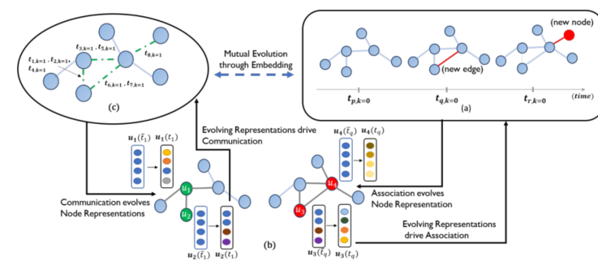

> 论文标题：Dyrep: Learning representations over dynamic graphs
>
> 发表于：2019 ICLR
>
> 作者：Rakshit Trivedi, Mehrdad Farajtabar
>
> 代码：https://github.com/Harryi0/dyrep_torch
>
> 论文地址：https://openreview.net/pdf?id=HyePrhR5KX

## 摘要

- 大多数进步都是在静态图设置方面取得的，而联合学习图的动态和图上的动态的努力仍处于起步阶段
- 在学习动态图时会出现两个基本问题：
  - (i）如何优雅地对图上的动态过程进行建模？
  - (ii) 如何利用这样的模型将演化的图信息有效地编码为低维表示？
- 提出了  DyRep——一种用于动态图的新型建模框架，它将表示学习假设为一个潜在的中介过程（节点间：关联→嵌入→通信），它连接了两个观察到的过程，即网络的动态（实现为拓扑演化）和网络上的动态（实现为节点之间的活动）。
  - 具体来说，我们提出了一个双时间尺度的深时间点过程模型，该模型捕获了观察到的过程的交错动态。
  - 该模型由时间注意表示网络进一步参数化，该网络将时间演变的结构信息编码为节点表示，从而驱动观察到的图动态的非线性演变。
  - 我们的统一框架使用高效的无监督程序进行训练，并具有泛化未见节点的能力。

## 结论

- 引入了一种新颖的动态图建模框架，该框架通过将表示学习作为潜在的中介过程来桥接拓扑演化和节点交互的动态过程，从而有效地学习节点表示。
- 提出了一个由时间注意表示网络参数化的深度时间点过程模型，该模型对这些复杂且非线性演变的动态过程进行建模，并学习将图上的结构-时间信息编码为低维表示。
- 提出了一种新颖的基于时间点过程的注意力机制，该机制可以基于图中的通信和关联事件的历史来关注邻域

## 未来工作

- DyRep 不支持网络收缩：（i）难以获取具有细粒度删除时间戳的数据，以及（ii）时间点过程模型需要更复杂的支持删除
  - 例如，可以使用生存过程公式来扩充模型，以解决未来时间节点/边缘的缺乏问题
- 支持编码更高阶的动态结构

## 介绍

- 学习节点表示以有效编码高维和非欧几里得图信息是一个具有挑战性的问题
- 几个领域呈现出高度动态的数据，这些数据表现出复杂的时间特性
- 多数现实世界的图至少表现出两个不同的动态过程，它们在不同的时间尺度上演化——拓扑演化：
- 节点和边的数量预计会随着时间的推移而增长（或缩小）导致图中的结构变化；
- 节点交互：涉及节点之间的活动，这些活动可能在结构上连接也可能不连接。
- 对这些非线性演变的动态过程之间的交错依赖进行建模是推进动态图形式模型的关键下一步。
- 如何利用这样的模型来学习能够有效捕捉随时间变化的图信息的动态节点表示？ — 该方向的现有技术可分为两种方法：
  - a.)  离散时间方法，其中动态图的演变被观察为随时间推移的静态图快照的集合。这些方法倾向于保留（编码）非常有限的结构信息并以非常粗略的水平捕获时间信息，这导致快照之间的信息丢失以及缺乏捕获细粒度时间动态的能力。这种方法的另一个挑战是选择适当的聚合粒度，这通常是错误指定的。  
  - b.)  连续时间方法，其中变成以更精细的时间粒度建模，以应对上述挑战。虽然现有方法已被证明在特定环境中非常有效，但它们要么以解耦的方式对简单的结构和复杂的时间属性进行建模，要么使用简单的时间模型
- 但是几个领域表现出结构特性的高度非线性演化以及复杂的时间动力学，有效地建模和学习捕获此类复杂系统的各种动力学特性的信息表示仍然是一个悬而未决的问题。

## 模型架构

## 实验

- ### 数据集

  - Social Evolution Dataset
  - Github Dataset

- ### baseline

  - 动态链接预测
    - Know-Evolve：一种用于多关系动态图的最先进模型，其中每条边都有时间戳和类型（通信事件）。
    - DynGem：将时间线划分为离散的时间点，并学习嵌入这些时间点的图形快照。
    - DynTrd ： 专注于三元组的特定结构，以模拟动态网络中开放三元组如何形成紧密三元组。
    - GraphSage：一种归纳表示学习方法，它学习样本和聚合函数来学习表示，而不是针对单个节点进行训练。
    - Node2Vec ：简单的转换基线来学习静态图上的图嵌入。
  - 事件时间预测
    - Know-Evolve
    - Multi-dimensional Hawkes Process (MHP) ：图中的所有事件都被视为二元的

- ### 超参数设置

- ### 评估指标

  - Mean Average Rank (MAR)、
  - HITS(@10) 