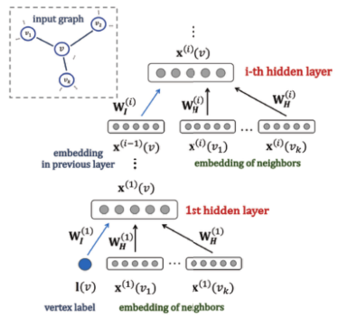

> 论文标题：Fast and Deep Graph Neural Networks
>
> 发表于：2020  AAAI
>
> 作者：Claudio Gallicchio, Alessio Micheli
>
> 代码：https://sites.google.com/site/cgallicch/FDGNN/code
>
> 论文地址：https://ojs.aaai.org/index.php/AAAI/article/view/5803/5659

## 摘要

- 解决了构建深度图神经网络 (GNN) 的效率问题。
- 该方法利用将每个输入图表示为动态系统的固定点（通过循环神经网络实现）的想法，并利用深层架构组织的循环单元
- 许多方面都提高了效率，包括使用小型且非常稀疏的网络，其中循环单元的权重在本工作中引入的稳定性条件下未经训练。
  - 这可以被视为研究深度 GNN  架构的内在力量的一种方式，也可以为建立更复杂的全面训练模型提供见解。
- 通过实验结果表明，即使没有训练循环连接，小型深度 GNN  的架构也能够在图分类领域的一组重要任务上达到或提高最先进算法的性能。

## 结论

- FDGNN，这是一种用于在图域中快速学习的新型 NN 模型
- 可以将 GNN 的深层架构构造的优势（在其有效处理通用图形式的结构化数据的能力方面）与随机 NN，特别是 RC 方法的极端效率相结合.
- 随机实现允许我们实现未经训练但稳定的图嵌入层，而通过深度架构，模型能够构建输入图的逐步更有效的表示

## 未来工作

## 介绍

- 结构化领域的学习已逐渐从平面转向更结构化的数据形式（序列、树和一般图），
- 而 神经网络 模型已从浅层架构扩展到深层架构，且允许对输入表示进行多级抽象。
  - 这俩方面意味着高计算成本
- 对于序列和树的情况，
  - Reservoir Computing (RC)  范式提供了一种基于在动态系统（Echo）稳定条件下使用循环权重的固定（随机）值对循环/递归模型进行有效建模的方法。
- RC 扩展到图（Gallicchio 和 Micheli 2010）遵循 GNN 的路线，而稳定性条件由储层动力学（ESP）的收缩性继承。对于一般图，这种方法对多层架构的扩展仍然没有得到探索
- 遵循所有这些思路，这项工作的目的是提供一种图分类方法，称为快速和深度图神经网络 (FDGNN)，它结合了：
  - (i) 图嵌入的稳定动态系统（在 GNN 模型类中）的能力，
  - (ii）GNN 架构的深层组织的潜力（通过架构层提供输入结构的分层抽象）
  - (iii）随机神经网络的极端效率，即没有训练循环单元的模型
- 中心思想是利用递归/动态系统的不动点来表示（或嵌入）输入图。
  - 特别是，一旦计算了所有图顶点的状态，迭代状态转换函数直到收敛，这些信息就被用于图嵌入，然后投影到模型输出，模型输出被实现为经过训练的神经单元的标准层
- 与 RC 模型的典型设置或与完全训练的方法的自由参数数量相比，稀疏连接和相对较少的单元数量也将解决效率问题。
  - 由于嵌入部分的自由参数不经过训练过程，该模型还提供了一种工具来研究 GNN 中分层的固有（即独立于学习）架构效果

## 模型架构

 

## 实验

- ### 数据集

  - 化学信息学
    - MUTAG：硝基芳香化合物的集合，目标是预测它们对鼠伤寒沙门氏菌的致突变性
    - PTC：一组被分类为致癌或非致癌化合物的化合物-对雄性大鼠致癌
    - COX2：包含一组标记为活性或非活性的环氧合酶-2 抑制剂分子
    - PROTEINS：一组蛋白质数据集
    - NCI1：分为酶类或非酶类，包含针对细胞肺癌的抗癌筛查
  - 社交网络分析
    - IMDB-b、IMDB-m：包含演员/女演员自我网络的电影协作数据集，其中目标类代表电影类型，IMDB-b 有 2 个可能的类（即动作或浪漫），IMDB-m 有 3  个类（即喜剧、浪漫和科幻）。 
    - REDDIT：对应于在线讨论线程的图表集合，分为 2 类（即问题/答案或讨论社区
    - COLLAB：一组科学合作，包含根据研究领域（即高能、凝聚态或天体物理学）分类的研究人员的自我网络

- ### baseline

  - GNN 
  - RelNN:关系神经网络
  - DGCNN:深度图卷积神经网络
  - PGC-DGCNN :参数图卷积
  - DCNN:扩散卷积神经网络
  - PSCN:PATCHY -SAN
  - GK: 图内核Graphlet Kernel 
  - DGK：Deep GK
  - RK:Random-walk Kernel
  - PK ：传播内核
  - WL:Weisfeiler-Lehman Kernel 
  - KGCNN:内核图 CNN 
  - CGMM:上下文图马尔可夫模型

- ### 超参数设置

- ### 评估指标

  - ACC