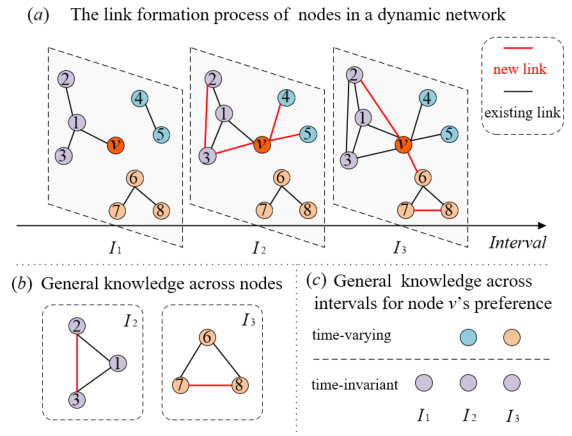
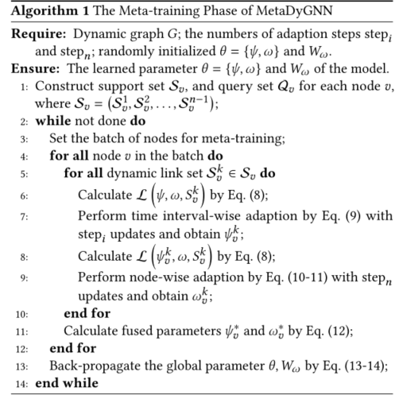

> 论文标题：Few-shot Link Prediction in Dynamic Networks
>
> 发表于：2022 WSDM
>
> 作者：Cheng Yang, Chunchen Wang, Yuanfu Lu, Chuan Shi
>
> 代码： https://github.com/BUPT-GAMMA/MetaDyGNN
>
> 论文地址：

## 摘要

- 动态链路预测旨在预测动态网络中节点的未来边缘
- 动态网络的一个关键特性是，新节点和链接会随着时间的推移不断出现，这些新节点通常在它们到达时只有几个链接
- 如何在动态网络中预测这些少数节点的未来链接还没有得到很好的研究
- 提出了一种基于元学习框架的新模型，称为 MetaDyGNN，用于动态网络中的小样本链接预测
  - 提出了一种具有分层时间间隔和节点自适应的元学习器，以提取该问题背后的一般知识。
  - 还设计了一个简单有效的动态图神经网络（GNN）模块来表征元学习任务中每个节点的局部结构。
  - 学习到的通用知识可用作模型初始化，并且可以通过仅在几个链接上进行微调过程来快速适应新节点。

## 结论

- 提出了一种名为 MetaDyGNN 的新模型来解决动态网络中的少样本链接预测问题。
- 通过引入分层时间间隔和节点自适应来专门针对此任务的元学习框架。
  - 通过这种方式，可以更好地跨节点或跨时间间隔提取通用知识，并快速适应以前看不见的只有几个链接的节点。
  - 设计了一个简单有效的动态 GNN 模块，它比现有的动态 GNN 模型更适合元学习框架。

## 未来工作

- 将我们的模型专门用于更具体的应用场景，例如推荐系统。虽然直接迁移可能是可行的，但如果进一步考虑用户行为会更好。

## 介绍

- 由于在现实世界系统中广泛存在此类新节点或冷启动节点 [12, 33]，因此值得研究如何预测动态网络中只有少数观察到的连接的节点的链接，即很少 -动态网络中的镜头链接预测
- 现有的动态 GNN 将动态链接预测视为一个有监督的问题，并且并不专门用于小样本场景,与少量节点相对应的预测损失很可能由整体损失决定。因此，在动态 GNN 模型中，所有节点共享的可训练参数不能很好地推广到少镜头节点，并且少镜头节点的特定于节点的可训练参数无法得到充分训练
- 元学习 [36] 可以跨不同的训练任务提取一般知识并快速适应小样本测试任务，并且已与 GNN 集成以解决小样本问题
- 挑战：
  - 如何通过元学习提取形成动态链接的一般知识，仍然是一个尚未解决的挑战
  - 如何在元学习环境中定制动态 GNN 以获得更好的泛化能力是另一个需要解决的挑战
    - 将元学习框架（例如，MAML [5]）与现有的动态 GNN（例如，TGAT [39]）简单地结合起来并非易事，其复杂的架构无法快速适应元学习中的小样本节点。
    - 他们通常将整个动态图作为输入，需要相对较大的计算资源，在元学习技术的简单组合下会损害泛化能力。
- 提出了一种名为 MetaDyGNN 的新模型，该模型可以利用元学习和图神经网络技术，用于动态网络中的小样本链接预测。
  - 为了解决第一个挑战，我们假设可以通过元学习提取两个级别的一般知识以进行动态链接预测
    - 为了提取上述通用知识以进行快速适应，我们将元学习框架中的每个任务形式化为单个节点的时间偏好学习，并提出了一种具有时间间隔自适应和节点(任务方面）自适应的分层自适应元学习器。
    - 在元测试阶段，我们的模型可以快速适应一个新节点（node-wise adaption），以预测其未来的潜在链接（time interval-wise adaption），新节点只有几个链接
  - 为了应对第二个挑战， 设计了一个轻量级的动态 GNN 模块来表征元学习任务中每个节点的局部结构。
    - 具体来说，我们的模块采用注意力机制来利用时间编码、节点特征和边特征进行节点表示学习。与 TGAT [39] 相比，我们的模块在元学习框架中更加高效和有效

## 模型架构

- 动态网络示例
  
  - 中心节点 v 的邻居偏好在不同的时间间隔内发生变化
  - 图  (b) 中的第一层是不同节点之间共享的知识，例如，具有共享邻居的两个节点倾向于稍后连接的三元闭合定律 [28]。
  - 图  (c) 中的第二个层次是了解特定节点的时间不变偏好。

## 方法论

- ### 任务制定

  - 元学习框架会将训练数据划分为一组任务，并将这些任务视为训练实例。在每个单独的任务中，“训练”和“测试”示例分别被命名为支持集和查询集，以避免混淆。在元训练阶段，框架将学习跨不同任务共享的知识作为模型参数。然后在元测试阶段，参数可以快速适应新任务，只需几个微调示例。
  - 为了提取关于动态链接形成的两个级别的一般知识，元学习框架中的每个任务都被形式化为单个节点的时间偏好学习，即将训练数据划分为节点级任务以捕获节点知识。具体来说，我们将每个任务视为节点的正时间链接和负时间链接之间的二元分类问题。
  - 为了获取每个节点的时不变偏好知识，我们将每个节点v的时间跨度 进一步划分为 n 等距时间间隔 $I_v$ = {$I^1_v,I^2_v,...,I^n_v$}并相应地将链接拆分为 n 集。
  - 对于节点v的任务Tv=(Sv,Qv),支持集Sv={$S^1_v,S^2_v,...,S^{n-1}_v$},$S^i_v$是滴i个巨剑的链接集，查询集Qv是最后一个区间$I^n_v$中的链接，
  - 现在任务制定的最后一部分是正负链接的选择。
  - 对于元训练，为了实现少样本链接预测的能力，我们需要采样一小部分动态链接作为每个节点的正链接，因为现有节点的度数通常远大于新节点的度数。
    - 具体来说，我们将在每个epoch中采样K个链接作为每个节点的支持集Sv，并确保不同时间间隔的链接数量大致相等。
    - 此外，将采样另一个K链接作为查询集Qv。
    - 对于元测试，我们使用每个新节点的K个动态链接作为微调的支持集（即 K-shot 链接预测），并将所有剩余链接用作评估的查询集。
    - 对于负链接，我们根据节点度分布遵循相同的采样策略 [21, 23] 对相同数量的正链接进行采样
  
- ### 基于动态GNN的链路预测

  - 动态 GNN 模块解决元学习框架中的节点级链接预测任务。模块集成了结构信息、时间戳信息和节点/边缘特征，表示每个节点
  - 将一对节点表示输入分类器，以判断时间链接 e = (v, v ′, te) 是否为真。形式上，动态 GNN 模块 fθ 包括节点编码器gφ 和分类器 cw。
    - 节点编码器gφ：节点v在时间戳te的表示是从其时间邻居Nv(t)聚合的，即时间戳t之前的节点本身和其邻居，t ≤ te
      - 首先，基于共享权重矩阵$Wnode，维度为d×d'$，对特征$x_v$进行线性变化,构造节点v的embedding $h^0_v,$d是节点特征的大小，d‘是节点embedding的大小
      - 对于时间编码器 Φ(·)，我们采用随机傅立叶特征进行编码 [13, 39]，根据 Bochner 定理 [1] 可以逼近任何正定核
      - 使用注意力机制通过相应的节点嵌入和时间编码来计算每个时间邻居的不同权重。因此，对于节点 v 在时间 t，
        - $h^l_v(t,t_e) = g \phi(v,N_v(t),t_e)$
    - 分类器cw：
  
- ### 分层自适应元学习器

  - #### 时间间隔自适应

    - 针对每个时间间隔微调节点编码器的全局参数φ，时间间隔自适应更新节点编码器的全局参数 φ 以表征节点 v 在 第k个 时间间隔中的偏好，基于 $S_v$ 中每个集合 $S^k_v$ 的损失
    - 每个边$e =(v,v',t_e) \in S^k_v$,节点v的表示计算为：$h^L_v(t^k,t_e) = g\varphi(v,\mathcal N_v(t^k),t_e)$ （7）
    - 然后计算损失
      - $\mathcal L(\varphi,w,S^k_v)$

    - 使用梯度下降调整全局参数
      - $\varphi^k_v = \varphi -\beta\frac{\part\mathcal L(\varphi,w,S^k_v)}{\part\varphi}$(9)

  - #### 节点自适应

    - 基于自适应参数 w 对分类器的全局参数 $\varphi^k_0$ 进行微调
      - $w_v=w+h^0_v·W_w$(10)
      - $w^k_v=w_v-\eta\frac{\part\mathcal L(\varphi,w,S^k_v)}{\part w_v}$(11)

  - #### 优化

    - 将节点的适应参数融合：$\varphi^*_v=\sum^{n-1}_{k=1}a^k_v\varphi^k_v,w^*_v=\sum^{n-1}_{k=1}a^k_v w^k_v$

- 学习的全局参数 φ 编码了跨节点和时间间隔的一般知识； $w_v$ 编码关于节点 v 跨不同间隔的时间不变知识。

- #### 元训练算法过程

  - 输入：动态图G，自适应步数$step_i\ \ step_n$,随机初始化θ = {φ，w}
  - 为每个节点v构造支持集$S_v$,查询集$Q_v$,且$S_v = (S^1_v,S^2_v,...,S^{n-1}_v)$
  - 循环
    - 设置元训练的节点批次
    - 让所有的节点在批次中
      - 让所有的动态连接$S^k_v \in S_v$
        - 计算损失
        - 学习更新时间间隔自适应$\varphi^k_v$
        - 计算损失
        - 学习更新节点自适应$w^k_t$
      - 计算融合参数$\varphi^k_v和w^k_t$
    - 反向传播学习参数θ和$W_w$

  

## 实验

- ### 研究问题

- ### 数据集

  - Wikipedia:一个包含编辑过的百科全书页面及其编辑者的数据集，其中节点代表 wiki 页面及其编辑者。每个动态链接表示一个带时间戳的编辑交互。 
  - Reddit：Reddit 上的活跃用户及其在subreddits 下的帖子的数据集。节点是用户和他们的帖子。链接代表发布请求的时间戳操作。
  -  DBLP：一个学术合作网络，其中节点是作者，每个链接代表相应年份的共同作者论文。

- ### baseline

  - 静态GNN
    - GraphSAGE [9] 和 GAT [35]
  - 动态GNN
    - DyRep [32]、EvolveGCN [25] 和 TGAT [39]
  - 基于元的 GNNS，包括 Meta-GNN [41]、GraphSAGE+MAML [5, 9] 和 TGAT+MAML [5, 39]

- ### 超参数设置

- ### 评估指标