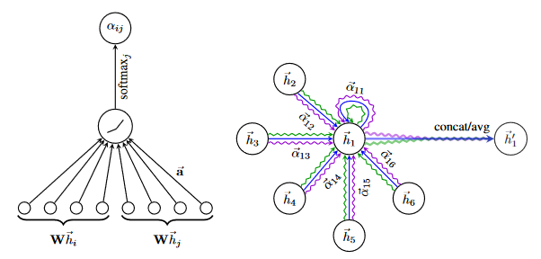
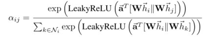

> 论文标题：Graph Attention Networks
>
> 发表于：2018 ICLR
>
> 作者：Petar Velickovi ́c，Guillem Cucurull，Arantxa Casanova
>
> 论文代码：https://github.com/Diego999/pyGAT
>
> 论文地址：https://arxiv.org/pdf/1710.10903v3.pdf

## 摘要

- 利用掩蔽的自我注意层来解决基于图形卷积或其近似的先前方法的缺点
- 通过堆叠节点能够参与其邻域特征的层，我们可以（隐式）为邻域中的不同节点指定不同的权重，而不需要任何类型的计算密集型矩阵运算（例如求逆）或依赖于知道图形结构前期。
- 模型适用于归纳和迁移问题

## 结论

- 图注意力网络 (GATs)，这是一种新颖的卷积式神经网络，可在图结构数据上运行，利用掩蔽的自注意力层
- 在这些网络中使用的图注意力层在计算上是高效的（不需要计算密集的矩阵运算，并且可以在图中的所有节点上并行化），允许（隐式）为邻域内的不同节点分配不同的重要性，同时处理不同的大小邻域，并且不依赖于预先了解整个图结构

## 未来工作

- 能够生成一个利用稀疏矩阵运算的 GA T 层版本，将存储复杂性降低到节点和边数的线性，并能够在更大的图形数据集上执行 GA T  模型。但是，我们使用的张量操作框架仅支持 rank-2 张量的稀疏矩阵乘法，这限制了当前实现的层的批处理能力
  - 解决这个问题，以便能够处理更大的批量大小。
- 利用注意力机制对模型的可解释性进行彻底的分析

## 介绍

- 卷积神经网络 (CNN)。底层数据表示具有类似网格的结构。这些架构通过将它们应用于所有输入位置，有效地重用具有可学习参数的本地过滤器。
- 许多任务涉及的数据不能以网格状结构表示，而是位于不规则域中。这样的数据通常可以用图表的形式来表示。
- 早期工作将卷积推广到图域的兴趣越来越大。这个方向的进展通常分为光谱方法和非光谱方法。
  - 谱方法中，学习滤波器依赖于拉普拉斯特征基，这取决于图结构。因此，在特定结构上训练的模型不能直接应用于具有不同结构的图。
  - 非谱方法存在的挑战是定义一个与不同大小的邻域一起工作并保持 CNN 的权重共享属性的算子
- 在许多基于序列的任务中，注意力机制几乎已成为实际标准
  - 注意力机制的好处之一是它们允许处理可变大小的输入，专注于输入中最相关的部分以做出决策
- 受此启发，论文引入了一种基于注意力的架构来执行图结构数据的节点分类

## 模型架构

- Graph Attentional Layer：
  - 使用的特殊注意力设置与 Transformer的工作密切相关
  - 为了获得足够的表达能力将输入特征转化为更高层次的特征，至少需要一个可学习的线性变换。为此，作为初始步骤，将由权重矩阵 W 参数化的共享线性变换应用于每个节点。然后我们在节点上执行自注意
    - 执行 masked attention 将图结构注入到机制中——我们只计算节点 j ∈ $N_i$ 的 $e_{ij}$，其中 $N_i$是图中节点 i 的某个邻域
  - 注意力机制 中的单层前馈神经网络，由权重向量a  参数化，并应用 LeakyReLU 非线性（负输入斜率 α = 0.2）。
    -  
  - 图右侧多头注意力表示节点 1 在其邻域上的多头注意力（K = 3 个头）示意图。不同的箭头样式和颜色表示独立的注意力计算。来自每个头部的聚合特征被连接或平均以获得h’1。

## 实验

- ### 数据集

  - 迁移学习：Cora、Citeseer、Pubmed、
  - 归纳学习：protein-protein interaction(PPI)

- ### baseline

  - #### 迁移学习

    - label propagation (LP，标签传播)
    - semi-supervised embedding (SemiEmb，半监督嵌入)
    - manifold regularization (ManiReg，流形正则化) 
    - skip-gram based graph embeddings (DeepWalk) 
    - iterative classification algorithm (ICA，迭代分类算法)
    - Planetoid
    - graph convolutional neural network(GCN)
    - graph convolutional models utilising higher-order Chebyshev filters(高阶 Chebyshev 滤波器的图卷积模型) 
    - model presented in Monti (MoNet )

  - #### 归纳学习

    - GraphSAGE-GCN（将图卷积式操作扩展到归纳设置）
    - GraphSAGE-mean（取特征向量的元素平均值）
    - GraphSAGE-LSTM（通过将邻域特征馈送到  LSTM 
    - GraphSAGE-pool（采用由共享的非线性多层感知器转换的特征向量的元素最大化操作）

- ### 超参数设置

  - #### 迁移学习：两层GAT

    - 在 Cora 、Citeseer 数据集上
      - 第一层：多头 K =8，头注意力计算F‘ = 8个特征(共64个特征)，以及非线性激活函数(ELU)
      - 第二层：计算 C 个特征（其中 C 是类数）的单个注意力头，然后是 softmax 激活
      - λ = 0.0005 的 L2 正则化
      - p = 0.6 的 dropout
    - 在Pubmed 的训练集上
      - 第二层微改：K = 8 个输出注意力头（而不是一个），并将 L2 正则化加强到 λ = 0.001

  - #### 归纳学习：三层GAT

    - 前两层都由 K = 4 个注意力头组成，计算 F = 256 个特征（总共 1024 个特征），然后是 ELU 非线性
    - 最后一层 K = 6 个注意力头，每个计算 121 个特征，对其进行平均，然后进行逻辑 sigmoid 激活
    - batchsize = 2
    - 提供了使用恒定注意力机制 a(x, y) = 1 时的结果，其中相同的架构——这将为每个邻居分配相同的权重

  - 模型使用Glorot 初始化，使用 Adam SGD 优化器

  - Pubmed 的初始学习率为 0.01，0.005为所有其他数据集的学习率

- ### 评估指标

  - cross-entropy loss
  -  (transductive)accuracy
  - micro-F1(inductive) score