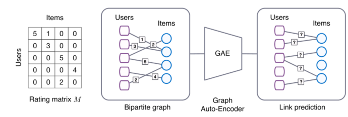
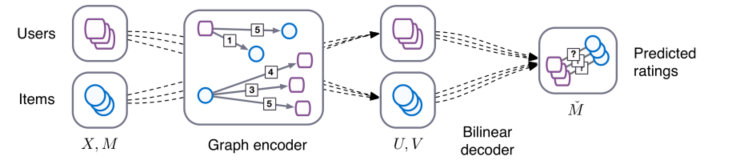

> 论文标题：Graph Convolutional Matrix Completion
>
> 发表于：2018 KDD
>
> 作者：Rianne van den Berg， Thomas N. Kipf，Max Welling
>
> 论文代码：https://github.com/hengruizhang98/GCMC-Pytorch-dgl
>
> 论文地址：https://arxiv.org/pdf/1706.02263v2.pdf

## 摘要

- 从图上链接预测的角度考虑推荐系统的矩阵补全
- 提出了一种基于双向交互图上可区分的消息传递的图自动编码器框架

## 结论

- 图卷积矩阵补全（GC-MC）：一种用于推荐系统中的矩阵补全任务的图自动编码器框架
  - 编码器包含一个图形卷积层，该层通过在二分用户-项目交互图上传递消息来构造用户和项目嵌入。
  - 结合双线性解码器，以标记边缘的形式预测新评级。
- 图形自动编码器框架自然地泛化为包括用户和项目的辅助信息
- 模型可以通过随机小批量在更大规模的数据集上进行训练

## 未来工作

- 此模型扩展到大规模多模态数据（由文本、图像和其他基于图形的信息组成），例如存在于许多现实推荐平台中，在这种情况下，GC-MC 模型可以与循环（文本）或卷积神经网络（图像）相结合。
- 为了解决可扩展性问题，有必要开发有效的近似方案，例如对局部邻域进行二次采样[10]，注意力机制 [1] 为扩展此类模型提供了一个有前途的未来途径。

## 介绍

- 推荐算法的两个主要分支：基于内容的推荐系统 [24] 和协同过滤模型 [9]。
  - 基于内容的推荐系统使用用户和项目的内容信息，例如他们各自的职业和流派，来预测用户的下一次购买或项目的评级
  - 协同过滤模型通过考虑集体交互数据来预测未来的评级或购买来解决矩阵补全任务
- 将矩阵补全视为图上的链接预测问题
- 当推荐图伴随结构化的外部信息（如社交网络）时，将矩阵补全公式化为二分图上的链接预测任务的好处变得尤为明显。将这些外部信息与交互数据相结合可以缓解与冷启动问题相关的性能瓶颈
- 图自动编码器模型有效地将交互数据与辅助信息相结合，而不像 [22] 中那样求助于循环框架

## 模型构建

- 考虑一个形状为 Nu × Nv 的评分矩阵 M，其中 Nu 是用户数，Nv 是项目数。此矩阵中的条目 $M_{ij}$编码来自一组离散的可能评分值的观察评分（用户 i  评分项目 j），或未观察评分的事实（由值 0 编码）。矩阵补全或推荐的任务可以看作是预测 M 中未观察到的条目的值。
- 矩阵补全模型 
  - 评级矩阵 M，其条目对应于用户-项目交互（评级在 1-5 之间）或缺失观察值
  - 右为二分结构的用户-项目交互图。边对应于交互事件，边上的数字表示用户对特定项目的评分。
  - 矩阵完成任务（即对未观察到的交互的预测）可以转换为链接预测问题，并使用端到端可训练图自动编码器进行建模
- 图卷积矩阵补全 
  - 提出了一种特定的编码器模型选择，该模型可以有效地利用图中位置之间的权重共享，并为每种边缘类型（或评级类型）分配单独的处理通道

## 实验

- ### 数据集

  - MovieLens2（100K、1M 和 10M）、Flixster、Douban和 YahooMusic。

- ### 超参数设置

  - 累积函数（stack vs sum)，是否在编码器中使用序数权重共享
  - 左归一化vs对称归一化
  - $p_{dropout}$ ∈ {0.3, 0.4, 0.5、0.6、0.7、0.8}
  - 学习率为 0.01 的 Adam 
  - 2 个基本权重矩阵共享权重，500层图卷积（使用 ReLU）和75层密集层（无激活）
  - 用学习模型参数的指数移动平均值在保留的测试集上评估我们的模型，衰减因子设置为 0.995

- ### 评估指标

  - 运行 5 次的平均RMSE分数

- ### baseline

  - #### MovieLens 100K

    - MC [3] 0.973
    - IMC [11, 31] 1.653
    - GMC [12] 0.996
    - GRALS [25] 0.945
    - sRGCNN [22] 0.929

  - #### MovieLens 1M and 10M

    - PMF [20] 
    - I-RBM [26] 
    - BiasMF [16] 
    - NNMF [7] 
    - LLORMA-Local [17] 
    - I-AUTOREC [27]
    - CF-NADE [32]

  - #### Flixster, Douban and YahooMusic

    - GRALS 
    - sRGCNN 
    - GC-MC