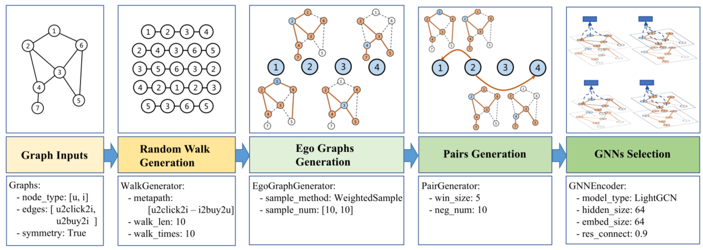

> 论文标题：Graph4Rec: A Universal Toolkit with Graph Neural Networks for Recommender Systems
>
> 发表于：
>
> 作者：Weibin Li, Mingkai He, Zhengjie Huang
>
> 代码：https://github.com/PaddlePaddle/PGL
>
> 论文地址：https://arxiv.org/pdf/2112.01035v2.pdf

## 摘要

- 由于数据集和评估指标的差异，许多近期使用 GNN 推荐系统的性能无法直接比较
  - 只提供了一个演示来对小数据集进行实验
- 文章引入了 Graph4Rec，一个通用工具包，它将 GNN 模型训练的范式统一为以下部分：
  - 图输入、随机游走生成、自我图生成、对生成和 GNN 选择。
- 开发了一个大规模的图引擎和一个参数服务器来支持分布式 GNN 训练
- 弄清楚稀疏和密集参数如何影响 GNN 的性能，
- 研究了包括负采样、自我图构建顺序和热启动策略在内的方法，以在推荐系统上找到更有效和高效的 GNN 实践

## 结论

- Graph4Rec，一个用于推荐系统的具有图神经网络的通用工具包，它统一将 GNN 模型训练变成五个组件的范式
- Graph4Rec：大规模、丰富和易于使用

## 未来工作

- 可以指导在工业推荐系统中的实践

## 介绍

- 用户和项目之间的交互构建了一个大规模的异构图。从图结构中学习到的节点表示，即用户和项目的低维向量可以应用于下游应用程序，从复杂的图结构中学习有意义的表示在推荐系统的开发中起着至关重要的作用。
- 由于数据集和评估指标的差异，许多最近与推荐系统的 GNN  相关的工作无法直接比较。
  - 他们中的许多人只提供了一个演示来对小数据集进行实验，这与现实世界中的网络规模推荐系统差别很大
- 图嵌入系统：
  - GraphVite 仅在具有多 GPU 的单台机器上执行基于步行的模型。
  - PyTorchBigGraph 支持分布式训练，但它无法处理异构 GNN  模型，缺乏为推荐系统建模复杂结构数据的能力
  - 这两个系统都不能处理图中节点的边信息来解决冷启动问题。

## 模型架构

 

- #### 图输入：Graph inputs

  - 基本的数据结构是异构图，其中节点和边具有多种类型。异构图可以分解为几个二部有向图，其中三元组 (u, r, v)  表示为源节点、关系和目标节点。如果我们只有单一类型的节点和边，异构图将退化为同构图，
  - Graph4Rec 设计了一个分布式图引擎来处理大规模的异构图数据。节点被均匀地划分为几台机器。并且每个节点的邻接表都存储在对应的服务器中。

- #### 随机游走生成：Random Walk Generation

  - 对于异构图挖掘，在 Graph4Rec 中采用元路径随机游走作为基本操作，
  - 受 metapath2vec 模型的启发，开发了一种多元路径随机游走策略，可以从异构图中采样多个元路径。
    - 生成不同类型的路径以从图中学习更多的结构信息。
  - 对于同构图，我们可以将元路径设置为“u2u - u2u”，相当于随机游走。

- #### 自我图生成：Ego Graphs Generation

  - 对于训练样本中的每个节点，需要进行邻域采样以降低 GNN 中后续多跳邻域聚合的计算成本。
  - 工作中使用自我图来表示中心节点的训练样本。
    - 自我图的定义是它的节点由一个中心节点和它的邻居组成
    - 对于节点 v，其类型为 r 的邻居定义为 $S_{v,r}$ = {u : d(u, r, v) ≤ K}，其中 d(u, r, v) 是 u 和 v  之间的最短路径距离类型 r。
    - 因此，类型 r 中节点 v 的自我图，表示为 $G_{v,r}$，是由 $S_{v,r}$ 诱导的子图
  - 由于存在多种边缘类型，因此我们开发了一种关系邻域采样方法，以允许关系聚合
  - 关系型自我图表示为 Gv，其中 Gv = {Gv,r : r ∈ R}。
    - 因此，从随机游走生成接收到的路径内的每个节点都成为中心节点。
    - 相同路径批次中的节点将通过关系邻域采样形成其不相交的自我图
  - 如果只想训练基于步行的模型，则可以跳过自我图的生成

- #### 対生成：Pairs Generation

  - win_size 用于用户控制元路径中邻近度的定义。然后我们生成自我图对作为下一个过程的正训练样本。

- #### GNN选择：GNNs Selection

  - 在获得成对的训练样本后，然后选择 GNN 进行自我图编码。
  - 对于所有异构设置，遵循 R-GCN  的想法，并为每个单独的关系类型提供具有不同权重的邻域聚合
  - Graph4Rec 包含了各种经典的 GNN，
    - GCN、GA T、LightGCN等
  - 提供了一个可学习的关系聚合设置，如 GA TNE (Cen et al. 2019)，它采用浅层网络为通过 φr = softmax(wT  tanh(Whv,r)) 计算的每个关系提供注意力分数。
  - 控制从底部特征 h0 到输出的残差连接来解决过度平滑。它也可以看作是使用 Personal PageRank进行特征传播
  - 为了解决冷启动问题，可以将类别、品牌或用户资料等辅助信息用作基本特征，并与 ID 嵌入相结合
    - 支持具有多个插槽的可配置稀疏特征。每个插槽可以有多个值来支持具有可变长度的功能
  - 

## 实验

- ### 研究问题

  - RQ1：我们提出的 Graph4Rec 在速度和性能上是否优于其他现有的图学习系统？
  - RQ2：当前图表示学习的最佳实践表现是什么？ 
  - RQ3：边信息的建模如何影响 GNN 模型的性能？ 
  - RQ4：批量负采样的影响是什么？ 
  - RQ5：自我图的采样顺序如何影响训练速度？
  - RQ6：基于walk 的模型和基于GNN 的模型之间的收敛关系是什么？

- ### 数据集

  - RetailRocket ：包括超过 4 个月的电子商务平台检查、添加到购物车和购买记录
  - Rec15 ：发布在 RecSys Challenge 2015 上的竞赛数据集
  - Tmall ：由IJCAI Competition 2015发布，包含了电子商务网站的四种常见行为，包括点击、购买、加入购物车和加入收藏。
  - UB：真实电子商务网站收集的用户行为数据集

- ### 数据预处理

  - 删除交互次数小于 10 的用户（RetailRocket 为 5）。
  - 对于 RetailRocket  数据集，我们删除了后来重复的（用户、项目、行为）三元组，并丢弃了交互次数少于 5 次的项目
  - 按照时间戳的顺序对每个用户的历史交互进行排序，并选择每个序列的前 80% 作为训练集，接下来的 10% 作为有效集，剩下的作为测试集

- ### baseline

  - 对比系统：
    - GraphVite ：仅在具有多 GPU 的单台机器上执行基于步行的模型。
    - PyTorchBigGraph(PBG) ：支持分布式训练，但它无法处理异构 GNN  模型，缺乏为推荐系统建模复杂结构数据的能力
  - 使用模型：
    - DeepWalk ，PBG使用DistMult 替代Deepwalk
    - metapath2vec
    - LightGCN
    - GraphSAGE
    - GAT
    - GIN
    - NGCF
    - GATNE

- ### 超参数设置

- ### 评估指标

  - 三种常见的召回策略，用recall指标评估，记为ICF@K、UCF@K、U2I@K
    - 基于用户的协同过滤（UCF）:为每个用户 u 召回最相似的前 N 个用户 u0，并通过聚合 u0 的交互项来推荐前 K 个频繁项
    - 基于项目的协同过滤（ICF）:为用户 u 的每个交互项目 i 召回最相似的前 N 个项目，并推荐在召回项目集中出现最频繁的前 K 个项目
    - 为每个用户召回项目的 U2I: 直接使用用户嵌入检索项目嵌入，推荐最相似的top-K 项目。