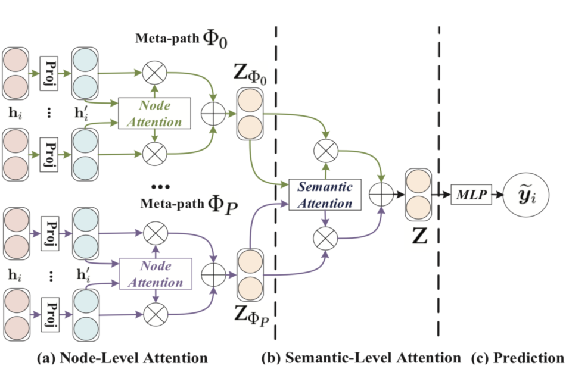

> 论文标题：Heterogeneous Graph Attention Network
>
> 发表于：2019 WWW
>
> 作者： Xiao Wang, Houye Ji, Chuan Shi
>
> 代码：Tensorflow：https://github.com/Jhy1993/HAN
> 			pytorch：https://github.com/dmlc/dgl/tree/master/examples/pytorch/han
>
> 论文地址：https://arxiv.org/pdf/1903.07293.pdf

## 摘要

- 对于包含不同类型节点和链接的异构图，图神经网络中并没有充分考虑到这一点
- 异构图的异构性和丰富的语义信息为设计异构图的图神经网络带来了巨大挑战
- 本文首先提出了一种基于层次注意的异构图神经网络，包括节点级和语义级注意。
  - 节点级注意力旨在学习节点与其基于元路径的邻居之间的重要性，
  - 而语义级注意力能够学习不同元路径的重要性。
  - 通过从节点级别和语义级别的注意力中学习到的重要性，可以充分考虑节点和元路径的重要性。
- 然后，所提出的模型可以通过以分层方式聚合来自基于元路径的邻居的特征来生成节点嵌入。

## 结论

- 提出了一种仅基于注意力机制的半监督异构图神经网络。
- 可以捕获异构图背后的复杂结构和丰富的语义。
- 利用节点级注意力和语义级注意力来分别学习节点和元路径的重要性。
- 模型以统一的方式利用结构信息和特征信息。

## 未来工作

## 介绍

- 注意力机制，它处理可变大小的数据并鼓励模型关注数据的最显着部分
- Graph Attention Network (GA T) [35] 是一种新颖的卷积式图神经网络，利用注意机制来处理仅包含一种类型的节点或链接的同构图
- 现实世界的图通常带有多种类型的节点和边，也被广泛称为异构信息网络（HIN）[28]
- 元路径 [32] 是一种连接两个对象的复合关系，是一种广泛使用的用于捕获语义的结构。
- 根据元路径，异构图中节点之间的关系可以具有不同的语义。由于异构图的复杂性，传统的图神经网络不能直接应用于异构图
- 需要解决以下问题：
  - 图的异质性。异构性是异构图的内在属性，即各种类型的节点和边。
    - 例如，不同类型的节点具有不同的特征，它们的特征可能落入不同的特征空间
    - 如何处理如此复杂的结构信息，同时保留多样的特征信息，是一个亟待解决的问题
  - 语义级别的关注。异构图中涉及不同的有意义和复杂的语义信息，这些信息通常由元路径[32]反映出来
    - 如何为特定任务选择最有意义的元路径并融合语义信息是一个悬而未决的问题[4,19,26]。
    - 语义级别的注意力旨在了解每个元路径的重要性并为它们分配适当的权重
    - 同等对待不同的元路径是不切实际的，并且会削弱一些有用的元路径提供的语义信息
  - 节点级别的关注。在异构图中，节点可以通过各种类型的关系连接
    - 如何设计一个能够发现邻居的细微差异并正确学习其权重的模型将是人们所期待的
- 本文提出提出了一种新颖的异构图注意网络，命名为  HAN，它同时考虑了节点级和语义级的注意。
- 给定节点特征作为输入，使用特定类型的变换矩阵将不同类型的节点特征投影到同一空间中。
- 然后节点级注意力能够学习节点与其基于元路径的邻居之间的注意力值，而语义级注意力旨在学习异构图中特定任务的不同元路径的注意力值。
- 基于学习到的两个级别的注意力值，我们的模型可以分层方式获得邻居和多个元路径的最佳组合，这使得学习到的节点嵌入能够更好地在异构图捕捉复杂结构和丰富的语义信息。之后，可以通过端到端的反向传播优化整个模型

## 模型架构

- HAN
  
  - (a) 所有类型的节点都被投射到一个统一的特征空间中，基于元路径的节点对的权重可以通过节点级注意力来学习。
  - (b) 联合学习每个元路径的权重，并通过语义层注意融合特定语义的节点嵌入。
  - (c) 计算拟议的HAN的损失和端到端优化

### 前置知识：

- 异构图：包含不同类型节点和链接的异构图
  
- Meta-path 元路径： 链接两个对象的复合关系，是一种广泛适用的捕获语义的结构 M-A-M,M-D-M
- Meta-path下的邻居节点 m1-a1-m2,m1-a3-m3，m1-a1-m1   因此m1的邻居节点如d图
- A 演员、M 电影、D 导演

### HAN算法原理

- ### 节点级别的Attention

  -  终结者通过詹姆斯卡梅隆与终结者2形成连接关系，终结者通过詹姆斯卡梅隆与泰坦尼克号形成连接关系，形成同构图
  -  根据它的邻居节点终结者2和泰坦尼克号，通过一种聚合方式，可以学习到终结者的特征表示

- ### 语义级别的Attention：旨在了解每个元路径的重要性，并为其分配适当的权重

  - 通过不同的Meta-path得到了终结者电影所对应的一个节点特征，然后将两个特征进行特征求和
  - 不同类型的邻居分配不同的权重，最终得到终结者所对应的一个节点的特征表
    

### 节点级别的Attention 具体算法

 

- $h'_i = M_{\phi_i}·h_i$
  - 当节点处在不同维度（节点特征数量不一致时）时，先将节点映射到同一个维度
-   
- $e^\phi_{ij} = att_{node}(h'_i,h'_j,\phi)$
  - $\phi$表示Meta-path，$att_{node}$将 i和j 输入后 得到他们之间的attention的值
  - 1节点的周围邻居为 $e^{\phi_0}_{11},e^{\phi_0}_{12},e^{\phi_0}_{13},e^{\phi_0}_{16}$
- $a^\phi_{ij}= softmax_j(e^\phi_{ij})$   ：对其做归一化操作，得到归一化之后的一个attention系数
- $Z^\phi_i$   ：将attention的系数与他的邻居做一个加权求和，再经过一个激活函数，得到节点所对应的特征表示
  - 如1节点的  ： $z^{\phi_0}_1 = (\alpha^{\phi_0}_{11}* x^{0}_1+\alpha^{\phi_0}_{12}* x^{0}_2+…)$
  - 求得所有节点不同类型的Meta-path下的embedding结果
    - $Z_{\phi_0}$ = {$z^{\phi_0}_1,z^{\phi_0}_2,z^{\phi_0}_3...$}
    - $Z_{\phi_1}$ = {$z^{\phi_1}_1,z^{\phi_1}_2,z^{\phi_1}_3...$}

## 语义级别的attention

- 根据之前的公式 求得两种Meta-path所对应的embedding
  - $Z_{\phi_0}$ = {$z^{\phi_0}_1,z^{\phi_0}_2,z^{\phi_0}_3...$}				$Z_{\phi_1}$ = {$z^{\phi_1}_1,z^{\phi_1}_2,z^{\phi_1}_3...$} 
-  
  - 经过一个全连接层W·$z^\phi_i$+b,然后经过一个激活函数tanh，再乘以一个可学习参数q，得到节点在该Meta-path下的一个标量
  - 然后对所有的节点做一个加权求和再除以节点数量
  - 就能得到在$\phi_i$这个Meta-path下的对应的系数$W\phi_i$
  - 示例
- 再将所有的Meta-path求得的$W\phi_i$进行一个softmax操作，进行归一化
  
- 最后将其进行加权求和，得到节点最终所要求的embedding
  

## HAN整体的算法流程

- **输入**：异构图，初始节点特征，事先规定的meta-path，多头注意力数量 K
- **输出**：每一个节点最终的embedding Z，节点级别的attention系数 α， 语义级别的attention系数 β
- 首先，遍历每个Meta-path
  - 遍历每一个注意力
    - 进行投影，将节点放到同一个维度
    - 然后遍历每一个节点
      - 找到节点所对应的Meta-path下的邻居节点
      - 遍历每一个邻居节点
        - 对每个找到的邻居节点根据GAT的方式，求得该节点与其每个邻居节点的attention系数$α^\phi_{ij}$
      - 根据邻居节点，对其进行加权求和，得到该Meta-path下所对应的embedding
    - 如果是多头注意力K≥2，将每个计算到的embedding进行一个拼接
  - 然后计算语义级别的attention $β_{\phi_i}$
  - 对所有Meta-path下的 $β_{\phi_i}$进行加权求和得到节点最终的特征表示Z
- 根据  Cross-Entropy 用节点的特征和其所属类别，求得一个损失函数
- 然后进行反向传播，学习HAN所对应的参数
- 然后得出 Z,α，β

## 实验

- ### 研究问题

- ### 数据集

  - DBLP。
    - 提取了  DBLP 的一个子集，其中包含 14328 篇论文 (P)、4057 位作者 (A)、20 个会议 (C)、8789 个术语  (T)。
    - 作者分为四个领域：数据库、数据挖掘、机器学习、信息检索。
    - 根据每位作者提交的会议标记他们的研究领域。
    - 作者特征是由关键词表示的词袋的元素。
    - 使用元路径集  {APA, APCPA, APTPA} 来进行实验。 
  - ACM。
    - 提取在 KDD、SIGMOD、SIGCOMM、MobiCOMM 和 VLDB  上发表的论文，并将论文分为三类（数据库、无线通信、数据挖掘）。
    - 构建了一个异构图，包括 3025 篇论文 (P)、5835 位作者 (A) 和 56  个主题 (S)。
    - 论文特征对应于由关键词表示的词袋的元素。我们使用元路径集 {PAP, PSP} 来进行实验。在这里，我们根据他们发表的会议标记论文。 
  - IMDB。
    - 提取了 IMDB 的一个子集，其中包含 4780 部电影（M）、5841 名演员（A）和 2269  名导演（D）。
    - 电影根据类型分为三类（动作、喜剧、戏剧）。
    - 电影特征对应于由情节表示的词袋的元素。我们使用元路径集 {MAM, MDM} 来进行实验。

- ### baseline

  - DeepWalk [23]：一种基于随机游走的网络嵌入方法，用于设计同构图。这里我们忽略节点的异构性，对整个异构图进行 
  - ESim [26]：一种异构图嵌入方法，可以从多个元路径中捕获语义信息。因为很难搜索一组元路径的权重，我们将从 HAN 学到的权重分配给 ESim。
  - metapath2vec [7]：一种异构图嵌入方法，它执行基于元路径的随机游走并利用skip-gram 嵌入异构图。
  - HERec [27]：一种异构图嵌入方法，它设计了一种类型约束策略来过滤节点序列并利用skip-gram 嵌入异构图。
  - GCN [18]：它是一个为同构图设计的半监督图卷积网络。在这里，我们测试了 GCN 的所有元路径并报告了最佳性能。 
  - GA T [35]：它是一个半监督神经网络，考虑了齐次图上的注意机制。在这里，我们测试了 GA T 的所有元路径并报告了最佳性能。 
  - HANnd：它是HAN 的一种变体，它消除了节点级别的注意力，并为每个邻居分配了相同的重要性。 
  - HANsem：它是HAN 的一种变体，它去除了语义级别的注意力，并对每个元路径赋予相同的重要性。
  - HAN：提出的半监督图神经网络同时采用节点级注意和语义级注意。

- ### 超参数设置

- ### 评估指标

  - f1 score