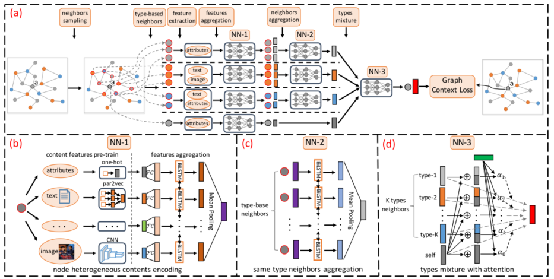

> 论文标题：Heterogeneous Graph Neural Network
>
> 发表于：2019 SIGKDD
>
> 作者：Chuxu Zhang，Dongjin Song，Ananthram Swami
>
> 代码：https://github.com/chuxuzhang/KDD2019_HetGNN
>
> 论文地址：https://arxiv.org/pdf/2002.12307v1.pdf

## 摘要

- 异构图中的表示学习旨在为每个节点寻求有意义的向量表示，以促进链接预测、个性化推荐、节点分类等下游应用
- 异构图任务具有挑战性，不仅需要合并异构结构（图）信息由多种类型的节点和边组成，也需要考虑与每个节点相关的异构属性或内容（例如，文本或图像）。
- 尽管在同构（或异构）图嵌入、属性图嵌入以及图神经网络方面已经做出了大量努力，但很少有人能够有效地同时考虑异构结构（图）信息以及每个节点的异构内容信息
- 提出了异构图神经网络模型 HetGNN 来解决这个问题
  - 首先引入了一种基于重启策略的随机游走，为每个节点采样固定大小的强相关异构邻居，并根据节点类型对它们进行分组。
  - 接下来，设计了一个具有两个模块的神经网络架构来聚合上一步采样的相邻节点的特征信息。
    - 第一个模块采用RNN对异构内容的“深度”特征交互进行编码，并为每个节点生成内容嵌入。
    - 第二个模块采用另一个RNN聚合不同相邻组（类型）的内容（属性）嵌入，并通过注意力机制考虑不同组的影响进一步组合它们以获得最终的节点嵌入。
  - 最后，我们利用图上下文损失和小批量梯度下降程序以端到端的方式训练模型。

## 结论

- 介绍了异构图表示学习的问题，并提出了一种异构图神经网络模型，即 HetGNN 来解决这个问题
- HetGNN 联合考虑了节点异构内容编码、基于类型的邻居聚合和异构类型组合。在训练阶段，使用图上下文损失和小批量梯度下降程序来学习模型参数

## 未来工作

## 介绍

- 异构图中的许多节点可能无法连接到所有类型的邻居，
  - 现状：现有的大多数 GNN 仅聚合直接（一阶）相邻节点的特征信息，特征传播过程可能会削弱更远邻居的影响
  - 挑战1：如何对 HetG 中每个节点的嵌入生成高度相关的异构邻居进行采样
- HetG 中的一个节点可以携带非结构化的异构内容，例如属性、文本或图像。此外，与不同类型节点相关联的内容可以不同
  - 现状：当前 GNN 的直接连接操作或线性变换无法模拟节点异构内容之间的“深度”交互。由于其内容各不相同，因此不适用于所有节点类型使用相同的特征变换函数
  - 挑战2：如何设计节点内容编码器来解决 HetG 中不同节点的内容异构性
- 不同类型的邻居对 HetG 中的节点嵌入的贡献不同
  - 现状：前大多数 GNN 主要关注同构图，没有考虑节点类型的影响
  - 挑战3：如何通过考虑不同节点类型的影响来聚合异构邻居的特征信息

## 模型架构

- a)  HetGNN 的整体架构：它首先为每个节点（在本例中为节点 a）采样固定大小的异构邻居，然后通过 NN-1 对每个节点的内容嵌入进行编码，然后通过 NN-2  聚合采样的异构邻居的内容嵌入和 NN-3，最终通过图上下文损失优化模型；
-  (b) NN-1：节点异构内容编码器； 
- (c) NN-2：基于类型的邻居聚合器； 
-  (d) NN-3：异构类型组合。

## 实验

- ### 数据集

  - academic graph
    - AMiner [30] 数据中提取了两个数据集，即 A-I 包含 1996 年至 2005 年之间的论文，A-II 包含 2006 年至 2015  年之间的论文）。
  - review graph
    - Amazon [8] 数据 2中提取两个数据集，即 R-I（Movies类别）和 R-II（CDs 类别）。

- ### baseline

  - 异构图嵌入模型 metapath2vec [4]（表示为 MP2V）、
  - 属性图模型 ASNE [15] 和 SHNE [34]，
  - 图神经网络模型  GraphSAGE [7]（表示为 GSAGE）和 GAT [31]

- ### 超参数设置

- ### 评估指标

  - AUC
  - F1