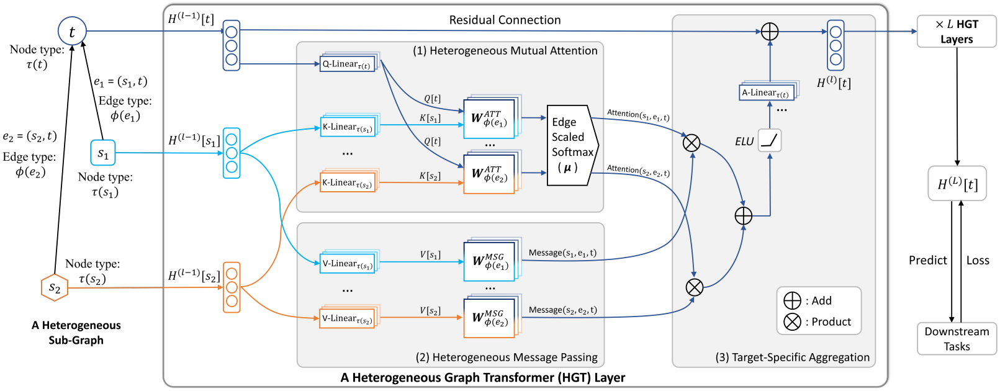
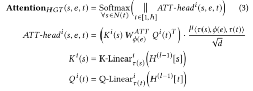
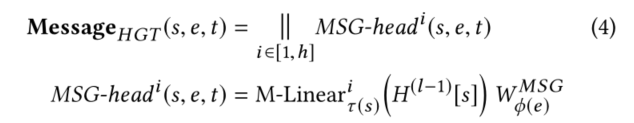
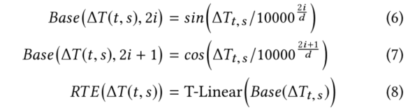

> 论文标题：Heterogeneous Graph Transformer
>
> 发表于：2020 WWW
>
> 作者：Ziniu Hu，Yuxiao Dong，Kuansan Wang， Yizhou Sun
>
> 代码：https://github.com/acbull/pyHGT
>
> 论文地址： https://doi.org/10.1145/3366423.3380027

## 摘要

- 大多数 GNN 都是为同构图设计的，其中所有节点和边都属于同一类型，这使得它们无法表示异构结构
- 在本文中，提出了用于对 Web 规模的异构图进行建模的异构图转换器 (HGT) 架构。
  - 为了对异质性进行建模，设计了节点和边类型相关参数来表征每条边上的异构注意力，使 HGT 能够为不同类型的节点和边维护专用表示。
  - 为了处理动态异构图，将相对时间编码技术引入 HGT，它能够捕获具有任意持续时间的动态结构依赖性。
  - 为了处理网络规模的图数据，设计了异构小批量图采样算法——HGSampling——用于高效和可扩展的训练。

## 结论

- 在本文中，提出了用于对 Web 规模的异构和动态图进行建模的异构图转换器 (HGT) 架构。
- 为了建模异质性，我们使用元关系⟨τ (s), φ(e),τ (t)⟩来分解交互和变换矩阵，使模型能够以更少的资源具有相似的建模能力。
- 为了捕获图形动态，我们提出了相对时间编码 (RTE) 技术，以使用有限的计算资源整合时间信息。
- 为了对 Web 规模的数据进行高效且可扩展的 HGT 训练，我们设计了异构 Mini-Batch 图采样算法——HGSampling。

## 未来工作

- 探索 HGT 是否能够生成异构图，例如预测新论文及其标题，以及我们是否可以预训练 HGT 以使标签稀缺的任务受益。

## 介绍

- 异构图通常用于抽象和建模复杂系统，其中不同类型的对象以各种方式相互交互。
  - 此类系统的一些流行实例包括学术图、Facebook 实体图、LinkedIn 经济图，以及广泛的物联网网络。
- 经典范例之一是定义和使用元路径来建模异构结构，例如 PathSim [18] 和 metapath2vec [3]。最近，鉴于图神经网络 (GNN) 的成功 [7, 9, 22]，有几种尝试采用 GNN 来学习异构网络 [14, 23, 26, 27]，然而，这些工作面临几个问题：
  - 首先，它们大多涉及为每种类型的异构图设计元路径，需要特定的领域知识；
  - 其次，他们要么简单地假设不同类型的节点/边共享相同的特征和表示空间，要么单独为节点类型或边类型保留不同的非共享权重，这使得它们不足以捕捉异构图的属性；
  - 第三，他们中的大多数忽略了每个（异构）图的动态性质；
  - 最后，它们的内在设计和实现使它们无法对 Web 规模的异构图进行建模。
- 鉴于这些限制和挑战，本文建议研究异构图神经网络，目标是维护节点和边类型相关的表示、捕获网络动态、避免自定义元路径以及可扩展到 Web 规模的图
- 为了处理图的异质性，我们引入了节点和边类型相关的注意机制。
  -  HGT中的异构相互注意力不是对每种类型的边进行参数化，而是通过根据其元关系三元组⟨ s的节点类型，s和t之间的边类型e，t的节点类型⟩分解每条边e = (s, t)来定义的。每种类型的节点都可以有自己的特征分布
  - 使用这些元关系来参数化权重矩阵，以计算每个边上的注意力。允许不同类型的节点和边保持其特定的表示空间。
  - 同时，不同类型的连接节点仍然可以交互、传递和聚合消息，而不受分布差距的限制。
  - 由于其架构的性质，HGT 可以通过跨层的消息传递来合并来自不同类型的高阶邻居的信息，这可以被视为“软”元路径。
    - 即使 HGT 仅将其单跳边作为输入而不手动设计元路径，所提出的注意力机制也可以自动和隐式地学习和提取对不同下游任务很重要的“元路径”。
- 为了处理图动态，我们通过提出相对时间编码 (RTE) 策略来增强 HGT。
  - 将在不同时间发生的所有边作为一个整体来维护，而不是将输入图分割成不同的时间戳，
  - 并设计 RTE 策略来建模具有任何持续时间长度的结构时间依赖关系，甚至是未见和未来的时间戳。
  - 通过端到端训练，RTE 使 HGT 能够自动学习异构图的时间依赖性和演化。
- 为了处理网络规模的图数据，我们设计了第一个异构子图采样算法——HGSampling——用于小批量 GNN 训练。
  - 它的主要思想是对不同类型节点具有相似比例的异构子图进行采样，
    - 因为直接使用现有（同质）GNN 采样方法，例如 GraphSage [7]、FastGCN [1] 和 LADIES [29]，导致关于节点和边缘类型的高度不平衡。
  - 此外，它还旨在保持采样的子图密集，以最大程度地减少信息丢失。使用 HGSampling，所有 GNN 模型，包括我们提出的 HGT，都可以在任意大小的异构图上进行训练和推断。
- 在挖掘异构图方面已经有了重要的研究方向，例如节点分类、聚类、排序和表示学习 [3, 17-19]，而 HG 的动态视角尚未得到广泛的探索和研究。
- 现有异构图GNN并没有充分利用异构图的属性。它们都单独使用节点类型或边缘类型来确定 GNN 权重矩阵。
  - 但是，不同类型的节点或边数可能会有很大差异。对于没有足够出现次数的关系，很难学习准确的关系特定权重。
  - 为了解决这个问题，我们建议考虑参数共享以获得更好的泛化。给定一条边 e = (s, t)，其元关系为 ⟨τ (s), φ(e),τ (t)⟩，如果我们使用三个交互矩阵对三个对应元素 τ (s), φ 进行建模（e）和元关系中的τ（t），那么大部分权重可以共享。
    - 例如，在“第一作者”和“第二作者”关系中，它们的源节点类型和目标节点类型分别都是作者到论文。换句话说，从一种关系中学到的关于作者和论文的知识可以迅速转移并适应另一种关系

## 知识概述

- 异构图
  - 异构有向图G={V,E,A,R},V表示实体(节点)，E表示关系(链接)
  - 存在映射函数 $\tau:V \rightarrow A ;\phi : E \rightarrow R$
  - 异构信息网络指实体类型数量的信息网络|A| > 1 或关系类型的数量 |R| > 1.
  - 具有实体类型数的信息网络|A| = 1 和关系类型的数量 |R| = 1 称为同质信息网络或 齐次图。
- 元关系
  - 对于从源节点 s 链接到目标节点 t 的边 e = (s, t)，其元关系表示为 ⟨τ (s), $\phi$(e),τ (t)⟩。
  - 经典的元路径范式 [17-19] 被定义为这种元关系的序列。
  - 为了更好地模拟现实世界的异构网络，我们假设不同类型的节点之间可能存在多种类型的关系
- 动态异构图
  - 当节点 s 在 T 处连接到节点 t 时，我们为边 e = (s, t) 分配时间戳 T。如果 s 第一次出现，T 也被分配给 s。如果随着时间的推移建立连接，s 可以与多个时间戳相关联。
    - 我们假设一条边的时间戳是不变的，表示它被创建的时间。例如，当一篇论文在时间 T 发表在会议上时，T 将被分配到论文和会议节点之间的边缘。相反，可以为节点分配不同的时间戳。例如，会议节点“WWW”可以分配任何年份。 WWW@1994 意味着我们正在考虑第一版 WWW，它更多地关注互联网协议和 Web 基础设施，而 WWW@2020 意味着即将到来的 WWW，其研究主题扩展到社会分析、普适计算、搜索和 IR、隐私和社会等等。
    - 合并时间信息的传统方法是为每个时隙构建一个单独的图。然而，这样的过程可能会在不同的时隙中丢失大部分的结构依赖性。同时，节点在时间 t 的表示可能依赖于在其他时隙发生的边。因此，对动态图进行建模的正确方法是维护在不同时间发生的所有边，并允许具有不同时间戳的节点和边相互交互。
    - 

## 模型架构

- ### HGT

  

  - 给定一个以   t 为目标节点，s1 & s2 为源节点  的采样异构子图，
  - HGT 模型取其边 e1 = (s1, t) & e2 = (s2, t) 并且它们对应的元关系 < τ ( s1), φ(e1),τ (t) > & < τ (s2), φ(e2),τ (t) > 作为输入来学习每个节点的上下文表示 H (L)，可用于下游任务。颜色解码节点类型。
  - HGT 的目标是聚合来自源节点的信息，以获得目标节点 t 的上下文表示。 
  - HGT 包括三个组件：（1）元关系感知异构相互注意力，（2）来自源节点的异构消息传递，（3）目标特定的异构消息聚合。
    - 元关系感知异构互注意力
      
      - 我们将目标节点 t 映射为 Query 向量，将源节点 s 映射为 Key 向量，并计算它们的点积作为注意力。
      - 关键区别在于，Transformer 对所有单词使用一组投影，而在该研究中，每个元关系都应该有一组不同的投影权重。
        - 为每个边缘类型 φ(e) 保留一个不同的基于边的矩阵$W^{AT T}_{φ(e)} ∈ R^{\frac d h × \frac d h}$
        - 该模型甚至可以在相同的节点类型对之间捕获不同的语义关系。
      - 由于并非所有关系对目标节点的贡献都相同，因此我们添加了一个先验张量 µ 表示每个元关系三元组的一般意义，作为注意力的自适应缩放
    - 异构信息传递
      - 将边的元关系合并到消息传递过程中，以缓解不同类型节点和边的分布差异。
      - 对于一对节点 e = (s, t)，我们通过以下方式计算其多头消息
        
        - 首先将 τ (s) 型源节点 s 投影到第 i 个消息向量中，线性投影 $M-Linear^i_τ (s) : R^d → R^{\frac d h}$。
        - 然后是一个矩阵 $W^{MSG}_{φ(e)} ∈ R^{\frac d h × \frac d h}$ 用于合并边依赖性。
        - 最后一步是连接所有 h 个消息头以获得每个节点对的 $Message_{HGT}(s, e, t)$
    - 特定目标聚合
      - 随着异构多头注意力和消息的计算，我们需要将它们从源节点聚合到目标节点
      - 每个目标节点 t 的注意力向量之和为 1，因此可以简单地将注意力向量作为权重，对来自源节点的相应消息进行平均，
      - 得到更新后的向量$\widetilde H^{(l)}[t]$为：
        - $\widetilde H^{(l)}[t]= ⊕_{∀s ∈N (t) }  Attention_{HGT} (s, e, t) · Message_{HGT} (s, e, t) $
        - 这将来自不同特征分布的所有邻居（源节点）的信息聚合到目标节点 t
      - 最后一步是将目标节点 t 的向量映射回其类型特定的分布，由其节点类型 τ (t) 索引
      - 为此，我们将线性投影 A-Linear τ (t) 应用于更新的向量 $\widetilde H^{(l)}[t]$，然后应用残差连接 [8]
    - 在整个模型架构中，我们高度依赖使用元关系——⟨τ (s), φ(e),τ (t)⟩ 来分别参数化权重矩阵。这可以解释为模型容量和效率之间的权衡。与普通 Transformer 相比，我们的模型区分了不同关系的算子，因此更能处理异构图中的分布差异。
      - 与现有模型为每个元关系保持一个不同的矩阵作为一个整体相比，HGT 的三元组参数化可以更好地利用异构图模式来实现参数共享。
      - 一方面，很少出现的关系可以从这种参数共享中受益，以实现快速适应和泛化。另一方面，不同关系的算子仍然可以通过使用更小的参数集来保持它们的特定特征。

- ### 相对时间编码

  - 存在问题：
    - 合并时间信息的传统方法是为每个时隙构建一个单独的图。这样的过程可能会在不同的时隙中丢失大部分的结构依赖性。
    - 同时，节点在时间 t 的表示可能依赖于在其他时隙发生的边。
    - 因此，对动态图进行建模的正确方法是维护在不同时间发生的所有边，并允许具有不同时间戳的节点和边相互交互。

  - 提出了相对时间编码 (RTE) 机制来对异构图中的动态依赖关系进行建模。 RTE 的灵感来自 Transformer 的位置编码方法
    - 给定源节点 s 和目标节点 t，以及它们对应的时间戳 T (s) 和 T (t)，表示相对时间间隙 ΔT (t, s) = T (t) - T (s ) 作为索引来获得相对时间编码 RT E(ΔT (t, s))。
    - 注意到训练数据集不会覆盖所有可能的时间间隙，因此 RT E 应该能够泛化到看不见的时间和时间间隙。因此，我们采用一组固定的正弦函数作为基础，具有可调线性投影 T-Linear∗:作为 RT E：
      

  - 相对于目标节点 t 的时间编码被添加到源节点 s 的表示中，如下所示：
    - $\hat H ^{(l−1)}[s] = H^{(l−1)}[s] + RTE(ΔT (t, s))$
    - 时间增强表示$\hat H ^{(l−1)}$将捕获源节点 s 和目标节点 t 的相对时间信息

- ### 异构图抽样

  - 用于异构图很容易得到关于不同节点类型的极端不平衡的子图，因为每种类型的度分布和节点总数可能会有很大差异
  - 为每种类型保持相似数量的节点和边，以及保持采样的子图密集，以最大限度地减少信息损失并减少样本方差。
  - 算法1 异构小批量图采样 流程：
    - 要求：每个⟨τ(s)、φ(e)、τ(t)⟩关系对的邻接矩阵A；输出节点Set OS；每个节点类型的样本数 n；样本深度 L。
    - 保证：采样节点集 NS；采样的邻接矩阵 $\hat A$
      - NS ← OS     将采样节点集初始化为输出节点集
      - 为每个具有归一化度的节点类型初始化一个空的预算 B 存储节点
      - 对每个t属于NS
        - 在Budget 中加入 (B,t,A,NS),	添加邻居t到B
      - 对于l ←1到L
        - 源节点类型τ∈B
          - 源节点s∈B[τ]
            - $\large prob^{(l-1)}[τ][s] ← \frac{B[τ][s]^2}{||B[τ]||^2_2}$，计算节点类型 τ 的每个源节点 s 的采样概率
          - 从B[τ]用采样概率$\large prob^{(l-1)}[τ]$采样n个节点{$t_i$}$^n_{i=1}$
          - 对于t ∈ {$t_i$}$^n_{i=1}$
            - OS[τ].add(t)  // 将节点t添加到输出节点集中
            - Add-In-Budget(B, t, A, N S) // 将 t 的邻居添加到 B。
            - B[τ].pop(t) // 从预算中删除采样节点 t
    - 从 A 重建采样节点 OS 之间的采样邻接矩阵 $\hat A$
    - 返回 OS 和  $\hat A$
  - 算法2（添加预算B）：
    - 要求：预算 B 存储每个类型的归一化度节点；添加节点 t；每个 ⟨τ (s), ϕ(e),τ (t)⟩ 关系对的邻接矩阵 A；采样节点集 NS
    - 确保：更新预算 B
      - 对于每个可能的源节点类型 τ 和边类型 φ
        - $\hat D_t$ ← 1 / len(A⟨τ,φ,τ (t)⟩[t] ) // 得到添加节点 t 关于 ⟨τ, ϕ,τ (t)⟩ 的归一化度
        - 源节点s在A⟨τ,φ,τ (t)⟩[t] 
          - 如果节点s没有被采样(s ∈ NS)采样
            - 如果s 没有时间戳
              - s.time = t.time // 归纳继承时间戳
            - B [τ] [s]← B[τ ] [s] + $\hat D_t$ // 将候选节点 s 添加到预算 B 中，目标节点 t 的归一化度
    - 更新预算 B
  
- ### 归纳时间戳分配

  - 我们假设每个节点 t 都分配有时间戳 T (t)，异构图中也存在事件节点，它们具有与之关联的显式时间戳
  - 根据它们所链接的事件节点来分配普通节点的时间戳，计划节点从事件节点继承时间戳。我们检查候选源节点是否是事件节点。如果是，就像在特定年份发表的论文一样，我们保留其时间戳以捕获时间依赖性。如果不是，就像可以与任何时间戳关联的会议一样，我们将关联节点的时间戳（例如其论文的发表年份）归纳分配给这个普通节点。通过这种方式，我们可以在子图采样过程中自适应地分配时间戳

## 实验

- ### 研究问题

- ### 数据集

- ### baseline

- ### 超参数设置

- ### 评估指标