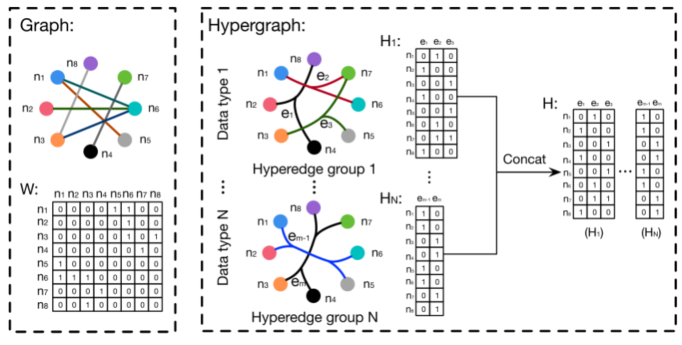
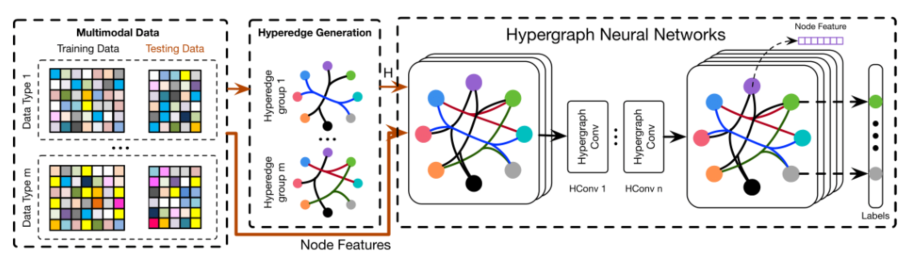
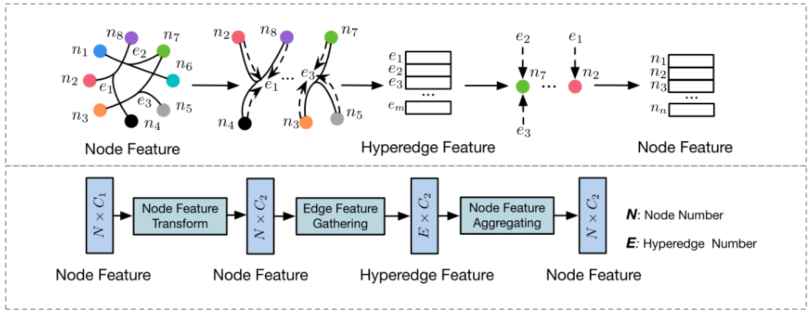

> 论文标题：Hypergraph Neural Networks
>
> 发表于：2019 AAAI
>
> 作者：Yifan Feng, Haoxuan You, Zizhao Zhang, Rongrong Ji, Yue Gao
>
> 代码：https://github.com/iMoonLab/HGNN
>
> 论文地址：https://arxiv.org/pdf/1809.09401v3.pdf

## 摘要

- 提出了一种用于数据表示学习的超图神经网络（HGNN）框架，它可以在超图结构中编码高阶数据相关性。
- 设计了超边卷积操作来处理表示学习期间的数据相关性。通过这种方式，可以有效地使用超边卷积操作进行传统的超图学习过程
- HGNN 能够学习考虑高阶数据结构的隐藏层表示
- HGNN 在处理多模态数据时更胜一筹

## 结论

- HGNN 将卷积操作推广到超图学习过程。谱域上的卷积使用超图拉普拉斯算子进行，并通过截断切比雪夫多项式进一步逼近

## 未来工作

## 介绍

- 在传统的图卷积神经网络方法中，采用了数据之间的成对连接。

  - 实际实践中的数据结构可能超出成对连接，甚至更复杂。面对多模态数据的场景，数据关联建模的情况可能会更加复杂。
  - 一方面，数据相关性可能比成对关系更复杂，难以用图结构建模。另一方面，数据表示往往是多模态的，
    - 例如本例中的视觉连接、文本连接和社交连接。
    - 在这种情况下，传统的图结构在表述数据相关性方面存在局限性，从而限制了图卷积神经网络的应用

- 超图可以使用其无度数超边对高阶数据相关性（超越成对连接）进行编码

  传统的超图学习方法 存在计算复杂度和存储成本高的问题，这限制了超图学习方法的广泛应用

## 模型架构

HGNN框架： 

-  超边卷积：

  

## 实验

- ### 数据集

  - 引文网络分类
    - Cora
    - Pumbed
  - 视觉对象识别
    - thePrinceton ModelNet40 dataset
    - the National Taiwan University(NTU) 3D model dataset 

- ### baseline

  - 引文网络分类
    - DeepWalk
    - ICA
    - Planetoid
    - Chebyshev
    - GCN
  - 视觉对象识别 
    -  基于多视图卷积神经网络 (MVCNN)和 Group-View Convolutional Neural Network  (GVCNN) 
      - 与 GCN进行比对
    - PointNet (Qi et al. 2017a) 
    - PointNet++ (Qi et al. 2017b) 
    - PointCNN (Li et al. 2018) 
    - SO-Net

- ### 超参数设置

- ### 评估指标

  - Classification Accuracy