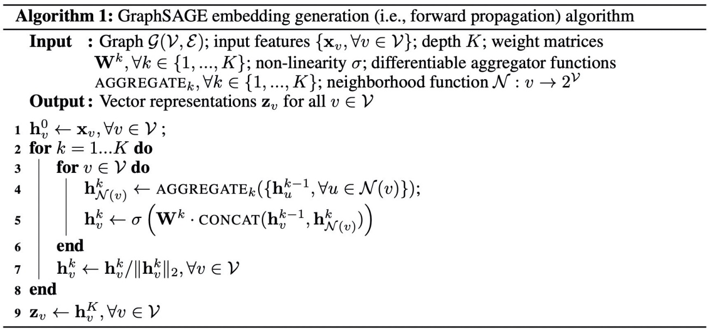

> 论文标题：Inductive Representation Learning on Large Graphs
>
> 发表于：2017 NIPS
>
> 作者：William L.Hamilton， Rex Ying，Jure Leskovec
>
> 论文代码：https://github.com/pyg-team/pytorch_geometric/blob/master/torch_geometric/nn/models/basic_gnn.py
>
> 论文地址：https://arxiv.org/pdf/1706.02216v4.pdf

## 摘要

- GraphSAGE，这是一个通用的归纳框架，它利用节点特征信息（例如，文本属性）有效地为以前看不见的数据生成节点嵌入。
- 我们不是为每个节点训练单独的嵌入，而是学习一个函数，该函数通过从节点的本地邻域采样和聚合特征来生成嵌入
- 之前的graph embedding方法都是所有节点都在图中，对于没有看到过的节点是不能处理的，这种叫做直推式方法。
- 而GraphSAGE属于归纳式的方法，可以对于没见过的节点也生成embedding。
- GraphSAGE不仅限于构建embedding，也通过聚合周围邻居节点的特征。
- 归纳式：节点的局部信息和图的全局信息
- 与基于矩阵分解的嵌入方法不同，我们利用节点特征（例如，文本属性、节点配置信息、节点度数）来学习泛化到未见节点的嵌入函数

## 结论

- GraphSAGE，可以有效地为看不见的节点生成嵌入，通过采样节点邻域有效地权衡性能和运行时间

## 未来方向

- 扩展 GraphSAGE 以合并有向图或多模态图
- 探索非均匀邻域采样函数，甚至可能学习这些函数作为 GraphSAGE 优化的一部分

## 算法流程

- 输入的是一张图G，节点的特征，做k层的GraphSAGE,矩阵权重
- 遍历k层的graphSAGE
  - 遍历所有的节点
    - 计算v节点周围的邻居节点的信息，然后将该节点上一层的所有的邻居节点的信息聚合在一起，形成v节点在第k层的邻居向量
    - 将v节点在上一层的特征向量与聚合了邻居之后的特征向量拼接在一起，再经过W参数，学习到v节点在该层的特征表示
  - 得到该层的特征表示
- 节点经过多层的graph之后，得到v节点的特征表示

## 实验

- ### 数据集：Web of Science，Reddit ，PPI

- ### baseline：

  - 随机分类器、
  - 基于逻辑回归特征的分类器（忽略图结构）、
  - DeepWalk 算法 [28]
  - 原始特征和DeepWalk 嵌入的链接

- ### 超参数设置

  - 对于消融实验使用校正线性单位作为非线性，并设置 K = 2，邻域样本大小 S1 = 25 和 S2 = 10

- ### 评估指标

  - unsup.F1
  - Sup.F1

