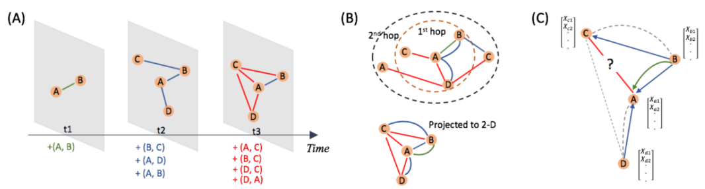
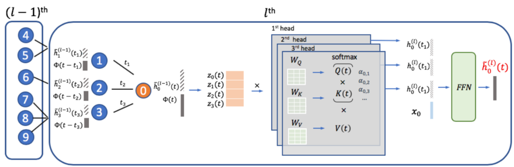

> 论文标题：Inductive Representation Learning on Temporal Graphs
>
> 发表于：ICLR 2020
>
> 作者：Da Xu, Chuanwei Ruan, Evren Körpeoglu, Sushant Kumar, Kannan Achan
>
> 代码：https://github.com/StatsDLMathsRecomSys/Inductive-representation-learning-on-temporal-graphs
>
> 论文地址：https://arxiv.org/pdf/2002.07962.pdf

## 摘要

- 时间动态图的演变性质需要处理新节点以及捕获时间模式
- 节点嵌入，是时间的函数，应该代表静态节点特征和不断发展的拓扑结构
- 节点和拓扑特征也可以是时间的，节点嵌入也应该捕获其模式
- 提出了时间图注意力（TGA T）层来有效地聚合时间拓扑邻域特征以及学习时间特征交互。
  - 对于 TGAT，我们使用自注意力机制作为构建块并基于谐波 alaysis 中的经典 Bochner 定理开发了一种新颖的时间编码技术。
  - 通过堆叠 TGAT 层，网络将节点嵌入识别为时间的函数，并能够随着图的发展归纳推断新节点和观察到的节点的嵌入。所提出的方法同时处理节点分类和链接预测任务，并且可以自然地扩展到包括时间边缘特征。

## 结论

- 引入了一种新颖的时间感知图注意力网络，用于在时间图上进行归纳表示学习
- 提出基于理论的功能时间编码来调整自我注意机制来处理连续时间。
  - 理论和实验分析证明了我们的方法在时间图上的节点和拓扑特征方面捕获时间特征信号的有效性

## 未来工作

- 自注意力机制通常会提供有用的模型解释
- 开发工具以有效地可视化不断发展的图动态和时间表示

## 介绍

- 大多数图表示学习方法只接受静态或非时间图作为输入，尽管许多图结构数据是时间相关的
- 图被创建为节点之间的时间交互。使用最终状态作为图的静态画像在某些情况下是合理的，
  - 只要节点相互作用本质上是永恒的，例如蛋白质蛋白质相互作用网络
  - 否则忽略时间信息会严重削弱建模工作，甚至导致有问题的推理
- 如果忽略时间约束，模型可能会错误地利用未来信息来预测训练和测试期间的过去交互。
- 许多与图相关的问题的动态和不断发展的性质要求在随时间添加、删除或更改节点和边时对及时性进行显式建模
- 三个挑战：
  - 为了对时间动态进行建模，节点嵌入不应该只是拓扑结构和节点特征的投影，还应该是连续时间的函数。
    - 除了通常的向量空间之外，时间表示学习也应该在一些功能空间中进行操作
  - 图拓扑结构不再是静态的，因为节点和边随着时间的推移而演变，这对邻域聚合方法提出了时间约束
  - 节点特征和拓扑结构可以表现出时间模式。
    - 例如，很久以前发生的节点交互可能对当前拓扑结构的影响较小，因此对节点嵌入的影响较小
    - 此外，一些节点可能具有允许它们与其他节点进行更规律或经常性交互的特征。
- 时间图上的表示学习模型应该能够在需要时以归纳方式快速生成嵌入
- 很多经典GNN不考虑时间因素生成embedding
- 大多数时间图嵌入方法只能处理迁移任务，
  - 因为它们需要重新训练或计算量大的梯度计算来推断未见节点的嵌入或新时间点的节点嵌入
- 开发一种架构来归纳学习时间图的表示，以便可以通过单个网络前向传递获得时间感知嵌入（对于看不见和观察到的节点）。
  - 将自注意力机制和源自经典谐波分析的 Bochner 定理的新颖功能时间编码技术相结合。
  - 将 self-attention 应用于时间图上的归纳表示学习的动机是识别和捕获时间邻域信息的相关片段
    - 作为一种离散事件序列学习方法，self-attention 将输入序列的向量表示输出为单个条目嵌入的加权和。 
    - Selfattention 具有多项优势，例如并行计算和可解释性
    - 由于它仅通过位置编码捕获顺序信息，因此无法处理时间特征。因此，用一些时间的向量表示来代替位置编码。
  - 由于时间是一个连续变量，从时域到向量空间的映射必须是函数式的。
  - 我们从谐波分析中获得见解，并提出了一种与自注意力机制兼容的基于理论的功能时间编码方法。
  - 然后通过功能时间编码和节点特征以及图拓扑结构之间的相互作用对时间信号进行建模
- 将观察到的节点上的未来链接预测视为转导学习任务，并将未见节点上的链接预测视为归纳学习任务
- 对比先前的方法：
  - 没有将时间图裁剪成一系列快照或构建时间约束随机游走，而是直接学习时间的函数表示。与自注意机制兼容
  - 具有 k 个头和 l 层的 TGA T 层的每批时间复杂度可以表示为$O((k\widetilde N)^l)$其中 N 是平均邻域大小，
  - 通过每个节点的显式函数表达式$\widetilde h(t)$，可以通过单个网络前向传递轻松地推断出任何时间戳的时间感知节点嵌入。
    - 无论何时更新图，都可以以类似于 GraphSAGE 的归纳方式快速推断出未见过和观察到的节点的嵌入，并且可以跨所有节点并行计算。
  - 带有均值池的 GraphSAGE可以解释为所提出方法的一个特例，其中时间邻域以相同的注意力系数聚合。
    - GAT 类似于本文方法的无时间信息的版本，但具有不同的自注意公式
    - 通过将时间邻域视为记忆，也可以直接显示我们与记忆网络的联系
- 时间编码有可能将非时间图表示学习方法扩展到时间设置
- 将时间注意力权重分配给相邻节点的有好处，
- 功能时间编码方法在捕获时间信号方面 优于相对位置编码
- 关注重复邻居的拓扑结构，通过找出模型对具有不同重复次数的相邻节点的注意力权重
- 输入不同的目标时间 t，然后在不同出现次数的相邻节点上记录它们的值
- 较小的 Δt 意味着更近期的交互，当预测更多的未来交互时，TGA T 将考虑具有更多出现次数的相邻节点更重要

## 模型架构

- ### 时间图中的几种并发症的可视化插图

  

  - A：时序图及其快照的生成过程。很明显，快照中的静态图只反映了部分时间信息。
  - B：投影到与时间无关的二维平面时时态图的最终状态。除了缺少时间信息外，还出现了多边缘情况
  - C：在时间 t3 预测节点 A 和 C 之间的链接时，消息传递路径应该受到时间约束。实线给出了适当的方向，虚线违反了时间约束

- ### TGAT

  - 推导出从时间域到连续可微函数域的映射作为函数时间编码,这样得到的公式与自注意机制以及基于反向传播的优化框架兼容

    - 相似idea论文：Self-attention with functional time representation learning

  - #### 时间编码函数

    - 获得一个连续的函数映射：$\phi:T\rightarrow \mathbb R^{d_T}$
      - 将时域迁移到 dT 维向量空间以替换self-attention中的位置编码
      - 为了不失一般性，我们假设时域可以用从原点开始的区间来表示
        - T = [0, tmax]，其中 tmax 由观测数据确定
        - 考虑两个时间点 t1、t2 和它们的函数编码之间的内积<Φ(t1)，Φ(t2)>
        - 通常，相对时间跨度，而不是时间的绝对值，揭示了关键的时间信息
        - 对与 |t2−t1| 的时间跨度相关的学习模式更感兴趣，理想情况下应该用 <Φ(t1), Φ(t2)>与自注意力兼容
      - 形式上$K:T×T → \mathbb R$使用  K(t1,t2) := <Φ(t1), Φ(t2)>  和  K(t1,t2):= ψ(t1-t2)，$ψ : [−tmax, tmax] → \mathbb R$
      - 时间核平移不变，即K(t1+c,t2+c) = ψ(t1-t2) = K(t1,t2) 
      - 将问题转化为学习由 Φ 表示的时间核 K
      - 需要为 Φ 找出一个明确的参数化，以便进行有效的基于梯度的优化
    -  基于Bochner 定理，时间核 K 是半正定 (PSD) 和连续的，因为它是通过 Gram 矩阵定义的并且映射 Φ 是连续的。
    - 因此，上面定义的核 K 满足 Bochner 定理的假设，
      - 定理 （Bochner 定理）。
        - 当且仅当 R 上存在非负测度使得 ψ 是测度的傅里叶变换时，Rd 上的连续、平移不变核 K(x, y) = ψ(x − y) 是正定的
    - 因此，当适当缩放时，我们的时间核 K 具有替代表达式
      - $\large K(t1,t2) = ψ(t1 − t2) = \int_{\mathbb R} e^{iw(t1-t2)}p(w)dw = \mathbb E[\xi_w(t1)\xi_w(t2)^*]$ (3)
        - $\xi_w(t) = e^{iwt}$
      - 由于核 K 和概率度量 p(ω) 是实数，我们提取上面 的实部并获得
        - $K(t1, t2) = E_ω [cos(ω(t1 - t2))] = E_ω[cos(ωt_1) cos(ωt_2) + sin(ωt_1) sin(ωt_2)]$ (4)
          - 通过蒙特卡洛积分来近似期望
            - $K(t1, t2) = \frac{1}{d}\sum^{d}_{i = 1}[cos(ω_it_1) cos(ω_it_2) + sin(ω_it_1) sin(ω_it_2)]$
              - $ω_1,...,ω_d ~ p(ω)$
      - Rd 的有限维函数映射为：$t \rightarrow\phi(t) = \sqrt\frac{1}{d}[cos(ω_1t),sin(ω_1t),..., sin(ω_dt) sin(ω_dt)]$(5)
      - $<Φ(t_1), Φ(t_2)>  ≈ K(t_1,t_2)$ 只需要合理数量的样本即可实现正确的估计
    - 通过应用 Bochner 定理，我们将核学习的问题转化为分布学习，即估计定理  中的 p(ω)
      - 一个直接的解决方案是通过使用具有已知边际分布的辅助随机变量来应用重新参数化技巧，如变分自动编码器
        - 重新参数化技巧通常仅限于某些分布，例如“局部规模”家族，这对于我们的目的来说可能不够丰富。
      - 另一种方法是使用逆累积分布函数 (CDF) 变换。
        - Rezende 提出使用参数化归一化流（即一系列可逆变换函数）来逼近任意复杂的 CDF 并有效地从中采样。
        -  Dinh等人进一步考虑堆叠双射变换，称为仿射耦合层，以实现更有效的 CDF 估计
        - 上述方法学习由基于流的网络参数化的逆 CDF 函数 F -1 θ (.)，并从相应的分布中抽取样本
      - 本文考虑一种非参数化方法来估计分布，那么学习 F -1(.) 并从中获取 d 个样本相当于直接优化 {ω1, . . . , ωd} 在 (4) 作为自由模型参数。因为它的参数效率更高并且训练速度更快

  - #### 时间图注意力层

    - TGA T 层可以被认为是一个局部聚合算子
    - 将时间邻域及其隐藏表示（或特征）以及时间戳作为输入，输出是时间感知表示对于任意时间点 t 的目标节点
      - 节点 i 在时间 t 的第 l 层的隐藏表示输出表示为 $\widetilde h^{(l)}_i (t)$
      - 对于时间 t 的节点 $v_0$，我们考虑其邻域 N (v0; t) = {$v_1, . . . , v_N$ } 使得在时间 $t_i$ 发生的 $v_0$ 和 $v_i$ ∈ N (v0; t) 之间的相互作用在 t 之前
      - TGA T 层的输入是邻域信息 $Z =\{\widetilde h^{(l-1)}_1 (t_1), . . . , \widetilde h^{(l−1)}_N (t_N )\}$以及目标节点信息与某个时间点$(\widetilde h^{(l−1)}_N (t),t)$
      - 对于第一层，输入只是原始节点特征。该层在时间 t 生成目标节点 v0 的时间感知表示，用 $\widetilde h^{(l)}_0 (t)$表示，作为其输出。
      - 由于时间核的平移不变假设，我们可以选择使用 {$t−t_1, . . . , t−t_N$ } 作为交互时间，只关心时间跨度。
      - n 与原来的self-attention机制一致，我们首先得到实体-时间特征矩阵为$Z(t) = [\widetilde h^{(l-1)}_0 (t)||Φ_{d_T} (0), \widetilde h^{(l-1)}_1 (t_1)||Φ_{d_T} (t - t_1), . . . , \widetilde h^{(l-1)}_N (t)||Φ_{d_T} (t − t_N ) ]^T$(6)（或使用总和)
      - 并将其转发到三个不同的线性投影以获得'query'、'key'和'value'：
        - $q(t) =[Z(t) ]_0 W_Q, \ K(t) = [Z(t) ]_{1:N}W_K, V(t) = [ Z(t)]_{1:N}W_V $,
      - 为了将邻域表示与目标节点特征相结合，我们采用了与 GraphSAGE 相同的做法，并将邻域表示与目标节点的特征向量 z0 连接起来。然后我们将其传递给前馈神经网络以捕获特征之间的非线性交互
        - $\widetilde h^{(l)}_0(t) = FFN [(h(t)||x_0] ≡ ReLU ( [h(t)||x_0]W^{(l)}_0 + b^{(l)}_0)W^{(l)}_{1} + b^{(l)}_1 $
        - 应用K个多头注意力
          - $\widetilde h^{(l)}_0(t) = FFN (h^{(1)}(t)||...||h^{(k)}(t)||x_0)$
      - 单个 TGA T 层聚合本地化的一跳邻域，并且通过堆叠 L TGA T 层，聚合扩展到 L 跳

  - #### 拓展边特征

    - 以消息传递方式处理边缘特征
    - 对于时间图，我们考虑每个动态边与特征向量相关联的一般设置，即在时间 t 时 $v_i$ 和 $v_j$ 之间的交互会产生特征向量 $x_{i,j}(t)$
    - 为了在 TGA T 聚合期间传播边特征，将 (6) 中的 Z(t) 扩展到
      - $Z(t) = [...,\widetilde h^{(l-1)}_i (t)||x_{0,i}(t_i)||Φ_{d_T} (t-t_i), . . . ]$ 或使用求和  (7)
      - 这样边缘信息就会传播到目标节点的隐藏表示，然后传递到下一层（如果存在）

  - #### 时间子图批处理

    - 堆叠 L TGA T 层相当于在 L-hop 邻域上聚合。对于在批量训练期间构建的每个 L-hop 子图，所有消息传递方向必须与观察到的时间顺序对齐。
    - 与每条边只出现一次的非时间设置不同，在时间图中，两个节点可以在不同的时间点进行多次交互。
    - 是否允许涉及目标节点的循环应根据具体情况进行判断。
    - 从邻域采样，或称为邻域 dropout，可以加速和稳定模型训练。
    - 对于时间图，邻域 dropout 可以统一进行或按反时间跨度加权，以便最近的交互具有更高的采样概率

## 实验

- ### 研究问题

  - 转导任务：通过未来的链接预测任务和节点分类检查在训练中观察到的节点的嵌入。
  - 归纳任务：通过预测未见节点之间的未来链接并根据其推断嵌入动态对它们进行分类，使用未知节点的推断表示检查归纳学习能力。只考虑未见节点的未来子图就足够了，因为它们等效于非时间设置下的新图。

- ### 数据集

  - Reddit ：使用来自活跃用户的数据和他们在 subreddits 下的帖子，生成一个包含 11,000 个节点、约 700,000 个时间边和指示用户是否被禁止发帖的动态标签的时间图。用户帖子被转换为边特征向量
  - Wikipedia：使用来自顶部编辑页面和活跃用户的数据，产生了一个大约 9,300 个节点和大约 160,000 个时间边的时间图。动态标签指示用户是否被暂时禁止编辑。用户编辑也被视为边特征
  - grocery walmart：选择 70,000 个热门产品和 100,000 个活跃客户作为节点，并使用客户-产品购买作为时间边（~200 万）。顾客被贴上标签，表明他们最近是否对饮食产品感兴趣。

- ### baseline

  - 转导任务

    - GAE
    - VGAE
    - node2vec
    - DeepWalk
    - CTDNE

  - 归纳任务

    - GraphSAGE-LSTM

    - GAT+T

    - GraphSAGE+T

      时间注意力全中等值的Const-TGAT

- ### 超参数设置

- ### 评估指标