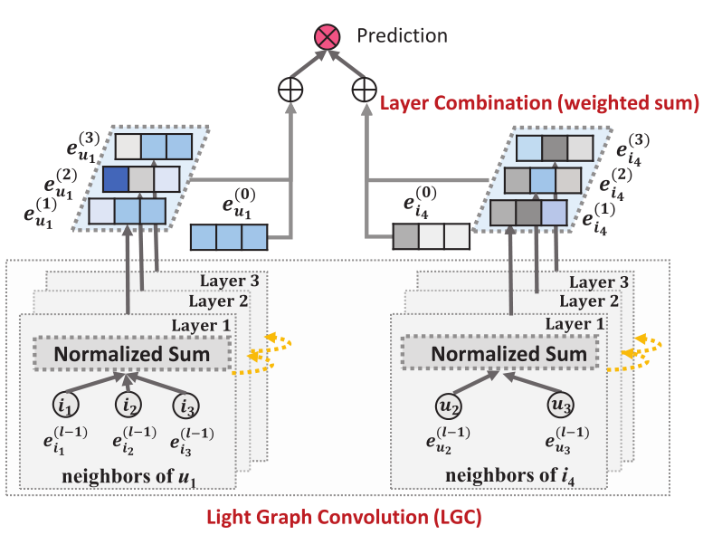
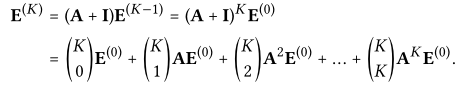
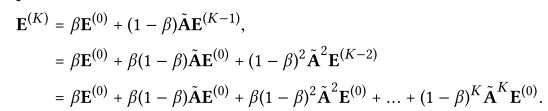
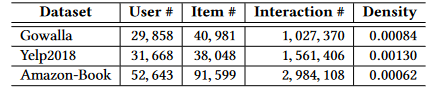

> 论文标题：LightGCN: Simplifying and Powering Graph ConvolutionNetwork for Recommendation
>
> 发表于：2020  SIGIR
>
> 作者：Xiangnan He，Kuan Deng，Xiang Wang
>
> 论文代码：https://github.com/gusye1234/pytorch-light-gcn
>
> 论文地址：https://arxiv.org/pdf/2002.02126.pdf

## 摘要

- 适应GCN推荐系统的现有工作缺乏GCN的全面消融分析，最初设计用于图形分类任务，并配备了许多神经网络操作
- GCNs中最常见的两个设计 - 特征转换和非线性激活 - 对于协同过滤的性能贡献很少，他们增加了训练的难度，降低了推荐绩效。
- 论文工作的目标是简化GCN的设计
- 提出了一个名为LightGCN的新模型，包括GCN的最重要组件  - 邻域聚合- 用于协同过滤
  - LightGCN通过在用户项交互图上线性传播它们来学习用户和项目嵌入品，并使用在所有层中学习的嵌入的加权和作为最终嵌入
- 这种简单，线性和整洁的模型更容易实现和培训，在神经图协作滤波（NGCF）上表现出大量改进（平均相对改善约为16.0％）

## 结论

- 提出了 LightGCN，它由两个基本组件组成——light graph卷积和层组合。
  - 在light graph卷积中，我们丢弃了特征变换和非线性激活——GCN  中的两个标准操作，但增加了训练难度。
  - 在层组合中，我们将一个节点的最终嵌入构造为它在所有层上的嵌入的加权和
    - 这被证明包含自连接的影响，并且有助于控制过度平滑。
- 我们进行实验以证明  LightGCN 在简单方面的优势：更容易训练、更好的泛化能力和更有效。

## 未来工作

- 计划在传统的监督学习模型中探索 LightGCN 的想法。
- 另一个未来方向是个性化层组合权重 αk  ，以便为不同用户启用自适应阶平滑（例如，稀疏用户可能需要来自高阶邻居的更多信号，而活跃用户需要更少）。
- 最后，我们将进一步探索 LightGCN  简单性的优势，研究是否存在针对非采样回归损失 [20] 的快速解决方案，并将其流式传输到在线工业场景。

## 工作贡献

- 证实GCN中的两个常见设计，特征转化和非线性激活，对协同过滤的有效性没有积极影响
- 提出了LightGCN，它通过仅包含GCN 中最重要的组件进行推荐，大大简化了模型设计
- 通过遵循相同的设置对 LightGCN 与 NGCF 进行了实证比较，并展示了显着的改进

## 模型架构

## 

- ### Light Graph Convolution (LGC)：Light Graph卷积

  - 采用简单的加权和聚合器并放弃使用功能转换和非线性激活。在LGC中只聚合连接的邻居并且不集成目标节点本身(自连接)。
  - 这与大多数现有的图表卷积操作不同，其通常聚合扩展邻居并且需要特别地处理自连接。
  - 通过引入的图层组合操作基本上捕获与自连接相同的效果。因此，LGC中不需要包括自连接。

- ### Layer Combination：层组合

  - 在 K 层 LGC 之后，我们进一步组合在每一层获得的嵌入，形成最终的用户(物品)表示：
    - $e_u = \sum^K_{k =0}\limits α_k e^{(k)}_ u ; e_i =\sum^K_{k =0}\limits α_k e^{(k)}_i,$
    - 将 αk 统一设置为 1/(K + 1) 通常会带来良好的性能
  - 执行层组合以获得最终表示的原因有三个。 
    - (1) 随着层数的增加，嵌入将被过度平滑[27]。因此，简单地使用最后一层是有问题的。
    -  (2)  不同层的嵌入捕获不同的语义。例如，第一层对具有交互的用户和项目强制平滑，第二层对交互项目（用户）有重叠的用户（项目）进行平滑，更高层捕获更高阶的接近度  [39]。因此，将它们结合起来将使表示更加全面。
    -  (3) 将不同层的嵌入与加权和相结合，捕捉到图卷积与自连接的效果，这是 GCN 中的一个重要技巧

- ### 矩阵形式

  - LightGCN的矩阵形式，以促进与现有模型的实现和讨论。让用户项目交互矩阵是R∈$\mathbb R^{M×N}$其中，其中M和N分别表示用户和项目的数量，如果与项目相互作用，则每个条目$R_{ui}$为1，否则为0

## 模型分析

- Simplified GCN(SGCN)：将自连接集成到图卷积的线性GCN模型，
  - SGCN它通过消除非线性并将权重矩阵折叠为一个权重矩阵来简化 GCN，将自连接插入矩阵A并在其上传播嵌入，本质上等同于在每个 LGC 层传播的嵌入的加权和
    -  
    - 与SGCN关系分析，通过执行层组合，LightGCN载于自连接的效果，因此不需要LightGCN在邻接矩阵中添加自连接
- 神经预测的近似个性化传播（AppnP）：通过个性化 PageRank [15] 的启发来解决过度平滑问题
  - 受 Personalized PageRank 中的瞬移设计的启发，APPNP 用起始特征（即第 0  层嵌入）补充每个传播层，这可以平衡保持局部性的需求（即保持靠近根节点以减轻过度平滑）并利用来自大社区的信息
    -  
    - 通过相应地设置αk，LightGCN可以完全恢复APPNP使用的预测嵌入。因此，LightGCN 在对抗过度平滑方面具有 APPNP 的优势，通过正确设置 α，我们允许使用较大的 K 进行具有可控过度平滑的远程建模。

## 实验

- ### 数据集

  - Gowalla、Amazon-Book、Yelp2018

- ### 评估指标

  - recall@20：正确识别出来的个数与在前K个数的比例
  - NDCG@20：表示位置感知度量，高 NDCG 表示目标项目倾向于前K个项目中有更多的位置占比

- ### baseline

  - NGCF:主要对比方法
  - 基于GCN的模型
    - GC-MC[35]
    - PINSAGE [45]
  - 基于神经网络的模型
    - NeuMF [19]
    - CMN [10]
  - 基于因式分解的模型
    - MF [32]
    - HOP-Rec [43
  - CF方法：
    - Mult-VAE [28]:假设数据是从多项分布生成的，并且使用用于参数估计的变分推理
    - GRMF [30]:该方法通过添加图拉普拉斯规范器来平滑矩阵分解。
    - 评级预测损失采用BPR损失

- ### 超参数设置

  - 嵌入大小：64，Xavier初始化参数
  - Adam学习率0.001，默认mini-batchsize ：1024（在Amazon-Book 上为2048）
  - L2正则化系数λ在{1E-6,1E-5，...，1E-2}的范围内搜索，1e-4常最优
  - 层组合系数αk均匀地设定为1 1 + k，其中k是层数，3测试常最优
  - epoch：1000

  

