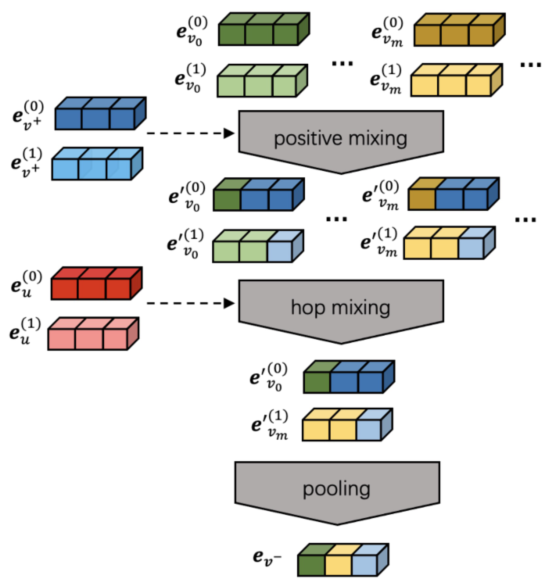
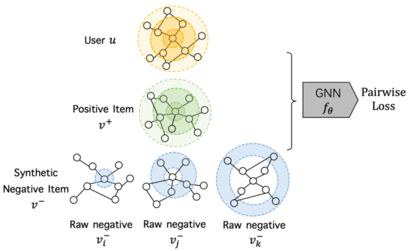

> 论文标题：MixGCF: An Improved Training Method for Graph Neural Network-based Recommender Systems
>
> 发表于：2021 SIGKDD
>
> 作者：Tinglin Huang, Yuxiao Dong, Ming Ding
>
> 代码：https://github.com/huangtinglin/MixGCF
>
> 论文地址：https://keg.cs.tsinghua.edu.cn/jietang/publications/KDD21-Huang-et-al-MixGCF.pdf

## 摘要

- CF 的一个基本挑战是从隐式反馈中提取负信号，但基于 GNN 的 CF 中的负采样在很大程度上尚未得到探索
- 文章建议通过利用用户-项目图结构和 GNN 的聚合过程来研究负采样
- 提出了 MixGCF 方法——一种通用的负采样插件，引入合成负样本的想法，而不是直接从数据中采样负样本
  - 不是从数据中采样原始负采样，而是设计了跳跃混合技术来合成硬的负样本。具体来说，
    - 跳跃混合的想法是通过聚合来自不同层的原始负邻域的嵌入来生成合成负样本。
    - 层和邻域选择过程通过理论上支持的硬选择策略进行了优化

## 结论

- 研究了基于 GNN 的推荐，目的是提高负样本的质量。
- 设计了一种简单的非参数方法：MixGCF，基于 GNN。 
- MixGCF  不是对现有的负样本进行采样，而是通过正混合和跳跃混合来整合多个负样本来合成一个硬负样本

## 未来工作

- 从数据中捕获（负面）信号隐含地在各种基础学习任务中发挥着至关重要的作用。
  - 进一步研究 MixGCF 中提出的用于图和关系数据预训练的技术，以学习数据的强泛化表示

## 介绍

- （基于 GNN  的）推荐系统的典型流程相对简单。
  - 给定一个用户-项目交互图，它首先在结构上定义一个聚合函数以传播邻域信息，
  - 然后通常是一个池化操作，用于输出用户和项目嵌入。
  - 它的目标函数被设计为更喜欢观察到的用户-项目对（作为正）而不是未观察到的用户-项目对（作为负对）。
  - 以BPR 损失 [31] 为例，对于每个用户和t他的一个积极项目，我们进行负抽样从他从未交互的项目中选择一个项目作为消极项目
  - 本质上，负样本在（基于 GNN 的）推荐模型的性能中起着决定性的作用
- 现有工作改进负采样中，对GNN 中的尝试只专注于改进离散图空间中的负采样，而忽略了 GNN 在嵌入空间中独特的邻域聚合过程。
- 提出了一个简单的 MixGCF 框架来生成硬负样本。 
  - MixGCF 不是直接从数据中采样真正的负样本，而是从数据增强和度量学习中汲取灵感，通过利用底层基于  GNN 的推荐器来合成负样本。
  - MixGCF  设计了两种策略：正向混合和跳跃混合。
    - 在正混合中，我们引入了一种插值混合方法，通过将来自正样本的信息注入原始负样本来污染原始负样本的嵌入。
    - 在跳跃混合中，我们对几个原始负样本进行采样，
      - 从哪个邻居中选择哪一跳是由设计的硬选择策略指导的

## 模型架构

- MixGCF
  
  - 其中 e(l) 表示节点 e 的第 l 层嵌入，e′(l) 表示正混合生成的第 l 层嵌入。

- 合成负项目的跳跃混合图示
  
  - 用户和项目分别由他们的自我网络表示，突出显示的圆圈表示选定的邻居。

## 实验

- ### 研究问题

- ### 数据集

  - Alibaba 
  - Yelp2018 
  - Amazon

- ### baseline

  - #### 基于模型

    -  LightGCN 
    - NGCF
    - PinSage 

  - #### 对比方法

    - RNS [31]：随机负样本（RNS）策略将均匀分布应用于样本负项目。它独立于推荐器并应用于各种任务。 
    - DNS [52]：动态负采样 (DNS)  策略是最先进的采样器 [17, 30]，它自适应地选择推荐器得分最高的负项。这种负片被视为硬负片，可以为参数提供大的梯度。
    - IRGAN [40]：IRGAN  将推荐器集成到生成对抗网络 (GAN) 中，生成器在其中充当采样器以挑选负数以混淆推荐器。
    - AdvIR [28]：AdvIR  也是一种对抗性采样器，它通过添加对抗性扰动将对抗性抽样与对抗性训练相结合。
    - MCNS  [48]：马尔可夫链蒙特卡罗负采样（MCNS）是从理论上分析负采样对链路预测影响的先驱。
      - 基于推导的理论，MCNS建议通过近似正分布来采样负样本，并通过 Metropolis-Hastings 算法加速该过程。

- ### 超参数设置

- ### 评估指标

  - Recall@N
  - NDCG@K