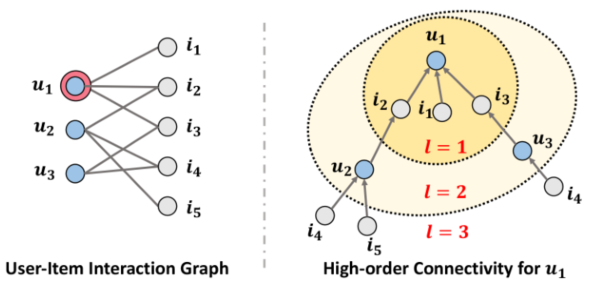
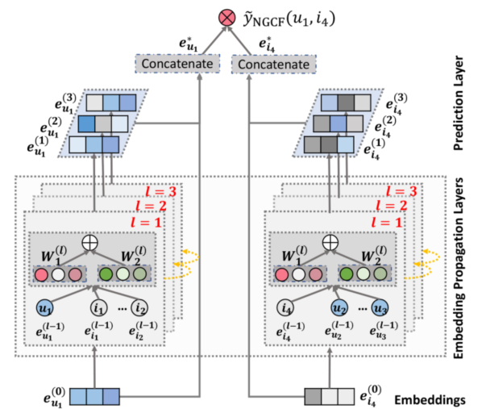
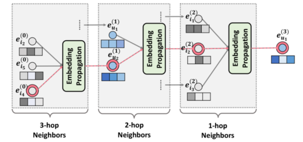

> 论文标题：Neural Graph Collaborative Filtering
>
> 发表于：2019 SIGIR
>
> 作者：Xiang Wang,Xiangnan He,Meng Wang
>
> 代码：TensorFlow：https://github.com/xiangwang1223/neural_graph_collaborative_filtering
> 			pytorch：https://github.com/huangtinglin/NGCF-PyTorch
>
> 论文地址：https://arxiv.org/pdf/1905.08108v2.pdf

## 摘要

- 从早期的矩阵分解到最近出现的基于深度学习的方法，通常通过从描述用户（或项目）的预先存在的特征（例如 ID 和属性）映射来获得用户（或项目）的嵌入	
  - 这种方法的一个固有缺点是，隐藏在用户-项目交互中的协作信号没有在嵌入过程中编码。
  - 因此，生成的嵌入可能不足以捕捉协同过滤效果
- 文章将用户-项目交互的二分图结构集成到嵌入过程中，
- 开发了一个新的推荐框架 Neural Graph Collaborative Filtering (NGCF)，
- 它通过在其上传播嵌入来利用 user-item  图结构。这使得用户项目图中高阶连通性的表达建模，以显式方式有效地将协作信号注入到嵌入过程中。

## 结论

- 将协作信号纳入基于模型的 CF 的嵌入功能中。我们设计了一个新的框架 NGCF，它通过利用用户-项目集成图中的高阶连接性来实现目标
- NGCF 的关键是新提出的嵌入传播层，在此基础上，我们允许用户和项目的嵌入相互交互以获取协作信号。
- 这项工作代表了在基于模型的 CF 中利用消息传递机制利用结构知识的初步尝试，并开辟了新的研究可能性
- 希望 NGCF 有利于用户在线行为的推理，从而实现更有效和可解释的推荐。

## 未来工作

- 将通过结合注意力机制 [2] 来进一步改进  NGCF，以在嵌入传播期间学习邻居的可变权重以及不同阶的连接性。这将有利于模型的泛化和可解释性。
- 探索关于用户/项目嵌入的对抗性学习 [13]  和图结构以增强 NGCF 的鲁棒性。

## 介绍

- 可学习的 CF 模型有两个关键组成部分
  - 1）嵌入，将用户和项目转换为矢量化表示，
  - 2）交互建模，它基于嵌入重建历史交互
- 矩阵分解（MF）直接将用户/项目 ID 作为向量嵌入，并使用内积建模用户-项目交互 [20]；
- 协同深度学习通过集成从项目丰富的边信息中学习到的深度表示来扩展  MF 嵌入功能 [30]；
- 神经网络协同过滤模型用非线性神经网络[14]代替了内积的MF交互函数；
- 基于平移的 CF 模型改为使用欧几里德距离度量作为交互函数  [28] 
- 以上方法虽有效，但不足以产生令人满意的 CF  嵌入。关键原因是嵌入函数缺乏对关键协作信号的显式编码，
  - 该信号隐藏在用户-项目交互中以揭示用户（或项目）之间的行为相似性。
  - 更具体地说，大多数现有方法仅使用描述性特征（例如  ID 和属性）构建嵌入函数，而不考虑用户-项目交互
  - 它们仅用于定义模型训练的目标函数 [26、28] ，当嵌入不足以捕获 CF 时，这些方法必须依靠交互函数来弥补次优嵌入的不足
- 这项工作中，通过利用来自用户项交互的高阶连通性来应对挑战
  - 高阶连通性
    
    - 节点 u1 是为其提供推荐的目标用户
    - 高阶连通性表示从路径长度 l 大于 1 的任意节点到达 u1 的路径
    - 路径 u1 ← i2 ← u2 表示 u1 和 u2 之间的行为相似性，因为两个用户都与 i2 进行了交互；
    - 较长的路径 u1 ← i2 ← u2 ← i4 表明  u1 很可能采用 i4，因为她的相似用户 u2 之前已经消费过 i4。
    - 此外，从 l = 3 的整体来看，项目 i4 比项目 i5 更可能对 u1  感兴趣，因为有两条路径连接 <i4,u1>，而只有一条路径连接 <i5,u1>。
  - 我们设计了一个嵌入传播层，它通过聚合交互项目（或用户）的嵌入来优化用户（或项目）的嵌入。
    - 通过堆叠多个嵌入传播层，我们可以强制嵌入以捕获高阶连接中的协作信号

## 模型架构

- NGCF 模型架构示意图（箭头线表示信息流）。 
  - user u1（左）和 item  i4（右）的表示通过多个嵌入传播层进行了细化，其输出被连接起来以进行最终预测。

- 用户 u1 的三阶嵌入传播示意图
  

## 实验

- ### 研究问题

  - RQ1：与最先进的 CF 方法相比，NGCF 的表现如何？
  - RQ2：不同的超参数设置（例如，层深度、嵌入传播层、层聚合机制、消息丢失和节点丢失）如何影响  NGCF？
  - RQ3：表示如何从高阶连接中受益？

- ### 数据集

  - Gowalla, Yelp2018, Amazon-book

- ### baseline

  - MF [26]：这是通过贝叶斯个性化排名（BPR）损失优化的矩阵分解，它仅利用用户-项目直接交互作为交互函数的目标值。
  - NeuMF [14]：该方法是最先进的神经 CF 模型，它使用元素上方的多个隐藏层以及用户和项目嵌入的串联来捕获它们的非线性特征交互
  - CMN [5]：它是一种最先进的基于内存的模型，其中用户表示通过内存层仔细地结合了相邻用户的内存槽。
  - HOP-Rec [40]：这是一个最先进的基于图的模型，其中利用从随机游走导出的高阶邻居来丰富用户-项目交互数据。
  - PinSage [42]：PinSage 旨在在项目-项目图上使用 GraphSAGE [8]。
  - GC-MC [29]：该模型采用 GCN [18] 编码器来生成用户和项目的表示，其中只考虑一阶邻居。

- ### 超参数设置

- ### 评估指标

  - recall@K 
  - ndcg@K
  - K =20