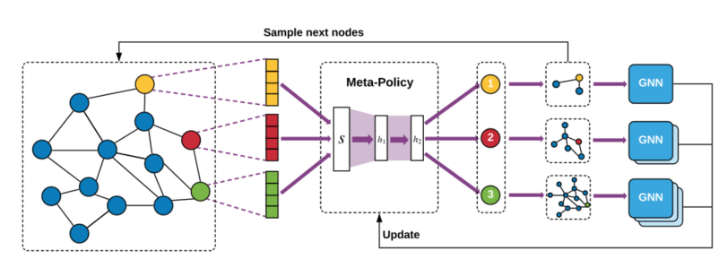

> 论文标题：Policy-GNN: Aggregation Optimizationfor Graph Neural Networks
>
> 发表于：2020 SIGKDD
>
> 作者：Kwei-Herng Lai, Daochen Zha, Kaixiong Zhou, Xia Hu
>
> 代码：https://github.com/datamllab/Policy-GNN
>
> 论文地址：https://arxiv.org/pdf/2006.15097v1.pdf

## 摘要

- GNN旨在通过使用可堆叠的网络模块聚合来自邻居的信息来对局部图结构进行建模并捕获层次模式
- 由于观察到不同的节点通常需要不同的聚合迭代来完全捕获结构信息
  - 本文中建议对不同节点的不同聚合迭代进行显式采样，以提高 GNN 的性能
- 给定复杂的图形和稀疏的特征，为每个节点开发有效的聚合策略是一项具有挑战性的任务
- 由于需要将采样节点馈送到不同数量的网络层，因此推导出一个有效的算法并不简单
- 提出了 Policy-GNN，一个元策略框架，将 GNN 的采样过程和消息传递建模为一个组合学习过程。
  - Policy-GNN  使用元策略来自适应地确定每个节点的聚合数量。
  - 通过利用模型的反馈，使用深度强化学习 (RL) 对元策略进行训练。
  - 我们进一步引入参数共享和缓冲机制来提高训练效率

## 结论

- 提出了 Policy-GNN，这是一个元策略框架，它自适应地学习聚合策略，以对不同节点的聚合的不同迭代进行采样
- Policy-GNN  将图表示学习问题表述为马尔可夫决策过程，并采用具有定制奖励函数的深度强化学习来训练元策略。
- 为了加速学习过程，设计了一种缓冲机制来启用批量训练并引入参数共享以降低训练成本

## 未来工作

- 通过自适应采样和聚合提高 GNN 的性能
- 为了学习一个有效的元策略，我们需要数百次训练迭代，这对于大图可能是有问题的
  - 对为大图开发更具可扩展性和更高效的元策略算法
- 探索不同的深度强化学习算法和更高级的聚合函数，以进一步提高性能
- 将我们的元策略与神经架构搜索结合起来，共同优化神经架构和聚合策略。

## 介绍

- 关于推进 GNN  的研究主要分为两个方向。
  - 首先，提出了批量采样[14]和重要性采样[3]等采样策略来提高学习效率。但采样策略可能会导致信息丢失，从而使性能次优。
  - 其次，引入了一些新颖的消息传递函数来更好地捕获图结构背后的信息，例如池化层  [7] 和多头注意力 [37]。
    - 最近的工作 [11, 31] 专注于深度架构并研究了过度平滑问题，这会导致梯度消失并使顶点的特征具有相同的值  [11]。
    - 解决过度平滑问题并使 GNN 更深入的一种方法是使用跳过连接 [7, 17, 23]。
    - 它需要手动指定起始层和结束层来构建跳跃连接。预定义的消息传递架构可能不适用于图中的所有顶点。
- 文章提倡对不同节点的不同聚合迭代进行显式采样，假设不同的节点需要不同的聚合迭代来完全捕获结构信息
- 由于以下挑战，这项任务是困难的
  - 现实世界的图通常很复杂，具有多种类型的属性：很难为每个节点确定合适的聚合迭代
  - 即使我们可以为每个节点定义适当的聚合策略，在这些节点上训练 GNN  仍然具有挑战性，
    - 我们需要将这些节点馈送到不同数量的网络层中。对采样节点的管理不当会极大地影响算法的训练效率。
- 应对上述挑战，本文提出了  PolicyGNN，一种用于对复杂聚合策略进行建模的元策略框架。
- 将图表示学习制定为马尔可夫决策过程（MDP），它通过利用模型的反馈来优化元策略。
  - MDP  使用元策略迭代地采样当前节点和相应相邻节点的跳数，并通过聚合采样跳内节点的信息来训练 GNN。
  - 所提出的 MDP  成功地将采样过程和消息传递集成到一个组合学习过程中。
  - 为了解决这个  MDP，我们采用由定制奖励函数增强的深度强化学习算法来训练元策略。
- 此外，我们引入了参数共享和缓冲机制，可以进行批量训练以提高训练效率。

## 模型架构

- Policy-GNN针对不同节点进行了 1、2 和 3  次聚合迭代的元策略采样。 
  
  - 学习过程遵循马尔可夫决策过程。
    - 在每个时间步中，元策略根据节点（状态）的属性对层数（动作）进行采样。
    - 下一个节点(下一个状态)是通过从当前节点的 k-hop邻居中随机采样一个节点来获得的,其中k是mata-policy（动作）的输出。
    - 元策略根据来自 GNN 的反馈进行更新。

## 实验

- ### 研究问题

  - Policy-GNN 与最先进的图形表示学习算法相比如何？
  - 对于经过训练的元策略，层数的分布情况如何？
  - Policy-GNN 的搜索过程在实现良好性能所需的迭代次数方面是否有效？

- ### 数据集

  - Cora 
  - Citeseer 
  - Pubmed

- ### baseline

  - 网络嵌入
    - DeepWalk [32] 
    - Node2vec [10]
  - 静态 GNN
    - Chebyshev [5] 和 GCN [20] 基于完整图的拉普拉斯或相邻矩阵进行信息聚合。 
    - GraphSAGE [12]  提出了邻域批量采样，以启用具有最大、最小和 LSTM 聚合函数的可扩展训练。 
    - FastGCN [3] 利用每个聚合层中的重要性采样来有效地学习特征向量。 
    - GAT  [37]在聚合函数中引入了多头注意力机制，它学习了每个节点邻域对信息聚合的重要性。 
    - LGCN [8]  根据值排序自动为每个节点选择固定数量的邻居，并将图形数据转换为一维格式的网格状结构以提取邻近信息。 
    - Adapt  [17]以自上而下的方式逐层构建网络，其中下层中的节点基于上层有条件地采样。 
    - g-U-Nets [7] 提出了一种带有 gPool  层的编码器-解码器结构来自适应地采样节点以形成更小的图，以及一个 gUnpool 来从更小的图恢复原始图，并使用跳跃连接来构建更深的架构。

- ### 超参数设置

- ### 评估指标

  - ACC