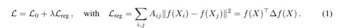
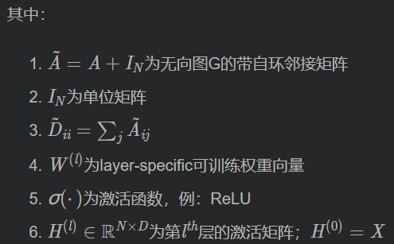
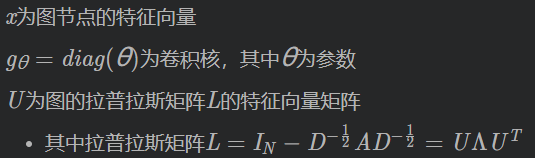
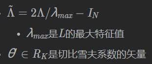
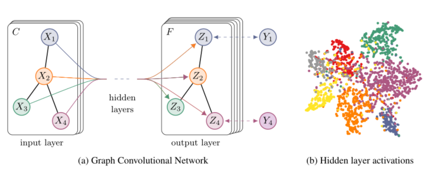
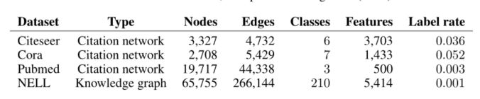
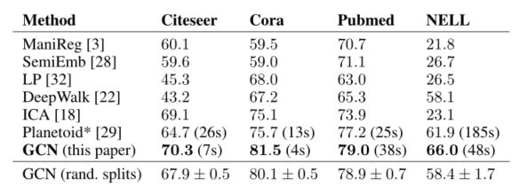

## 0摘要：

本文提出了一种基于卷积神经网络的可扩展半监督学习结构化数据处理方法。

- 卷积神经网络直接处理图形。我们通过一个谱图卷积的局部一阶近似来推动卷积结构的选择。
- 模型在图的边的数量上线性放缩，
- 并学习隐藏层表示，这些表示编码局部图的结构和节点的特征。
- 通过图结构数据中部分有标签的节点数据对卷积神经网络结构模型训练，使网络模型对其余无标签的数据进行进一步分类。

在引用网络和知识图数据集上进行实验

## 1介绍

​	考虑图中节点(如文档)的分类问题(如引用网络)  ，其中标签只能用于一小部分节点。

​	这个问题可以被框定为基于图的半监督学习，其中标记信息在图上是平滑的通过某种形式的显示的基于图的正则化

- ​	例如，通过在损失函数中使用图的拉普拉斯正则化项
  - 
    - L0表示监督损失 w.r.t  
    - 图的标记部分f (.)可以是一个类似于可微函数的神经网络
    - λ 是一个权重因子
    - x 是一个特征节点矩阵
    - △表示无向图 G = (V，E)的非规范化拉普拉斯算子，其中有 n 个节点 vi ∈ V，边(vi，vj)∈E，邻接矩阵A ∈$$ R ^ {N×N} $$(二元或加权)  ，度矩阵 $$D_ {ii} = Σ_j A_ {ij}$$
  - 依赖于这样的假设: 图中连接的节点可能共享相同的标签
    - 这种假设可能会限制建模能力，因为图的边不一定需要编码节点相似度，而可能包含额外的信息。

​	使用神经网络模型 f ( X , A ) 对所有带标签节点进行基于监督损失的训练。

- X为输入数据，A 为图的邻接矩阵

​	在图的邻接矩阵上调整f (.)将允许模型从监督损耗$$L_0$$中分配梯度信息，并且使它能够学习带标签和不带标签的节点的表示。

​	贡献：

- 我们为直接操作图的神经网络模型引入了一个简单且行为良好的分层传播规则，并说明了如何从谱图卷积的一阶近似中激发这个规则

- 演示了这种形式的基于图的神经网络模型如何用于图中节点的快速和可扩展的半监督分类

## 2图的快速卷积

具有以下分层传播规则的多层图卷积网络(gcn):$H^{(l+1)} = \sigma(\widetilde D^{-\frac 1 2}\widetilde A\widetilde D^{-\frac 1 2}H^{(l)}W^{(l)} )$**（2）**

### 谱图卷积

​	将图上的谱卷积定义为一个符号x∈ $$R^N$$ (每个节点的标量)与一个过滤器 = diag (.)在 fourier 域上的相乘：$$g_θ∗x=Ug_θU^Tx$$**（3）**

- 缺点：计算太过复杂，卷积核的选取不合适

因此有人提出一种卷积核设计方法，即$$g_θ ( Λ )$$可以用切比雪夫多项式$$T _k ( x )$$到$$K^{th}$$ 的截断展开来近似

切比雪夫多项式：$$Tk(x)=2xT_{k−1}(x)−T_{k−2}(x)$$   $$T_0(x)=1$$  $$T_1(x)=x$$

因此新的卷积核 : $g_{θ'}(Λ)≈\sum^K_{k=0}θ'_kT_k(\widetildeΛ)$    **（4）**

基于以上卷积核，课得到 $g_{θ'}∗x ≈ \sum^K_{k=0}θ'_kT_k(\widetilde L)x$**（5）**

- 其中 $\widetilde L = \frac{2}{λ_{max}}L-I_N$
- 此公式为拉普拉斯算子中的$K^{th}$阶多项式，即它仅取决于离中央节点最大K步的节点

公式$$g_θ∗x=Ug_θU^Tx$$与上面引文中的第二代GCN用到的卷积公式非常相似，最终都将参数简化到了K个，并不再需要做特征分解，直接用拉普拉斯矩阵L进行变换，计算复杂性大大降低。

但本文使用了切比雪夫多项式 $T_k(x)$，这是与上面引文中提到的第二代GCN中的卷积公式的不同点

### 线性模型

基于图卷积的神经网络模型可以通过叠加  $g_{θ'}∗x ≈ \sum^K_{k=0}θ'_kT_k(\widetilde L)x$ 的形式的多个卷积层来实现，每层之后是一个非线性的卷积层。

​	**K = 1：2个参数的模型**

​	首先，我们将分层卷积操作限制为K = 1，即关于L 是线性的，因此在拉普拉斯谱上有线性函数

- 我们仍可以通过叠加多个卷积滤波器层来恢复大量的卷积滤波器函数，但不局限于参量化切比雪夫多项式所提供的显式滤波器
- 对于节点度分布非常广泛的图，我们直观地期望该模型能够缓解局部邻域结构的过拟合问题
- 对于一个固定的计算预算，这种分层的线性公式允许我们建立更深层次的模型

​	在GCN的这个线性公式中，我们进一步近似$λ _{m a x} $≈ 2 ，我们可以预测到GCN的参数能够在训练中适应这一变化，

​	此时上述公式**（5）**将简化为下式：$g_{θ′}∗x≈θ'_0x+θ'_1(L−I_N)x = θ'_0x−θ'_1D^{-\frac 1 2}AD^{-\frac 1 2}x$  **(6)**

- 此公式具有两个自由参数：θ ′0 和θ '1  ，滤波器参数将被整个图共享 
- 连续应用这种形式的滤波器，可以有效的卷积节点的$k^{(th)}$-阶邻域，其中k 是模型中连续滤波操作或卷积层的数目
- 在实践中，进一步限制参数数量来解决过**拟合问题**和**最小化每层**的操作数量(例如矩阵乘法)是有益的

​	**简化：1个参数的模型**

​	令θ = θ'0 = -θ’1，将两个参数化为单参数θ，得到卷积公式如下： $g_{θ′}∗x≈ θ(I_N + D^{-\frac 1 2}AD^{-\frac 1 2})x$   **(7)**

​	注意 $I_N + D^{-\frac 1 2}AD^{-\frac 1 2}$ 拥有范围为[ 0 , 2 ] 的特征值，这将会导致数值不稳定性和梯度爆炸/消失

​	因此进行归一化处理： $I_N + D^{-\frac 1 2}AD^{-\frac 1 2}$   =>  $\widetilde D^{-\frac 1 2}\widetilde A \widetilde D^{-\frac 1 2}$ 

- $\widetilde A = A+I_N$
- $\widetilde D_{ii} = Σ_j\widetilde A_{ij}$

​	**推广：特征映射公式**

​	将该定义推广到具有C个输入通道（即每个节点的C维特征向量）的信号$X ∈ R^{N×C}$ ，和F个滤波器，

​	则特征映射如下:  $Z = \widetilde D^{-\frac 1 2}\widetilde A \widetilde D^{-\frac 1 2}Xθ$   **(8)**  

- θ∈$R^{C×F}$是滤波器参数矩阵
- Z∈$R^{N×F}$是卷积后的信号矩阵
-  $\widetilde AX$ 可以有效地实现为稀疏矩阵和稠密矩阵的乘积

## 3半监督节点分类

​	我们已经有了模型f ( X , A )，可以在图上有效的传播信息，现在回到半监督节点分类问题上。

​	我们可以通过将数据集和底层图结构的邻接矩阵调整我们的模型f ( X , A ) ，来放松通常在半监督学习中所做的假设。希望模型可以在【邻接矩阵A中包含着（数据 X 没有表达出来的）信息】这种情况下更有用。

​	一个用于整体模型的多层半监督GCN模型如下：

​	左(a)是一个GCN网络示意图，在输入层拥有C个输入，中间有若干隐藏层，在输出层有F个特征映射；图的结构（边用黑线表示）在层之间共享；标签用$Y_{i}$表示。
​	右(b)是一个两层GCN在Cora数据集上（使用了5%的标签）训练得到的隐藏层激活值的形象化表示，颜色表示文档类别。

### 	示例

​	考虑一个用于半监督图节点分类问题的两层GCN，其中对称邻接矩阵为A （二进制/加权）

- ##### 预处理
  
  - 计算   $\widehat A = \widetilde D^{-\frac 1 2}\widetilde A \widetilde D^{-\frac 1 2}$ 
  - 使得模型更加简洁：Z=f（X,A） =softmax（$\widehat A ReLU(\widehat A X W^{(0)})w^{(1)}$）**(9)**
    - $W^{(0)} ∈ R^{C×F}$为输出层 - 隐藏层的权重矩阵，才隐藏层具有H个特征映射
    - $W^{(1)} ∈ R^{H×F}$为隐藏层到输出层的权重矩阵
    - softmax激活函数：$softmax(x_i) = \frac {1} {Σ_iexp_{(x_i)}}exp_{(x_i)}$  作用在每一行上
  
- ##### 交叉熵误差

  - 对于半监督多类别分类，评估所有标记标签的**交叉熵误差**
    - $\iota = - \sum_{l∈γ_L} \sum_{f = 1}^F Y_{lf}lnZ_{lf}$    **(10)**, γL为带标签的节点集

- ##### 训练

  - 神经网络中的权重$W^{(0)}和W^{(1)}$通过梯度下降训练，对每个【训练迭代】使用完整的数据集执行【批量梯度下降】
  - 对于A使用稀疏表示，即边数是线性的。通过Dropout引入训练过程中的随机性。
  - 我们将内存效率扩展与小批随机梯度下降留作以后的工作

### 	实现

​	利用TensorFlow，基于GPU的【稀疏-密集矩阵乘法】高效实现公式**(9)**：Z=f（X,A） =softmax（$\widehat A ReLU(\widehat A X W^{(0)})w^{(1)}$）

## 4相关工作

- ### 基于图的半监督学习

  - 一类是利用图的拉普拉斯正则化方法
    - 图拉普拉斯正则化的突出例子包括标签传播(zhu 等人，2003) 
    - 流形正则化(belkin 等人，2006)
    - 深半监督嵌入(weston 等人，2012)
  - 另一类是基于图的嵌入方法
    - Deepwalk (perozzi et al. ，2014)通过预测节点的局部邻域学习嵌入，这些邻域取自图上的随机游动
    - LINE (tang et al. ，2015)和 node2vec (grover &  leskovec，2016)通过更复杂的随机漫步或广度优先搜索方案扩展了 deepwalk
  - 对于所有这些方法，需要一个包括随机游动生成和半监督训练的多步流水线，每一步都需要单独优化。Planetoid (yang  等人，2016)通过在学习嵌入过程中注入标签信息来缓解这种情况。

- ### 图上的神经网络

  - RNN的一种形式：重复使用缩减映射作为传播函数，直到节点表示达到一个稳定的固定点

  - Li等人在原始图形神经网络框架中引入了递归神经网络训练的现代实践

  - Duvenaud 等人(2015)介绍了图上类卷积传播规则和图级分类方法

  - 他们的方法需要学习节点度特定的权矩阵，这些权矩阵不能扩展到具有广泛节点度分布的大型图。

  - 我们的模型在每层使用一个单一的权重矩阵，并通过适当的邻接矩阵标准化处理不同的节点度

    

  - 在atwood & towsley (2016)中引入了一种基于图的神经网络的相关节点分类方法。它们报告(n2)复杂性，限制了可能的应用范围

  - niepert 等人(2016)将图局部地转换成序列，这些序列被输入到传统的一维卷积神经网络中，这需要在预处理步骤中定义一个节点顺序

  - 本文方法是基于谱图卷积神经网络

  - 介绍了 bruna 等人(2014年)和后来扩展 defferlard 等人(2016年)与快速局部卷积，因为研究任务，传感器节点分类在网络显着更大的规模，因此在第二节中对框架化，改善大规模网络中的可伸缩性和分类性能

## 5实验

- ### 实验检验

  - 引文网络：半监督文档分类
  - 知识图中提取的二分图：半监督实体分类
  - 各种图传播模型的评估
  - 随机图的运行时分析

- ### 数据集

- 

  - Citeseer, Cora and Pubmed 是引文网络数据集
    - 节点是文档，边是引文链接
    - Label rate是用于训练的标记节点数除以每个数据集中的节点总数
  - NELL是一个二部图数据集，从一个包含55864个关联节点和9891个实体节点的知识图中提取
  - **引文网络**：这些数据集包含稀疏的单词特征向量为每个文档和文档之间的引用链接列表。我们将引文链接视为(无向的)边，并构造一个二进制的对称邻接矩阵 A，每个文档都有一个类标签。对于训练，我们每个类只用20个标签和所有的特征矢量
  - **NELL**：从(carlson 等人，2010)引入的知识图中提取的数据集。知识图是一组连接有向标记边(关系)的实体。我们遵循yang(2016)中描述的预处理方案。
    - 我们为每个实体对(e1，r，e2)分配独立的关系节点 r1和 r2，作为(e1，r1) 和 (e2，r2)。采用稀疏特征向量描述实体节点。
    - 通过为每个关系节点分配一个唯一的独热编码表示，扩展了 nell 中的特征数，有效地生成了每个节点61,278维稀疏特征向量

  - **随机图**：模拟不同大小的随机图形数据集用于测量每个历元的训练时间。对于一个有节点的数据集，我们创建一个随机图，随机分配2n  条边。我们将身份矩阵作为输入特征矩阵，从而隐含地采用了一种无特征的方法，即模型只知道每个节点的身份，由唯一的独热向量指定。我们为每个节点添加虚拟标签 $Y_i$ =  1。

- ### 实验设置

  - 使用3.1节中的两层GCN网络，并在一个由1000个标记示例组成的测试集上评估预测的准确性
  - 对比实验：10个层次的深层模型网络
  - 使用500张带标签示例验证集的超参数的初始化
    - 所有层的dropout率
    - 第一层的L2正则化因子
    - 隐藏层单元的个数

- ### 对比实验

  - 标号传播（LP）
  - 半监督嵌入（Semiemb）
  - 流行正则化
  - 跳过基于图的嵌入
  - 进一步比较了 lu & getoor (2003)中提出的迭代分类算法(ica)和两个 Logit模型分类器
    - 一个用于局部节点特征，另一个用于使用局部特征和聚合运算符的关系分类
    - 我们首先利用所有标记的训练集节点训练局部分类器，然后用它引导未标记节点的类标记进行关系分类器训练
    - 我们运行迭代分类(关系分类器)与随机节点排序10次迭代在所有未标记的节点(引导使用局部分类器）
    - L2正则化参数和聚合操作符(count vs.prop，see sen et al. (2008))是根据每个数据集的验证集性能单独选择的
  - 最后，我们比较Planetoid(y ang et al. ，2016) ，我们总是选择他们表现最好的模型变体(传感器 vs 归纳)作为基线

## 6实验结果

- ### 半监督节点分类

  - 对于ICA，报告了随机节点排序的100次运行的平均精度，其他的均取自与Planetoid论文
  - 
    - 对 citeseer、 cora 和 pubmed 使用了以下几组超参数: 0.5(dropout rate)、$5*10^{-4}$(L2正则化)和16(隐藏单元数) ;
    -  NELL:  0.1(dropout rate)、$1*10^{-5}$(L2正则化)和64(隐藏单元数)。
  - 另外，我们报告了我们的模型在10个随机绘制的数据集上的性能，这10个数据集的大小与  Yang (2016)相同，由 gcn (表示,分割)。在这里，我们报告的平均误差和标准误差的预测精度的测试集分割按百分制显示。

- ### 传播模式的评估

- 

  - 原 gcn 模型的传播模型用重整化技巧(加粗)表示
  - 在所有其他情况下，将两个神经网络层的传播模型替换为指定的下传播模型
  - 报告的数字表示平均分类精度为100次重复运行与随机权重矩阵初始化
  - 在每一层有多个变量 θi 的情况下，我们对第一层的所有权矩阵施加 l2正则化

- ### 训练时间周期

  - 模拟随机图上100个时期每个时期的平均训练时间(前进，交叉熵计算，后退)的结果，以秒壁钟时间为单位测量

## 7讨论

- ### 半监督模型

  - 基于图-拉普拉斯正则化的方法很可能受到限制，因为他们假设边仅仅编码节点的相似性

  - 基于跳图的方法由于基于多步流水线，难以优化而受到限制

  - GCN模型可以克服这两个局限性，在效率方面与 ICA 等方法相比，每一层中相邻节点的特征信息传播提高了分类性能

  - 本文进一步论证了所提出的重整化传播模型(公式8)提供了更高的效率(更少的参数和操作，如乘法或加法)和更好的预测性能
    - 对一些数据集，相比于一阶模型(6)或使用切比雪夫多项式的高阶图卷积模型（5)

- ### 局限性和未来工作

  - 存储需要
    - 在当前使用全批处理梯度下降法的设置中，数据集的大小会使内存需求线性增长，小批量随机梯度下降可纾缓这问题，
    - 生成小批处理的过程，应该考虑到 gcn 模型中的层数，因为具有 k 层的 gcn 的 k 阶邻域必须存储在内存中以完成一个精确的过程
    - 对于非常大且密集连接的图形数据集，可能需要进一步的近似

  - 有向边和边特征
    - 框架目前不自然地支持边特征，并且仅限于无向图(加权或不加权)
    - nell 的结果表明，通过将原始有向图表示为无向二部图，其中包含代表原始图中边的附加节点，可以同时处理有向边和边的特征

  - 局限假设
    - 隐式地假设局部性(依赖于 k 层的 gcn 的 k 阶邻域)和自连接与相邻节点的边相同的重要性
    - 对于某些数据集来说，在 a 的定义中引入一个折衷参数 λ 可能是有益的:
      - $\widetilde A  =  A+λI_N$    **(11)**
      - 在典型的半监督环境中，这个参数现在扮演着与监督损失和非监督损失之间的权衡参数类似的角色(公式1).
      - 然而，在这可以通过梯度下降法学习。

## 8结论

- 一种新的图结构化数据的半监督分类方法
- gcn 模型使用了一个有效的分层传播规则，这个规则是基于图上谱卷积的一阶近似
- gcn 模型能够同时对图形结构和节点特征进行编码，可用于半监督分类

