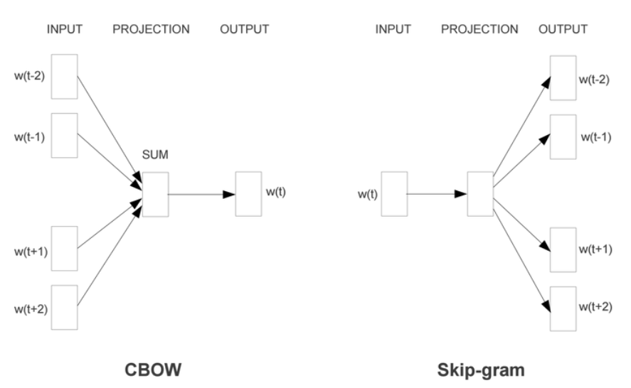

## Word2Vec和Embeddings

Word2Vec是从大量文本语料中以无监督的方式学习语义知识的一种模型

- Word2Vec其实就是通过学习文本来用词向量的方式表征词的语义信息，即通过一个嵌入空间使得语义上相似的单词在该空间内距离很近。
  - 主要有Skip-Gram和CBOW两种模型，从直观上理解，Skip-Gram是给定input word来预测上下文。而CBOW是给定上下文，来预测input word，以Skip-Gram为例分析   详细原理：https://zhuanlan.zhihu.com/p/27234078
  - 
  - Word2Vec的整个建模过程实际上与自编码器（auto-encoder）的思想很相似，即先基于训练数据构建一个神经网络，当这个模型训练好以后，我们并不会用这个训练好的模型处理新的任务，我们真正需要的是这个模型通过训练数据所学得的参数，例如隐层的权重矩阵——后面我们将会看到这些权重在Word2Vec中实际上就是我们试图去学习的“word vectors”。
  - 训练模型的真正目的是获得模型基于训练数据学得的隐层权重

- 自编码器（auto-encoder）：通过在隐层将输入进行编码压缩，继而在输出层将数据解码恢复初始状态，训练完成后，我们会将输出层“砍掉”，仅保留隐层。
- Embedding其实就是一个映射，将单词从原先所属的空间映射到新的多维空间中，也就是把原先词所在空间嵌入到一个新的空间中去。
