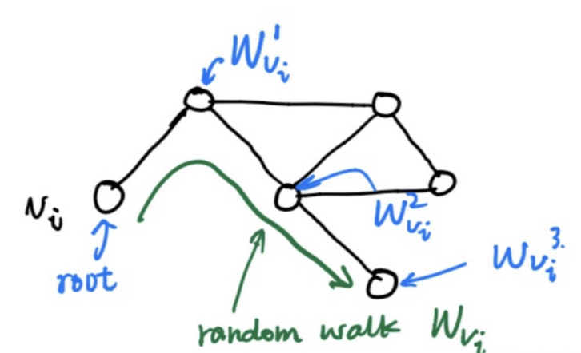
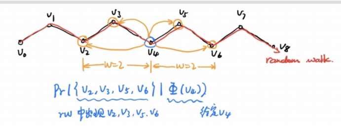
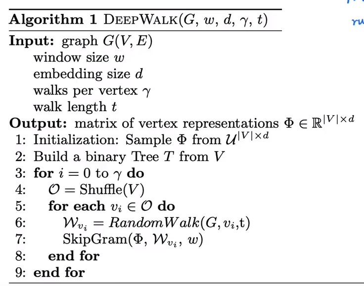

## Deepwalk

- 每个节点通过随机游走的方式，得到图上所有语调的信息
  - 
- 采用skip-gram的方式

  - **第一部分为建立模型，第二部分是通过模型获取嵌入词向量**
  - 给定v4节点的情况下，计算v2v3v5v6同时出现的概率，通过这种方法，算出最终每个节点的embdding
  - 
- Deepwalk算法流程
  - 
    - windows size 窗口左右选取的宽度，embedding size 所要求出的embedding的大小，
    - walks per vertex 每个节点循环的次数，walk length随机游走的长度
  - 首先，对每个节点进行γ次的随机游走采样
  - 其次，对节点进行一个打乱
  - 再次对每个节点进行一个长度为t的随机游走，生成一个随机游走的序列
  - 再通过SkipGram，去学习每个节点的embedding