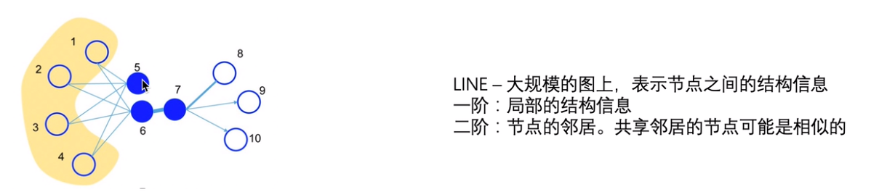
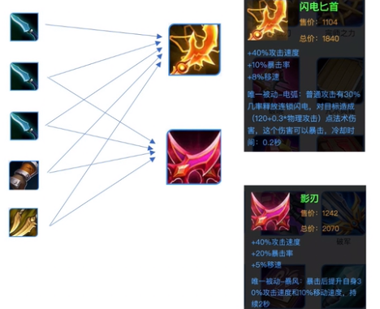
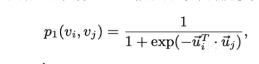
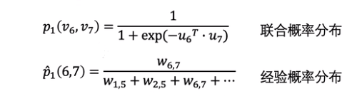
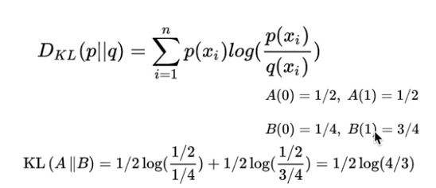
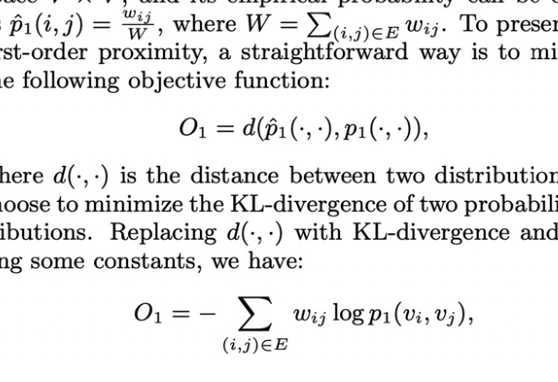
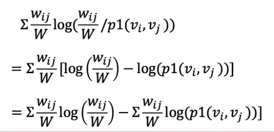
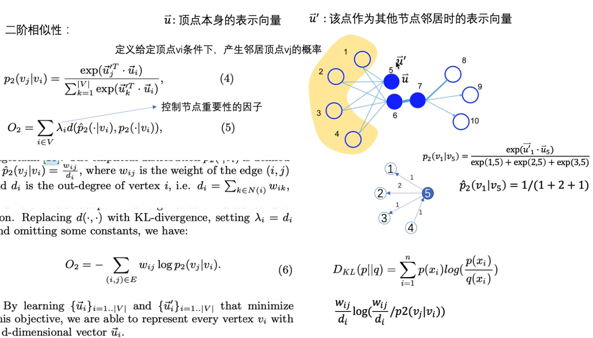
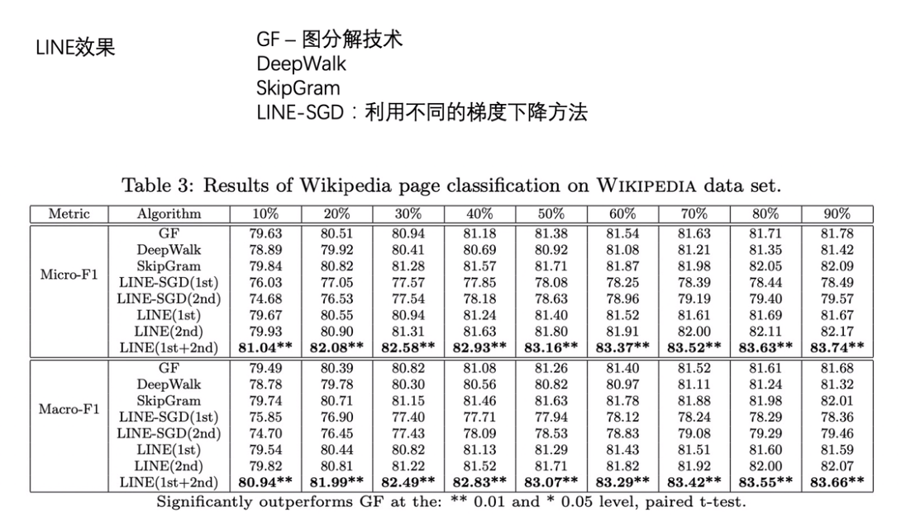

## Large-scale Information Network Embedding

Deepwalk在无向图上，LINE也可以在有向图上使用

**一阶相似性**：

求i，j节点的联合概率分布

**概率分布的距离越小，节点的embedding越好**

KLdiversion KL散度：求两个分布的距离

**二阶相似性**

- u为节点的向量表示，u'为节点作为其他节点的邻居节点的向量表示

**一阶二阶embedding训练完成之后，如何将其组合成一个embedding：直接拼接**

