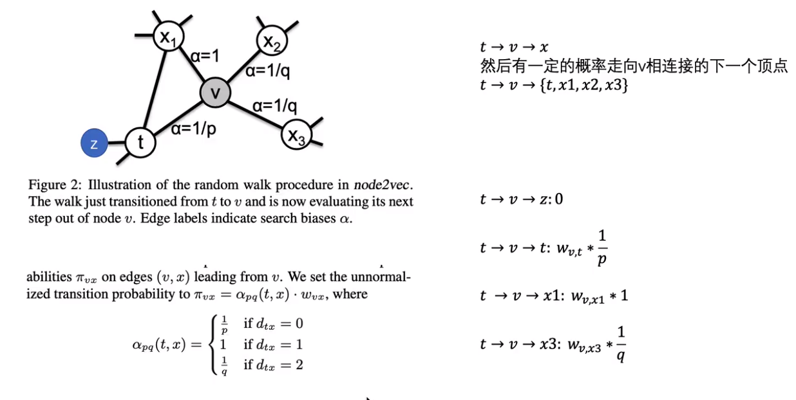
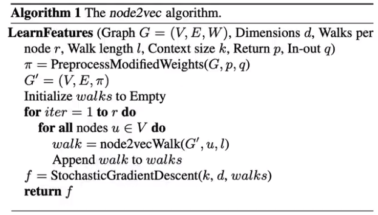
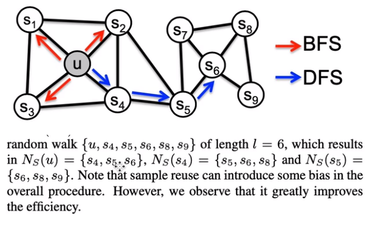
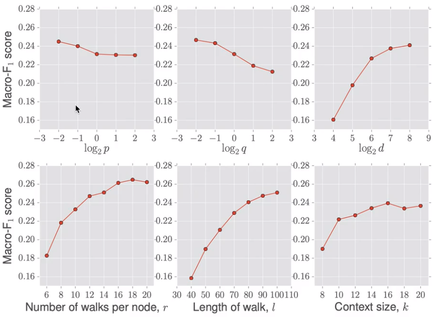
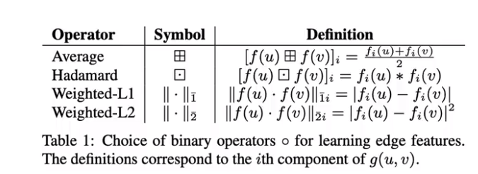

同质性：节点与周围节点的embedding相似

## 结构等价性：节点在图上所处的位置相似，embedding相似

 

## 采用了一种有策略的随机游走方式

- 定义了：图G+(V,E,W),graph embedding长度d，随机游走次数γ，随机游走的长度l，窗口数量k，返回的p，输入的q
- π = 在p，q的条件下图G的随机游走的概率
- 遍历每个节点，遍历γ次
- 对每个节点都采用node2vevwalk的随机游走方式
- 得到一个随机游走的序列，再将所有序列都组合在一起
- 再采用随机下降的算法，求个每个节点的embedding

## 提高效率的方法

 

每次取一个邻居，通过一次随机游走，得到多个序列，再根据得到的序列再以此往后类推，就可以提升随机游走的效率

## 结果

- DFS，即q值小，探索强。会捕获homophily同质性节点，即相邻节点表示类似
- BFS，即p值小，保守周围，会捕获结构性，即某些节点的图上结构类似

### 影响因素

### 

## 节点的embedding如何做一些边的embedding（平均，L1,L2范数）

