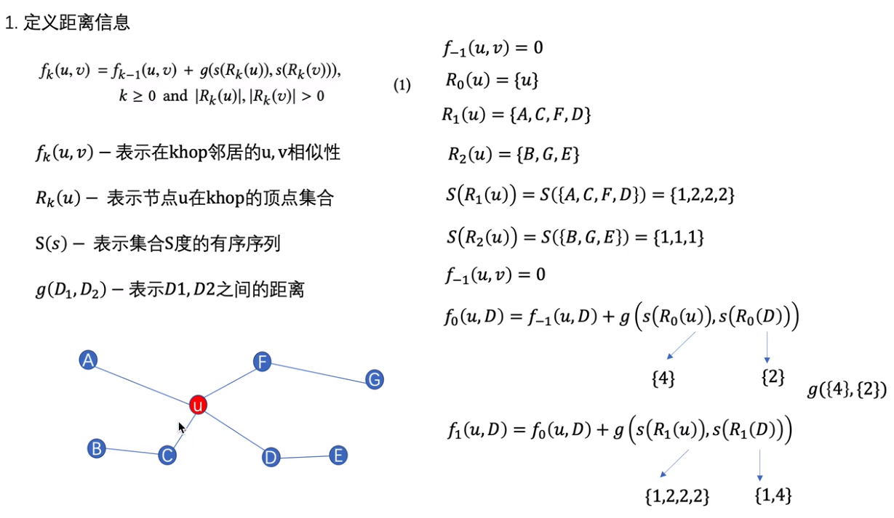

$f_k(u,v) = f_{k-1}(u,v)$+u节点和v节点的距离的度量

## 动态时间规整：通过不断地压缩和拓展x轴，使得这两个节点的距离最小

- 动态时间规整算两个序列相似性，两个序列是两个节点k跳邻居的度产生序列，由此得到两个节点的结构相似性刻画
- 动态时间规整解释：https://zhuanlan.zhihu.com/p/43247215

## 构造多层带权重图

## 顶点采样序列

p为人为定值，$e^{-f_{k}(u,v)}为当前节点k跳某一邻居边的权重w，Z_k(u)为与节点k跳的所有的边的权重和$

## 使用skip-gram生成embedding

### 

## Struct2vec适用于节点分类中，其结构标识比邻居标识更重要时，采用Struct2vec效果更好