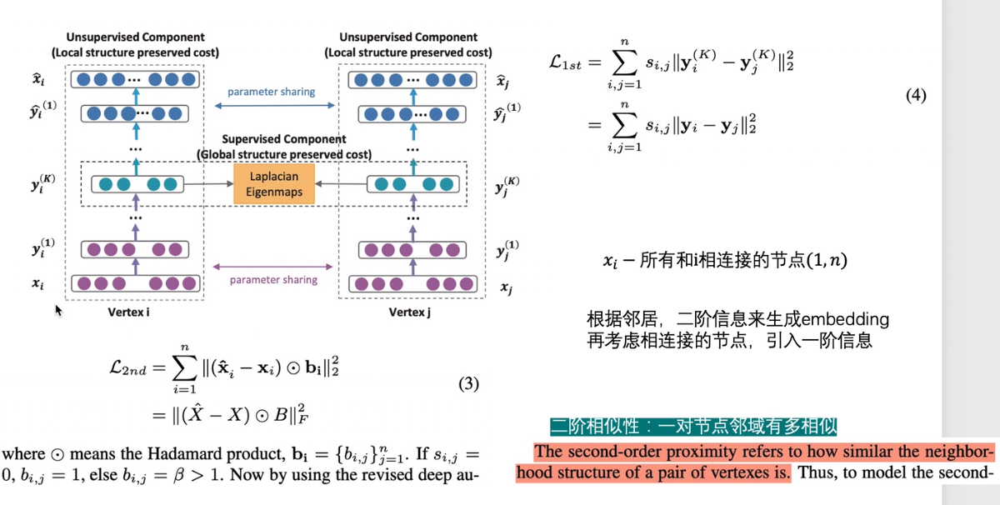

## Structural Deep Network Embedding

之前的Deepwalk，LINE，node2vec，struc2vec都使用了浅层的结构，浅层模型往往不能捕获高度非线性的网络结构。

因此产生了SDNE方法，使用多个非线性层来捕获node的embedding

- xi表示图的邻接矩阵第i行的值（与i节点相连接的关系），将其带入到一个encoder里边（y），encoder可以是多层的
- 学习到了中间的一个向量$y_i^{K}$,即压缩之后所要学习的一个embedding，
- 再将这个embedding decoder成与之前长度一样的向量
- 之后计算输入输出向量的结构性误差
- 学习到了节点的二阶相似性的度量
  - 二阶相似性：一堆节点领域有多相似