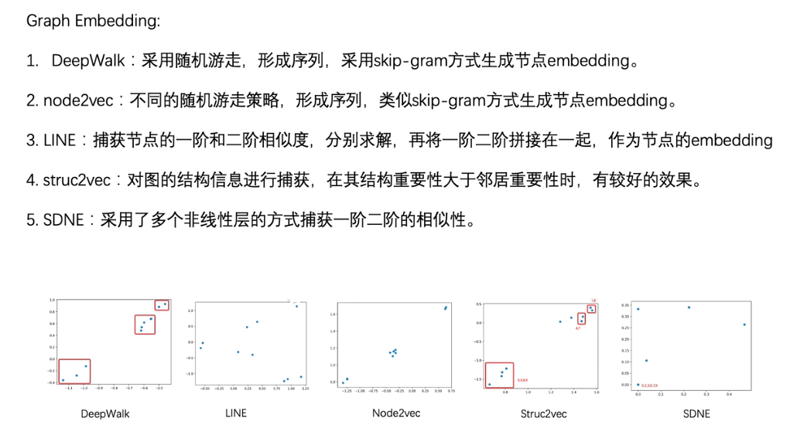

- **DeepWalk**：采用随机游走，形成序列，采用skip-gram方式生成节点embedding。

- **node2vec**：不同的随机游走策略，形成序列，类似skip-gram方式生成节点embedding。

- **LINE**：捕获节点的一阶和二阶相似度，分别求解，再将一阶二阶拼接在一起，作为节点的embedding

- **struc2vec**：对图的结构信息进行捕获，在其结构重要性大于邻居重要性时，有较好的效果。

- **SDNE**：采用了多个非线性层的方式捕获一阶二阶的相似性。
