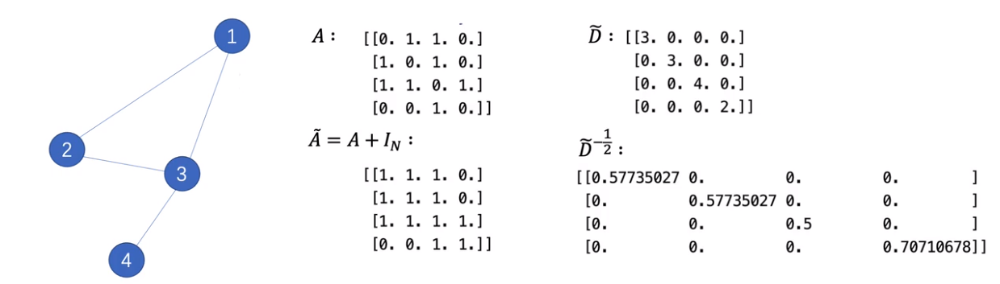
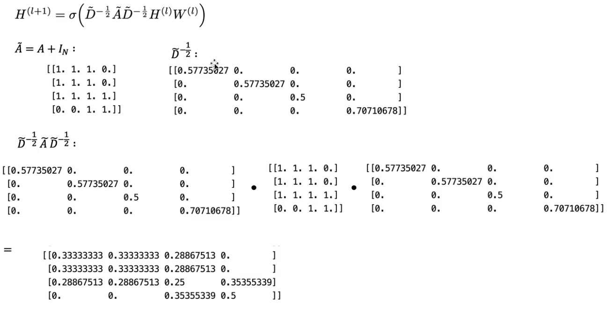
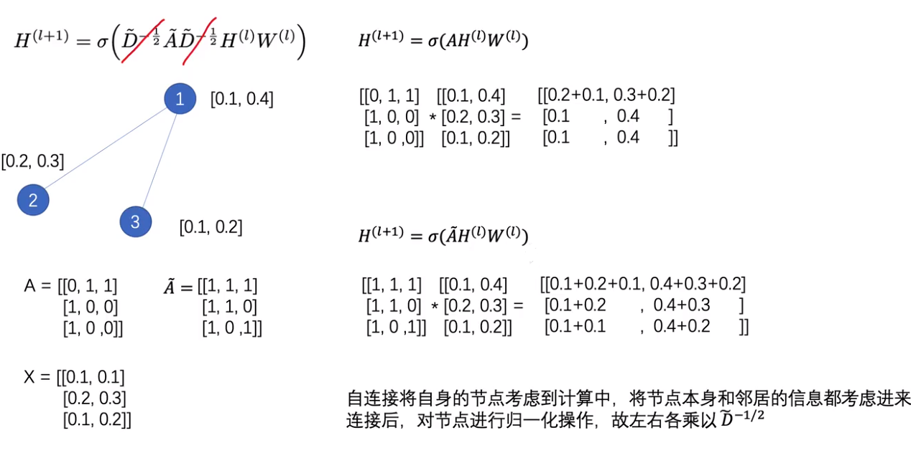
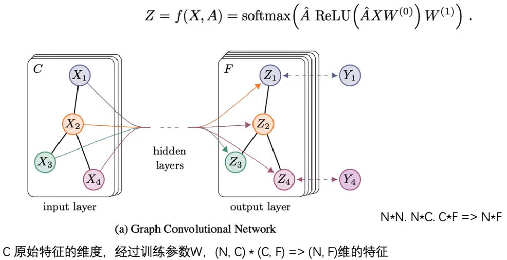
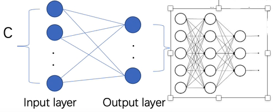

## GCN论文要点

本文提出了一种基于卷积神经网络的可扩展半监督学习结构化数据处理方法。

- 卷积神经网络直接处理图形。我们通过一个谱图卷积的局部一阶近似来推动卷积结构的选择。
- 模型在图的边的数量上线性放缩，
- 并学习隐藏层表示，这些表示编码局部图的结构和节点的特征。
- 通过图结构数据中部分有标签的节点数据对卷积神经网络结构模型训练，使网络模型对其余无标签的数据进行进一步分类。

在引用网络和知识图数据集上进行实验

**GCN由谱域转换而来，将一个矩阵通过数列变换转换到谱域，在通过逆数列变换转换成空域，通过这样的方式得到GCN的网络**

具有以下分层传播规则的多层图卷积网络(gcn): 

$\large  H^{(l+1)} = \sigma(\widetilde D^{-\frac 1 2}\widetilde A\widetilde D^{-\frac 1 2}H^{(l)}W^{(l)})$                

- $\widetilde D^{-\frac 1 2}\widetilde A\widetilde D^{-\frac 1 2}$ ：代表矩阵的相乘，归一化操作
- $H^{(l)}$：第 l 层的激活矩阵 ，也就是 l 层节点的特征
- $W^{(l)}$：第 l 层可学习的权重参数
- $\widetilde A = A + I_N$ 为无向图G的带自环的邻接矩阵，$I_N$为单位矩阵
- $\widetilde D_{ii} = \sum _j \widetilde A_{ij}$  为节点的度矩阵
- $\sigma (.)$为激活函数，如 ReLU

$\widetilde D^{-\frac 1 2}\widetilde A\widetilde D^{-\frac 1 2}$是为了将矩阵进行归一化处理，

- 归一化主要是为了避免  发生梯度爆炸或者梯度消失问题
  - 度大的节点，连接节点较多时，特征边的很大，而某些节点的度很小，特征很小，因此

- 
  -  经过矩阵相乘和激活函数后，即可学习节点在下一层的特征$H^{(l+1)}$

- 先忽略归一化分析物理意义,
- $H^{(l+1)} = \sigma( AH^{(l)}W^{(l)})$
  - 对其做矩阵相乘 ：如 1节点的特征现在等于2节点的特征与3节点的特征相加
    - 物理意义：做了矩阵相乘之后，聚合了1节点周围的所有的邻居节点的和
- $H^{(l+1)} = \sigma( \widetilde AH^{(l)}W^{(l)})$
  - 对其做矩阵相乘 ：如 1节点的特征现在等于2节点的特征与3节点的特征相加的同时与他本身相加
    - 物理意义：做了矩阵相乘之后，聚合了1节点本身和它周围的所有的邻居节点的和

## 算法执行过程

## 

- 输入的特征维度为C，经过训练参数W，(N,C) *  (C, F) =》(N, F) 维的特征，节点的特征数由C维变成了F维
- 上面的Z 是一个两层GCN的函数，$\hat A$ 为归一化之后的A ，乘以节点本身的特征和可学习的参数$W^{(0)}$,然后经过一个ReLU的激活层，那么就算出了经过一层GCN之后这个节点的特征表示
- 之后再乘以$\hat A$ ，再乘以第二层的可学习参数$W^{(1)}$,就得到最终的节点所属的特征
- 最终是要预测节点所属的类别，然后经过softmax的函数就得到了节点所对应的类别
- **如何转换成类别：**
  - 最后一层GCN的隐藏层特征数等于类别数，直接使用softmax概率输出
    - 

  - 最后一层GCN的隐藏层特征数不等于类别数，在输出的F维特征后，再接一个全连接层，训练标签
    - 
    - GCN当做是一个特征提取器的过程，全连接层当做是一个分类器，将gcn所输出的特征进行分类

