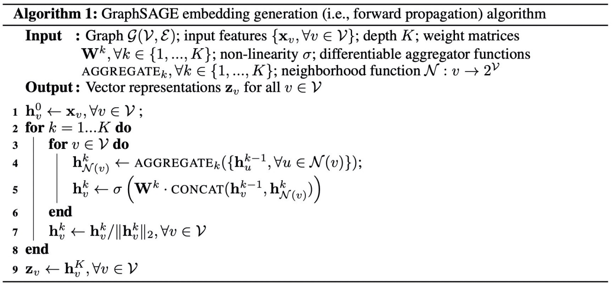
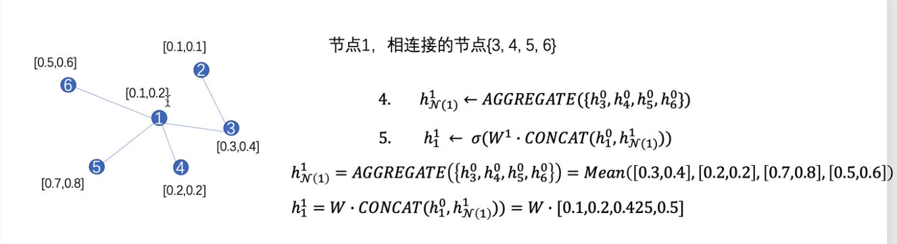
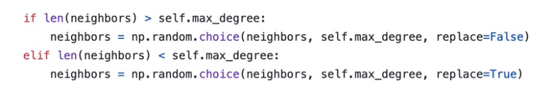
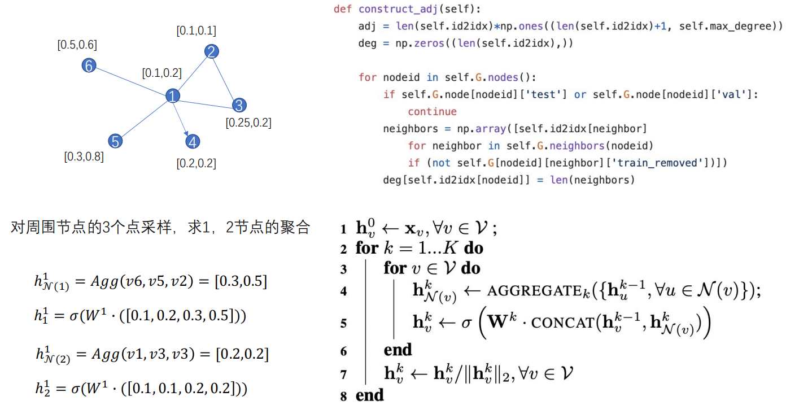
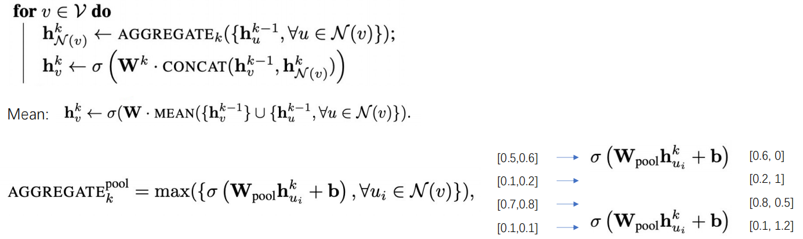

## GraphSAGE(SAmple and aggreGatE)

- 之前的graph embedding方法都是所有节点都在图中，对于没有看到过的节点是不能处理的，这种叫做直推式方法。
- 而GraphSAGE属于归纳式的方法，可以对于没见过的节点也生成embedding。
- GraphSAGE不仅限于构建embedding，也通过聚合周围邻居节点的特征。
- 归纳式：节点的局部信息和图的全局信息

## 算法流程

- 输入的是一张图G，节点的特征，做k层的GraphSAGE,矩阵权重
- 遍历k层的graphSAGE
  - 遍历所有的节点
    - 计算v节点周围的邻居节点的信息，然后将该节点上一层的所有的邻居节点的信息聚合在一起，形成v节点在第k层的邻居向量
    - 将v节点在上一层的特征向量与聚合了邻居之后的特征向量拼接在一起，再经过W参数，学习到v节点在该层的特征表示
  - 得到该层的特征表示
- 节点经过多层的graph之后，得到v节点的特征表示

## 算法示例

- 求1节点进行一次graphSAGE之后，其特征表示
  - 求1节点在第一层邻域的特征
    - 获取1节点的周围邻居（3,4,5,6），将邻居节点的上一层(0层)的特征使用聚合函数（这使用均值函数）聚合，得到 $h^1_{N(1)}$
  - 求1节点在经过一层graphSAGE之后的特征表示
    - 将1节点的第一层特征和其邻域特征拼接在一起，再经过可学习权重W，可以得到特征表示 $h^1_1$

## 邻居采样：不是对所有的周围邻居进行采样，而是采样固定长度的邻居去聚合他的信息

- 邻居数大于固定长度，取固定长度进行采样
- 邻居数小于固定长度，将所有邻居放进来，再从邻居中随机取几个的节点当做是邻居再放进来（缺几个就再取几个，可反复）
  - 如a有2个邻居，要采样3个，则在取了2个节点后，最后再从两个邻居节点中随机取1次，补全3个
- **一般做两层graphSAGE,   两层采样个数 S1*S2≤500   效果较好**

### 采样过程示例

- 首先对节点进行采样，固定采样长度为3
  - 1->4是有向边，但不是双向，因此1节点聚合其周围邻居时，不考虑4

## 聚合：将节点和周围邻居节点聚合成一个向量

- 图上的邻居节点没有顺序，因此聚合函数需满足以下性质
  - 聚合函数是对称的
  - 聚合函数对于不同输入队列顺序 ，得到的结果是不变的
- **可以使用的聚合函数**
  - Mean aggregator：也可以在均值聚合时不做拼接的操作，直接将节点本身与其邻居求均值
  - LSTM aggregator ：LSTM本身是有顺序的，但可以通过将输入节点随机排列，使得LSTM可以适用于无序集合
  - Pooling aggregator：经过Pool函数进行聚合，不仅可以使用max，其他的排列不变型的函数都可以

