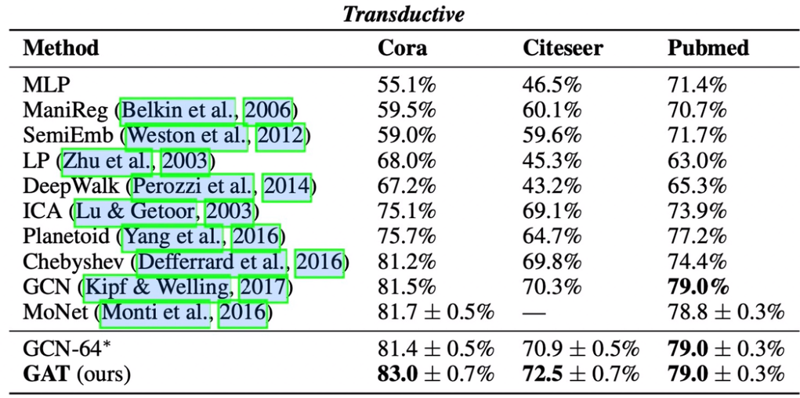

## GAT(Graph Attention Networks)

## 算法描述

- ### 求得了节点i与周围的节点的attention的系数，再通过attention的系数对节点周围的邻居节点进行一个加权求和，求得节点聚合了周围邻居之后的特征

- $\large α_{ij}$：为求得i，j节点之间的attention系数

- 对$\large h_i，h_j$向量进行可学习的参数W转换，并将其拼接在一起，再经过可学习的参数 a，得到 i j 的attention值
- 在之后对 i j 节点进行归一化操作，得到$\large α_{ij}$
  - 分母为：将所有和 i 节点相连接的邻居节点的attention值

- 通过attention的系数， i 节点所有的邻居节点 $\large h_j$，可学习的参数W  进行聚合，得到一个特征$\large h'_i $当做下一层的节点特征

### 示例

- $\large e_{ij}$为 i 节点和 j 节点的attention的值
- 其中α  ，w，$h_j$ 均为 对角线矩阵

## 多头注意力机制

在计算节点 i 与 j 的attention时，计算多次attention，通过多次attention去计算节点 i 与节点 j 的相关性，将多次attention的结果拼接在一起得到最终的注意力

- 对应公式： 

- 还有一种情况：直接连接softmax的方式
  - 如果是最后预测层，上面拼接方式是没有必要的，而是要平均值。
  - 如果是接一个全连接层，则可以拼在一起

## 实验效果

