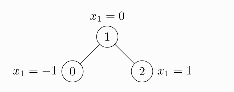

## 介绍文档  https://pytorch-geometric.readthedocs.io/en/latest/notes/introduction.html

## 构造数据Data

[`torch_geometric.data.Data`](https://pytorch-geometric.readthedocs.io/en/latest/modules/data.html#torch_geometric.data.Data)默认包含以下属性：

- `data.x`: 节点特征矩阵，形式为：`[num_nodes, num_node_features]`

- `data.edge_index`: 边的属性，COO 格式的图形连通性，[2, num_edges] ，类型为`torch.long`

- `data.edge_attr`：边的属性定义，形式为`[num_edges, num_edge_features]`

- `data.y`：要训练的目标（可能具有任意形状），*例如*，节点级分类任务：[num_nodes, *]  或图形级分类任务[1, *]

- `data.pos`: 节点位置矩阵`[num_nodes, num_dimensions]`

  ```python
  import torch
  from torch_geometric.data import Data
  
  edge_index = torch.tensor([[0, 1, 1, 2],
                             [1, 0, 2, 1]], dtype=torch.long)
  x = torch.tensor([[-1], [0], [1]], dtype=torch.float)
  
  data = Data(x=x, edge_index=edge_index)
  #输出
  output： Data(edge_index=[2, 4], x=[3, 1])
  ```

  

  `edge_index`，*即*定义所有边的源节点和目标节点的张量**不是**索引元组的列表。如果您想以另一种方式编写索引，您应该在将它们传递给数据构造函数之前转置并调用contiguous

```python
import torch
from torch_geometric.data import Data

edge_index = torch.tensor([[0, 1],
                           [1, 0],
                           [1, 2],
                           [2, 1]], dtype=torch.long)
x = torch.tensor([[-1], [0], [1]], dtype=torch.float)

data = Data(x=x, edge_index=edge_index.t().contiguous())
>>> Data(edge_index=[2, 4], x=[3, 1])

```

除了拥有许多节点级、边缘级或图形级属性外，[`Data`](https://pytorch-geometric.readthedocs.io/en/latest/modules/data.html#torch_geometric.data.Data)还提供了许多有用的实用功能

```python
print(data.keys)
>>> ['x', 'edge_index']

print(data['x'])
>>> tensor([[-1.0],
            [0.0],
            [1.0]])

for key, item in data:
    print(f'{key} found in data')
>>> x found in data
>>> edge_index found in data

'edge_attr' in data
>>> False

data.num_nodes
>>> 3

data.num_edges
>>> 4

data.num_node_features   #节点属性的shape
>>> 1

data.has_isolated_nodes()  #是否存在孤立节点
>>> False

data.has_self_loops()  #是否存在环
>>> False

data.is_directed() #是否是有向图
>>> False

# Transfer data object to GPU.
device = torch.device('cuda')
data = data.to(device)
```

## 通用基准数据集

PyG 包含大量通用基准数据集，*例如*，所有 Planetoid 数据集（Cora、Citeseer、Pubmed）、来自[http://graphkernels.cs.tu-dortmund.de](http://graphkernels.cs.tu-dortmund.de/)的所有图形分类数据集及其[清理版本](https://github.com/nd7141/graph_datasets)、QM7 和 QM9数据集，以及少数 3D 网格/点云数据集，如 FAUST、ModelNet10/40 和 ShapeNet。

初始化数据集很简单。数据集的初始化将自动下载其原始文件并将其处理为先前描述的[`Data`](https://pytorch-geometric.readthedocs.io/en/latest/modules/data.html#torch_geometric.data.Data)格式。 *例如*，要加载 ENZYMES 数据集（由 6 个类中的 600 个图组成），请键入：

```python
from torch_geometric.datasets import TUDataset

dataset = TUDataset(root='/tmp/ENZYMES', name='ENZYMES')
>>> ENZYMES(600)

len(dataset)
>>> 600

dataset.num_classes
>>> 6

dataset.num_node_features
>>> 3
```

我们现在可以访问数据集中的所有 600 个图形：

```python
data = dataset[0]
>>> Data(edge_index=[2, 168], x=[37, 3], y=[1])  #边168 37个节点 每个节点3个特征  

data.is_undirected()  #
>>> True
```

我们可以看到数据集中的第一个图包含 37 个节点，每个节点有 3 个特征。有 168/2 = 84 条无向边，并且该图恰好分配给一个类。此外，数据对象恰好持有一个图级目标。

我们甚至可以使用切片、长或布尔张量来分割数据集。 *例如*，要创建 90/10 的训练/测试拆分，请键入：

```python
train_dataset = dataset[:540]
>>> ENZYMES(540)

test_dataset = dataset[540:]
>>> ENZYMES(60)
```

如果您不确定数据集在拆分之前是否已经打乱，您可以通过运行随机排列它：

```python
dataset = dataset.shuffle()
>>> ENZYMES(600)
```

这相当于做：

```python
perm = torch.randperm(len(dataset))
dataset = dataset[perm]
>> ENZYMES(600)
```

让我们尝试另一个！让我们下载用于半监督图节点分类的标准基准数据集 Cora：

```python
from torch_geometric.datasets import Planetoid

dataset = Planetoid(root='/tmp/Cora', name='Cora')
>>> Cora()

len(dataset)
>>> 1

dataset.num_classes
>>> 7

dataset.num_node_features
>>> 1433
```

在这里，数据集只包含一个单一的、无向的引文图：

```python
data = dataset[0]
>>> Data(edge_index=[2, 10556], test_mask=[2708],
         train_mask=[2708], val_mask=[2708], x=[2708, 1433], y=[2708])  
#task_mask：节点属于测试集 则值为1 否则为0

data.is_undirected()
>>> True

data.train_mask.sum().item() #训练集
>>> 140

data.val_mask.sum().item()  #验证集
>>> 500

data.test_mask.sum().item() #测试集
>>> 1000
```

这一次，[`Data`](https://pytorch-geometric.readthedocs.io/en/latest/modules/data.html#torch_geometric.data.Data)对象为每个节点保存一个标签，以及额外的节点级属性：和`train_mask`，其中`val_mask``test_mask`

- `train_mask`表示要针对哪些节点进行训练（140 个节点），
- `val_mask`表示用于验证的节点，*例如*，执行提前停止（500 个节点），
- `test_mask`表示要测试的节点（1000 个节点）。

## 小批量

PyG 通过创建稀疏块对角邻接矩阵（由 定义`edge_index`）并在节点维度中连接特征和目标矩阵来实现小批量的并行化。这种组合允许在一批示例中使用不同数量的节点和边：

$\begin{split}\mathbf{A} = \begin{bmatrix} \mathbf{A}_1 & & \\ & \ddots & \\ & & \mathbf{A}_n \end{bmatrix}, \qquad \mathbf {X} = \begin{bmatrix} \mathbf{X}_1 \\ \vdots \\ \mathbf{X}_n \end{bmatrix}, \qquad \mathbf{Y} = \begin{bmatrix} \mathbf{Y }_1 \\ \vdots \\ \mathbf{Y}_n \end{bmatrix}\end{split}$

PyG 包含它自己的[`torch_geometric.loader.DataLoader`](https://pytorch-geometric.readthedocs.io/en/latest/modules/loader.html#torch_geometric.loader.DataLoader)，它已经处理了这个连接过程。

```python
from torch_geometric.datasets import TUDataset
from torch_geometric.loader import DataLoader

dataset = TUDataset(root='/tmp/ENZYMES', name='ENZYMES', use_node_attr=True)
loader = DataLoader(dataset, batch_size=32, shuffle=True)

for batch in loader:
    batch
    >>> DataBatch(batch=[1082], edge_index=[2, 4066], x=[1082, 21], y=[32])

    batch.num_graphs
    >>> 32
    
    x = scatter_mean(data.x, data.batch, dim=0)  #每个图单独计算节点维度中的平均节点特征
    x.size()
    >>> torch.Size([32, 21])   
```

[`torch_geometric.data.Batch`](https://pytorch-geometric.readthedocs.io/en/latest/modules/data.html#torch_geometric.data.Batch)继承自[`torch_geometric.data.Data`](https://pytorch-geometric.readthedocs.io/en/latest/modules/data.html#torch_geometric.data.Data)并包含一个名为 的附加属性`batch`。

`batch`是一个列向量，它将每个节点映射到批处理中的相应图形：

$\mathrm{batch} = {\begin{bmatrix} 0 & \cdots & 0 & 1 & \cdots & n - 2 & n -1 & \cdots & n - 1 \end{bmatrix}}^{\top}$

## 数据转换

transform 是`torchvision`变换图像和执行增强的常用方法。PyG 带有自己的转换，它期望一个[`Data`](https://pytorch-geometric.readthedocs.io/en/latest/modules/data.html#torch_geometric.data.Data)对象作为输入并返回一个新的转换[`Data`](https://pytorch-geometric.readthedocs.io/en/latest/modules/data.html#torch_geometric.data.Data)对象。[`torch_geometric.transforms.Compose`](https://pytorch-geometric.readthedocs.io/en/latest/modules/transforms.html#torch_geometric.transforms.Compose)在将处理过的数据集保存到磁盘 ( `pre_transform`) 或访问数据集中的图形之前( )可以使用和应用转换`transform`。

我们在 ShapeNet 数据集（包含 17,000 个 3D 形状点云和来自 16 个形状类别的每个点标签）上应用变换

```python
from torch_geometric.datasets import ShapeNet

dataset = ShapeNet(root='/tmp/ShapeNet', categories=['Airplane'])

dataset[0]
>>> Data(pos=[2518, 3], y=[2518])
```

我们可以通过变换从点云生成最近邻图，将点云数据集转换为图形数据集

```python
import torch_geometric.transforms as T
from torch_geometric.datasets import ShapeNet

dataset = ShapeNet(root='/tmp/ShapeNet', categories=['Airplane'],
                    pre_transform=T.KNNGraph(k=6))

dataset[0]
>>> Data(edge_index=[2, 15108], pos=[2518, 3], y=[2518])

```

## PyG构建GCN

加载 Cora 数据集：

```python
from torch_geometric.datasets import Planetoid

dataset = Planetoid(root='/tmp/Cora', name='Cora')
>>> Cora()
```

实现一个两层 GCN：

```python
import torch
import torch.nn.functional as F
from torch_geometric.nn import GCNConv

class GCN(torch.nn.Module):
    def __init__(self):
        super().__init__()
        self.conv1 = GCNConv(dataset.num_node_features, 16)
        self.conv2 = GCNConv(16, dataset.num_classes)

    def forward(self, data):
        x, edge_index = data.x, data.edge_index

        x = self.conv1(x, edge_index)
        x = F.relu(x)
        x = F.dropout(x, training=self.training)
        x = self.conv2(x, edge_index)

        return F.log_softmax(x, dim=1)
```

构造函数定义了两个[`GCNConv`](https://pytorch-geometric.readthedocs.io/en/latest/modules/nn.html#torch_geometric.nn.conv.GCNConv)层，它们在网络的前向传递中被调用。请注意，非线性没有集成在`conv`调用中，因此需要在之后应用（这在 PyG 中的所有运算符中都是一致的）。在这里，我们选择使用 ReLU 作为我们的中间非线性，最后输出一个在类数上的 softmax 分布。让我们在训练节点上训练这个模型 200 个 epoch：

```python
device = torch.device('cuda' if torch.cuda.is_available() else 'cpu')
model = GCN().to(device)
data = dataset[0].to(device)
optimizer = torch.optim.Adam(model.parameters(), lr=0.01, weight_decay=5e-4)

model.train()
for epoch in range(200):
    optimizer.zero_grad()
    out = model(data)
    loss = F.nll_loss(out[data.train_mask], data.y[data.train_mask])
    loss.backward()
    optimizer.step()
```

最后，我们可以在测试节点上评估我们的模型：

```python
model.eval()
pred = model(data).argmax(dim=1)
correct = (pred[data.test_mask] == data.y[data.test_mask]).sum()
acc = int(correct) / int(data.test_mask.sum())
print(f'Accuracy: {acc:.4f}')
>>> Accuracy: 0.8150
```