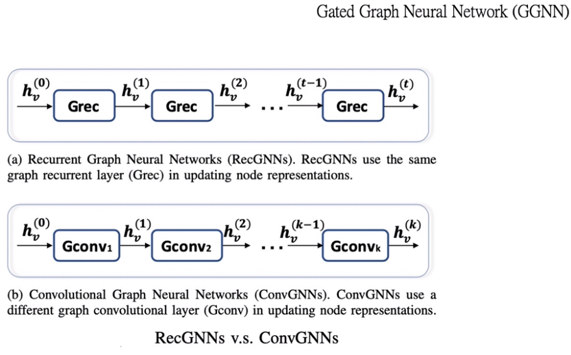
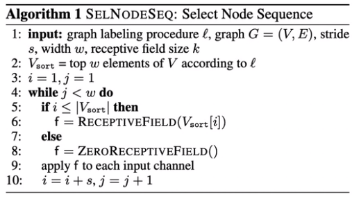

## 3.图网络大体分类

- 递归图神经网络（Recurrent Graph Neural Networks）
- 图卷积神经网络（Graph Convolution Networks）
- 图注意力网络（Graph Attention Networks）
- 图自编码器（Graph Auto-encoder）
- 图时空网络（Graph Spatial-Temporal networks）
- 图生成网络（Graph Generative Networks）
- 图强化学习（Graph Reinforcement Learning）
- 图对抗学习（Graph Adversarial Methods）

## 更通用的框架，更一般的框架分类方式

- MPNN：图神经网络和图卷积 / Message Passing neural Networks
- NLNN：统一 Attention / Non-local Neural Networks
- GN：统一MPNN和NLNN / Graph Networks

## 图计算任务框架

- 1.节点问题
- 2.边：将两个节点作为输入，输入边的预测
- 3.图：图分类/图匹配/图生成

## 图上任务类别

- 1.半监督任务：节点
- 2.有监督：图/节点
- 3.无监督：图嵌入

## 图的类别

- 异构图 ：图中点与点之间的关系，边与边之间的关系是不一样的
  - 引文网络中，用户和论文之间存在关系，论文和期刊之间存在关系，但是点的属性类型是不一样的

- 二部图：存在两部分节点 ，同一部分节点之间没有边连接，不同部分之间的节点可以有边连接
  - 用户在某个电商网站购买物品，用户与用户之间无法连接，用户和物品之间可以连接
- 多维图：点和点之间的边存在多种类型的属性
  - 一个用户可以浏览、购买物品  浏览和购买为 用户和商品之间的多种关系

- 符号图：点和点之间的边存在相反属性的关系
  - 社交网络中，用户和用户之间的关系为朋友或非朋友，属于积极或消极关系中的一种

- 超图：一条边可能会连接两个以上的点
  - 每个边所包含的定点个数相同且为k个，就可成为k阶超图，常见的图是二阶超图

- 动态图： 随着新节点被添加到图中，图在不断发展，并且新边也在不断出现。 
  - 例如，在诸如Facebook的在线社交网络中，用户可以不断与他人建立友谊，新用户也可以随时加入Facebook。 这些类型的演化图可以表示为动态图，其中每个节点或边都与时间戳关联。

## 循环神经网络（Recurrent Graph Neural Networks）

利用相同的递归参数，不断地学习节点的高层特征

- hv表示节点在当前层的特征，hu表示节点的邻居特征，求和表示聚合了节点周围邻居节点的特征
- 然后通过GRU的函数学习节点的下一层的节点表示

RGNN与GCN的不同点在于

- RGNN中间层所用的参数都一样，GCN每层所用的参数都不一样

## 图卷积神经网络 （Graph Convolution Networks）

- GCN,GraphSAGE  ：利用节点和节点周围的信息，不断聚合，得到节点的高层表示，认为邻居节点具有一个排列物边径

- ### PATCH-SAN ：

  - 首先得到节点周围的邻居信息
  - 然后得到邻居信息的一个有序的排列
  - 
    - 首先选择红色节点，绿色节点表示对红色节点的一节邻居节点，黄色表示二阶节点
    - 每个邻居节点的选择顺序根据节点的度来定义，按照一阶度、二阶度的顺序对节点进行排序，然后形成一个有顺序的序列，
    - 之后采用CNN的方式进行训练
  - 算法流程：

  ## 图注意力网络 GAT

  通过attention系数 加权求和 邻居节点的信息 学习节点的下一层特征表示

  ## 图自编码器（Graph Auto-encoder）

  - ### GAE（Auto-encoder）

    - 输入一张图，然后通过一层GCN学习到图的一个隐层节点的特征表示
    - 再求隐层节点与其特征的转置 做内积  即可还原出一张图
    - 然后计算输入图和输出图的结构性误差，将其当做损失函数，求损失函数的最小值
    - 然后就可以学习到encoder的GCN的参数
    - 
    - 与深度学习的 Auto-encoder类似，将encoder换成GCN，将decoder换成特征与其转置相乘

  - ### VGAE(VAE)

    - 输入一张图，经过两层的GCN，第一层GCN共享参数，第二层GCN学习两个参数，然后将两个参数组合在一起，得到一个向量表示
    - 然后通过 节点与其特征的转置 做内积，即可还原出一张图
    - 然后计算输入图和输出图的结构性误差，将其当做损失函数，求损失函数的最小值
    - 然后就可以学习到encoder中的GCN的参数的值
    - 

  ## 图时空网络（Graph Spatial-Temporal networks）

  - 同时考虑图的 **空间性** 和 **时间性** 的维度
    - 比如在交通领域，速度传感器会随着时间的维度不断变化，不同的传感器之间在空间中也会形成连接空间维度的边
    - 当前的许多方法都应用GCN来捕获图的依赖性，使用一些 RNN 或 CNN 来求取时间的依赖性

  ## 图生成网络（Graph Generative Networks）

  - 通过 RNN 或 GAN 的方式生成网络
  - 有前景的应用领域 ：化合物合成
    - 在化学图中，原子被视为节点，化学键被视为边
    - 起任务是发现具有某些化学和物理性质的新的可合成分子

  ## 图强化学习（Graph Reinforcement Learning）

  - 采用强化学习的方法，应用在图网络

  ## 图对抗学习（Graph Adversarial Methods）

  - 将GAN的思想引入到图网络
  - 用生成器生成样本
  - 然后用分类器去判别样本

  ## MPNN：Message Passing Neural Networks 消息传递网络

  - 消息传递阶段
    - 消息传递函数 Mt：聚合  节点和其周围邻居节点以及边的信息
      - 
    -  更新函数 Ut：通过节点的本身向量，以及消息传递函数聚合的特征  更新节点的下一层特征表示
      - 
  - ReadOut阶段
    - 将消息传递阶段得到的每一个节点的特征组合在一起经过一个R函数，得到图的特征表示
      - $\hat y = R({h^T_v | v ∈ G})$
      - ReadOut函数需要满足的条件：保证节点排列的不变性
  
  - 为何说其统一了图卷积网络？
    - Mt函数聚合了节点本身以及周围邻居节点的信息
    - 如果其是GCN，就相当于做了第一层的本身节点的自连接($h_v^t$)以及邻居节点($h^t_w,e_{vw}$)的聚合
    - 如果其是GraphSAGE,Mt函数相当于对周围邻居节点进行采样，然后通过Ut函数将本节点($h_v^t$)以及周围邻居节点的信息($m^{t+1}_v$)进行聚合得到下一层的节点表示
    - Readout函数相当于将所有的节点特征放在一起，学习图的特征表示
  
  
  ## NLNN：Non-local Neural Networks 非局部的神经网络
  
  
  
  - 聚合所有与i节点相关联的j节点的信息，做一个求和
  - 再用归一化的方式，求得新的特征表示
  - 其中：ij节点之间的关系可以使用许多变异的关系函数来求得，如
    - 
  - 为何说统一了自注意网络
    - $f(x_i,x_j)$相当于attention的系数
      - 如果是应用在GAT上，就相当于是i节点与j节点拼接之后，再使用一个α向量去求attention的系数
    - $g(x_j)$相当于是邻居节点经过一个函数转换，然后与不同的attention系数  进行求和得到下一层节点 的表示
  
  ## GN：Graph Network
  
  - ### GN block
  
    - 更新函数
      - $e'_k$：更新边后的特征，$\overline v'_i$：更新节点后的特征， u' ：更新全局后的特征
      - $r_k$表示receiver节点的索引，$s_k$表示sender节点的索引，$e_k$ 表示边的属性，u表示一个全局属性
      - $v_{r_k}$ ，$v_{s_k}$
    - 聚合函数
      -  $\overline e'_i$：聚合邻居后的特征，  $\overline e'$：更新所有边后的特征，  $\overline v'：$更新所有点后的特征
    - 算法流程
      - 
      - 遍历所有的边，根据边和点的特征，更新所有的边
      - 遍历所有的点，通过下面三个操作，得到所有更新节点的属性
        1. 将所有更新之后的边特征和点聚合在一起，得到点的邻居的信息
        2. 将点的领域信息聚合在一起，得到点得周围领域聚合之后的特征表示
        3. 将聚合之后的边的特征与节点本身的特征在加上全局属性，得到节点新的特征表示
      - 再使用全局更新函数更新全局边的信息，点信息
      - 然后使用更新完的边和点的属性，加上之前的全局属性 更新一个全局属性u’
  
  - 示例
  
    - 
    - 执行流程
      - 
  
  - GN网络如何统一MPNN和NLNN？
  
    - 
    - 
  
  