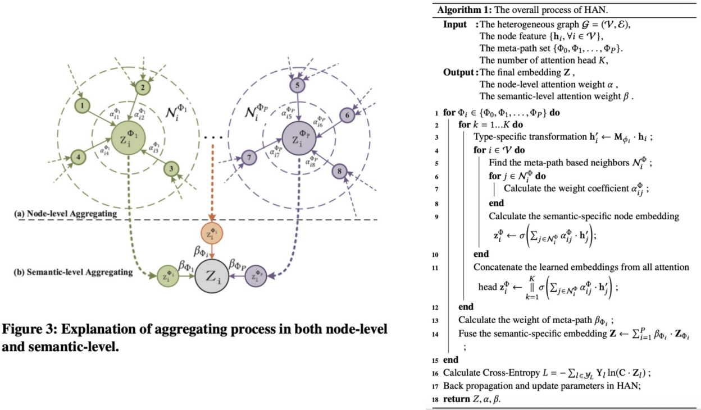

## HAN:Heterogeneous Graph Attention Network

> WWW2019

## 前置知识：

- 异构图：包含不同类型节点和链接的异构图
  - 

- Meta-path 元路径： 链接两个对象的复合关系，是一种广泛适用的捕获语义的结构 M-A-M,M-D-M
  - 

- Meta-path下的邻居节点 m1-a1-m2,m1-a3-m3，m1-a1-m1   因此m1的邻居节点如d图

## HAN算法原理

- ### 节点级别的Attention

  - 
  - 终结者通过詹姆斯卡梅隆与终结者2形成连接关系，终结者通过詹姆斯卡梅隆与泰坦尼克号形成连接关系，形成同构图
  - 根据它的邻居节点终结者2和泰坦尼克号，通过一种聚合方式，可以学习到终结者的特征表示

- ### 语义级别的Attention：旨在了解每个元路径的重要性，并为其分配适当的权重

  - 通过不同的Meta-path得到了终结者电影所对应的一个节点特征，然后将两个特征进行特征求和
  - 不同类型的邻居分配不同的权重，最终得到终结者所对应的一个节点的特征表示
    - 

## 节点级别的Attention 具体算法

- $h'_i = M_{\phi_i}·h_i$
  - 当节点处在不同维度（节点特征数量不一致时）时，先将节点映射到同一个维度
- 
- $e^\phi_{ij} = att_{node}(h'_i,h'_j,\phi)$
  - $\phi$表示Meta-path，$att_{node}$将 i和j 输入后 得到他们之间的attention的值
  - 1节点的周围邻居为 $e^{\phi_0}_{11},e^{\phi_0}_{12},e^{\phi_0}_{13},e^{\phi_0}_{16}$
- $a^\phi_{ij}= softmax_j(e^\phi_{ij})$   ：对其做归一化操作，得到归一化之后的一个attention系数
- $Z^\phi_i$   ：将attention的系数与他的邻居做一个加权求和，再经过一个激活函数，得到节点所对应的特征表示
  - 如1节点的  ： $z^{\phi_0}_1 = (\alpha^{\phi_0}_{11}* e^{\phi_0}_{11}+…)$
  - 求得所有节点不同类型的Meta-path下的embedding结果
    - $Z_{\phi_0}$ = {$z^{\phi_0}_1,z^{\phi_0}_2,z^{\phi_0}_3...$}
    - $Z_{\phi_1}$ = {$z^{\phi_1}_1,z^{\phi_1}_2,z^{\phi_1}_3...$}

## 语义级别的attention

- 根据之前的公式 求得两种Meta-path所对应的embedding
  - $Z_{\phi_0}$ = {$z^{\phi_0}_1,z^{\phi_0}_2,z^{\phi_0}_3...$}				$Z_{\phi_1}$ = {$z^{\phi_1}_1,z^{\phi_1}_2,z^{\phi_1}_3...$}
- 
  - 经过一个全连接层W·$z^\phi_i$+b,然后经过一个激活函数tanh，再乘以一个可学习参数q，得到节点在该Meta-path下的一个标量
  - 然后对所有的节点做一个加权求和再除以节点数量
  - 就能得到在$\phi_i$这个Meta-path下的对应的系数
  - 示例
    - 
- 
  - 再将所有通过同种的Meta-path的$W\phi_i$进行一个softmax操作，进行归一化
- 
  - 最后将起进行加权求和，得到节点最终所要求的embedding

## HAN整体的算法流程

- **输入**：异构图，初始节点特征，事先规定的meta-path，多头注意力数量 K
- **输出**：每一个节点最终的embedding Z，节点级别的attention系数 α， 语义级别的attention系数 β
- 首先，遍历每个Meta-path
  - 遍历每一个注意力
    - 进行投影，将节点放到同一个维度
    - 然后遍历每一个节点
      - 找到节点所对应的Meta-path下的邻居节点
      - 遍历每一个邻居节点
        - 对每个找到的邻居节点根据GAT的方式，求得该节点与其每个邻居节点的attention系数$α^\phi_{ij}$
      - 根据邻居节点，对其进行加权求和，得到该Meta-path下所对应的embedding
    - 如果是多头注意力K≥2，将每个计算到的embedding进行一个拼接
  - 然后计算语义级别的attention $β_{\phi_i}$
  - 对所有Meta-path下的 $β_{\phi_i}$进行加权求和得到节点最终的特征表示Z
- 根据  Cross-Entropy 用节点的特征和其所属类别，求得一个损失函数
- 然后进行反向传播，学习HAN所对应的参数
- 然后得出 Z,α，β

## 数据集

引文网络：DBLP、ACM

电影数据集：IMDB

## 实验结果对比

- Deepwalk主要应用于同构图上，因此忽略了图的异构性
- 先采用Meta-path的方式，将异构图转换成同构图，再采用GCN、GAT的方式去求
- HANnd,表示去除节点的attention，将节点的attention都当做是同一个值，将每个节点和其邻居都赋予相同的权重
- HANsem表示去除Meta-path下的权重，基于每个Meta-path都是相同的权重（在上图转换过程中的tanh(W*Z+b) ）

## 分析Attention的重要性

- HAN的一个显著特性是结合了层次机制，在学习代表性前如何考虑了节点邻居和元路径的重要性
- 节点级别
  - 
  - 图中同颜色的节点所属同一类别，相同类别的attention相对于不同类别的会比较高
- 语义级别
  - 
  - NMI表示聚类的评价指标，NMI指标越高 ，Meta-path重要性就越高
