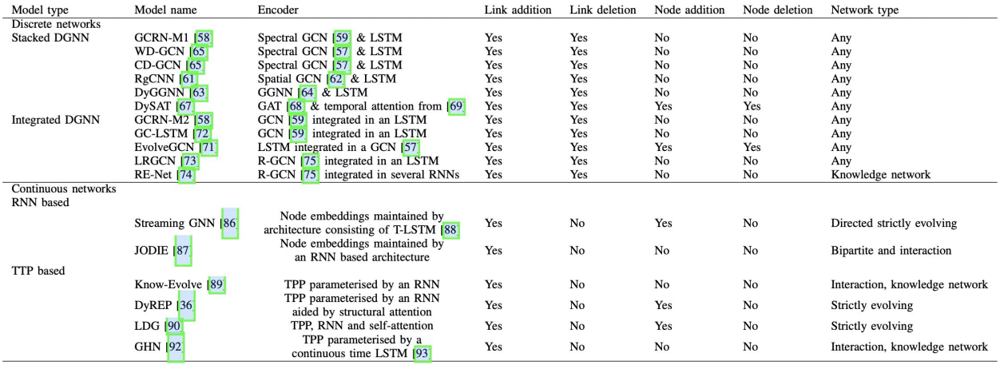

### 动态网络为网络建模和预测增加了新的维度-时间

- 这个新的维度从根本上影响网络属性，使网络数据更强大地表示出来，进而提高使用此类数据的方法的预测能力

------

# 1.按不同类型划分网络

## 1.1按照时间粒度——划分网络：

- Static(静态图)：不关注图中的动态信息，将其作为一张静态图同等处理

- edge weighted(边加权)：动态信息知识作为一张静态图中的节点和边的labels而存在

- ### **discrete（离散时间）：离散表示使用一组有序的图（快照）来表示动态图**
  
  - 在一个连续的时间内，按照时间进行切片，在每一个时间切片内得到一个图，然后对图采用GNN聚合图的信息
  - 对于时间的方式，采用RNN得到时间序列的信息，
  
- ### **continuous networks（连续时间）：使用确切时间信息来表示动态图**

- 静态网络最粗糙，连续表示最精细，随着时间粒度的增加，模型的复杂性也随之增加

- 主要研究：**离散时间和连续时间**

### 1.1.1离散表示：DG={$G^1,G^2,..,G^T$},   T--快照数，在每一个时间间隔内形成一个图

### 1.1.2连续表示：可分为三种

1. ##### 基于链接持续时间的动态网络的表示  ：

   - EB={($u_i,v_i,t_i,\Delta_i$)；i = 1，2，... } 
     -  $u_i,v_i$表示发生事件的一对节点，$t_i$-发生时间，$\Delta_i$-持续时间
   - 例：u和v在t时刻发生事件，事件持续事件为$\Delta_i$

2. ##### 在接触序列中，链接是瞬时发生的，不存在持续时间，如电子邮件的发送

   - EB={($u_i,v_i,t_i$)；i = 1，2，... } 
   - 例：u和v在t时刻发生的事件

3. ##### 基于事件的表示，它将链接的出现和链接的消失视为单独的事件

   - GS={$e_1,e_2,...$}  
     - $e_i = (u_i,v_i,t_i,\delta_i)$,$\delta_i$∈{-1,1}表示消失边和出现边
   - 例：u在t1时刻关注v，出现了边$\delta$ = 1，$e_1 = (u_1,v_1,t_1,1)$
   - 例：u在t2时刻取消关注了v，出现了边$\delta$ = -1，$e_2 = (u_2,v_2,t_2,-1)$

------

## 1.2按照链接持续时间——划分网络

- **Interaction networks：接触型时间网络，其中的链接是瞬时时间。如电子邮件的发送**
- **Temporal networks：时序网络，边有一定的持续时间，但比较短。比如社交网络中，人与人的交谈**
- **Evolving networks：演化型网络，链接持续存在的时间如此长，比如雇佣关系**
- **Strictly evolving networks：严格的演化型网络，链接出现后就会一直出现，比如引文网络**

------

## 1.3按照节点动态——划分网络

- static：节点数量在一段时间内保持不变
- Dynamic：节点可能出现和消失

# 2动态图网络算法

- ## 离散网络

  - **Stacked DGNNs（堆叠DGNN） 单独的GNN处理图的每个快照，并将每个GNN输出到RNN模型中进行时序的处理**

  - **Integrated DGNNs（集成DGNN）将gnn和rnn结合在一层，从而结合空间和时间信息的建模。**

- ## 连续网络

  - **基于RNN的方法**

  - **基于点过程的方法**

- 

