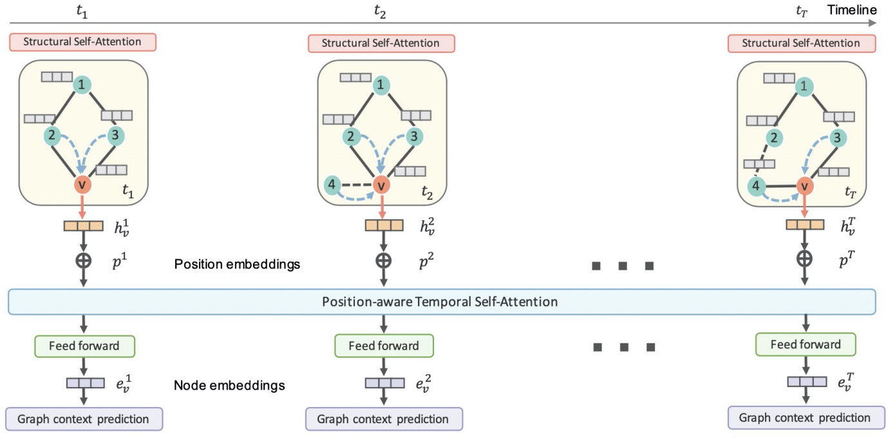
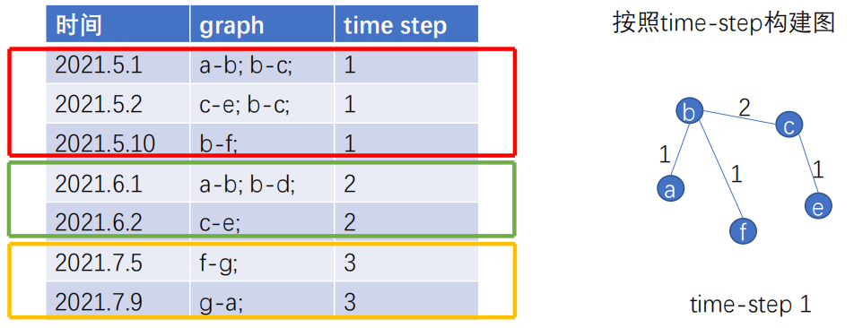
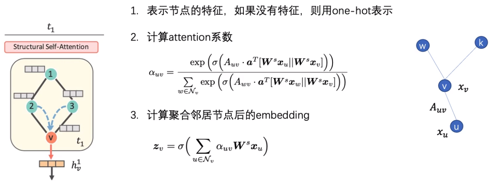
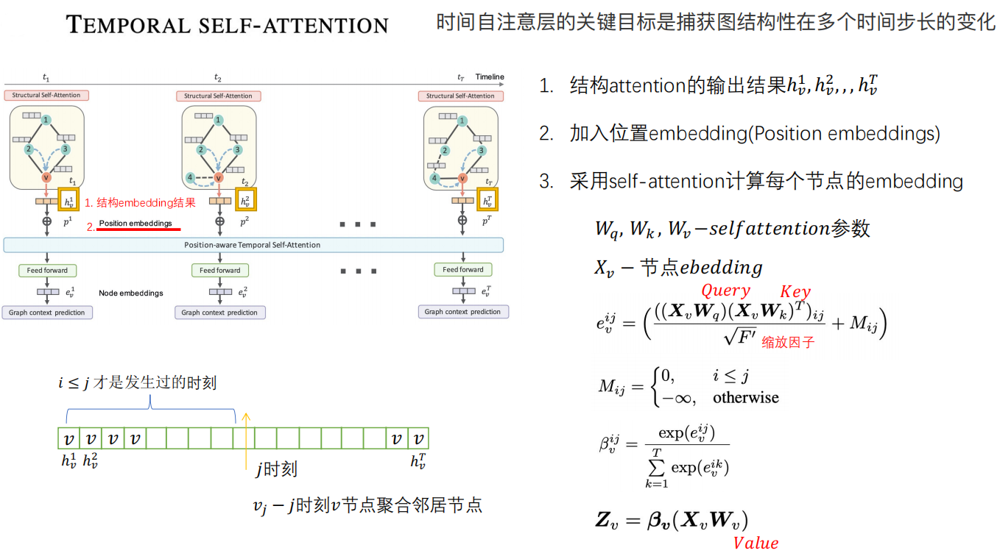
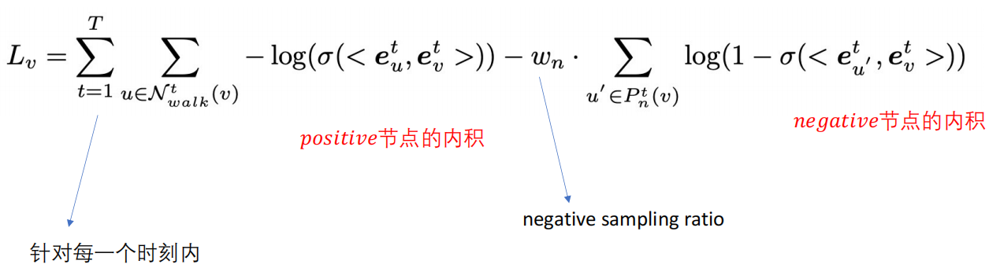
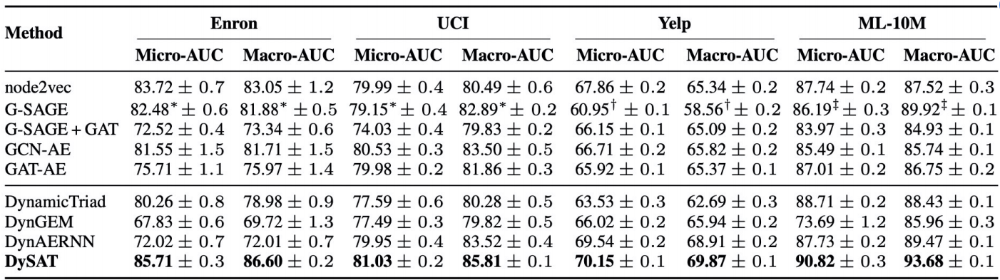
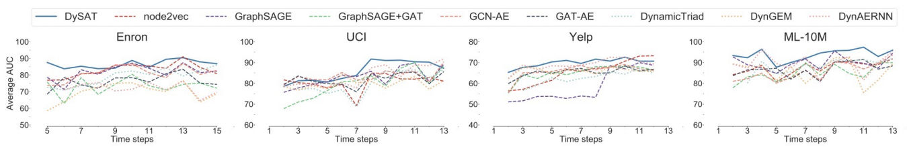

## Dynamic Self-Attention Network：[Deep Neural Representation Learning on Dynamic Graphs via Self-Attention Networks]

> WSDM2020

离散型动态GNN，属于堆叠DGNN，是基于GNN和RNN的组合：

- 在每个快照中使用GNN作为特征提取器聚合节点特征，然后在每个快照中使用RNN聚合时间特征来进一步聚合节点的特征

## 算法流程

- 

  - 按照时间划分t个快照，

  - 在每个快照里都形成一个图，

  - 采用GNN的方式聚合节点与其周围邻居的信息，

  - 得到每个时刻里节点的embedding，

  - 之后采用RNN的方式去聚合时间信息，

  - 得到节点在每个时刻所具有的embedding

## 0.创建数据示例

- 根据离散型数据构建，也就是快照的方式。Time step 按月进行分割
  - 

## 1.构造Self-Attention

- 
  - 聚合方式与GAT大致类似，只是在计算Attention时，增加了边的权重(Auv)

## 2.时域Self-Attention计算

- 时间自注意层的关键在捕获图结构性在多个时间步长的变化
  - 
    - 位置embedding就是我们所要学习的embedding
    - Query*Key得到self-attention的值，除以缩放因子进行归一化
    - $M_{ij}$表示 求 j 时刻聚合v节点的信息，i ≤ j时，才是j时刻可以观测到的信息，可以聚合，i > j表示未来的信息，不进行聚合
    - $\beta ^{ij}_v$ softmax方式求节点v所有时刻的attention系数，Zv 加权求和得到每个时刻的embedding

## 3.求LOSS

- 在每个时间步，采用随机游走的方式，获得节点u的上下文节点v，构建正样本 ，负样本采用负采样方式获得
  - 
    - 本质上是一个逻辑回归的损失函数

## 4.实验效果

- 在数据集上的效果
  - 

- 性能上的比较
  - 
    - 在某些时间步长处静态嵌入方法的性能急剧下降