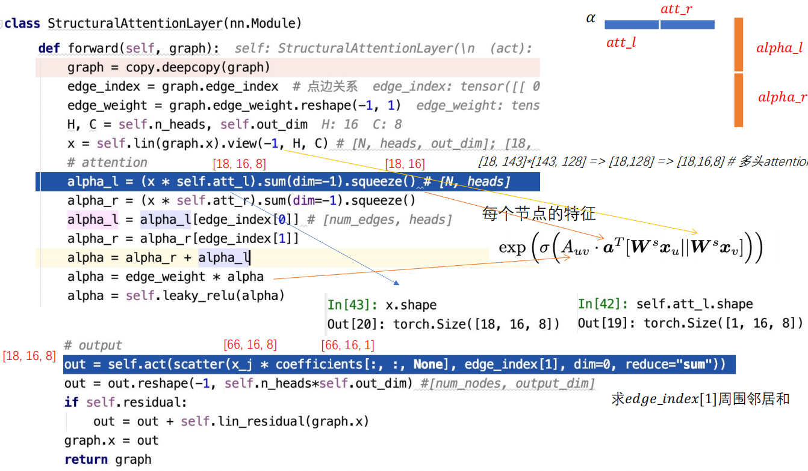
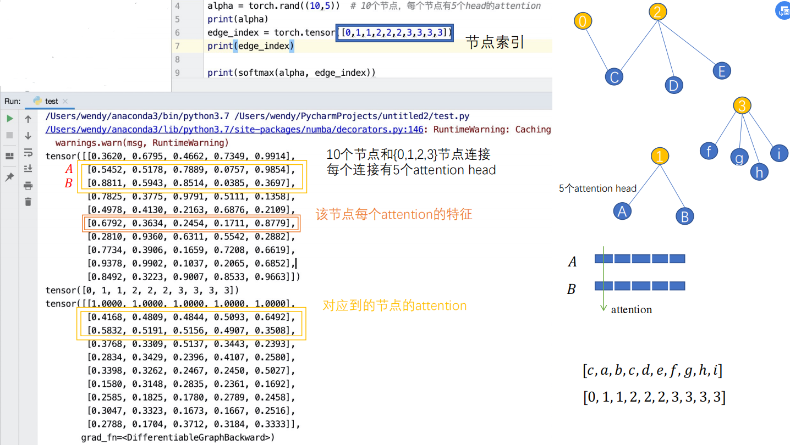
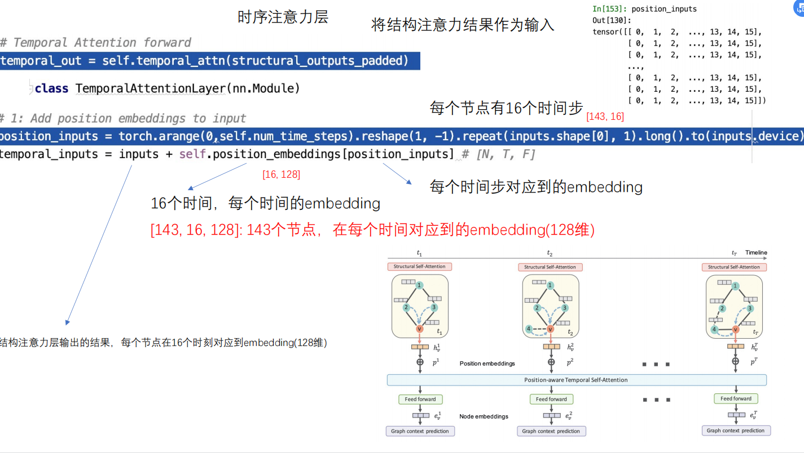
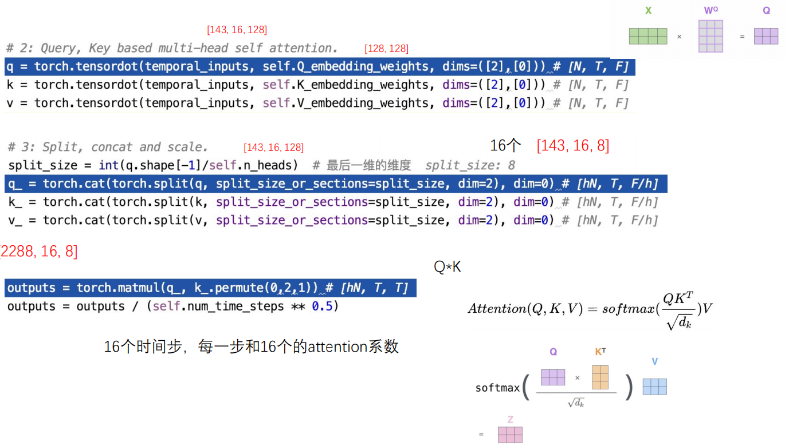

## 数据预处理 

-  raw_data/Enron下文件  vis.graph.nodeList.json  
  - id：节点id
  - name：节点的信息
  - idx：id的索引
-  raw_data/Enron下文件  vis.diagraph.allEdges.json  
  - id：节点id
  - name：两个节点的信息 使用 "_ " 拼接
  - time：表示当前时刻有边连接+
- 处理数据代码：DySAT_pytorch\raw_data\Enron\process.py

## 正式过程

### 导入数据，构建图节点

```python
#graphs, feats, adjs = load_graphs(args.dataset)
graphs, adjs = load_graphs(args.dataset)  # 导入数据
if args.featureless == True:  # 创建单位阵  # 最后一个时间点包括的节点数量
    feats = [scipy.sparse.identity(adjs[args.time_steps - 1].shape[0]).tocsr()[range(0, x.shape[0]), :] for x in adjs if
         x.shape[0] <= adjs[args.time_steps - 1].shape[0]]  # 选择需要的时间点; 构建ont-hot特征
```

- adjs[args.time_steps - 1].shape:求最后一张图的节点数量
- scipy.sparse.identity(adjs[args.time_steps - 1].shape[0])：建立one-hot编码格式   
- x.shape[0] <= adjs[args.time_steps - 1].shape[0]] :根据之前理论图的节点数会随着时间的增加而增多，因此判断当前节点是否大于图的本身节点数，大于则构建ont-hot特征

```python
assert args.time_steps <= len(adjs), "Time steps is illegal"
# node2vec的训练语料; 16个garph 和 16个节点特征;
context_pairs_train = get_context_pairs(graphs, adjs)  # 16个图，每个图中进行随机游走采样;
```

- **之后进入get_context_pairs方法 ：在utils/preprocess.py**

  - ```python
    def get_context_pairs(graphs, adjs):
        """ Load/generate context pairs for each snapshot through random walk sampling."""
        print("Computing training pairs ...")
        context_pairs_train = []
        for i in range(len(graphs)):
        	#遍历每一个时间步骤，然后进行随机游走
            context_pairs_train.append(run_random_walks_n2v(graphs[i], adjs[i], num_walks=10, walk_len=20))
        return context_pairs_train
    ```

    - 进入run_random_walks_n2v函数：在utils/utilities.py

    - ```python
      def run_random_walks_n2v(graph, adj, num_walks, walk_len):
          """ In: Graph and list of nodes
              Out: (target, context) pairs from random walk sampling using 
              the sampling strategy of node2vec (deepwalk)"""
          nx_G = nx.Graph() #建立一个空图
          for e in graph.edges():
              nx_G.add_edge(e[0], e[1])  # 添加节点; 重复只保留一次; 只将有连接的节点保留，没有连接的去掉（因为在构图时，将之前的节点加入了）
          for edge in graph.edges():
              nx_G[edge[0]][edge[1]]['weight'] = adj[edge[0], edge[1]]  # 连接的边的权重; 也就是连接的次数
          # node2vec随机游走
          G = Graph_RandomWalk(nx_G, False, 1.0, 1.0)
      ```

      - 进入Graph_RandomWalk：在utils/random_walk.py

      - 调用Graph_RandomWalk类的方法计算随机游走的概率

        - ```python
          def preprocess_transition_probs(self):
              G = self.G  # G.adj
              is_directed = self.is_directed  #是否是有向图
          
              alias_nodes = {}
              for node in G.nodes():  # 节点到下一个节点的采样概率
                  unnormalized_probs = [G[node][nbr]['weight'] for nbr in sorted(G.neighbors(node))]  # 节点与邻居节点连接边的权重
                  norm_const = sum(unnormalized_probs) #求和
                  normalized_probs =  [float(u_prob)/norm_const for u_prob in unnormalized_probs]  # 归一化
                  alias_nodes[node] = alias_setup(normalized_probs)  # alias采样，目的是降低时间复杂度
          
              alias_edges = {}
              triads = {}
          
              if is_directed:
                  for edge in G.edges():
                      alias_edges[edge] = self.get_alias_edge(edge[0], edge[1])
              else:
                  for edge in G.edges():  # node2vec的采样概率
                      alias_edges[edge] = self.get_alias_edge(edge[0], edge[1])  # node2vec随机游走的概率
                      alias_edges[(edge[1], edge[0])] = self.get_alias_edge(edge[1], edge[0])  # 有向边计算
          
              self.alias_nodes = alias_nodes  # 节点到下个节点的概率（第一次游走使用）
              self.alias_edges = alias_edges  # node2vec采样概率
              return
          ```

          - 进入函数 get_alias_edge

          - ```python
            def get_alias_edge(self, src, dst):
                G = self.G
                p = self.p
                q = self.q
            
                unnormalized_probs = []
                for dst_nbr in sorted(G.neighbors(dst)):  # dst终止节点的邻居节点
                    #node2vec的三种节点概率计算公式
                    if dst_nbr == src:  #邻居节点==初始节点
                        unnormalized_probs.append(G[dst][dst_nbr]['weight']/p)  # node2vec向回走概率
                    elif G.has_edge(dst_nbr, src):
                        unnormalized_probs.append(G[dst][dst_nbr]['weight'])
                    else:
                        unnormalized_probs.append(G[dst][dst_nbr]['weight']/q)
                norm_const = sum(unnormalized_probs)
                normalized_probs =  [float(u_prob)/norm_const for u_prob in unnormalized_probs]  # 下一次游走的概率
                
                return alias_setup(normalized_probs)
            ```

      - 以上执行完Graph_RandomWalk(),继续向下

      - ```python
        G.preprocess_transition_probs()  # 游走概率计算
        walks = G.simulate_walks(num_walks, walk_len)  # 随机游走
        ```

        - 进入simulate_walks()

        - ```python
          def simulate_walks(self, num_walks, walk_length):
              G = self.G
              walks = []
              nodes = list(G.nodes())
              for walk_iter in range(num_walks):  # 每个节点遍历的次数
                  random.shuffle(nodes)
                  for node in nodes:
                      walks.append(self.node2vec_walk(walk_length=walk_length, start_node=node))
          
              return walks
          ```

          - 进入node2vec_walk

          - ```python
            def node2vec_walk(self, walk_length, start_node):
                G = self.G
                alias_nodes = self.alias_nodes  
                alias_edges = self.alias_edges
            
                walk = [start_node]
            
                while len(walk) < walk_length:  # 游走长度20
                    cur = walk[-1]  #获取当前节点
                    cur_nbrs = sorted(G.neighbors(cur))  # 按照节点的邻居节点排序进行概率选择;
                    if len(cur_nbrs) > 0:
                        if len(walk) == 1:  # 初始节点
                            # alias采样，得到概率
                            walk.append(cur_nbrs[alias_draw(alias_nodes[cur][0], alias_nodes[cur][1])]) 
                        else:
                            prev = walk[-2]
                            next = cur_nbrs[alias_draw(alias_edges[(prev, cur)][0],  # node2vec
                                alias_edges[(prev, cur)][1])]
                            walk.append(next)
                    else:
                        break
                return walk
            ```

      - 执行完之后，得到所有采样序列，继续向下

      - ```python
        WINDOW_SIZE = 10  #规定所取窗口值大小
        pairs = defaultdict(list)
        pairs_cnt = 0
        for walk in walks:
            for word_index, word in enumerate(walk):
                for nb_word in walk[max(word_index - WINDOW_SIZE, 0): min(word_index + WINDOW_SIZE, len(walk)) + 1]:  # 该节点的window上下文节点
                    if nb_word != word:
                        pairs[word].append(nb_word)  # 和本身节点不同，则作为一对训练语料
                        pairs_cnt += 1
        print("# nodes with random walk samples: {}".format(len(pairs)))
        print("# sampled pairs: {}".format(pairs_cnt))
        return pairs  
        ```

- **执行完以上所有，返回到train.py，返回所有得到的上下文节点**

```python
# 只是对最后一张图中边进行了处理：如果上张图中没有该节点，则不计算这条边的label
train_edges_pos, train_edges_neg, val_edges_pos, val_edges_neg, \
    test_edges_pos, test_edges_neg = get_evaluation_data(graphs)
print("No. Train: Pos={}, Neg={} \nNo. Val: Pos={}, Neg={} \nNo. Test: Pos={}, Neg={}".format(
    len(train_edges_pos), len(train_edges_neg), len(val_edges_pos), len(val_edges_neg),
    len(test_edges_pos), len(test_edges_neg)))
```

- 进入函数get_evaluation_data：在utils/preprocess.py中

  - ```python
    def get_evaluation_data(graphs):
        """ Load train/val/test examples to evaluate link prediction performance"""
        eval_idx = len(graphs) - 2  #获取倒数第二张图
        eval_graph = graphs[eval_idx]  # 训练语料, data
        next_graph = graphs[eval_idx+1]  # 测试集下一个图,label
        print("Generating eval data ....")
        train_edges, train_edges_false, val_edges, val_edges_false, test_edges, test_edges_false = \
            create_data_splits(eval_graph, next_graph, val_mask_fraction=0.2,  # 创建数据
                                test_mask_fraction=0.6)
    
        return train_edges, train_edges_false, val_edges, val_edges_false, test_edges, test_edges_false
    ```

    - 进入函数create_data_splits

    - ```python
      def create_data_splits(graph, next_graph, val_mask_fraction=0.2, test_mask_fraction=0.6):
          edges_next = np.array(list(nx.Graph(next_graph).edges()))  # next_graph涉及到的所有edge
          edges_positive = []   # Constraint to restrict new links to existing nodes.
          for e in edges_next:
              if graph.has_node(e[0]) and graph.has_node(e[1]):  # 上一时刻图中是否有该节点
                  edges_positive.append(e)  # positive的边
          edges_positive = np.array(edges_positive) # [E, 2]
          edges_negative = negative_sample(edges_positive, graph.number_of_nodes(), next_graph)  # 负采样
      ```

      - 进入函数negative_sample进行负采样

      - ```python
        def negative_sample(edges_pos, nodes_num, next_graph):
            edges_neg = []
            while len(edges_neg) < len(edges_pos):  # 采样和positive同等数量的边
                idx_i = np.random.randint(0, nodes_num)  # 随机选择i,j节点
                idx_j = np.random.randint(0, nodes_num)
                if idx_i == idx_j:  # 自连接
                    continue
                if next_graph.has_edge(idx_i, idx_j) or next_graph.has_edge(idx_j, idx_i):  # pos的边
                    continue
                if edges_neg:
                    if [idx_i, idx_j] in edges_neg or [idx_j, idx_i] in edges_neg:  # 存在之前的数据
                        continue
                edges_neg.append([idx_i, idx_j])
            return edges_neg
        ```

      - 负采样执行完后，返回到函数create_data_splits继续向下

      - ```python
        # 划分训练集，测试集，验证集
        train_edges_pos, test_pos, train_edges_neg, test_neg = train_test_split(edges_positive, 
                edges_negative, test_size=val_mask_fraction+test_mask_fraction)
        val_edges_pos, test_edges_pos, val_edges_neg, test_edges_neg = train_test_split(test_pos, 
                test_neg, test_size=test_mask_fraction/(test_mask_fraction+val_mask_fraction))
         return train_edges_pos, train_edges_neg, val_edges_pos, val_edges_neg, test_edges_pos, test_edges_neg
        ```

- **划分好训练、验证、测试集之后，继续向下**

```python
# 创建包括下张图的所有节点，但只保留这一层的边
# inductive testing.
new_G = inductive_graph(graphs[args.time_steps-2], graphs[args.time_steps-1])  # 下一层的所有点，都放到数据集中
graphs[args.time_steps-2] = new_G
adjs[args.time_steps-2] = nx.adjacency_matrix(new_G) #更新邻接矩阵
feats[args.time_steps-2] = feats[args.time_steps-1] #更新节点特征
```

- **定义dataset**

- ```python
  # build dataloader and model
  device = torch.device('cuda' if torch.cuda.is_available()  else 'cpu')
  dataset = MyDataset(args, graphs, feats, adjs, context_pairs_train)
  ```

  - 进入MyDataset类：在utils/minibatch.py

  - ```python
    def __init__(self, args, graphs, features, adjs,  context_pairs):
        super(MyDataset, self).__init__()
        self.args = args
        self.graphs = graphs  # 所有时刻的图
        self.features = [self._preprocess_features(feat) for feat in features]  # 16个图和16个图中的特征,并归一化
        self.adjs = [self._normalize_graph_gcn(a)  for a  in adjs]  # 邻接矩阵归一化操作
        self.time_steps = args.time_steps
        self.context_pairs = context_pairs  # 随机游走序列
        self.max_positive = args.neg_sample_size  # 负采样数量
        self.train_nodes = list(self.graphs[self.time_steps-1].nodes()) # all nodes in the graph. 所有的节点
        self.min_t = max(self.time_steps - self.args.window - 1, 0) if args.window > 0 else 0  # 最小时间步==0
        self.degs = self.construct_degs()  # 计算每个时间步图中节点的度
        self.pyg_graphs = self._build_pyg_graphs()  # 定义dataloader
        self.__createitems__()  # 创建训练语料
    ```

    - 其中_build_pyg_graphs函数，构造数据集list

      - ```python
        def _build_pyg_graphs(self):
            pyg_graphs = []
            for feat, adj in zip(self.features, self.adjs):  # 特征和邻接矩阵
                x = torch.Tensor(feat)  # 特征转换成tensor
                edge_index, edge_weight = tg.utils.from_scipy_sparse_matrix(adj)  # 将稀疏矩阵转换成index和value的形式
                data = Data(x=x, edge_index=edge_index, edge_weight=edge_weight)  # 定义data
                pyg_graphs.append(data)
            return pyg_graphs
        ```

    - 其中_createitems函數，

      - ```python
        def __createitems__(self):
            self.data_items = {}
            for node in list(self.graphs[self.time_steps-1].nodes()):  # 所有节点
                feed_dict = {}
                node_1_all_time = []
                node_2_all_time = []
                for t in range(self.min_t, self.time_steps):  # 遍历所有的时间步
                    node_1 = []
                    node_2 = []
                    if len(self.context_pairs[t][node]) > self.max_positive:  # 每个节点随机游走后的上下文训练pair
                        node_1.extend([node]* self.max_positive)  #大于规定的pos采样数量
                        node_2.extend(np.random.choice(self.context_pairs[t][node], self.max_positive, replace=False))  # 随机选择10个训练语料
                    else:  # 如果上下文节点数量小于采样数
                        node_1.extend([node]* len(self.context_pairs[t][node]))  # 不抽样
                        node_2.extend(self.context_pairs[t][node])
                    assert len(node_1) == len(node_2)
                    node_1_all_time.append(node_1)
                    node_2_all_time.append(node_2)
        
                node_1_list = [torch.LongTensor(node) for node in node_1_all_time]  # 节点在每个时间步转成torch
                node_2_list = [torch.LongTensor(node) for node in node_2_all_time]
                node_2_negative = []  # 负采样
                for t in range(len(node_2_list)):  # 每个时间步，对节点负采样
                    degree = self.degs[t]  # 该时刻每个节点的degree
                    node_positive = node_2_list[t][:, None]  # 正样本节点;
                    # t时刻节点的负采样节点
                    node_negative = fixed_unigram_candidate_sampler(true_clasees=node_positive,  
                                                                    num_true=1,
                                                                    num_sampled=self.args.neg_sample_size,
                                                                    unique=False,
                                                                    distortion=0.75,
                                                                    unigrams=degree)
                    node_2_negative.append(node_negative)  # 16个时间步
                node_2_neg_list = [torch.LongTensor(node) for node in node_2_negative]
                feed_dict['node_1']=node_1_list  # 该节点
                feed_dict['node_2']=node_2_list  # 该节点的上下文正样本节点
                feed_dict['node_2_neg']=node_2_neg_list  # 该节点负采样节点
                feed_dict["graphs"] = self.pyg_graphs  # 图的信息
            
                self.data_items[node] = feed_dict  # 节点对应到的所有信息
        ```
      
        - 其中负采样函数fixed_unigram_candidate_sampler

          - ```python
            def fixed_unigram_candidate_sampler(true_clasees, 
                                                num_true, 
                                                num_sampled, 
                                                unique,  
                                                distortion, 
                                                unigrams):
                # TODO: implementate distortion to unigrams
                assert true_clasees.shape[1] == num_true
                samples = []
                for i in range(true_clasees.shape[0]):  # 遍历正样本节点;
                    dist = copy.deepcopy(unigrams)  # 节点的degree
                    candidate = list(range(len(dist)))  # self.graphs[t].nodes 获取候选节点
                    taboo = true_clasees[i].cpu().tolist()  # 当前正样本节点
                    for tabo in sorted(taboo, reverse=True):
                        candidate.remove(tabo)  # 移除正样本节点
                        dist.pop(tabo)  # 该正样本节点degree去除
                    sample = np.random.choice(candidate, size=num_sampled, replace=unique, p=dist/np.sum(dist))  # 每个正样本按概率采样10个节点
                    samples.append(sample)
                return samples  # 10个正样本，每个正样本采样10个负样本
            ```
  
- **设置完数据，定义dataload**

- ```python
  dataloader = DataLoader(dataset,  # 定义dataloader
                          batch_size=args.batch_size, 
                          shuffle=True, 
                          num_workers=10, 
                          collate_fn=MyDataset.collate_fn)
  ```

- **定义模型DySAT**

- ```python
  model = DySAT(args, feats[0].shape[1], args.time_steps).to(device)
  ```

  - 进入DySAT模型

  - ```python
    def __init__(self, args, num_features, time_length):
        super(DySAT, self).__init__()
        self.args = args
        if args.window < 0:
            self.num_time_steps = time_length
        else:
            self.num_time_steps = min(time_length, args.window + 1)  # window = 0 => only self.
        self.num_features = num_features
    
        self.structural_head_config = list(map(int, args.structural_head_config.split(",")))  # [16, 8, 8] 结构多头信息
        self.structural_layer_config = list(map(int, args.structural_layer_config.split(",")))  # 结构layer层信息
        self.temporal_head_config = list(map(int, args.temporal_head_config.split(",")))  # [16] 时序多头信息
        self.temporal_layer_config = list(map(int, args.temporal_layer_config.split(",")))  # [128] 时序layer层信息
        self.spatial_drop = args.spatial_drop  # 定义dropout
        self.temporal_drop = args.temporal_drop
    
        self.structural_attn, self.temporal_attn = self.build_model()
    
        self.bceloss = BCEWithLogitsLoss()  # 定义loss函数; sigmoid和crossentropy节点在一起
    ```
    
    - 其中self.build_model
    
    - ```python
      def build_model(self):
          input_dim = self.num_features
      
          # 1: Structural Attention Layers
          structural_attention_layers = nn.Sequential()
          for i in range(len(self.structural_layer_config)):  # 结构层信息
              layer = StructuralAttentionLayer(input_dim=input_dim,  # featurs; 143
                                               output_dim=self.structural_layer_config[i],  # output维度
                                               n_heads=self.structural_head_config[i],  # 多头参数
                                               attn_drop=self.spatial_drop,  # drop参数
                                               ffd_drop=self.spatial_drop,
                                               residual=self.args.residual) # 残差连接
              structural_attention_layers.add_module(name="structural_layer_{}".format(i), module=layer)
              input_dim = self.structural_layer_config[i]  # 下一层input维度等于上一层的输出维度
          
          # 2: Temporal Attention Layers
          input_dim = self.structural_layer_config[-1]  # 时序层信息，将结构层的维度当成是时序层的输入
          temporal_attention_layers = nn.Sequential()
          for i in range(len(self.temporal_layer_config)):  # [128]
              layer = TemporalAttentionLayer(input_dim=input_dim,  # 输入维度
                                             n_heads=self.temporal_head_config[i],  # 多头数量
                                             num_time_steps=self.num_time_steps,  # 时间维度
                                             attn_drop=self.temporal_drop,  # dropout
                                             residual=self.args.residual)  # 残差连接
              temporal_attention_layers.add_module(name="temporal_layer_{}".format(i), module=layer)
              input_dim = self.temporal_layer_config[i]
      
          return structural_attention_layers, temporal_attention_layers  # 定义的结构层和时序层
      ```
    
      - 其中的StructuralAttentionLayer
    
        - ```python
          def __init__(self, 
                      input_dim, 
                      output_dim, 
                      n_heads, 
                      attn_drop, 
                      ffd_drop,
                      residual):
              super(StructuralAttentionLayer, self).__init__()
              self.out_dim = output_dim // n_heads  # 每个头特征的维度
              self.n_heads = n_heads
              self.act = nn.ELU()
          
              self.lin = nn.Linear(input_dim, n_heads * self.out_dim, bias=False)  # 线性层[143, 128]; W*X
              self.att_l = nn.Parameter(torch.Tensor(1, n_heads, self.out_dim))  # [1, 16, 8]; a1, attention
              self.att_r = nn.Parameter(torch.Tensor(1, n_heads, self.out_dim))  # [1, 16, 8]; a2, attention
              # att_l初始参数是否需要好的优化
              self.reset_param(self.att_l)
              self.reset_param(self.att_r)
          
              self.leaky_relu = nn.LeakyReLU(negative_slope=0.2)
          
              self.attn_drop = nn.Dropout(attn_drop)
              self.ffd_drop = nn.Dropout(ffd_drop)
          
              self.residual = residual  # 残差
              if self.residual:
                  self.lin_residual = nn.Linear(input_dim, n_heads * self.out_dim, bias=False)  # [143, 128]
          ```
    
      - 其中的StructuralAttentionLayer
    
        - ```python
          def __init__(self, 
                      input_dim, 
                      n_heads, 
                      num_time_steps, 
                      attn_drop, 
                      residual):
              super(TemporalAttentionLayer, self).__init__()
              self.n_heads = n_heads
              self.num_time_steps = num_time_steps
              self.residual = residual
          
              # define weights
              self.position_embeddings = nn.Parameter(torch.Tensor(num_time_steps, input_dim))  # 位置embedding信息[16, 128]
              self.Q_embedding_weights = nn.Parameter(torch.Tensor(input_dim, input_dim))  # [128, 128]; W*Q
              self.K_embedding_weights = nn.Parameter(torch.Tensor(input_dim, input_dim))
              self.V_embedding_weights = nn.Parameter(torch.Tensor(input_dim, input_dim))
              # ff
              self.lin = nn.Linear(input_dim, input_dim, bias=True)
              # dropout 
              self.attn_dp = nn.Dropout(attn_drop)
              self.xavier_init()
          ```

- **构件好模型之后，定义优化器和进行训练**

- ```python
  opt = torch.optim.AdamW(model.parameters(), lr=args.learning_rate, weight_decay=args.weight_decay)
  
  # in training
  best_epoch_val = 0
  patient = 0
  for epoch in range(args.epochs):
      model.train()
      epoch_loss = []
      for idx, feed_dict in enumerate(dataloader):
          feed_dict = to_device(feed_dict, device)  # 节点信息
          opt.zero_grad()
          loss = model.get_loss(feed_dict)
          loss.backward()
          opt.step()
          epoch_loss.append(loss.item())
  ```

  - 开始循环，进入到dataloader中的MyDataset.collate_fn函数：在utils/minibatch.py

    ```python
    def collate_fn(samples):  # 节点对应的所有信息; [143]: {"node_1", "node_2", "node_2_neg"}
        batch_dict = {}
        for key in ["node_1", "node_2", "node_2_neg"]:  # node_1:节点本身; node_2:节点对应到的10个pos节点; node_2_neg:节点对应到的[10,10]的负采样节点
            data_list = []
            for sample in samples:  # 每一个节点的所有信息
                data_list.append(sample[key])
            concate = []  # 按照时间步涉及到的节点
            for t in range(len(data_list[0])):  # 遍历每个时间步
                concate.append(torch.cat([data[t] for data in data_list]))  # 对于所有节点，都选择t这个时间步中的节点信息;
            batch_dict[key] = concate  # key下的所有时间涉及到的节点
        batch_dict["graphs"] = samples[0]["graphs"]  # graph
        return batch_dict  # 每个类别下，所有时间步中涉及到的节点（16个时间步，每个时间步中的节点flatten）
    ```

  - 构造好feed_dict，开始构造loss函数，进入model.get_loss

    - ```python
      def get_loss(self, feed_dict):
          node_1, node_2, node_2_negative, graphs = feed_dict.values()
          # run gnn
          final_emb = self.forward(graphs) # [N, T, F]
          self.graph_loss = 0
          for t in range(self.num_time_steps - 1):
              emb_t = final_emb[:, t, :].squeeze() #[N, F];  这一时刻，所有节点的embedding
              source_node_emb = emb_t[node_1[t]]
              tart_node_pos_emb = emb_t[node_2[t]]
              tart_node_neg_emb = emb_t[node_2_negative[t]]
              pos_score = torch.sum(source_node_emb*tart_node_pos_emb, dim=1)  # 节点内积操作
              neg_score = -torch.sum(source_node_emb[:, None, :]*tart_node_neg_emb, dim=2).flatten()
              pos_loss = self.bceloss(pos_score, torch.ones_like(pos_score))
              neg_loss = self.bceloss(neg_score, torch.ones_like(neg_score))
              graphloss = pos_loss + self.args.neg_weight*neg_loss
              self.graph_loss += graphloss
          return self.graph_loss
      ```
    
      - 其中，先进入DySAT.forward()方法

        - ```python
          def forward(self, graphs):
              # Structural Attention forward
              structural_out = []
              for t in range(0, self.num_time_steps):  # 遍历每一个时间步，节点做GAT操作;
                  structural_out.append(self.structural_attn(graphs[t]))
              structural_outputs = [g.x[:,None,:] for g in structural_out] # list of [Ni, 1, F]; 节点聚合邻居后的特征
          
              # padding outputs along with Ni
              maximum_node_num = structural_outputs[-1].shape[0]  # 节点数量
              out_dim = structural_outputs[-1].shape[-1]  # 输出特征的数量
              structural_outputs_padded = []
              for out in structural_outputs:  # 对节点进行特征补0，使其为同一个维度
                  
                  zero_padding = torch.zeros(maximum_node_num-out.shape[0], 1, out_dim).to(out.device)  # padding节点的数量; 保持一定的维度;
                  padded = torch.cat((out, zero_padding), dim=0)  # 节点特征拼接
                  structural_outputs_padded.append(padded)
              structural_outputs_padded = torch.cat(structural_outputs_padded, dim=1) # [N, T, F]; 16个时刻拼接在一起; structural最终输出的节点特征
              
              # Temporal Attention forward
              temporal_out = self.temporal_attn(structural_outputs_padded)
              
              return temporal_out
          ```
          
          - 其中structural_attn中的model构造 ：在models\layers.py，查看其forward函数
          
            - ```python
              def forward(self, graph):
                  graph = copy.deepcopy(graph)
                  edge_index = graph.edge_index  # 点边关系
                  edge_weight = graph.edge_weight.reshape(-1, 1)
                  H, C = self.n_heads, self.out_dim
                  x = self.lin(graph.x).view(-1, H, C) # [N, heads, out_dim]; [18, 143]*[143, 128] => [18,128] => [18,16,8] # 多头attention  ，lin()为W*X操作
                  # attention
                  alpha_l = (x * self.att_l).sum(dim=-1).squeeze()  # [N, heads]; a1*X; [18, 16]: 18个节点，16个head，每个head的attention值
                  alpha_r = (x * self.att_r).sum(dim=-1).squeeze()  # a2*X
                  alpha_l = alpha_l[edge_index[0]] # [num_edges, heads]  每个src节点的attention值
                  alpha_r = alpha_r[edge_index[1]]  # dst节点特征的attention的值
                  alpha = alpha_r + alpha_l  # 将attention拼接在一起
                  alpha = edge_weight * alpha
                  alpha = self.leaky_relu(alpha)
                  coefficients = softmax(alpha, edge_index[1]) # [num_edges, heads]; softmax: 先按edge_index[1]进行分组，然后计算softmax值
              
                  # dropout
                  if self.training:
                      coefficients = self.attn_drop(coefficients)
                      x = self.ffd_drop(x)
                  x_j = x[edge_index[0]]  # [num_edges, heads, out_dim]  初始节点的特征
              
                  # output; coefficients-每个边对应到的attention系数;
                  out = self.act(scatter(x_j * coefficients[:, :, None], edge_index[1], dim=0, reduce="sum"))  # [nodes, heads, dim]
                  out = out.reshape(-1, self.n_heads*self.out_dim) #[num_nodes, output_dim]
                  if self.residual:
                      out = out + self.lin_residual(graph.x)  # 残差全连接
                  graph.x = out  # 将计算attention后的节点特征赋予到图上
                  return graph
              ```
          
              - 
              - 
              - 
          
          - 构造完structural_attention，开始构造temporal_attention，构造过程forward如下：
          
            - ```python
              def forward(self, inputs):
                  """In:  attn_outputs (of StructuralAttentionLayer at each snapshot):= [N, T, F]"""
                  # 1: Add position embeddings to input; [143, 16]: 143个节点，每个节点16个位置信息
                  position_inputs = torch.arange(0,self.num_time_steps).reshape(1, -1).repeat(inputs.shape[0], 1).long().to(inputs.device)  # 重复143个节点; 每个节点有16个时间步
                  temporal_inputs = inputs + self.position_embeddings[position_inputs] # [N, T, F]; 每个节点在各个时刻对应到的128维向量
              
                  # 2: Query, Key based multi-head self attention. [143, 16, 128]
                  q = torch.tensordot(temporal_inputs, self.Q_embedding_weights, dims=([2],[0])) # [N, T, F]; 第一个矩阵第2个维度，乘以，第二个矩阵的第0个维度
                  k = torch.tensordot(temporal_inputs, self.K_embedding_weights, dims=([2],[0])) # [N, T, F]
                  v = torch.tensordot(temporal_inputs, self.V_embedding_weights, dims=([2],[0])) # [N, T, F]
              
                  # 3: Split, concat and scale.
                  split_size = int(q.shape[-1]/self.n_heads)  # 转换成多头信息，每个head的维度
                  q_ = torch.cat(torch.split(q, split_size_or_sections=split_size, dim=2), dim=0) # [hN, T, F/h]
                  k_ = torch.cat(torch.split(k, split_size_or_sections=split_size, dim=2), dim=0) # [hN, T, F/h]
                  v_ = torch.cat(torch.split(v, split_size_or_sections=split_size, dim=2), dim=0) # [hN, T, F/h]
                  
                  outputs = torch.matmul(q_, k_.permute(0,2,1)) # [hN, T, T]
                  outputs = outputs / (self.num_time_steps ** 0.5)  # Q*K
                  # 4: Masked (causal) softmax to compute attention weights. 目的是将之前没有出现的时间步，设置为0;
                  diag_val = torch.ones_like(outputs[0])  # [16,16]的全1向量
                  tril = torch.tril(diag_val)  # 下三角阵
                  masks = tril[None, :, :].repeat(outputs.shape[0], 1, 1) # [h*N, T, T]  重复N次（2288）; [2288, 16, 16]
                  padding = torch.ones_like(masks) * (-2**32+1)  # 负无穷
                  outputs = torch.where(masks==0, padding, outputs)  # outputs中mask为0的地方，填充padding中负无穷的数值
                  outputs = F.softmax(outputs, dim=2)  # output:[2288, 16, 16]
                  self.attn_wts_all = outputs # [h*N, T, T]
                          
                  # 5: Dropout on attention weights.
                  if self.training:
                      outputs = self.attn_dp(outputs)  # dropout
                  outputs = torch.matmul(outputs, v_)  # [hN, T, F/h]  # (K*Q)*V; ouput-经过归一化后的attention系数[2288, 16, 16]
                  outputs = torch.cat(torch.split(outputs, split_size_or_sections=int(outputs.shape[0]/self.n_heads), dim=0), dim=2) # [N, T, F]
                  
                  # 6: Feedforward and residual
                  outputs = self.feedforward(outputs)
                  if self.residual:
                      outputs = outputs + temporal_inputs
                  return outputs  # 所有节点聚合时序self-attention后的节点embedding，所有时间
              ```
          
              - 
              - 

- **获取完embedding后，利用倒数第二层的信息，去获取最后一层的结果**

- ```python
  model.eval()
  emb = model(feed_dict["graphs"])[:, -2, :].detach().cpu().numpy()  # 倒数第二层节点的信息当作特征，来训练最后一层的边的连接情况;
  ```

- **获取完之后。进入评估函数**

- ```python
  # 训练时无监督训练(上下文)训练节点embedding; 测试时根据<e0,e1>或者再接一个classifier
  val_results, test_results, _, _ = evaluate_classifier(train_edges_pos,  
                                                      train_edges_neg,
                                                      val_edges_pos, 
                                                      val_edges_neg, 
                                                      test_edges_pos,
                                                      test_edges_neg, 
                                                      emb, 
                                                      emb)
  epoch_auc_val = val_results["HAD"][1]
  epoch_auc_test = test_results["HAD"][1]
  ```

  - 进入评估函数evaluate_classifier

  - ```python
    def evaluate_classifier(train_pos, train_neg, val_pos, val_neg, test_pos, test_neg, source_embeds, target_embeds):
        """Downstream logistic regression classifier to evaluate link prediction"""
        test_results = defaultdict(lambda: [])
        val_results = defaultdict(lambda: [])
    
        test_auc = get_roc_score_t(test_pos, test_neg, source_embeds, target_embeds)
        val_auc = get_roc_score_t(val_pos, val_neg, source_embeds, target_embeds)
    
        # Compute AUC based on sigmoid(u^T v) without classifier training.
        test_results['SIGMOID'].extend([test_auc, test_auc])
        val_results['SIGMOID'].extend([val_auc, val_auc])
    
        test_pred_true = defaultdict(lambda: [])
        val_pred_true = defaultdict(lambda: [])
    
        for operator in operatorTypes: #边的操作
            # 得到训练、验证、测试集正负样本边所对应的信息
            # 获取节点之间的特征之后，使用相乘操作进行拼接，在对新得到的特征进行训练得到一个分类器
            train_pos_feats = np.array(get_link_feats(train_pos, source_embeds, target_embeds, operator))
            train_neg_feats = np.array(get_link_feats(train_neg, source_embeds, target_embeds, operator))
            val_pos_feats = np.array(get_link_feats(val_pos, source_embeds, target_embeds, operator))
            val_neg_feats = np.array(get_link_feats(val_neg, source_embeds, target_embeds, operator))
            test_pos_feats = np.array(get_link_feats(test_pos, source_embeds, target_embeds, operator))
            test_neg_feats = np.array(get_link_feats(test_neg, source_embeds, target_embeds, operator))
    
            train_pos_labels = np.array([1] * len(train_pos_feats))
            train_neg_labels = np.array([-1] * len(train_neg_feats))
            val_pos_labels = np.array([1] * len(val_pos_feats))
            val_neg_labels = np.array([-1] * len(val_neg_feats))
    
            test_pos_labels = np.array([1] * len(test_pos_feats))
            test_neg_labels = np.array([-1] * len(test_neg_feats))
            train_data = np.vstack((train_pos_feats, train_neg_feats))
            train_labels = np.append(train_pos_labels, train_neg_labels)
    
            val_data = np.vstack((val_pos_feats, val_neg_feats))
            val_labels = np.append(val_pos_labels, val_neg_labels)
    
            test_data = np.vstack((test_pos_feats, test_neg_feats))
            test_labels = np.append(test_pos_labels, test_neg_labels)
    
            #建立逻辑回归模型
            logistic = linear_model.LogisticRegression()
            logistic.fit(train_data, train_labels)
            test_predict = logistic.predict_proba(test_data)[:, 1]
            val_predict = logistic.predict_proba(val_data)[:, 1]
    
            test_roc_score = roc_auc_score(test_labels, test_predict)
            val_roc_score = roc_auc_score(val_labels, val_predict)
    
            val_results[operator].extend([val_roc_score, val_roc_score])
            test_results[operator].extend([test_roc_score, test_roc_score])
    
            val_pred_true[operator].extend(zip(val_predict, val_labels))
            test_pred_true[operator].extend(zip(test_predict, test_labels))
    
        return val_results, test_results, val_pred_true, test_pred_true
    ```

- **之后就像模型的输出结果保存下来**

- ```python
  epoch_auc_val = val_results["HAD"][1]
      epoch_auc_test = test_results["HAD"][1]
  
      if epoch_auc_val > best_epoch_val:
          best_epoch_val = epoch_auc_val
          torch.save(model.state_dict(), "./model_checkpoints/model.pt")
          patient = 0
      else:
          patient += 1
          if patient > args.early_stop:
              break
  
      print("Epoch {:<3},  Loss = {:.3f}, Val AUC {:.3f} Test AUC {:.3f}".format(epoch, 
                                                              np.mean(epoch_loss),
                                                              epoch_auc_val, 
                                                              epoch_auc_test))
  # Test Best Model
  model.load_state_dict(torch.load("./model_checkpoints/model.pt"))
  model.eval()
  emb = model(feed_dict["graphs"])[:, -2, :].detach().cpu().numpy()
  val_results, test_results, _, _ = evaluate_classifier(train_edges_pos,
                                                      train_edges_neg,
                                                      val_edges_pos, 
                                                      val_edges_neg, 
                                                      test_edges_pos,
                                                      test_edges_neg, 
                                                      emb, 
                                                      emb)
  auc_val = val_results["HAD"][1]
  auc_test = test_results["HAD"][1]
  print("Best Test AUC = {:.3f}".format(auc_test))
  ```
