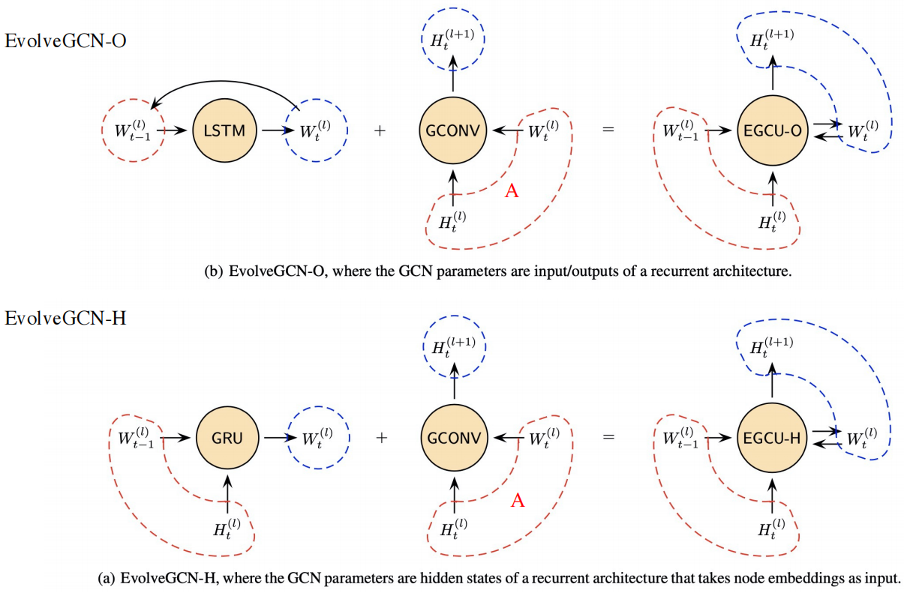

## EvolveGCN:Evolving Graph Convolutional Networks for Dynamic Graph

> AAAI2020
>
> 源码：https://github.com/IBM/EvolveGCN

- 离散型动态GNN，是集成型的DGNN，将GNN和RNN结合在同一层，从而结合空间和时间信息的建模

## 构图

## 算法流程

- GCN的公式：		 $\large  H^{(l+1)} = \sigma(\widetilde D^{-\frac 1 2}\widetilde A\widetilde D^{-\frac 1 2}H^{(l)}W^{(l)})$      
  - 归一化： $H^{(l+1)} = \sigma( \hat AH^{(l)}W^{(l)})$    
  - W靠loss反向传播更新
- 在EvolveGCN中，W通过RNN学习，更新时通过更新RNN函数得到W
  - 首先输入t时刻的  邻接矩阵$A_t$，  t时刻的在第l层的节点特征$H_t^{(l)}$，上一时刻在第l层的权重矩阵$W_{t-1}^{(l)}$
    - 经过EvolveGCN函数 得到下一层的节点特征$H_t^{(l+1)}$， t时刻在第 l 层的权重矩阵$W_{t}^{(l)}$
      - 通过RNN的方式求得下一个时刻的权重
      - 然后再通过GCN，得到下一层的节点特征
- 算法示例
  - 同一层里不同时刻的传播
  - 同一时刻里不同层的传播
  - 
    - H 和 O的区别在于 做RNN时，多加了本层的节点特征
  - 
  - EvolveGCN-H可能存在的问题：$H^{(l)}_t$和$W^{(l)}_{t-1}$ 维度不一致
    - p是一个权重矩阵，$X_t$ 与 p 相乘 再进行归一化 得到 $\large y_t$
    - $i_t$ 为从  $y_t$  中选择 前 k 个大的值

### 该如何选择两种EvolveGCN

- 如果节点有信息，-H效果要好，因为考虑了节点的特征变化
- 如果节点信息⽐较少，-O效果好，因为他更关系图结构的变化

## Loss函数

- 在每个时间步，有连接的边构建正样本 ，负样本采用负采样方式获得

## 实验结果

